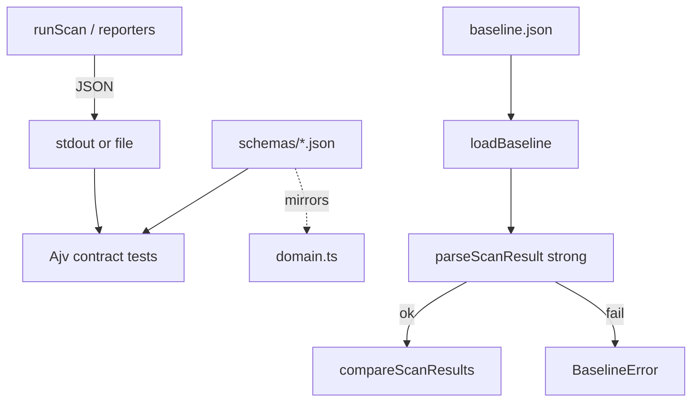

# Milestone 20 — JSON Contract Design

**Spec**: [`.specs/features/json-contract/spec.md`](./spec.md)  
**Context**: [`.specs/features/json-contract/context.md`](./context.md)  
**Status**: Done

---

## Architecture Overview

M20 makes JSON **self-describing via schemas** and **enforced at baseline load**. Reporters remain the producers; schemas and `parseScanResult` are the consumers’ contract.

---

## Code Reuse Analysis

| Component | Location | How to Use |
| --------- | -------- | ---------- |
| `parseScanResult` / `loadBaseline` | `src/compare/load-baseline.ts` | Deepen item-level checks |
| `BaselineError` | same | Reuse error type |
| Domain types | `src/types/domain.ts` | Field checklist for schemas |
| Report fixtures | `tests/fixtures/report/` | Valid/invalid samples |
| CLI integration | `bin/*.integration.test.ts` | Optional hook for contract tests |
| M14 CouplingPair | domain | `hasStaticDependency` required |

### Fragile areas

| Area | Mitigation |
| ---- | ---------- |
| Compare engine assumes shapes | Reject bad baselines before compare |
| Over-strict `additionalProperties: false` | Prefer `true` (context.md) |

---

## Components

### schemas/scan-result.json

- **Purpose**: Contract for `ScanResult` JSON
- **Location**: `schemas/scan-result.json`
- **Includes**: `version`, `hotspots[]`, `functions[]`, `coupling[]` (with `hasStaticDependency`), `meta`

### schemas/compare-result.json

- **Purpose**: Contract for `CompareResult` JSON
- **Location**: `schemas/compare-result.json`
- **Includes**: nested delta sections; entity shapes aligned with scan entities

### Strong parseScanResult

- **Purpose**: Runtime gate for baselines
- **Location**: `src/compare/load-baseline.ts` (+ tests)
- **Interfaces**: Same exports; stricter validation helpers (e.g. `assertHotspot`, `assertCouplingPair`)

### Contract tests

- **Purpose**: Lock CLI/library JSON to schemas
- **Location**: e.g. `tests/contract/json-schema.test.ts` or `src/compare/json-contract.test.ts`
- **Dependencies**: Ajv (devDependency), schema files, fixture scan/compare

---

## Data Models

Mirror TypeScript:

- `HotspotScore` — path, scores, raw metrics, `authorCount`, …
- `FunctionHotspotScore` — filePath, functionName, line, scores, …
- `CouplingPair` — fileA, fileB, coChangeCount, couplingStrength, **hasStaticDependency**
- `ScanMeta` — since, scannedAt, granularity
- `CompareResult` — per existing domain.ts

---

## Error Handling Strategy

| Scenario | Handling | User impact |
| -------- | -------- | ----------- |
| Missing `hasStaticDependency` | `BaselineError` with re-scan hint | Exit != 0 |
| Wrong type on nested field | `BaselineError` with field path | Exit != 0 |
| Valid schema-compliant JSON | Return `ScanResult` | Compare proceeds |

---

## Tech Decisions

| Decision | Choice | Rationale |
| -------- | ------ | --------- |
| Schema draft | JSON Schema Draft 2020-12 or Draft-07 | Ajv support; pick one and stick |
| additionalProperties | `true` | Forward compatible |
| Ajv runtime | Optional; tests require Ajv or equivalent | YAGNI vs DRY — see context |
| Execute order | After M14 | Required field exists in producers |
