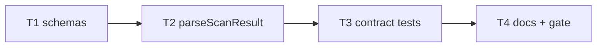

# Milestone 20 — JSON Contract Tasks

**Design**: [`.specs/features/json-contract/design.md`](./design.md)  
**Spec**: [`.specs/features/json-contract/spec.md`](./spec.md)  
**Context**: [`.specs/features/json-contract/context.md`](./context.md)  
**Status**: Planned  
**Prerequisite**: M14 Execute complete (producers emit `hasStaticDependency`)

---

## Execution Plan

```
T1 schemas → T2 strong loadBaseline → T3 contract tests → T4 docs + gate
```



### Diagram-Definition Cross-Check

| Task | Depends on | Diagram | Match |
| ---- | ---------- | ------- | ----- |
| T1 | None | Root | ✅ |
| T2 | T1 | T1 → T2 | ✅ |
| T3 | T2 | T2 → T3 | ✅ |
| T4 | T3 | T3 → T4 | ✅ |

### Path Conflict Check

| Task | Module owner | Paths | Conflict |
| ---- | ------------ | ----- | -------- |
| T1 | `schemas/` | `schemas/*.json` | Sequential |
| T2 | `src/compare/` | `load-baseline.ts`, `load-baseline.test.ts` | After T1 |
| T3 | `tests/contract/` or `src/compare/` | contract test + package.json devDep | After T2 |
| T4 | docs | README, ARCHITECTURE, ROADMAP | After T3 |

### Test Co-location Validation

| Task | Layer | Tests | Match |
| ---- | ----- | ----- | ----- |
| T1 | schemas | Compile/smoke in T3; optional Ajv compile in T1 | ✅ |
| T2 | compare loader | unit in same task | ✅ |
| T3 | contract | contract tests in same task | ✅ |
| T4 | docs | full gate | ✅ |

---

## Task Breakdown

### T1: Author JSON Schemas

**What**: Create `schemas/scan-result.json` and `schemas/compare-result.json` mirroring `domain.ts`, requiring `hasStaticDependency` on coupling items. Use `additionalProperties: true`. Shared `$defs` optional.

**Where**: `schemas/scan-result.json`, `schemas/compare-result.json`

**Depends on**: None (assumes M14 types already in tree)

**Reuses**: `src/types/domain.ts`, sample fixtures

**Requirement**: HOTSPOT-158, HOTSPOT-159

**Done when**:

- [ ] Both schema files exist and describe required fields
- [ ] Coupling item requires boolean `hasStaticDependency`
- [ ] Schemas are valid JSON

**Tests**: none yet (T3) — optional quick Ajv compile if dep already added

**Gate**: none (or `node -e JSON.parse`)

---

### T2: Strengthen parseScanResult / loadBaseline

**What**: Validate nested hotspot, function, and coupling item shapes (types + required keys including `hasStaticDependency`). Clear `BaselineError` messages. Update `load-baseline.test.ts` with valid/invalid fixtures (including missing static flag).

**Where**: `src/compare/load-baseline.ts`, `src/compare/load-baseline.test.ts`, fixtures under `tests/fixtures/` as needed

**Depends on**: T1

**Reuses**: Existing `BaselineError`; [context.md](./context.md) reject policy

**Requirement**: HOTSPOT-160, HOTSPOT-161

**Done when**:

- [ ] Invalid nested items rejected
- [ ] Missing `hasStaticDependency` rejected with actionable message
- [ ] Valid M14-shaped fixture loads
- [ ] Unit tests green

**Tests**: unit — `load-baseline.test.ts`

**Gate**: `pnpm exec vitest run src/compare/load-baseline.test.ts`

---

### T3: Contract tests (scan + compare JSON)

**What**: Add Ajv (devDependency) if needed. Contract tests: validate `runScan` JSON (or CLI `--format json`) against scan schema; validate compare JSON against compare schema. Use `tests/fixtures/repos/small-ts/` and a baseline fixture.

**Where**: e.g. `tests/contract/json-schema.test.ts`, `package.json` (devDependency)

**Depends on**: T2

**Reuses**: schemas from T1; existing integration helpers

**Requirement**: HOTSPOT-162, HOTSPOT-163

**Done when**:

- [ ] Scan JSON validates
- [ ] Compare JSON validates
- [ ] Failure mode demonstrated if a required field stripped in a negative test (optional but recommended)

**Tests**: contract

**Gate**: `pnpm exec vitest run tests/contract/` (or chosen path)

---

### T4: Documentation + full gate

**What**: Link `schemas/` from README and ARCHITECTURE; note baseline validation; mark M20 ROADMAP items on Execute completion; `pnpm build && pnpm test`.

**Where**: `README.md`, `.specs/codebase/ARCHITECTURE.md`, `.specs/project/ROADMAP.md`

**Depends on**: T3

**Requirement**: HOTSPOT-164, HOTSPOT-165

**Done when**:

- [ ] Docs reference schemas
- [ ] Full gate green

**Tests**: none

**Gate**: `pnpm build && pnpm test`

**Commit** (propose only): `feat(compare): publish JSON schemas and strengthen baseline validation`

---

## Requirement → Task map

| Requirement ID | Task |
| -------------- | ---- |
| HOTSPOT-158 | T1 |
| HOTSPOT-159 | T1 |
| HOTSPOT-160 | T2 |
| HOTSPOT-161 | T2 |
| HOTSPOT-162 | T3 |
| HOTSPOT-163 | T3 |
| HOTSPOT-164 | T4 |
| HOTSPOT-165 | T4 |
