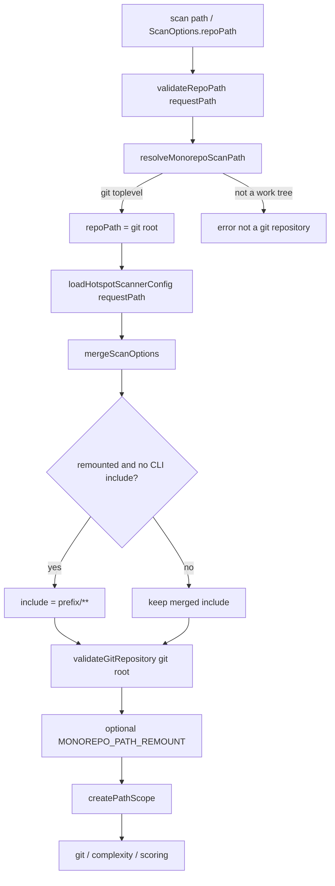

# Milestone 43 — Monorepo Path Detect Design

**Spec**: [`.specs/features/monorepo-path-detect/spec.md`](./spec.md)  
**Context**: [`.specs/features/monorepo-path-detect/context.md`](./context.md)  
**Status**: Planned (planning session)  
**Design SoT**: [ARCHITECTURE.md](../../codebase/ARCHITECTURE.md)

---

## Architecture Overview

M43 adds a **path resolution** step before git validation in `runScan()`, without changing PathScope semantics, merge precedence rules, or default excludes.

1. Validate `requestPath` exists and is a directory (existing `validateRepoPath`).
2. **`resolveMonorepoScanPath(requestPath)`** → `{ repoPath, packagePrefix?, remounted }` via `git rev-parse --show-toplevel`.
3. Load config from **original** `requestPath` (M30 walk / `--config` unchanged).
4. Merge CLI > config > defaults; if `remounted && options.include === undefined`, inject CLI-level `include: ["{packagePrefix}/**"]`.
5. `validateGitRepository(resolved.repoPath)` on git root; emit `MONOREPO_PATH_REMOUNT` info warning when remounted.
6. Existing pipeline uses resolved `repoPath` + `createPathScope(merged)`.



**Bin:** Keep loading config from the user argument path (already correct). Prefer **no domain remount in bin** — `runScan` owns remount so library and CLI stay aligned. Optional: CLI help text / description mentioning package-cwd behavior.

---

## Code Reuse Analysis

| Component                                       | Location                | How to use                                                                           |
| ----------------------------------------------- | ----------------------- | ------------------------------------------------------------------------------------ |
| `validateRepoPath` / `validateGitRepository`    | `src/scan.ts`           | Keep order: path → resolve → config → git-on-root                                    |
| `createPathScope` / `isPathInScope`             | `src/paths/scope.ts`    | Unchanged; consume auto-include via merged options                                   |
| `mergeScanOptions` / `loadHotspotScannerConfig` | `src/config/`           | Unchanged API; inject include into CLI side before/at merge                          |
| `pickCliOverrides`                              | `src/scan.ts`           | Treat injected include as CLI when auto-applying                                     |
| Git spawn pattern                               | `src/git/spawn.ts`      | Mirror small `execFile`/`spawn` helper for `rev-parse` — do **not** add `simple-git` |
| Commander `isExplicitCliOption("include")`      | `bin/`                  | Already distinguishes CLI include (bin stays thin)                                   |
| Fixtures                                        | `tests/fixtures/repos/` | New nested monorepo fixture for integration                                          |

### Fragile / concern notes

- Do **not** alter git log streaming, McCabe, or scoring formulas ([CONCERNS.md](../../codebase/CONCERNS.md)).
- Double config load (bin `top` + `runScan`) must both use **requestPath** — remount must not change discovery root.
- `validateGitRepository` today checks `join(repoPath, ".git")` — after remount this correctly targets the root (worktree `.git` file still OK).
- Avoid spawning `rev-parse` on every unit test path: inject a `detectGitToplevel` dependency for tests.

---

## Components

### `resolveMonorepoScanPath` (new)

- **Purpose**: Map user path → pipeline git root + optional package prefix
- **Location**: `src/paths/resolve-repo.ts` (preferred — path concern; keeps `src/git/` focused on mining) **or** thin wrapper in `src/scan.ts` calling a paths helper
- **Interfaces** (illustrative):

```typescript
export interface ResolvedMonorepoScanPath {
  /** Absolute path used for git / discovery / enrich */
  repoPath: string;
  /** Absolute original user path */
  requestPath: string;
  /** Posix relative prefix under repoPath when remounted; undefined if requestPath is git root */
  packagePrefix?: string;
  remounted: boolean;
}

export interface ResolveMonorepoScanPathDeps {
  detectGitToplevel?: (cwd: string) => Promise<string>;
}

export async function resolveMonorepoScanPath(
  requestPath: string,
  deps?: ResolveMonorepoScanPathDeps,
): Promise<ResolvedMonorepoScanPath>;

export function buildAutoIncludePattern(packagePrefix: string): string;
// → `${packagePrefix}/**` with posix separators, no leading ./
```

- **Algorithm**:
  1. `requestAbs = resolve(requestPath)`
  2. `toplevel = await detectGitToplevel(requestAbs)` (default: `git -C requestAbs rev-parse --show-toplevel`)
  3. `rootAbs = resolve(toplevel.trim())`
  4. If `rootAbs === requestAbs` (after normalize) → `{ repoPath: rootAbs, requestPath: requestAbs, remounted: false }`
  5. Else compute `packagePrefix = relative(rootAbs, requestAbs).split(sep).join("/")`; if prefix is empty or starts with `..` → error
  6. Return `{ repoPath: rootAbs, requestPath: requestAbs, packagePrefix, remounted: true }`
- **Dependencies**: `node:path`, `node:child_process` (or shared tiny git exec helper)
- **Reuses**: Error messaging style from `validateGitRepository`

### `runScan` wiring

- **Purpose**: Apply resolution, config-from-request, auto-include, warning, pipeline on root
- **Location**: `src/scan.ts`
- **Change**:
  1. After `validateRepoPath(options.repoPath)`, call `resolveMonorepoScanPath`
  2. `loadHotspotScannerConfig(options.repoPath /* request */, { configPath })` — **not** remounted path
  3. Build CLI overrides; if `remounted && options.include === undefined`, set `cli.include = [buildAutoIncludePattern(prefix)]`
  4. `validateGitRepository(resolved.repoPath)`
  5. Push `MONOREPO_PATH_REMOUNT` via `onWarning` + `collectedWarnings`
  6. Pass `resolved.repoPath` into miner / analyzer / enrich
- **Unchanged**: Overlap barriers, scoring, formats

### Diagnostics

- **Code**: `MONOREPO_PATH_REMOUNT`
- **Severity**: `info`
- **Message**: Include git root path; if auto-include applied, mention the pattern

### Fixture

- **Location**: `tests/fixtures/repos/monorepo-nested/` (or similar slug)
- **Shape**: git root with at least `packages/api/` and `packages/other/` (minimal TS files + history) so include scoping is observable
- **Owner**: Prefer `fixture-builder` during Execute for T2/T3

### Docs

- README: short “Monorepo / package cwd” note
- ARCHITECTURE: update pipeline step 2–3 (config from request; remount before git validate)
- STRUCTURE / INTEGRATIONS: note `rev-parse` helper if new git invocation surface

---

## Data Models

No JSON schema / `ScanResult` shape changes. Additive warning code only (existing `ScanWarning.code?: string`).

---

## Error Handling

| Case                        | Behavior                                              |
| --------------------------- | ----------------------------------------------------- |
| Not a directory             | Existing `validateRepoPath` error                     |
| `rev-parse` fails           | Map to “not a git repository” (include `requestPath`) |
| Prefix escapes root         | Throw clear error with both paths                     |
| Explicit `--config` missing | Existing `ConfigError`                                |

---

## Testing Strategy

| Layer                         | What                                                                                  |
| ----------------------------- | ------------------------------------------------------------------------------------- |
| Unit (`resolve-repo.test.ts`) | Root vs nested vs outside; auto-include string; injected `detectGitToplevel`          |
| Unit / scan                   | `runScan` with nested temp repo: remount, warning code, include suppression           |
| Integration                   | Fixture monorepo: nested path scopes rankings; git-root path unchanged                |
| CLI                           | Optional smoke: `hotspot-scanner scan <fixture>/packages/api` exit 0                  |
| Config                        | Nested path still loads ancestor `.hotspot-scanner.json`; `--config` still skips walk |

---

## Risks

| Risk                                        | Mitigation                                                |
| ------------------------------------------- | --------------------------------------------------------- |
| Silent whole-repo scan after remount        | Auto-include mandatory when remounted without CLI include |
| Config load diverges bin vs runScan         | Both keep `requestPath` for discovery                     |
| Worktree / `.git` file                      | Prefer `rev-parse --show-toplevel`                        |
| Extra git spawn cost                        | One `rev-parse` per scan — negligible vs `git log`        |
| Programmatic callers pass already-root path | Idempotent: no remount, no auto-include                   |

---

## Implementation Notes (for Execute)

- Export `resolveMonorepoScanPath` from `src/paths/index.ts` if useful for tests; no need to expand public `src/index.ts` API unless already exporting path helpers.
- Do not parse workspace manifests.
- Propose Conventional Commit after gate (do not commit unless user asks): `feat: remount nested scan paths to git root with auto-include`.
