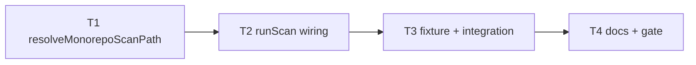

# Milestone 43 — Monorepo Path Detect Tasks

**Design**: [`.specs/features/monorepo-path-detect/design.md`](./design.md)  
**Spec**: [`.specs/features/monorepo-path-detect/spec.md`](./spec.md)  
**Context**: [`.specs/features/monorepo-path-detect/context.md`](./context.md)  
**Status**: Done

---

## Execution Plan

```
T1 resolve-repo ──→ T2 runScan wiring ──→ T3 fixture + integration/CLI ──→ T4 docs + full gate
```



### Diagram-Definition Cross-Check

| Task | Depends on (body) | Diagram shows | Status |
| ---- | ----------------- | ------------- | ------ |
| T1   | None              | Root          | ✅ Match |
| T2   | T1                | T1→T2         | ✅ Match |
| T3   | T2                | T2→T3         | ✅ Match |
| T4   | T3                | T3→T4         | ✅ Match |

### Path Conflict Check

| Task | Module owner | Paths | Conflict |
| ---- | ------------ | ----- | -------- |
| T1   | `src/paths/` | `resolve-repo.ts`, `resolve-repo.test.ts`, `index.ts` | None |
| T2   | `src/scan.ts` | `scan.ts`, `scan.test.ts` (and/or focused unit) | After T1; sole owner of scan wiring |
| T3   | `tests/fixtures/` + integration/CLI tests | fixture tree, `scan.integration.test.ts` and/or `bin/*.test.ts` | After T2; may touch scan/bin tests only for assertions |
| T4   | docs | README, ARCHITECTURE, STRUCTURE/INTEGRATIONS as needed | After T3 |

### Test Co-location Validation

| Task | Code layer | Matrix / TESTING.md | Task Tests | Status |
| ---- | ---------- | ------------------- | ---------- | ------ |
| T1   | `src/paths/` | unit co-located | unit | ✅ OK |
| T2   | `src/scan.ts` | unit + integration as needed | unit (remount / warning / include) | ✅ OK |
| T3   | fixtures + integration/CLI | integration / CLI | integration (+ CLI smoke if practical) | ✅ OK |
| T4   | docs only | none | none + full gate | ✅ OK |

### Granularity Check

| Task | Scope | Status |
| ---- | ----- | ------ |
| T1 | One module: resolve + auto-include helper + unit tests | ✅ Granular |
| T2 | Cohesive scan wiring: config-from-request, inject include, validate root, warning | ✅ OK |
| T3 | Fixture + end-to-end nested vs root behavior | ✅ Granular |
| T4 | Docs + full project gate | ✅ Granular |

---

## Task Breakdown

### T1: `resolveMonorepoScanPath` + auto-include helper

**What**: Implement git-toplevel resolution and `{prefix}/**` helper with injectable `detectGitToplevel` for unit tests.

**Where**: `src/paths/resolve-repo.ts`, `src/paths/resolve-repo.test.ts`, `src/paths/index.ts`

**Depends on**: None

**Reuses**: Path normalize style from `scope.ts`; git error messaging style from `validateGitRepository`; [context.md](./context.md) locked heuristic

**Requirement**: HOTSPOT-570, HOTSPOT-571, HOTSPOT-572, HOTSPOT-573, HOTSPOT-574

**Tools**:

- MCP: NONE
- Skill: `coding-guidelines`, `vitals-pipeline-domain`

**Done when**:

- [x] `resolveMonorepoScanPath` returns `remounted: false` when request path is git root
- [x] Returns `remounted: true`, `packagePrefix`, and git-root `repoPath` for nested paths (via injected detector and/or real temp git repo)
- [x] `buildAutoIncludePattern` yields posix `{prefix}/**`
- [x] Outside / failed detection maps to a clear “not a git repository” (or equivalent) error
- [x] Escaping `..` relative prefix rejected
- [x] Gate check passes: `pnpm exec vitest run src/paths/resolve-repo.test.ts`
- [x] Test count does not drop silently

**Tests**: unit  
**Gate**: `pnpm exec vitest run src/paths/resolve-repo.test.ts`

**Verify**:

```bash
pnpm exec vitest run src/paths/resolve-repo.test.ts
```

---

### T2: Wire remount + auto-include + warning in `runScan`

**What**: Integrate resolution into `runScan`: config load from original `requestPath`; pipeline + `validateGitRepository` on git root; inject CLI-level include when remounted and `options.include === undefined`; emit `MONOREPO_PATH_REMOUNT`; preserve merge precedence otherwise.

**Where**: `src/scan.ts`, `src/scan.test.ts` (and export tweaks only if needed)

**Depends on**: T1

**Reuses**: `resolveMonorepoScanPath`, `loadHotspotScannerConfig`, `mergeScanOptions`, `pickCliOverrides`, `createPathScope`, existing warning collection

**Requirement**: HOTSPOT-575, HOTSPOT-576, HOTSPOT-577, HOTSPOT-578, HOTSPOT-579, HOTSPOT-580, HOTSPOT-581, HOTSPOT-582, HOTSPOT-587

**Tools**:

- MCP: NONE
- Skill: `coding-guidelines`, `vitals-pipeline-domain`, `task-implementer`

**Done when**:

- [x] Nested `repoPath` without `include` → remount + auto-include applied before PathScope
- [x] Nested path with explicit `include` → remount, no auto-include; user include honored
- [x] Config still loaded from request path; `--config` / `configPath` behavior unchanged
- [x] Auto-include beats config `include` when CLI include absent
- [x] `MONOREPO_PATH_REMOUNT` info warning present iff remounted; absent on git-root scans
- [x] Git-root `runScan` behavior unchanged (no surprise include)
- [x] Gate check passes: `pnpm exec vitest run src/scan.test.ts src/paths/`
- [x] Test count does not drop silently

**Tests**: unit  
**Gate**: `pnpm exec vitest run src/scan.test.ts src/paths/`

**Verify**:

```bash
pnpm exec vitest run src/scan.test.ts src/paths/
```

---

### T3: Monorepo fixture + integration / CLI smoke

**What**: Add a nested-package git fixture and prove scoped rankings from package path vs full root; optional CLI invocation smoke.

**Where**: `tests/fixtures/repos/<slug>/` (e.g. `monorepo-nested`), `src/scan.integration.test.ts` and/or `bin/hotspot-scanner.test.ts` / integration test as appropriate; fixture README if required by fixture conventions

**Depends on**: T2

**Reuses**: Existing fixture patterns (`small-ts`); `fixture-builder` agent if scaffolding a real git repo; `vitals-cli-validation` for CLI exit codes

**Requirement**: HOTSPOT-577, HOTSPOT-585, HOTSPOT-586

**Tools**:

- MCP: NONE
- Skill: `vitals-cli-validation`, `coding-guidelines`
- Agent (optional): `fixture-builder`

**Done when**:

- [x] Fixture has git root + ≥2 packages with distinguishable TS files / history
- [x] Integration: scan from nested package path → results limited to that prefix; scan from root without include → both packages eligible (subject to default excludes)
- [x] CLI smoke (if added): `hotspot-scanner scan <fixture>/packages/...` exits 0
- [x] Gate check passes: targeted vitest for integration/CLI files touched
- [x] Test count does not drop silently

**Tests**: integration (+ CLI if added)  
**Gate**: `pnpm exec vitest run src/scan.integration.test.ts` (add bin test path if modified)

**Verify**:

```bash
pnpm exec vitest run src/scan.integration.test.ts
# if bin tests updated:
pnpm exec vitest run bin/hotspot-scanner.test.ts
```

---

### T4: Docs + full quality gate

**What**: Document the heuristic in README and ARCHITECTURE (and STRUCTURE/INTEGRATIONS if a new git invocation is introduced); run full project gate.

**Where**: `README.md`, `.specs/codebase/ARCHITECTURE.md`, optionally `.specs/codebase/STRUCTURE.md`, `.specs/codebase/INTEGRATIONS.md`

**Depends on**: T3

**Reuses**: [context.md](./context.md) wording; M7/M30 path-scoping doc sections

**Requirement**: HOTSPOT-583, HOTSPOT-584, HOTSPOT-588, HOTSPOT-589

**Tools**:

- MCP: NONE
- Skill: `vitals-spec-driven` (docs sync only), `coding-guidelines`

**Done when**:

- [x] README describes nested cwd → git root + `{prefix}/**` unless `--include`
- [x] ARCHITECTURE notes config-from-requestPath vs pipeline-on-git-root order
- [x] YAGNI stated (no workspace-yaml / nx parsers)
- [x] INTEGRATIONS/STRUCTURE updated if `rev-parse` helper is a new integration surface
- [x] Full gate passes: `pnpm build && pnpm test`
- [x] Propose Conventional Commit message (do not commit unless user asks)

**Tests**: none (docs)  
**Gate**: `pnpm build && pnpm test`

**Verify**:

```bash
pnpm build && pnpm test
```

---

## Requirement → Task Mapping

| Requirement ID | Task |
| -------------- | ---- |
| HOTSPOT-570 | T1 |
| HOTSPOT-571 | T1 |
| HOTSPOT-572 | T1 |
| HOTSPOT-573 | T1 |
| HOTSPOT-574 | T1 |
| HOTSPOT-575 | T2 |
| HOTSPOT-576 | T2 |
| HOTSPOT-577 | T2, T3 |
| HOTSPOT-578 | T2 |
| HOTSPOT-579 | T2 |
| HOTSPOT-580 | T2 |
| HOTSPOT-581 | T2 |
| HOTSPOT-582 | T2 |
| HOTSPOT-583 | T4 |
| HOTSPOT-584 | T4 |
| HOTSPOT-585 | T3 |
| HOTSPOT-586 | T3 |
| HOTSPOT-587 | T2 |
| HOTSPOT-588 | T4 |
| HOTSPOT-589 | T4 |

**Coverage:** 20/20 IDs mapped. Unmapped: none.

---

## Parallelism notes

- No `[P]` tasks — linear dependency (resolve → scan → fixture → docs).
- Do not parallelize work that both edits `src/scan.ts`.

---

## Handoff

Status is **Planned**. Promote to `Approved` / `Ready for Execute` in a **new** development session, then invoke `orchestrator-implementer`.

Expected final gate: `pnpm build && pnpm test`
