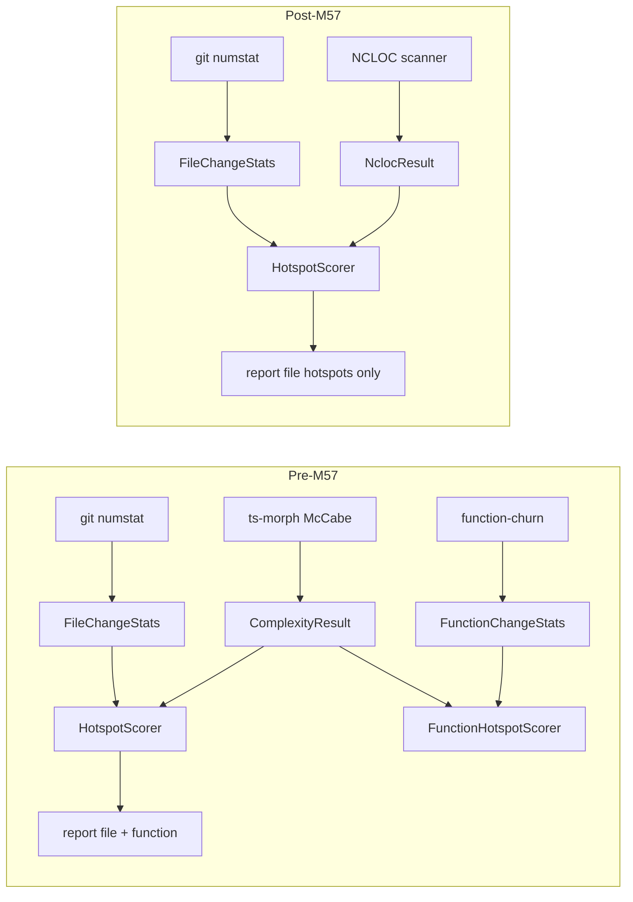

# Milestone 57 — NCLOC Metric Design

**Spec**: [spec.md](./spec.md)  
**Context**: [context.md](./context.md)  
**Status**: Approved for planning (locked decisions)  
**Depth**: Complex

---

## Architecture Overview

M57 is a **metric swap + subtractive hard cut**. The scan pipeline becomes:

```text
git (churn only) → NCLOC size analysis (file-level) → hotspot score → report
```

Optional `--baseline` compare remains for **hotspots only**. JSON contract bumps to `"3.0"` with `ncloc` and **no** `functions` array.



### Safe change order (compile + contract)

| Step | Why this order |
| ---- | -------------- |
| 1. Schemas + domain types + baseline reject | Contract SoT first; fail closed on `"2.0"` / legacy fields |
| 2. NCLOC scanner + scoring field rename | New metric green behind types; McCabe path can still compile briefly |
| 3. Pipeline producers (scan, compare, reporters, CLI/config) | Stop function mode + emit `ncloc` / `"3.0"` |
| 4. Delete McCabe / function-churn / function scorers + fixtures | No dangling imports; drop `ts-morph` when unused |
| 5. Living docs / skills / ADR-2026-019 | Match shipped behavior |
| 6. Full gate | Prove green tree |

**Compile note:** Between step 1 and end of step 3, full `pnpm build` may be red. Tasks use **targeted Vitest gates** until producers align; full `pnpm build && pnpm test` is the final task. Do **not** leave empty `functions: []` or dual `cyclomaticComplexity` stubs.

**Historical specs:** Do not edit Done sister specs beyond optional one-line “superseded by M57” in ROADMAP/STATE.

---

## Tech Decision: NCLOC scanner vs ts-morph

| Option | Pros | Cons |
| ------ | ---- | ---- |
| **A. Keep ts-morph**, count lines via AST / source text | Reuses Project/workers | Heavy dep for line metric; RT-005 McCabe surface unused; function AST dead |
| **B. Lighter stateful line/token scanner** | Accurate comment/string handling without AST; drop `ts-morph`; simpler workers | Must implement string/`/* */` state carefully; regex-literal edge cases |

**Choice: B — lighter scanner** (locked in [context.md](./context.md)).

### Scanner algorithm (normative for Execute)

Implement a **single-pass state machine** over file text (UTF-8):

1. Track modes: `code`, `lineComment`, `blockComment`, `singleQuote`, `doubleQuote`, `template`, (optional) `regex` best-effort
2. At end of each physical line, if the line contributed any **code** character (not only whitespace and not only comment text), increment NCLOC by 1
3. Blank lines → 0 contribution
4. Comment-only lines → 0
5. Code + trailing `//` → count
6. `//` inside strings/templates → still code line

**Out of perfect lexer fidelity:** exotic regex-literal / nested template edge cases — document pragmatic behavior in fixtures; prefer false-positive NCLOC over false-negative when ambiguous (YAGNI on full JS lexer).

### Module shape

| Piece | Location | Notes |
| ----- | -------- | ----- |
| `countNcloc(source: string): number` | `src/complexity/ncloc.ts` (or rename package folder later — keep `src/complexity/` path to limit blast) | Pure; heavily unit-tested |
| File analyze | Replace `analyze-file.ts` McCabe path with read text → `countNcloc` | No ts-morph `Project` |
| Discovery | Keep `discover.ts` + PathScope + eligible extensions | Unchanged filters |
| Workers / concurrency | Retarget worker payload to `{ path, text }` → `ncloc` **or** main-thread `Promise` pool with concurrency; **remove** ts-morph Project reuse | Prefer delete `project.ts` McCabe adapter; keep pool only if parallel file I/O remains valuable |
| Public analyzer API | `createComplexityAnalyzer` may rename conceptually to size analyzer but **path rename optional** (YAGNI — avoid mass import churn); result type field `ncloc` | `cyclomaticComplexity` / `functionCount` / `parseFailed` removed from happy path |

### Dependency

When no file under `src/` imports `ts-morph`, **remove** it from `package.json` dependencies and update INTEGRATIONS.md.

---

## Code Reuse Analysis

### Existing patterns to leverage

| Pattern | Location | How to use |
| ------- | -------- | ---------- |
| Hard-cut breaking change | M56 remove-coupling-analysis | Same order: contract → producers → delete → docs |
| Baseline reject + re-scan | `src/compare/load-baseline.ts` | Extend for `"3.0"`; reject `"2.0"`/`"1.0"`, `cyclomaticComplexity`, top-level `functions` |
| Contract tests | `tests/contract/json-schema.test.ts` | Retarget to 3.0 + `ncloc` |
| Harmonic + normalize | `src/scoring/normalize.ts`, `hotspot-scorer.ts` | Swap input field only |
| Unknown config keys | M55 | Leftover `granularity` → warn-only |
| CSV bundle | `src/report/csv.ts` | Drop functions keys |
| `--only` validation | `src/report/only.ts` | `hotspots` only |
| File-mode pipeline overlap | `src/scan.ts` M34 | Keep git ∥ size analysis; remove function branch |

### Integration points

| System | Change |
| ------ | ------ |
| `schemas/*.json` | `"3.0"`; `ncloc`; drop `functions` / McCabe fields |
| `src/types/domain.ts` | `ncloc`; remove function types / granularity |
| `src/complexity/**` | NCLOC scanner; retire McCabe + function collection |
| `src/scoring/**` | File scorer only; delete function scorer |
| `src/git/function-churn/**` | Delete entire tree |
| `src/scan.ts` | File-only pipeline; no granularity branch |
| `src/compare/**` | Hotspots-only compare; baseline 3.0 |
| `src/report/**` | NLOC columns; no function CSV/explain/triage |
| `src/config/**`, `bin/**` | Remove granularity; completion; `--only` |
| `src/index.ts` | Drop function exports |
| Docs / skills / STATE ADR | NCLOC vision; ADR-2026-019 supersession |

---

## Components

### Contract layer

- **Purpose**: Publish/enforce JSON `"3.0"` with `ncloc`; reject legacy baselines
- **Location**: `schemas/`, `src/types/domain.ts`, `src/compare/load-baseline.ts`, `tests/contract/`
- **Interfaces**: `parseScanResult` expects `version === "3.0"`; rejects legacy metric/function keys
- **Reuses**: M56 `BaselineError` pattern

### NCLOC analyzer

- **Purpose**: File-level NCLOC for eligible sources
- **Location**: `src/complexity/ncloc.ts` + analyze/discover/pool retarget
- **Interfaces**: `countNcloc(text) → number`; analyzer `analyze(repoPath) → NclocResult[]` (`filePath`, `ncloc`)
- **Dependencies**: `fs` read / discovery; optional workers
- **Reuses**: PathScope discovery; concurrency option

### Hotspot scoring

- **Purpose**: Harmonic score with `c` from NCLOC
- **Location**: `src/scoring/hotspot-scorer.ts`, `normalize.ts`
- **Interfaces**: `scoreHotspots(fileStats, nclocResults) → HotspotScore[]` with `ncloc` field
- **Reuses**: Existing normalize + combiner; delete function scorer

### Pipeline / CLI / report

- **Purpose**: File-only product surface
- **Location**: `src/scan.ts`, `src/compare/*`, `src/report/**`, `src/config/**`, `bin/**`
- **Reuses**: M56 subtractive patterns for arrays/flags

### Deletion set

- `src/complexity/mccabe.ts` (+ tests)
- Function collection paths in `analyze-file.ts` that only served McCabe/functions
- `src/git/function-churn/**`
- `src/scoring/function-hotspot-scorer.ts*`
- Function-only report helpers / fixtures as identified in Execute
- McCabe-verified fixtures under `tests/fixtures/complexity/` → replace with **NCLOC-verified** fixtures
- Patch fixtures only used by function-churn tests

### Documentation / agent surface

- **Purpose**: Vision = NCLOC + churn; supersede ADR-2026-019; scrub function mode
- **Location**: `.specs/codebase/*`, PROJECT, README, AGENTS, CONTRIBUTING, `docs/*`, `vitals-pipeline-domain`, `fragile-areas`, `vitals-project.md`, STATE ADR + rejected alternatives

---

## Data Models (post-M57)

```typescript
// Conceptual — Exact fields follow Execute typing pass.
interface ScanResultV3 {
  version: "3.0";
  hotspots: HotspotScore[];
  // functions: removed — do not keep []
  meta: ScanMeta; // no granularity
}

interface HotspotScore {
  filePath: string;
  complexityNormalized: number; // still "normalized c" — name retained unless Execute renames (YAGNI: keep)
  churnNormalized: number;
  hotspotScore: number;
  ncloc: number;
  commitCount: number;
  linesChanged: number;
  authorCount: number;
  // cyclomaticComplexity, functionCount, parseFailed: removed
}

interface CompareResultV3 {
  version: "3.0";
  hotspots: CompareSection<HotspotScore>;
  // functions: removed
  // granularity: removed
  meta: CompareMeta;
}
```

**CSV scan keys (post):** `meta.json` + `hotspots.csv` only.  
**CSV compare keys (post):** hotspot trio only + `meta.json`.

**Progress phases (post):** `"git" | "complexity"` (or rename phase id to `"ncloc"` / `"size"` — **prefer keep `"complexity"` phase string** for less churn unless docs already treat it as McCabe-specific; if rename, update ARCHITECTURE + tests in same docs/scan task). Design recommendation: **keep phase id `"complexity"`** meaning “size analysis stage” to avoid extra breaking diagnostic contracts; document in ARCHITECTURE that the stage computes NCLOC.

---

## Error Handling Strategy

| Scenario | Handling | User impact |
| -------- | -------- | ----------- |
| Baseline `version` ≠ `"3.0"` | `BaselineError` + re-scan | Exit ≠ 0 |
| Baseline has `cyclomaticComplexity` or `functions` | `BaselineError` + re-scan | Exit ≠ 0 |
| Unknown CLI `--granularity` | Commander unknown option | Exit ≠ 0 |
| `--only functions` | Validation error → `hotspots` | Exit ≠ 0 |
| Config `granularity` leftover | Warn-only unknown key; not applied | Scan continues |
| Unreadable source file | Warning + skip (omit hotspot row) | Partial scan |
| `--explain` with `path:function` | `CliUsageError` — file path only | Exit ≠ 0 |

---

## Risks (from CONCERNS.md)

| Fragile area | M57 mitigation |
| ------------ | -------------- |
| RT-005 McCabe decision nodes | **Retire** — replace CONCERNS row with NCLOC definition + fixture discipline |
| ts-morph / workers | Remove or retarget; INTEGRATIONS update mandatory |
| JSON schemas / baseline | Strong reject of 2.0 + legacy fields; contract tests in T1 |
| Scoring formulas | Do not change harmonic/normalize — only input field |
| Function-churn / pathspec / ARG_MAX | Delete with function mode — remove related CONCERNS rows |
| CSV / explain consumers | Document breaking change |
| Coverage per-file | Deleting modules removes thresholds; ensure no orphan imports |
| NCLOC string/comment accuracy | Fixture matrix mandatory (blank, `//`, block, JSDoc, string with `//`, code+trailing comment) |

---

## Check 5 — Path ownership (task planning)

| Owner prefix | Tasks that may edit |
| ------------ | ------------------- |
| `schemas/` + `src/types/` + `src/compare/load-baseline.ts` + `tests/contract/` | T1 |
| `src/complexity/` (NCLOC scanner + analyzer retarget; not yet delete all McCabe if staged) | T2 |
| `src/scoring/` (file scorer + delete function scorer wiring) | T3 |
| `src/scan.ts` (+ integration) | T4 |
| `src/compare/` (except load-baseline already done) | T5 |
| `src/report/` | T6 |
| `src/config/` + `bin/` + `src/index.ts` | T7 |
| Delete function-churn + McCabe leftovers + fixtures + drop ts-morph | T8 |
| Docs / skills / rules / PROJECT / STATE ADR | T9 |
| Gate only | T10 |

No `[P]` across overlapping producers — sequential hard cut is safer (same as M56).

---

## `.specs/codebase/` refresh (Execute)

On Done, update at least: ARCHITECTURE (pipeline, remove function granularity section, NCLOC stage), CONCERNS (RT-005 → NCLOC; remove function-churn risk block or mark superseded), STRUCTURE, TESTING (fixtures = NCLOC), INTEGRATIONS (ts-morph removed or role rewritten), PROJECT.md vision, fragile-areas rule, pipeline-domain skill.
