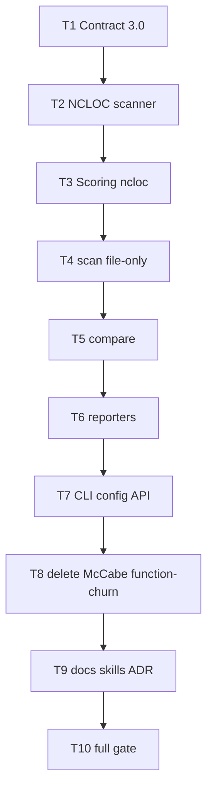

# Milestone 57 — NCLOC Metric Tasks

**Design**: [design.md](./design.md)  
**Spec**: [spec.md](./spec.md)  
**Context**: [context.md](./context.md)  
**Status**: Done

---

## Execution Plan

### Phase 1: Contract (Sequential)

```
T1 schemas 3.0 + types + baseline reject + contract/unit tests
```

### Phase 2: Metric + scoring (Sequential)

```
T1 → T2 NCLOC scanner + complexity analyzer retarget
T2 → T3 hotspot scorer feeds ncloc; remove function scorer exports/wiring
```

### Phase 3: Stop function mode / emit 3.0 (Sequential)

```
T3 → T4 scan pipeline file-only
T4 → T5 compare hotspots-only
T5 → T6 reporters / CSV / explain / triage / progress copy
T6 → T7 CLI + config + completion + public exports
```

### Phase 4: Delete + docs + gate (Sequential)

```
T7 → T8 delete McCabe / function-churn / fixtures; drop ts-morph
T8 → T9 living docs / skills / ADR-2026-019
T9 → T10 full project gate
```



### Diagram-Definition Cross-Check

| Task | Depends on (declared) | Diagram shows | Match |
| ---- | --------------------- | ------------- | ----- |
| T1 | None | Root | ✅ |
| T2 | T1 | T1→T2 | ✅ |
| T3 | T2 | T2→T3 | ✅ |
| T4 | T3 | T3→T4 | ✅ |
| T5 | T4 | T4→T5 | ✅ |
| T6 | T5 | T5→T6 | ✅ |
| T7 | T6 | T6→T7 | ✅ |
| T8 | T7 | T7→T8 | ✅ |
| T9 | T8 | T8→T9 | ✅ |
| T10 | T9 | T9→T10 | ✅ |

### Path Conflict Check (Check 5)

| Task | Module owner | Paths (primary) | Conflict with parallel peers |
| ---- | ------------ | --------------- | ---------------------------- |
| T1 | schemas + types + compare/load-baseline + contract | `schemas/*.json`, `src/types/domain.ts`, `src/compare/load-baseline.ts` (+test), `tests/contract/**` | Sole — sequential |
| T2 | complexity | `src/complexity/**` (add `ncloc.ts`; retarget analyze/discover/pool/worker/index; fixtures under `tests/fixtures/complexity/`) | After T1 |
| T3 | scoring | `src/scoring/hotspot-scorer.ts*`, `normalize` if needed, `index.ts`; stop exporting function scorer | After T2 |
| T4 | scan | `src/scan.ts`, `src/scan*.test.ts` | After T3 |
| T5 | compare | `src/compare/compare.ts`, `keys.ts` (+tests); **not** re-open load-baseline except import fix | After T4 |
| T6 | report | `src/report/**` | After T5 |
| T7 | config + bin + index | `src/config/**`, `bin/**`, `src/index.ts` | After T6 |
| T8 | delete + package.json | Delete `mccabe*`, `function-churn/**`, `function-hotspot-scorer*`, orphan tests/fixtures; remove `ts-morph` dep | After T7 |
| T9 | docs / skills | `.specs/codebase/*`, PROJECT, README, AGENTS, CONTRIBUTING, `docs/*`, pipeline-domain, fragile-areas, vitals-project, STATE ADR | After T8 |
| T10 | gate | none (run only) | After T9 |

> **[P]**: None. Overlapping type/compile surface makes parallel unsafe for this Complex hard cut.

### Test Co-location Validation

| Task | Code layer | TESTING.md expectation | Tests in same task | Match |
| ---- | ---------- | ---------------------- | ------------------ | ----- |
| T1 | schemas, load-baseline, types | Unit + contract | `load-baseline.test.ts`, `tests/contract/json-schema.test.ts` | ✅ |
| T2 | complexity / NCLOC | Unit + fixtures | `ncloc.test.ts`, retargeted complexity tests/fixtures | ✅ |
| T3 | scoring | Unit | `hotspot-scorer.test.ts`, scoring index tests; drop function scorer tests | ✅ |
| T4 | scan | Integration/unit | `scan.integration.test.ts`, `scan.test.ts` | ✅ |
| T5 | compare | Unit | `compare.test.ts`, `keys.test.ts` | ✅ |
| T6 | report | Unit | Co-located `src/report/*.test.ts` | ✅ |
| T7 | config + bin | Unit (+ CLI) | config + `bin/*.test.ts` / completion | ✅ |
| T8 | deletions | cleanup | Remove orphan tests; fix remaining refs | ✅ |
| T9 | docs | none | Grep/checklist in Done when | ✅ |
| T10 | full tree | Full gate | `pnpm build && pnpm test` | ✅ |

---

## Task Breakdown

### T1: Schemas 3.0 + domain types + baseline reject

**What**: Bump JSON schemas and domain types to `"3.0"` with hotspot field `ncloc` (replace `cyclomaticComplexity`); remove top-level `functions`, function-only types (`FunctionHotspotScore`, etc.), `functionCount`, `parseFailed` (as applicable), and `granularity` from scan/compare meta/options. Update `parseScanResult` / `loadBaseline` to accept only `"3.0"`, reject `"2.0"`/`"1.0"`, reject hotspot items with `cyclomaticComplexity`, and reject top-level `functions` via `BaselineError` + re-scan hint. Update contract + load-baseline tests.

**Where**: `schemas/scan-result.json`, `schemas/compare-result.json`, `src/types/domain.ts`, `src/compare/load-baseline.ts`, `src/compare/load-baseline.test.ts`, `tests/contract/json-schema.test.ts` (and related contract fixtures)

**Depends on**: None

**Reuses**: [context.md](./context.md) JSON + baseline decisions; M56 `BaselineError` pattern

**Requirement**: HOTSPOT-924, HOTSPOT-925, HOTSPOT-926, HOTSPOT-927, HOTSPOT-928, HOTSPOT-929, HOTSPOT-930

**Recommended module owner**: `schemas` + `types` + `compare/load-baseline`

**Tools**:

- MCP: NONE
- Skill: `vitals-pipeline-domain`

**Done when**:

- [ ] Schemas describe `version: "3.0"`, require `ncloc` on hotspots, do not require/define top-level `functions`
- [ ] Domain types match; no `FunctionHotspotScore` in public contract types
- [ ] `parseScanResult` rejects `2.0`/`1.0`, `cyclomaticComplexity`, and `functions`
- [ ] Valid minimal `"3.0"` baseline with `ncloc` parses
- [ ] Contract + load-baseline tests updated and passing for this slice
- [ ] Note: full-repo `pnpm build` may still fail until T2–T7 — acceptable per design

**Tests**: unit (`load-baseline.test.ts`) + contract (`tests/contract/json-schema.test.ts`)

**Gate**: `pnpm exec vitest run src/compare/load-baseline.test.ts tests/contract/json-schema.test.ts`

---

### T2: NCLOC scanner + analyzer retarget

**What**: Implement pure `countNcloc` state machine per [design.md](./design.md) / [context.md](./context.md). Retarget `src/complexity/` analyze path to read file text → NCLOC (file-level only); stop computing McCabe / collecting functions for scoring. Keep discovery + PathScope + eligible extensions. Retarget or simplify workers (no ts-morph Project). Replace McCabe fixtures with NCLOC-verified fixtures. Emit analyzer results with `ncloc` (types from T1).

**Where**: `src/complexity/ncloc.ts` (+test), `analyze-file.ts`, `analyze-batch.ts`, `index.ts`, `pool.ts` / `worker.ts` / `project.ts` as needed, `tests/fixtures/complexity/**`, co-located complexity tests

**Depends on**: T1

**Reuses**: Discovery/PathScope; concurrency option; design scanner algorithm

**Requirement**: HOTSPOT-920, HOTSPOT-922, HOTSPOT-923

**Recommended module owner**: `src/complexity/`

**Tools**:

- MCP: NONE
- Skill: `vitals-pipeline-domain`, `task-implementer`

**Done when**:

- [ ] Fixture matrix covers blank, `//`, block/JSDoc, string with `//`, code+trailing comment
- [ ] Analyzer returns file `ncloc`; no product path computes McCabe
- [ ] Function collection not required for scoring output
- [ ] Complexity unit tests green for this slice
- [ ] Unreadable file → warn + skip (document in tests)

**Tests**: unit (`ncloc.test.ts` + retargeted complexity tests) + fixtures

**Gate**: `pnpm exec vitest run src/complexity`

---

### T3: Hotspot scoring feeds `ncloc`

**What**: Update `scoreHotspots` to normalize/combine using `ncloc` as axis `c`; emit `ncloc` on `HotspotScore`. Remove/stop exporting `scoreFunctionHotspots` / function scorer from scoring barrel (file may remain until T8 if needed for compile — prefer stop all imports). Update scoring unit tests and fixtures.

**Where**: `src/scoring/hotspot-scorer.ts`, `hotspot-scorer.test.ts`, `src/scoring/index.ts`, `index.test.ts`, related scoring fixtures; leave `function-hotspot-scorer.ts` unused until T8 delete

**Depends on**: T2

**Reuses**: `normalizeLogMinMax`, harmonic combiner unchanged

**Requirement**: HOTSPOT-921

**Recommended module owner**: `src/scoring/`

**Tools**:

- MCP: NONE
- Skill: `vitals-pipeline-domain`

**Done when**:

- [ ] Scorer maps `ncloc` → normalized `c`; formula unchanged
- [ ] Output field is `ncloc` (no `cyclomaticComplexity` / `functionCount` / `parseFailed` on happy path)
- [ ] Function scorer not exported / not called from barrel used by scan
- [ ] Scoring unit tests green

**Tests**: unit (`src/scoring`)

**Gate**: `pnpm exec vitest run src/scoring`

---

### T4: Scan pipeline — file-only + version 3.0

**What**: Update `runScan` to file-only pipeline: no granularity branch, no function-churn spawn, no function scoring; construct `ScanResult` at `"3.0"` with hotspots only (no `functions` key). Keep git ∥ size-analysis overlap for file mode. Update progress so `function-churn` is never emitted. Update scan unit/integration tests (invert/remove function-mode cases).

**Where**: `src/scan.ts`, `src/scan.test.ts`, `src/scan.integration.test.ts`, related scan helpers if any

**Depends on**: T3

**Reuses**: M34 overlap for file mode; T2 analyzer + T3 scorer

**Requirement**: HOTSPOT-932, HOTSPOT-940

**Recommended module owner**: `src/scan.ts`

**Tools**:

- MCP: NONE
- Skill: `vitals-pipeline-domain`, `vitals-cli-validation`

**Done when**:

- [ ] `runScan` never calls function-churn or function scorer
- [ ] Result `version === "3.0"`, has `hotspots[].ncloc`, no `functions` property
- [ ] No `function-churn` progress phase
- [ ] Integration/unit tests updated; green for this slice

**Tests**: unit/integration for scan

**Gate**: `pnpm exec vitest run src/scan.test.ts src/scan.integration.test.ts`

---

### T5: Compare without functions

**What**: Remove function compare sections/keys; `CompareResult` is `"3.0"` hotspots-only without `granularity` (per T1 types). Update compare unit tests; ensure baseline load already 3.0 from T1.

**Where**: `src/compare/compare.ts`, `src/compare/keys.ts`, `src/compare/compare.test.ts`, `src/compare/keys.test.ts`

**Depends on**: T4

**Reuses**: Hotspot compare unchanged; M56 subtractive pattern

**Requirement**: HOTSPOT-933, HOTSPOT-925

**Recommended module owner**: `src/compare/`

**Tools**:

- MCP: NONE
- Skill: `vitals-pipeline-domain`

**Done when**:

- [ ] Compare output has no `functions` section / no `granularity` field as required by types
- [ ] Function compare helpers/keys removed
- [ ] Unit tests green

**Tests**: unit (`compare` / `keys`)

**Gate**: `pnpm exec vitest run src/compare/compare.test.ts src/compare/keys.test.ts`

---

### T6: Reporters — NLOC columns, no function surface

**What**: Update table/markdown/JSON/CSV/summary/glossary/triage/explain/compare reporters: show **NLOC** (not Cpx); emit `ncloc`; omit function sections/files; CSV omits `{stem}.functions.csv` and compare `functions.*.csv`; `--only` allows `hotspots` only; explain accepts file paths only (reject `path:function`). Update all co-located report tests and sample fixtures under report as needed.

**Where**: `src/report/**`

**Depends on**: T5

**Reuses**: M56 CSV omit pattern; M41/M42/M53 interpretation without function rules

**Requirement**: HOTSPOT-934, HOTSPOT-935, HOTSPOT-936, HOTSPOT-938, HOTSPOT-939

**Recommended module owner**: `src/report/`

**Tools**:

- MCP: NONE
- Skill: `vitals-pipeline-domain`

**Done when**:

- [ ] Human formats label NLOC / describe NCLOC
- [ ] JSON render has `ncloc`, no `functions`
- [ ] CSV keys exclude all `functions*` files
- [ ] `--only functions` invalid; `--explain` file-only
- [ ] Report unit tests green

**Tests**: unit (`src/report`)

**Gate**: `pnpm exec vitest run src/report`

---

### T7: CLI, config, completion, public API

**What**: Remove `--granularity` / `-g` from Commander and scan-actions; remove `granularity` from config merge + exemplar; update completion scripts; strip function / McCabe / function-scorer exports from `src/index.ts`. Leftover config `granularity` → warn-only unknown key (M55). Ensure `--only` completion/help lists `hotspots` only.

**Where**: `bin/hotspot-scanner.ts`, `bin/scan-actions.ts`, `bin/completion-scripts.ts` (+tests), `src/config/merge-options.ts`, `load-config.ts`, `exemplar.ts` (+tests), `src/index.ts`, related CLI tests

**Depends on**: T6

**Reuses**: M55 unknown-key warn; M38 CLI patterns

**Requirement**: HOTSPOT-931, HOTSPOT-935, HOTSPOT-937 (exports half)

**Recommended module owner**: `bin/` + `src/config/` + `src/index.ts`

**Tools**:

- MCP: NONE
- Skill: `vitals-cli-validation`

**Done when**:

- [ ] `--granularity` absent from help/parse
- [ ] Exemplar/docs keys omit `granularity`
- [ ] Completion omits granularity and `functions` only-value
- [ ] `src/index.ts` does not export function scorers / function types
- [ ] CLI/config unit tests green
- [ ] `pnpm build` expected green after this task (deleted modules may still exist unused until T8)

**Tests**: unit (bin + config)

**Gate**: `pnpm exec vitest run bin src/config && pnpm build`

---

### T8: Delete McCabe, function-churn, fixtures; drop ts-morph

**What**: Delete `mccabe.ts*` , function collection leftovers, `src/git/function-churn/**`, `function-hotspot-scorer.ts*`, orphan tests, McCabe-only or function-only fixtures (patch fixtures only used by function-churn, etc.). Remove `ts-morph` from `package.json` if unused. Fix any remaining references so the tree compiles. Retarget `tests/fixtures/complexity/` fully to NCLOC if any McCabe remnants remain.

**Where**: `src/complexity/mccabe*`, `src/git/function-churn/**`, `src/scoring/function-hotspot-scorer*`, related report leftovers, `package.json`, fixture trees under `tests/fixtures/` still referencing McCabe/function mode, any baseline sample JSON still on 2.0

**Depends on**: T7

**Reuses**: N/A (deletion)

**Requirement**: HOTSPOT-922, HOTSPOT-937

**Recommended module owner**: complexity + git + scoring delete + fixtures

**Tools**:

- MCP: NONE
- Skill: `fixture-builder` only if structured fixture replace needed; else NONE

**Done when**:

- [ ] Glob for `function-churn`, `mccabe`, `function-hotspot-scorer` under `src/` empty
- [ ] No `ts-morph` import under `src/`; dependency removed if unused
- [ ] No test imports deleted modules
- [ ] `pnpm build` succeeds

**Tests**: cleanup + targeted vitest on any suites fixed here

**Gate**: `pnpm build && pnpm exec vitest run src bin tests/contract`

---

### T9: Living docs, skills, ADR-2026-019 supersession

**What**: Update product vision and SoT docs to NCLOC + churn (file-only); remove McCabe / function-granularity product claims; rewrite CONCERNS RT-005 toward NCLOC definition; update INTEGRATIONS (ts-morph removed or superseded); update `vitals-pipeline-domain` and `fragile-areas`; sync PROJECT/README/AGENTS/ARCHITECTURE/STRUCTURE/TESTING/recipes/warning-codes; revisit ADR-2026-019 + rejected-alternatives in STATE (NCLOC is product metric; McCabe retired). Note M57 supersession of historical function/McCabe milestones without reopening Done sister specs. Update `vitals-project.md` module map if it still lists McCabe/granularity.

**Where**: `.specs/project/PROJECT.md`, `.specs/project/STATE.md` (ADR + rejected alternatives — planning already seeded; Execute confirms after ship), `.specs/codebase/{ARCHITECTURE,CONCERNS,STRUCTURE,TESTING,INTEGRATIONS}.md`, `README.md`, `AGENTS.md`, `CONTRIBUTING.md`, `docs/recipes.md`, `docs/warning-codes.md`, `.cursor/skills/vitals-pipeline-domain/SKILL.md`, `.cursor/rules/fragile-areas.mdc`, `.cursor/skills/vitals-spec-driven/references/vitals-project.md`, `package.json` description/keywords if needed

**Depends on**: T8

**Reuses**: [design.md](./design.md) docs refresh list; M56 docs task pattern

**Requirement**: HOTSPOT-941, HOTSPOT-942, HOTSPOT-943

**Recommended module owner**: docs / skills

**Tools**:

- MCP: NONE
- Skill: NONE

**Done when**:

- [ ] Vision docs: NCLOC + churn; no McCabe/function mode as capability
- [ ] Codebase SoT matches post-M57 pipeline
- [ ] Skills/rules/INTEGRATIONS updated
- [ ] ADR-2026-019 superseded wording + rejected-alternatives narrative updated
- [ ] Historical sister specs left Done

**Tests**: none (docs)

**Gate**: Doc checklist complete; optional `rg` sanity for stale “cyclomaticComplexity” / “--granularity” in living docs (exclude `.specs/features/**` historical)

---

### T10: Final project gate

**What**: Run full quality gate; fix any residual failures from T1–T9 without expanding scope.

**Where**: repo root (run only)

**Depends on**: T9

**Reuses**: AGENTS.md quality gate

**Requirement**: all HOTSPOT-920–943 (verification)

**Recommended module owner**: gate

**Tools**:

- MCP: NONE
- Skill: none (or invoke verifier-quality-gates in orchestrator Phase E)

**Done when**:

- [ ] `pnpm build && pnpm test` exits 0
- [ ] No silent test deletions to force green (investigate failures)
- [ ] tasks.md ready to mark Complete by orchestrator after verify phases

**Tests**: full suite with coverage

**Gate**: `pnpm build && pnpm test`

**Commit** (propose only unless user asks): `feat(m57)!: replace McCabe with NCLOC and remove function mode (JSON 3.0)`

---

## Requirement → Task Mapping

| Requirement | Task(s) |
| ----------- | ------- |
| HOTSPOT-920 | T2 |
| HOTSPOT-921 | T3 |
| HOTSPOT-922 | T2, T8 |
| HOTSPOT-923 | T2 |
| HOTSPOT-924 | T1 |
| HOTSPOT-925 | T1, T5 |
| HOTSPOT-926 | T1 |
| HOTSPOT-927 | T1 |
| HOTSPOT-928 | T1 |
| HOTSPOT-929 | T1 |
| HOTSPOT-930 | T1 |
| HOTSPOT-931 | T7 |
| HOTSPOT-932 | T4 |
| HOTSPOT-933 | T5 |
| HOTSPOT-934 | T6 |
| HOTSPOT-935 | T6, T7 |
| HOTSPOT-936 | T6 |
| HOTSPOT-937 | T7, T8 |
| HOTSPOT-938 | T6 |
| HOTSPOT-939 | T6 |
| HOTSPOT-940 | T4 |
| HOTSPOT-941 | T9 |
| HOTSPOT-942 | T9 |
| HOTSPOT-943 | T9 |

**Coverage:** 24/24 mapped. No unmapped P1.

---

## Parallel Execution Map

```
Phase 1: T1
Phase 2: T2 → T3
Phase 3: T4 → T5 → T6 → T7
Phase 4: T8 → T9 → T10
```

All sequential — no `[P]` tasks.

---

## Handoff

Planning complete. Promote **Status** to `Approved` or `Ready for Execute` in a **new** session, then invoke `orchestrator-implementer`.

Expected final gate: `pnpm build && pnpm test`
