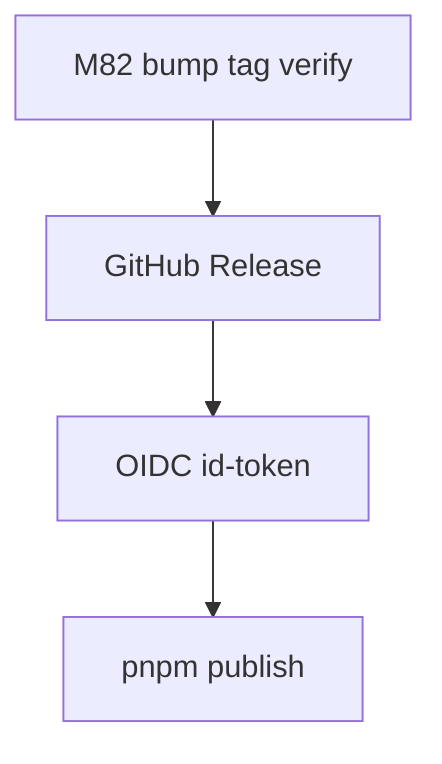

# Milestone 83 — npm Publish via OIDC Design

**Spec**: [spec.md](./spec.md)  
**Context**: [context.md](./context.md)  
**Status**: Planned  
**Depends on**: M82 Done ([`github-release-action/design.md`](../github-release-action/design.md))

---

## Architecture Overview

Extend the M82 release pipeline with a registry publish step authenticated by GitHub OIDC → npm Trusted Publishing.

**Unchanged:** bump input, tag format, `pnpm verify` before Release, product pipeline, contract JSON versions.

---

## Brownfield map

| Area           | Evidence                                      | Execute impact        |
| -------------- | --------------------------------------------- | --------------------- |
| Release Action | M82 `release.yml` (contents write only)       | T1 extend             |
| Package meta   | `name`, `publishConfig.access: public`, `files`, `bin` | Ready for publish |
| Docs           | CONTRIBUTING Releasing (M82); README clone-only install | T2–T3          |
| STATE          | Deferred npm publish                          | T4 on Done            |

---

## Code Reuse Analysis

### Existing Components to Leverage

| Component        | Location                 | How to Use                                      |
| ---------------- | ------------------------ | ----------------------------------------------- |
| `release.yml`    | `.github/workflows/`     | Append permissions + publish; do not rename     |
| `publishConfig`  | `package.json`           | Keep `access: public`                           |
| CI Node setup    | `ci.yml` / M82           | Add `registry-url` on setup-node for publish job|

### Integration Points

| System        | Integration Method                                                |
| ------------- | ----------------------------------------------------------------- |
| GitHub OIDC   | `permissions.id-token: write`                                     |
| npmjs Trusted Publisher | Manual config on package Access tab (AlanTaranti / hotspot-scanner / release.yml) |
| npm registry  | `pnpm publish --access public` (access already in publishConfig)  |

---

## Components

### Publish step on `release.yml`

- **Purpose**: Ship tarball matching the just-tagged version
- **Location**: same job as M82 (or dedicated job needing release success — prefer same job for simplicity)
- **Order**: after GitHub Release succeeds
- **Auth**: OIDC only (no `NPM_TOKEN`)
- **Tooling**: ensure npm ≥ 11.5.1; `actions/setup-node` with `registry-url: https://registry.npmjs.org`
- **Risks**: Trusted Publisher misconfigured → opaque 401; first-publish prerequisite; private-repo provenance limits N/A (public repo)

### Docs

- **CONTRIBUTING**: Trusted Publisher checklist + chicken-egg
- **README**: registry install + keep clone for contributors

### STATE (Execute Phase F)

- Narrow Deferred; add Decision row for OIDC-only publish via `release.yml`

---

## Error Handling

| Failure                         | Behavior                                              |
| ------------------------------- | ----------------------------------------------------- |
| OIDC / Trusted Publisher missing| Publish fails; tag+Release may already exist — ops fix|
| Version already on npm          | Publish fails — do not force / `--force`              |
| Verify or Release failed        | Publish must not run                                  |

---

## Security

- No long-lived npm automation token in GitHub secrets for steady state
- Trusted Publisher binds exact workflow filename — renaming `release.yml` breaks publish until npm UI updated
- Optional: GitHub Environment with required reviewers before publish job (YAGNI unless protection demands it — default: same job, maintainer-only `workflow_dispatch`)

---

## Testing Strategy

| Layer         | Approach                                                              |
| ------------- | --------------------------------------------------------------------- |
| Product tests | Unchanged                                                             |
| Workflow      | Static AC review                                                      |
| Live publish  | Maintainer checklist after Trusted Publisher configured (post-merge)  |
| Gate          | `pnpm verify`                                                         |

---

## Implementation Notes (for Execute)

- Do not rename `release.yml`
- Prefer `pnpm publish` from package root after `pnpm verify` + Release
- Avoid caching package manager in a way that breaks publish reproducibility if docs warn against it
- Provenance: trust Trusted Publishing defaults; add explicit flag only if publish fails without it
