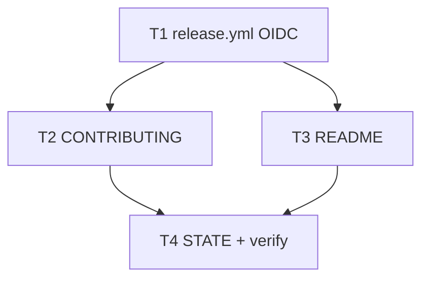

# Milestone 83 — npm Publish via OIDC Tasks

**Design**: [design.md](./design.md)  
**Spec**: [spec.md](./spec.md)  
**Context**: [context.md](./context.md)  
**Status**: Planned  
**Depends on**: M82 [`github-release-action`](../github-release-action/tasks.md) **Done**  
**Note**: Medium feature — Execute only after M82 Done and Status promotion. Do **not** rename `release.yml`. Do **not** add steady-state `NPM_TOKEN`. Do **not** bump JSON contracts. Expected final gate: `pnpm verify`. Live npm publish requires maintainer Trusted Publisher setup (checklist, not a code task).

---

## Execution Plan

### Phase 1: Workflow

```
T1 extend release.yml OIDC + publish
```

### Phase 2: Docs (parallel OK)

```
T1 ──┬→ T2 [P] CONTRIBUTING Trusted Publisher
     └→ T3 [P] README registry install
```

### Phase 3: STATE + gate

```
T2 + T3 → T4 STATE Deferred/Decision + pnpm verify
```



### Diagram-Definition Cross-Check

| Task | Depends on (declared) | Diagram shows | Match |
| ---- | --------------------- | ------------- | ----- |
| T1   | None (M82 Done assumed) | Root        | yes   |
| T2   | T1                    | T1→T2         | yes   |
| T3   | T1                    | T1→T3         | yes   |
| T4   | T2, T3                | T2/T3→T4      | yes   |

### Path Conflict Check (Check 5)

| Task   | Module owner | Paths (primary)                    | Conflict with parallel peers |
| ------ | ------------ | ---------------------------------- | ---------------------------- |
| T1     | GHA          | `.github/workflows/release.yml`    | None                         |
| T2 [P] | CONTRIBUTING | `CONTRIBUTING.md`                  | vs T3: disjoint              |
| T3 [P] | README       | `README.md`                        | vs T2: disjoint              |
| T4     | STATE + gate | `.specs/project/STATE.md`          | After T2/T3                  |

### Test Co-location Validation

| Task | Code layer    | Required tests | Co-located        |
| ---- | ------------- | -------------- | ----------------- |
| T1   | workflow YAML | none           | n/a               |
| T2   | docs          | none           | n/a               |
| T3   | docs          | none           | n/a               |
| T4   | STATE + gate  | full           | `pnpm verify`     |

### Granularity Check (Check 1)

| Task | Scope                    | Status      |
| ---- | ------------------------ | ----------- |
| T1   | One workflow extension   | ✅ Granular |
| T2   | CONTRIBUTING section     | ✅ Granular |
| T3   | README install           | ✅ Granular |
| T4   | STATE + verify           | ✅ Granular |

---

## Tasks

### T1: Extend `release.yml` with OIDC publish

**Owner**: GHA / `.github/workflows/release.yml`  
**Depends on**: M82 Done  
**Requirements**: HOTSPOT-1780–1784

**Done when**:

- [ ] `permissions` include `contents: write` and `id-token: write`
- [ ] setup-node (or equivalent) sets `registry-url: https://registry.npmjs.org`
- [ ] Job ensures npm CLI ≥ 11.5.1 when required for Trusted Publishing
- [ ] After successful GitHub Release, publish `@taranti/hotspot-scanner` without `NPM_TOKEN` / `NODE_AUTH_TOKEN`
- [ ] Workflow filename remains `release.yml`

**Tests**: none (YAML)  
**Gate**: none beyond review (project gate in T4)

---

### T2: CONTRIBUTING Trusted Publisher docs

**Owner**: CONTRIBUTING.md  
**Depends on**: T1  
**Requirements**: HOTSPOT-1785, HOTSPOT-1786, HOTSPOT-1787

**Done when**:

- [ ] Releasing section documents Trusted Publisher: `AlanTaranti` / `hotspot-scanner` / `release.yml`
- [ ] Documents first-publish chicken-egg (package must exist before Trusted Publisher)
- [ ] States steady-state auth is OIDC (no long-lived token)
- [ ] Thin guide (contributing-sot)

**Tests**: none  
**Gate**: none beyond review (project gate in T4)

---

### T3: README registry install

**Owner**: README.md  
**Depends on**: T1  
**Requirements**: HOTSPOT-1788, HOTSPOT-1789, HOTSPOT-1790

**Done when**:

- [ ] README documents installing `@taranti/hotspot-scanner` from npm
- [ ] Clone + `pnpm build` path remains for contributors
- [ ] Package name and bin `hotspot-scanner` are correct
- [ ] `npx`/`pnpm dlx` mentioned only if accurate for the published bin

**Tests**: none  
**Gate**: none beyond review (project gate in T4)

---

### T4: STATE sync + final verify

**Owner**: STATE + gate  
**Depends on**: T2, T3  
**Requirements**: HOTSPOT-1791, HOTSPOT-1792

**Done when**:

- [ ] STATE Deferred npm publish item removed or narrowed to match shipped OIDC path
- [ ] STATE Decisions includes lasting lock: publish via Trusted Publishing OIDC on `release.yml` (no steady-state `NPM_TOKEN`)
- [ ] `pnpm verify` exits 0
- [ ] Maintainer checklist noted: configure Trusted Publisher + one successful dispatch publish (ops)

**Tests**: full suite via verify  
**Gate**: `pnpm verify`

---

## Parallelism Summary

T1 then T2∥T3 then T4.
