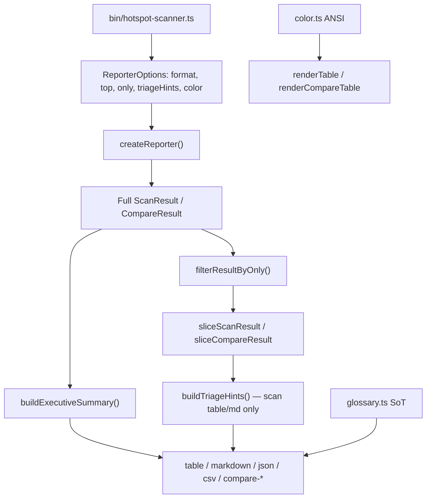

# Milestone 41 — Output Interpretation UX Design

**Spec**: [`.specs/features/output-interpretation-ux/spec.md`](./spec.md)  
**Context**: [`.specs/features/output-interpretation-ux/context.md`](./context.md)  
**Status**: Approved for Tasks (planning)

---

## Architecture Overview

M41 is a **reporter + CLI** feature. The scan pipeline (`runScan`, scorers, schemas) is unchanged. `createReporter()` gains interpretation options; pure helpers under `src/report/` build summary, glossary, triage, color, and section filters. The bin resolves TTY / `NO_COLOR` / `--no-color` / `--output` into a boolean `color` flag and passes `--only` + `triageHints` into `ReporterOptions`.



**Baseline:** [ARCHITECTURE.md](../../codebase/ARCHITECTURE.md) § Export formats; [reporter-cli/design.md](../reporter-cli/design.md); [format-scoped-top/context.md](../format-scoped-top/context.md) (`--top` table/markdown only).

---

## Code Reuse Analysis

### Existing Components to Leverage

| Component                                | Location                                  | How to Use                                                                                                                 |
| ---------------------------------------- | ----------------------------------------- | -------------------------------------------------------------------------------------------------------------------------- |
| `createReporter`                         | `src/report/index.ts`                     | Extend `ReporterOptions`; compute summary pre-slice; apply `--only` then slice for table/md; filter json/csv without slice |
| `sliceScanResult` / `sliceCompareResult` | `src/report/slice.ts`, `slice-compare.ts` | Unchanged; call after filter, after summary totals captured                                                                |
| `renderTable` / `renderMarkdown`         | `src/report/table.ts`, `markdown.ts`      | Accept optional summary, triage, color, section visibility                                                                 |
| `renderJson` / `renderCsv`               | `src/report/json.ts`, `csv.ts`            | Apply omit-section filter only                                                                                             |
| Compare renderers                        | `src/report/compare-*.ts`                 | Same pattern; no triage                                                                                                    |
| `CliUsageError` / `parseFormat`          | `bin/hotspot-scanner.ts`                  | Mirror for `parseOnlySection` / collect `--only`                                                                           |
| Report fixtures                          | `tests/fixtures/report/`                  | Extend or add fixtures for triage thresholds                                                                               |
| `formatStaticDep` etc.                   | `src/report/coupling-format.ts`           | Unchanged; color wraps formatted cells                                                                                     |

### Integration Points

| System                   | Integration                                                                       |
| ------------------------ | --------------------------------------------------------------------------------- |
| `bin/hotspot-scanner.ts` | New flags; `resolveTableColor(...)`; pass options into `render` / `renderCompare` |
| `src/scan.ts` / scoring  | **None**                                                                          |
| `schemas/`               | **Unchanged** — filtered JSON is non-contract                                     |
| Diagnostics / stderr     | Unchanged — legend/summary/triage on report stdout/file only                      |

### CONCERNS mitigation

| Concern                   | Mitigation                                                                       |
| ------------------------- | -------------------------------------------------------------------------------- |
| Report purity (no `fs`)   | Keep; TTY/`NO_COLOR` resolved in bin → `color: boolean`                          |
| JSON contract / baselines | Document `--only` JSON as non-baseline; do not change schemas                    |
| Padding vs ANSI           | Pad on visible width or strip-ANSI in width calc; tests compare stripped strings |

---

## Components

### `ReportSection` + `parseOnlySection` / `collectOnly`

- **Purpose**: Validate and accumulate `--only` values
- **Location**: `src/report/only.ts` (pure) + thin collect in `bin/hotspot-scanner.ts`
- **Interfaces**:
  - `export type ReportSection = "hotspots" | "coupling" | "functions"`
  - `parseOnlySection(value: string): ReportSection` — throws/`CliUsageError` at bin boundary
  - `filterScanResult(result, only?: ReportSection[]): ScanResult` — omits arrays by deleting keys for JSON path **or** returns a structured “sections” view; prefer a `SectionFilter` set consumed by each renderer rather than mutating typed `ScanResult` for table (TypeScript still requires keys). **Design choice:** keep `ScanResult` intact; pass `only?: ReadonlySet<ReportSection>` into renderers / factory. For JSON serializer, skip keys not in set. For CSV, skip files not in set.
- **Reuses**: `collectGlob` pattern for repeatable flags

### `buildExecutiveSummary`

- **Purpose**: Pre-slice corpus stats + shown-vs-total after slice sizes known
- **Location**: `src/report/summary.ts`
- **Interfaces**:
  - `buildScanExecutiveSummary(full: ScanResult, displayed: ScanResult): string[]`
  - `buildCompareExecutiveSummary(full: CompareResult, displayed: CompareResult): string[]`
- **Dependencies**: `ScanResult` / `CompareResult` meta + array lengths; static-dep false count via `coupling.filter(p => !p.hasStaticDependency).length` on **full**
- **Reuses**: Existing meta field names

### `glossary.ts`

- **Purpose**: Single SoT for table footer lines and markdown “How to read this” body
- **Location**: `src/report/glossary.ts`
- **Interfaces**:
  - `renderTableGlossary(): string[]`
  - `renderMarkdownHowToRead(options?: { compare?: boolean }): string[]`
- **Reuses**: Metric definitions aligned with ARCHITECTURE / rich-output columns

### `buildTriageHints`

- **Purpose**: Apply the three locked rules; cap 3/rule
- **Location**: `src/report/triage.ts`
- **Interfaces**:
  - `buildTriageHints(displayed: ScanResult): TriageHint[]` (empty → omit section)
  - `renderTableTriageHints(hints): string[]` / `renderMarkdownTriageHints(hints): string[]`
  - Exported threshold constants for tests
- **Dependencies**: Displayed (sliced + filtered) scan result only
- **Reuses**: Ranking field names from domain types

### `color.ts`

- **Purpose**: ANSI wrap helpers + score band
- **Location**: `src/report/color.ts`
- **Interfaces**:
  - `colorEnabled` already decided by bin; helpers `paintScore(n, enabled)`, `paintStaticDep(text, enabled)`, `stripAnsi(s)` for tests
- **Dependencies**: None (manual CSI codes)
- **Reuses**: None

### `createReporter` dispatch (extended)

```typescript
export interface ReporterOptions {
  format: "table" | "json" | "markdown" | "csv";
  top?: number;
  only?: readonly ReportSection[];
  triageHints?: boolean; // default true for callers that omit — bin passes explicit
  color?: boolean; // table only; default false if omitted
}
```

Algorithm for `render(result, options)`:

1. `onlySet = normalizeOnly(options.only)` // undefined → all sections
2. `summary = buildScanExecutiveSummary(result, /* displayed later */)` — compute full totals first; finalize shown counts after slice
3. For `json` / `csv`: filter sections → render (no slice; no summary/triage/color)
4. For `table` / `markdown`: `filtered` view via onlySet → `sliced = slice*(filteredOrFull, top)` → triage if `triageHints !== false` → render with summary + glossary/how-to-read + optional color

**Note:** Filtering before slice keeps `--top` applying to the selected ranking. Summary totals always from original full `result`.

### Bin: `resolveTableColor`

```typescript
function resolveTableColor(opts: {
  format: OutputFormat;
  outputPath?: string;
  noColor: boolean;
  envNoColor: string | undefined;
  stdoutIsTTY: boolean | undefined;
}): boolean;
```

False unless `format === "table"` and all enable conditions pass.

---

## Data Models

```typescript
export type ReportSection = "hotspots" | "coupling" | "functions";

export interface TriageHint {
  ruleId:
    "dual-signal-hotspot" | "coupled-with-static" | "coupled-without-static";
  message: string;
  /** Stable display target, e.g. file path or "fileA ↔ fileB" */
  target: string;
  rankMetric: number;
}
```

No domain `ScanResult` schema changes.

---

## Error Handling Strategy

| Scenario                       | Handling               | User impact                                                 |
| ------------------------------ | ---------------------- | ----------------------------------------------------------- |
| `--only bogus`                 | `CliUsageError`        | Exit 2, message lists valid values                          |
| Empty `--only` value           | `CliUsageError`        | Exit 2                                                      |
| Filtered JSON used as baseline | Docs/help warning only | `loadBaseline` may fail schema/structural checks — expected |
| Triage on empty scan           | Omit section           | Clean output                                                |

---

## Tech Decisions

| Decision                      | Choice                                                     | Rationale                                                                                         |
| ----------------------------- | ---------------------------------------------------------- | ------------------------------------------------------------------------------------------------- |
| Section filter representation | `only?: ReportSection[]` on options; renderers consult set | Avoid breaking `ScanResult` required keys in TS for table path; JSON omits keys at serialize time |
| Color dependency              | Manual ANSI                                                | YAGNI; no new runtime dep                                                                         |
| Triage evaluation set         | Sliced + filtered rows                                     | Hints describe visible table                                                                      |
| Summary totals                | Full pre-slice corpus                                      | Honest window stats                                                                               |
| Compare triage                | None                                                       | Absolute thresholds misleading on deltas                                                          |
| Empty excluded sections       | Omit (not header-only)                                     | User lock; included empties keep today’s empty UI                                                 |
| `NO_COLOR`                    | Non-empty env value disables                               | Align with no-color.org spirit                                                                    |

---

## Risks

| Risk                                    | Mitigation                                                      |
| --------------------------------------- | --------------------------------------------------------------- |
| ANSI breaks column alignment            | Visible-width padding + strip-ANSI golden tests                 |
| Filtered JSON surprises CI users        | Help + README warning; schemas unchanged                        |
| Path conflicts on `src/report/index.ts` | Single fan-in task for factory after parallel helpers/renderers |
| Compare CSV file matrix with `--only`   | Explicit matrix in tests (which suffixes remain)                |

---

## Test Plan (maps to TESTING.md)

| Layer       | What                                                                                                                 |
| ----------- | -------------------------------------------------------------------------------------------------------------------- |
| Unit        | `only.ts`, `summary.ts`, `glossary.ts`, `triage.ts`, `color.ts`; table/markdown/json/csv/compare-* / `index.test.ts` |
| CLI         | `bin/hotspot-scanner.test.ts` — invalid `--only`, flags wiring, color disable via env/`--no-color`/`--output`        |
| Contract    | Unfiltered JSON still validates; **no** schema change for `--only`                                                   |
| Integration | Optional `small-ts` smoke for default table contains glossary marker                                                 |

Gate: per-task targeted Vitest; final `pnpm build && pnpm test`.
