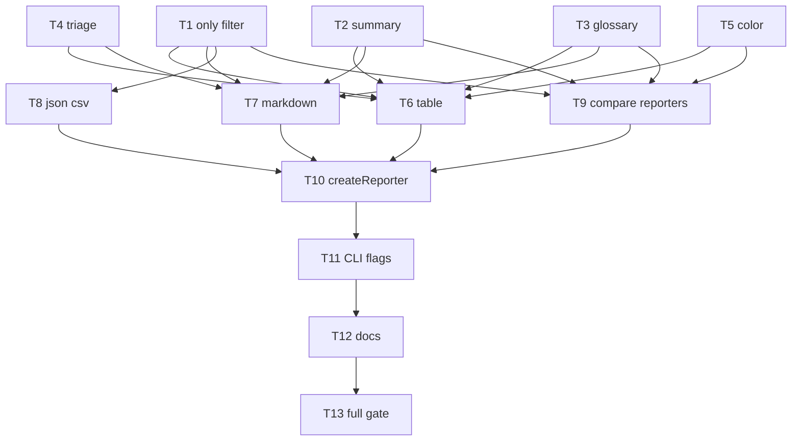

# Milestone 41 — Output Interpretation UX Tasks

**Design**: [`.specs/features/output-interpretation-ux/design.md`](./design.md)  
**Spec**: [`.specs/features/output-interpretation-ux/spec.md`](./spec.md)  
**Context**: [`.specs/features/output-interpretation-ux/context.md`](./context.md)  
**Status**: Planned

---

## Execution Plan

### Phase 1: Pure helpers (Parallel OK)

```
T1 only filter ──┐
T2 summary     ──┤
T3 glossary    ──┼──→ Phase 2
T4 triage      ──┤
T5 color       ──┘
```

### Phase 2: Renderers (Parallel OK after Phase 1)

```
T1–T5 ──┬→ T6 table [P]
        ├→ T7 markdown [P]
        ├→ T8 json+csv [P]
        └→ T9 compare-* [P]
```

### Phase 3: Factory → CLI → docs → gate

```
T6–T9 → T10 createReporter → T11 CLI → T12 docs → T13 full gate
```



### Diagram-Definition Cross-Check

| Task | Depends on (task body) | Diagram shows | Match |
| ---- | ---------------------- | ------------- | ----- |
| T1 | None | Root | ✅ |
| T2 | None | Root | ✅ |
| T3 | None | Root | ✅ |
| T4 | None | Root | ✅ |
| T5 | None | Root | ✅ |
| T6 | T1, T2, T3, T4, T5 | T1–T5→T6 | ✅ |
| T7 | T1, T2, T3, T4 | T1–T4→T7 | ✅ |
| T8 | T1 | T1→T8 | ✅ |
| T9 | T1, T2, T3, T5 | T1–T3,T5→T9 | ✅ |
| T10 | T6, T7, T8, T9 | T6–T9→T10 | ✅ |
| T11 | T10 | T10→T11 | ✅ |
| T12 | T11 | T11→T12 | ✅ |
| T13 | T12 | T12→T13 | ✅ |

### Path Conflict Check (Check 5)

| Task | Module owner | Paths | Conflict |
| ---- | ------------ | ----- | -------- |
| T1 | `src/report/` | `src/report/only.ts`, `only.test.ts` | Sole |
| T2 | `src/report/` | `src/report/summary.ts`, `summary.test.ts` | Sole |
| T3 | `src/report/` | `src/report/glossary.ts`, `glossary.test.ts` | Sole |
| T4 | `src/report/` | `src/report/triage.ts`, `triage.test.ts` | Sole |
| T5 | `src/report/` | `src/report/color.ts`, `color.test.ts` | Sole |
| T6 | `src/report/` | `src/report/table.ts`, `table.test.ts` | Sole (not parallel with other table edits) |
| T7 | `src/report/` | `src/report/markdown.ts`, `markdown.test.ts` | Sole |
| T8 | `src/report/` | `src/report/json.ts`, `csv.ts`, `csv-bundle.ts` (if needed), `*.test.ts` | Sole — sequential within task |
| T9 | `src/report/` | `src/report/compare-table.ts`, `compare-markdown.ts`, `compare-json.ts`, `compare-csv.ts`, tests | Sole — one owner for compare renderers |
| T10 | `src/report/` | `src/report/index.ts`, `index.test.ts` | After T6–T9 |
| T11 | `bin/` | `bin/hotspot-scanner.ts`, `bin/hotspot-scanner.test.ts` | Sole |
| T12 | docs | `ARCHITECTURE.md`, `README.md`, optionally `STRUCTURE.md` | Docs only |
| T13 | gate | none (verify) | N/A |

**Parallelism:** T1–T5 `[P]` (disjoint new files). T6–T9 `[P]` (disjoint renderer files). Do **not** parallelize any two tasks that both edit `index.ts` or `bin/`.

### Test Co-location Validation

| Task | Code layer | Matrix / TESTING.md | Task Tests | Status |
| ---- | ---------- | ------------------- | ---------- | ------ |
| T1–T5 | `src/report/` helpers | Unit co-located | unit | ✅ |
| T6–T9 | `src/report/` renderers | Unit co-located | unit | ✅ |
| T10 | `src/report/index.ts` | Unit | unit | ✅ |
| T11 | `bin/` | CLI Vitest | unit/CLI | ✅ |
| T12 | docs | none | none | ✅ |
| T13 | gate | full gate | deferred_project_gate | ✅ |

---

## Task Breakdown

### T1: Section filter helper `[P]`

**What**: Add `ReportSection` type, `parseOnlySection`, `normalizeOnly`, and helpers that decide which sections are included; unit tests for union/dedupe/invalid.
**Where**: `src/report/only.ts`, `src/report/only.test.ts`
**Depends on**: None
**Reuses**: Repeatable-flag mental model from `collectGlob`
**Requirement**: HOTSPOT-525, HOTSPOT-526, HOTSPOT-530

**Done when**:

- [ ] Valid values: `hotspots` \| `coupling` \| `functions`
- [ ] Invalid value throws a clear error (bin will wrap as `CliUsageError`)
- [ ] Dedupe + union behavior tested
- [ ] Gate: `pnpm exec vitest run src/report/only.test.ts`

**Tests**: unit  
**Gate**: quick  
**Commit**: `feat(report): add --only section filter helper`

---

### T2: Executive summary builder `[P]`

**What**: Implement `buildScanExecutiveSummary` / `buildCompareExecutiveSummary` producing string lines for scan window, granularity, shown-vs-total, coupling count, static-dep-false count (scan).
**Where**: `src/report/summary.ts`, `src/report/summary.test.ts`
**Depends on**: None
**Reuses**: `ScanResult` / `CompareResult` meta fields
**Requirement**: HOTSPOT-515, HOTSPOT-517, HOTSPOT-518, HOTSPOT-519

**Done when**:

- [ ] Full-corpus totals used for coupling + static-dep-false
- [ ] Shown vs total reflects displayed array lengths vs full
- [ ] Compare summary covers delta-oriented counts per context D3
- [ ] Gate: `pnpm exec vitest run src/report/summary.test.ts`

**Tests**: unit  
**Gate**: quick  
**Commit**: `feat(report): add executive summary builder`

---

### T3: Glossary / How-to-read SoT `[P]`

**What**: Shared glossary content for table footer and markdown `## How to read this`.
**Where**: `src/report/glossary.ts`, `src/report/glossary.test.ts`
**Depends on**: None
**Reuses**: Column names from `table.ts` / `markdown.ts`
**Requirement**: HOTSPOT-510, HOTSPOT-511, HOTSPOT-513, HOTSPOT-514

**Done when**:

- [ ] `renderTableGlossary()` returns footer lines defining locked metric terms
- [ ] `renderMarkdownHowToRead()` returns GFM section with same semantics
- [ ] Gate: `pnpm exec vitest run src/report/glossary.test.ts`

**Tests**: unit  
**Gate**: quick  
**Commit**: `feat(report): add shared output glossary`

---

### T4: Triage hints `[P]`

**What**: Implement three locked rules, thresholds as constants, cap 3/rule, render helpers for table/markdown.
**Where**: `src/report/triage.ts`, `src/report/triage.test.ts`
**Depends on**: None
**Reuses**: Hotspot / coupling field names
**Requirement**: HOTSPOT-520, HOTSPOT-521, HOTSPOT-523, HOTSPOT-524

**Done when**:

- [ ] All three rules covered with positive/negative fixtures
- [ ] Cap and sort-by-metric tested; empty → `[]`
- [ ] Gate: `pnpm exec vitest run src/report/triage.test.ts`

**Tests**: unit  
**Gate**: quick  
**Commit**: `feat(report): add conservative triage hints`

---

### T5: Table color helpers `[P]`

**What**: Manual ANSI helpers for score bands and StaticDep; `stripAnsi` for tests; no new dependency.
**Where**: `src/report/color.ts`, `src/report/color.test.ts`
**Depends on**: None
**Reuses**: None
**Requirement**: HOTSPOT-532, HOTSPOT-537, HOTSPOT-538

**Done when**:

- [ ] Bands match context D6; `enabled: false` returns plain text
- [ ] `package.json` dependencies unchanged (no chalk/picocolors)
- [ ] Gate: `pnpm exec vitest run src/report/color.test.ts`

**Tests**: unit  
**Gate**: quick  
**Commit**: `feat(report): add optional ANSI color helpers`

---

### T6: Wire scan table renderer `[P]`

**What**: Integrate summary (top), triage (optional), glossary footer, and color into `renderTable`; honor section filter for omitted blocks.
**Where**: `src/report/table.ts`, `src/report/table.test.ts`
**Depends on**: T1, T2, T3, T4, T5
**Reuses**: Existing section renderers
**Requirement**: HOTSPOT-510, HOTSPOT-512, HOTSPOT-515, HOTSPOT-521, HOTSPOT-522, HOTSPOT-527, HOTSPOT-532

**Done when**:

- [ ] Footer after tables; triage before footer when present
- [ ] `--only` omits sections; empty included keeps `(none)`
- [ ] Strip-ANSI equality vs uncolored for same fixture
- [ ] Gate: `pnpm exec vitest run src/report/table.test.ts`

**Tests**: unit  
**Gate**: quick  
**Commit**: `feat(report): enrich table with summary legend triage color`

---

### T7: Wire scan markdown renderer `[P]`

**What**: Integrate executive summary, `## How to read this`, optional triage, section filter into `renderMarkdown` (no color).
**Where**: `src/report/markdown.ts`, `src/report/markdown.test.ts`
**Depends on**: T1, T2, T3, T4
**Reuses**: Glossary + triage markdown renderers
**Requirement**: HOTSPOT-513, HOTSPOT-514, HOTSPOT-516, HOTSPOT-521, HOTSPOT-527

**Done when**:

- [ ] Section order: summary → how-to-read → tables → triage (if any)
- [ ] Omitted sections have no headings
- [ ] Gate: `pnpm exec vitest run src/report/markdown.test.ts`

**Tests**: unit  
**Gate**: quick  
**Commit**: `feat(report): enrich markdown interpretation sections`

---

### T8: Wire JSON + CSV `--only` omit `[P]`

**What**: Omit excluded top-level JSON keys; omit excluded CSV bundle files; keep `meta.json`; no summary/triage/color.
**Where**: `src/report/json.ts`, `src/report/csv.ts`, related tests (`json.test.ts`, `csv.test.ts`); adjust `csv-bundle` typing only if required
**Depends on**: T1
**Reuses**: Existing CSV stem/suffix conventions
**Requirement**: HOTSPOT-528, HOTSPOT-529, HOTSPOT-530

**Done when**:

- [ ] `--only coupling` JSON lacks `hotspots`/`functions` keys (or whichever excluded)
- [ ] CSV bundle omits non-selected data files; meta retained
- [ ] Unfiltered output unchanged vs pre-task snapshots
- [ ] Gate: `pnpm exec vitest run src/report/json.test.ts src/report/csv.test.ts`

**Tests**: unit  
**Gate**: quick  
**Commit**: `feat(report): honor --only in json and csv exports`

---

### T9: Wire compare reporters `[P]`

**What**: Apply `--only`, executive summary, glossary/how-to-read, and table color to compare renderers; **no** triage.
**Where**: `src/report/compare-table.ts`, `compare-markdown.ts`, `compare-json.ts`, `compare-csv.ts`, co-located tests
**Depends on**: T1, T2, T3, T5
**Reuses**: Scan helpers where shared
**Requirement**: HOTSPOT-519, HOTSPOT-524, HOTSPOT-531, HOTSPOT-532

**Done when**:

- [ ] Compare table/markdown include summary + glossary/how-to-read
- [ ] Compare never emits triage section
- [ ] JSON/CSV omit excluded compare sections/files
- [ ] Gate: `pnpm exec vitest run src/report/compare-table.test.ts src/report/compare-markdown.test.ts src/report/compare-json.test.ts src/report/compare-csv.test.ts`

**Tests**: unit  
**Gate**: quick  
**Commit**: `feat(report): extend interpretation UX to compare output`

---

### T10: `createReporter` options plumbing

**What**: Extend `ReporterOptions` (`only`, `triageHints`, `color`); dispatch: summary from full result → filter → slice (table/md) → renderers; JSON/CSV filter without slice.
**Where**: `src/report/index.ts`, `src/report/index.test.ts`
**Depends on**: T6, T7, T8, T9
**Reuses**: Existing format branches
**Requirement**: HOTSPOT-518, HOTSPOT-523, HOTSPOT-531

**Done when**:

- [ ] Defaults: all sections; triage on for scan table/md path; color off unless set
- [ ] Rankings/scores unchanged vs fixture when interpretation flags default
- [ ] Gate: `pnpm exec vitest run src/report/index.test.ts`

**Tests**: unit  
**Gate**: quick  
**Commit**: `feat(report): plumb interpretation options through createReporter`

---

### T11: CLI flags and color resolution

**What**: Add repeatable `--only`, `--no-triage-hints`, `--no-color`; `resolveTableColor`; pass options into reporter; invalid `--only` → `CliUsageError` exit 2; help text warns filtered JSON is not a baseline.
**Where**: `bin/hotspot-scanner.ts`, `bin/hotspot-scanner.test.ts`
**Depends on**: T10
**Reuses**: `CliUsageError`, `collectGlob` pattern
**Requirement**: HOTSPOT-522, HOTSPOT-525, HOTSPOT-526, HOTSPOT-533, HOTSPOT-534, HOTSPOT-535, HOTSPOT-536, HOTSPOT-539 (help portion)

**Done when**:

- [ ] Invalid `--only` exits 2 before scan
- [ ] Color disabled for non-TTY, `--no-color`, non-empty `NO_COLOR`, `--output`, non-table formats
- [ ] `--no-triage-hints` suppresses triage in table/markdown
- [ ] Gate: `pnpm exec vitest run bin/hotspot-scanner.test.ts`

**Tests**: unit / CLI  
**Gate**: quick  
**Commit**: `feat(cli): add --only --no-triage-hints --no-color`

---

### T12: Living docs sync

**What**: Update ARCHITECTURE § Reporter/export, README output section, and STRUCTURE report listing for new helpers; document `--only` JSON baseline warning.
**Where**: `.specs/codebase/ARCHITECTURE.md`, `README.md`, `.specs/codebase/STRUCTURE.md` (if report tree listed)
**Depends on**: T11
**Reuses**: Existing doc style from M16/M18
**Requirement**: HOTSPOT-539

**Done when**:

- [ ] Docs describe legend, summary, triage rules (pointer to context/spec), `--only`, color policy
- [ ] No implementation drift claims (checkboxes remain open in ROADMAP until Execute Done)
- [ ] Gate: docs-only review (no code gate required beyond T13)

**Tests**: none  
**Gate**: none  
**Commit**: `docs: document M41 output interpretation UX`

---

### T13: Full quality gate

**What**: Run mandatory project gate; fix only M41 regressions.
**Where**: n/a
**Depends on**: T12
**Requirement**: Success criteria / all HOTSPOT-510–539 verified

**Done when**:

- [ ] `pnpm build && pnpm test` passes
- [ ] Unfiltered JSON still schema-valid
- [ ] Test count does not silently drop

**Tests**: deferred_project_gate  
**Gate**: `pnpm build && pnpm test`  
**Commit**: none (verify only)

---

## Requirement → Task Mapping

| Requirement | Tasks |
| ----------- | ----- |
| HOTSPOT-510 | T3, T6 |
| HOTSPOT-511 | T3 |
| HOTSPOT-512 | T6 |
| HOTSPOT-513 | T3, T7 |
| HOTSPOT-514 | T3, T7 |
| HOTSPOT-515 | T2, T6 |
| HOTSPOT-516 | T7 |
| HOTSPOT-517 | T2 |
| HOTSPOT-518 | T2, T10 |
| HOTSPOT-519 | T2, T9 |
| HOTSPOT-520 | T4 |
| HOTSPOT-521 | T4, T6, T7 |
| HOTSPOT-522 | T6, T11 |
| HOTSPOT-523 | T4, T10 |
| HOTSPOT-524 | T4, T9 |
| HOTSPOT-525 | T1, T11 |
| HOTSPOT-526 | T1, T11 |
| HOTSPOT-527 | T6, T7 |
| HOTSPOT-528 | T8 |
| HOTSPOT-529 | T8 |
| HOTSPOT-530 | T1, T8 |
| HOTSPOT-531 | T9, T10 |
| HOTSPOT-532 | T5, T6, T9 |
| HOTSPOT-533 | T11 |
| HOTSPOT-534 | T11 |
| HOTSPOT-535 | T11 |
| HOTSPOT-536 | T11 |
| HOTSPOT-537 | T5 |
| HOTSPOT-538 | T5 |
| HOTSPOT-539 | T11, T12 |

**Unmapped:** 0

---

## Parallel Execution Map

```
Phase 1: T1 [P], T2 [P], T3 [P], T4 [P], T5 [P]
Phase 2: T6 [P], T7 [P], T8 [P], T9 [P]
Phase 3: T10 → T11 → T12 → T13
```

**Tools (Execute session):** Skill `task-implementer` + `coding-guidelines`; CLI tasks also `vitals-cli-validation`; domain `vitals-pipeline-domain` (report section). No MCP required.
