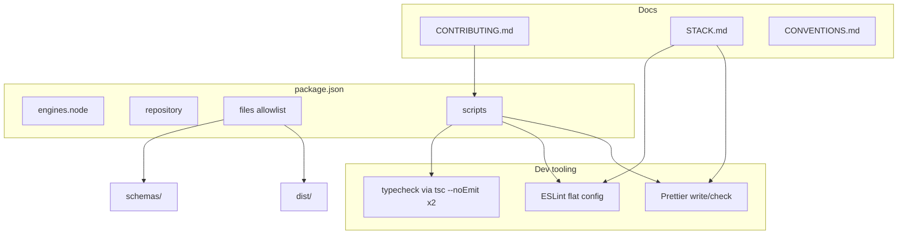

# Milestone 24 — Package DX Design

**Spec**: [`.specs/features/package-dx/spec.md`](./spec.md)  
**Context**: [`.specs/features/package-dx/context.md`](./context.md)  
**Status**: Planned  
**Depth**: Light (tooling / package metadata — no `src/` architecture change)

---

## Architecture Overview

M24 is **repo tooling + publish prep**. No scanner pipeline modules change. Artifacts:



---

## Code Reuse Analysis

| Existing | Location | How to use |
| -------- | -------- | ---------- |
| Dual tsconfig build | `tsconfig.json`, `tsconfig.bin.json`, `pnpm build` | Mirror with `--noEmit` for `typecheck` |
| Node 22 baseline | `@tsconfig/node22`, CONTRIBUTING prerequisites | Align `engines.node` |
| LICENSE / README | repo root | Include in `files` |
| JSON schemas | `schemas/*.json` | Include via `files` (closes M20 note) |

**Fragile areas (CONCERNS.md):** None touched in `src/git|complexity|scoring`. Risk is tooling false positives / large Prettier churn — mitigate with ignores and green scripts.

---

## Script contracts (concrete)

| Script | Exact command | Mutates tree? |
| ------ | ------------- | ------------- |
| `typecheck` | `tsc --noEmit && tsc --noEmit -p tsconfig.bin.json` | No |
| `lint` | `eslint .` | No |
| `format` | `prettier --write .` | Yes |
| `format:check` | `prettier --check .` | No |
| `build` | unchanged (`tsc && tsc -p tsconfig.bin.json`) | Emit |
| `test` | unchanged (`vitest run --coverage`) | No |

**Project gate (unchanged):** `pnpm build && pnpm test`  
**Recommended local (CONTRIBUTING only):** `typecheck`, `lint`, `format:check` before PR; use `format` to fix.

---

## Components

### package.json publish-prep metadata

- **Purpose**: Engines, repository, files allowlist for future publish
- **Location**: `package.json` (root)
- **Fields**:
  - `"engines": { "node": ">=22" }`
  - `"repository": { "type": "git", "url": "git+https://github.com/taranti/hotspot-scanner.git" }` (see context.md)
  - `"files": ["dist", "schemas", "LICENSE", "README.md"]`
- **Does not add**: `publishConfig`, publish scripts, `private: false` flip beyond current state

### typecheck

- **Purpose**: Dual-project typecheck without emit
- **Location**: `package.json` scripts; reuses existing tsconfigs
- **No new tsconfig** required unless `--noEmit` reveals a gap (YAGNI)

### ESLint (flat)

- **Purpose**: Lint TS/JS sources
- **Location**: `eslint.config.mjs` (preferred) at repo root
- **Dependencies (dev):** `eslint`, `typescript-eslint`; after Prettier: `eslint-config-prettier`
- **Ignores:** `node_modules/`, `dist/`, `coverage/`, and other generated paths as needed
- **Script:** `lint` → `eslint .`

### Prettier

- **Purpose**: Format source/docs consistently
- **Location**: `.prettierrc` (JSON or minimal config), `.prettierignore`
- **Dependencies (dev):** `prettier`
- **Scripts:** `format`, `format:check` as above
- **Integration:** Disable ESLint stylistic conflicts via `eslint-config-prettier`

### Documentation

- **CONTRIBUTING.md**: Gate unchanged; add recommended DX commands; keep no CI in v1
- **STACK.md**: ESLint + Prettier under Dev dependencies; note scripts
- **CONVENTIONS.md**: Short lint/format section; gate reminder
- **AGENTS.md / quality-gates.mdc**: **Do not change** gate text (HOTSPOT-202)

---

## Data / package shape

```json
{
  "engines": { "node": ">=22" },
  "repository": {
    "type": "git",
    "url": "git+https://github.com/taranti/hotspot-scanner.git"
  },
  "files": ["dist", "schemas", "LICENSE", "README.md"],
  "scripts": {
    "build": "tsc && tsc -p tsconfig.bin.json",
    "test": "vitest run --coverage",
    "typecheck": "tsc --noEmit && tsc --noEmit -p tsconfig.bin.json",
    "lint": "eslint .",
    "format": "prettier --write .",
    "format:check": "prettier --check ."
  }
}
```

---

## Risks

| Risk | Mitigation |
| ---- | ---------- |
| Lint fails on existing code | Fix or narrow rules until `pnpm lint` is green |
| Large Prettier diff | Run once; ignore generated dirs; accept format commit within T4/T6 if needed for check green |
| Wrong `repository.url` (no remote) | Locked default in context.md; replace if origin appears |
| Accidental gate expansion | Explicit HOTSPOT-202; do not edit AGENTS.md gate |

---

## Testing strategy

- No new Vitest suites required (config / docs / scripts).
- Verification = CLI script exits + `pnpm build && pnpm test`.
- Tests field on tasks: N/A with CLI verification where noted.
