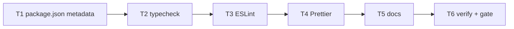

# Milestone 24 — Package DX Tasks

**Design**: [`.specs/features/package-dx/design.md`](./design.md)  
**Spec**: [`.specs/features/package-dx/spec.md`](./spec.md)  
**Context**: [`.specs/features/package-dx/context.md`](./context.md)  
**Status**: Planned

---

## Execution Plan

### Phase 1: package.json metadata + typecheck (Sequential)

```
T1 metadata → T2 typecheck
```

### Phase 2: Lint + format (Sequential — shared package.json)

```
T2 → T3 ESLint → T4 Prettier
```

> **Path conflict:** T1–T4 all touch `package.json`. **Do not** mark T3/T4 `[P]`. Sequential ownership of `package.json` scripts.

### Phase 3: Docs + verification (Sequential)

```
T4 → T5 CONTRIBUTING + living docs → T6 verify scripts + project gate
```



### Diagram-Definition Cross-Check

| Task | Depends on (task body) | Diagram shows | Match |
| ---- | ---------------------- | ------------- | ----- |
| T1 | None | Root | ✅ |
| T2 | T1 | T1→T2 | ✅ |
| T3 | T2 | T2→T3 | ✅ |
| T4 | T3 | T3→T4 | ✅ |
| T5 | T4 | T4→T5 | ✅ |
| T6 | T5 | T5→T6 | ✅ |

### Path Conflict Check (Check 5)

| Task | Module owner | Paths | Conflict |
| ---- | ------------ | ----- | -------- |
| T1 | root `package.json` (metadata only) | `package.json` — `engines`, `repository`, `files` only | Sole owner this phase |
| T2 | root `package.json` scripts + tsconfigs (read) | `package.json` `scripts.typecheck`; may touch tsconfigs only if `--noEmit` requires (YAGNI prefer none) | After T1 — sequential |
| T3 | ESLint config + deps + lint script | `eslint.config.mjs`, `package.json` (deps + `lint`), optionally `.eslintignore` N/A for flat | After T2 — sequential |
| T4 | Prettier config + deps + format scripts + prettier eslint compat | `.prettierrc`, `.prettierignore`, `package.json` (deps + `format`/`format:check`), may edit `eslint.config.mjs` for `eslint-config-prettier` | After T3 — sequential; sole Prettier owner |
| T5 | docs only | `CONTRIBUTING.md`, `.specs/codebase/STACK.md`, `.specs/codebase/CONVENTIONS.md` | Disjoint from tooling configs; after scripts exist so docs match |
| T6 | verification | no ownership edits beyond ROADMAP/STATE checkboxes on Done; run gates | After T5 |

### Test Co-location Validation

| Task | Code layer | TESTING.md expectation | Task `Tests` | Match |
| ---- | ---------- | ---------------------- | ------------ | ----- |
| T1 | package metadata | none (not src/bin) | N/A — inspect JSON | ✅ |
| T2 | scripts / tsconfig | none | N/A — CLI `pnpm typecheck` | ✅ |
| T3 | ESLint config | none | N/A — CLI `pnpm lint` | ✅ |
| T4 | Prettier config | none | N/A — CLI `pnpm format:check` | ✅ |
| T5 | docs | none | N/A — doc review | ✅ |
| T6 | verification | full project gate | CLI scripts + `pnpm build && pnpm test` | ✅ |

### Granularity Check

| Task | Scope | Status |
| ---- | ----- | ------ |
| T1 | package.json metadata fields | ✅ Granular |
| T2 | typecheck script | ✅ Granular |
| T3 | ESLint flat + lint script | ✅ Granular (cohesive tooling) |
| T4 | Prettier + format scripts | ✅ Granular |
| T5 | CONTRIBUTING + STACK + CONVENTIONS | ✅ OK cohesive docs |
| T6 | verification / gate | ✅ Granular |

---

## Task Breakdown

### T1: package.json publish-prep metadata

**What**: Add `engines.node`, `repository`, and explicit `files` allowlist including `schemas/` (plus `dist`, `LICENSE`, `README.md`). Do **not** add lint/format/typecheck scripts yet.

**Where**: `package.json`

**Depends on**: None

**Reuses**: Existing LICENSE/README/schemas; [context.md](./context.md) repository URL default

**Requirement**: HOTSPOT-197, HOTSPOT-198, HOTSPOT-199

**Tools**:

- MCP: NONE
- Skill: `coding-guidelines`

**Done when**:

- [ ] `"engines": { "node": ">=22" }` present
- [ ] `"repository": { "type": "git", "url": "git+https://github.com/taranti/hotspot-scanner.git" }` present (or real origin if added before Execute)
- [ ] `"files"` includes `dist`, `schemas`, `LICENSE`, `README.md`
- [ ] No `publishConfig`, no publish script, no `dev` script

**Tests**: N/A — inspect `package.json`  
**Gate**: none (metadata only; full verify in T6)

**Commit** (propose only): `chore(package): add engines, repository, and files allowlist`

---

### T2: typecheck script

**What**: Add `typecheck` script exactly: `tsc --noEmit && tsc --noEmit -p tsconfig.bin.json`. Ensure it exits 0 on current tree.

**Where**: `package.json` (`scripts.typecheck`); read-only use of `tsconfig.json`, `tsconfig.bin.json`

**Depends on**: T1

**Reuses**: Dual-project build layout from CONVENTIONS.md / STACK.md

**Requirement**: HOTSPOT-194

**Tools**:

- MCP: NONE
- Skill: `coding-guidelines`

**Done when**:

- [ ] `scripts.typecheck` matches design contract exactly
- [ ] `pnpm typecheck` exits 0

**Tests**: N/A — CLI verification  
**Gate**: `pnpm typecheck`

**Commit** (propose only): `chore(package): add typecheck script`

---

### T3: ESLint flat config + lint script

**What**: Add ESLint flat config, install ESLint + `typescript-eslint` as devDependencies, add `lint` script `eslint .`, make `pnpm lint` exit 0 (fix or narrowly configure until green). Do **not** add Prettier yet (T4).

**Where**: `eslint.config.mjs` (preferred), `package.json` (devDependencies + `scripts.lint`)

**Depends on**: T2

**Reuses**: Existing TS/ESM layout; ignore `dist/`, `coverage/`, `node_modules/`

**Requirement**: HOTSPOT-195

**Tools**:

- MCP: NONE
- Skill: `coding-guidelines`

**Done when**:

- [ ] Flat ESLint config exists at repo root
- [ ] `lint` script is `eslint .`
- [ ] ESLint-related packages are devDependencies
- [ ] `pnpm lint` exits 0

**Tests**: N/A — CLI verification  
**Gate**: `pnpm lint`

**Commit** (propose only): `chore(lint): add ESLint flat config and lint script`

---

### T4: Prettier config + format scripts

**What**: Add Prettier config + ignore, install `prettier` and `eslint-config-prettier`, wire prettier into ESLint config, add `format` (`prettier --write .`) and `format:check` (`prettier --check .`). Run format as needed so `format:check` is green.

**Where**: `.prettierrc`, `.prettierignore`, `eslint.config.mjs` (prettier compat), `package.json` (deps + scripts)

**Depends on**: T3

**Reuses**: T3 ESLint config; design script contracts

**Requirement**: HOTSPOT-196

**Tools**:

- MCP: NONE
- Skill: `coding-guidelines`

**Done when**:

- [ ] Prettier config + ignore present
- [ ] `format` and `format:check` scripts match design exactly
- [ ] ESLint does not conflict with Prettier
- [ ] `pnpm format:check` exits 0
- [ ] `pnpm lint` still exits 0 after prettier integration

**Tests**: N/A — CLI verification  
**Gate**: `pnpm format:check && pnpm lint`

**Commit** (propose only): `chore(format): add Prettier and format scripts`

---

### T5: CONTRIBUTING + living docs

**What**: Update CONTRIBUTING to recommend `typecheck` / `lint` / `format:check` (and `format` for fixes) **alongside** the unchanged gate `pnpm build && pnpm test`; keep “no CI in v1”. Update STACK.md and CONVENTIONS.md for ESLint/Prettier and note that `schemas/` ships via package `files`. Do **not** change AGENTS.md or quality-gates.mdc gate text.

**Where**: `CONTRIBUTING.md`, `.specs/codebase/STACK.md`, `.specs/codebase/CONVENTIONS.md`

**Depends on**: T4

**Reuses**: Existing CONTRIBUTING quality-gate section; [context.md](./context.md) gate decision

**Requirement**: HOTSPOT-200, HOTSPOT-201, HOTSPOT-202 (docs half — gate file non-edit)

**Tools**:

- MCP: NONE
- Skill: NONE

**Done when**:

- [ ] CONTRIBUTING documents DX scripts + unchanged gate + no CI in v1
- [ ] STACK lists ESLint and Prettier
- [ ] CONVENTIONS summarizes lint/format; notes gate remains build+test
- [ ] Docs note `schemas/` included in package `files`
- [ ] AGENTS.md / `.cursor/rules/quality-gates.mdc` gate text **unchanged**

**Tests**: N/A — doc review / grep  
**Gate**: none (docs); T6 runs full gate

**Commit** (propose only): `docs: document package DX scripts and tooling`

---

### T6: Verify DX scripts green + project gate

**What**: Run `pnpm typecheck`, `pnpm lint`, `pnpm format:check`, and project gate `pnpm build && pnpm test`. Confirm AGENTS.md gate text still build+test only. On Execute completion, mark ROADMAP M24 checkboxes and sync STATE (keep Deferred registry vs Git-install).

**Where**: verification only; ROADMAP/STATE updates when feature Done

**Depends on**: T5

**Reuses**: quality-gates rule; verifier-quality-gates agent optional

**Requirement**: HOTSPOT-202 (verify), closes HOTSPOT-194–201 verification

**Tools**:

- MCP: NONE
- Skill: NONE (or agent `verifier-quality-gates` for project gate)

**Done when**:

- [ ] `pnpm typecheck` exits 0
- [ ] `pnpm lint` exits 0
- [ ] `pnpm format:check` exits 0
- [ ] `pnpm build && pnpm test` exits 0
- [ ] AGENTS.md still documents gate as `pnpm build && pnpm test` only
- [ ] ROADMAP M24 items checked; STATE updated; Deferred registry line retained

**Tests**: N/A — full CLI + project gate  
**Gate**: `pnpm typecheck && pnpm lint && pnpm format:check && pnpm build && pnpm test`  
**deferred_project_gate**: included explicitly above

**Commit** (propose only): none required if prior tasks committed; else squash note in orchestrator summary

---

## Requirement → Task Mapping

| Requirement ID | Task(s) |
| -------------- | ------- |
| HOTSPOT-194 | T2, T6 |
| HOTSPOT-195 | T3, T6 |
| HOTSPOT-196 | T4, T6 |
| HOTSPOT-197 | T1, T6 |
| HOTSPOT-198 | T1, T6 |
| HOTSPOT-199 | T1, T6 |
| HOTSPOT-200 | T5 |
| HOTSPOT-201 | T5 |
| HOTSPOT-202 | T5 (non-edit), T6 (verify) |

**Coverage:** 9/9 mapped, 0 unmapped

---

## Parallel Execution Map

```
Phase 1: T1 → T2
Phase 2: T2 → T3 → T4   (no [P] — package.json conflict)
Phase 3: T4 → T5 → T6
```

**No `[P]` tasks** — all sequential due to shared `package.json` ownership (Check 5).

---

## Handoff

Planning complete. Promote `Status` to `Approved` / `Ready for Execute` in a **new** development session, then invoke `orchestrator-implementer`.

Expected final gate: `pnpm build && pnpm test` (plus DX scripts verified in T6).
