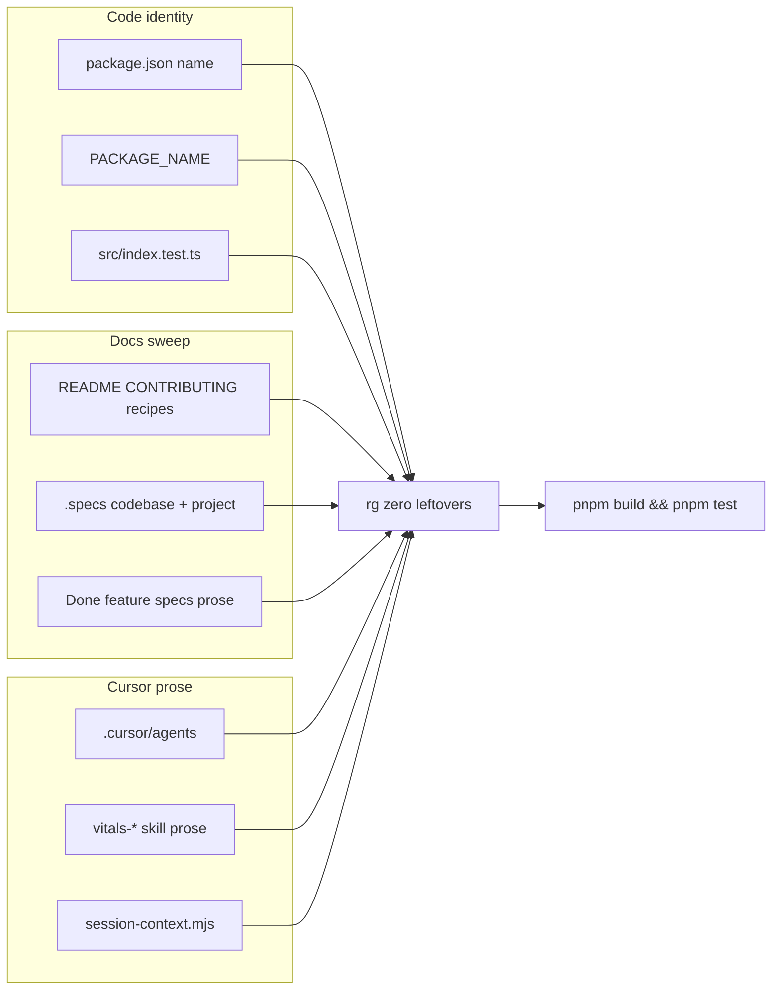

# Milestone 79 — Package Scope Rename Design

**Spec**: [`.specs/features/package-scope-rename/spec.md`](./spec.md)  
**Context**: [context.md](./context.md)  
**Status**: Planned

---

## Architecture Overview

Identity-only change. No pipeline stages, scorers, schemas, or CLI command grammar change. The npm package name string moves from `@vitals/hotspot-scanner` to `@taranti/hotspot-scanner` in code metadata and every exact-string citation in docs / Cursor prose.

**Unchanged by design:** `bin` key `hotspot-scanner`, `.hotspot-scanner.json`, `vitals-*` skill **directories**, `#` imports, `schemas/*` contract bodies, scan/trend/assess JSON `version`.

---

## Brownfield map (Large)

| Area | Evidence | Execute impact |
| ---- | -------- | -------------- |
| Code | `package.json` `"name"`; `src/index.ts` `PACKAGE_NAME`; `src/index.test.ts` assertion | T1 — three-file identity |
| Adoption | README, CONTRIBUTING, `docs/recipes.md`, AGENTS identity row, PROJECT/STACK titles | T2 |
| Living + archive | `.specs/codebase/*`, ROADMAP/STATE titles, STATE-ARCHIVE, Done feature specs citing the string (~40+ files repo-wide) | T3 |
| Cursor | Agents, skill SKILL/refs prose, `session-context.mjs` | T4 |
| Fixtures / schemas | Grep: **no** `@vitals/hotspot-scanner` under `tests/fixtures/` or `schemas/` | Touch only if sweep finds a hit |
| Pipeline / CONCERNS | No fragile git/NCLOC/scoring path | Risk is **incomplete sweep**, not runtime fragility |

---

## Code Reuse Analysis

### Existing Components to Leverage

| Component | Location | How to Use |
| --------- | -------- | ---------- |
| `PACKAGE_NAME` | `src/index.ts` | Update string constant only |
| Package unit test | `src/index.test.ts` | Update expected string |
| `getPackageVersion()` | `src/package-meta.ts` | No change (reads `version` only) |
| Exact-string sweep | repo-wide `rg` | Mechanical replace of the package name |

### Integration Points

| System | Integration Method |
| ------ | ------------------ |
| `package.json` | Change `"name"` only; leave `bin`, `exports`, `imports`, `files` |
| JSON contracts (`schemas/`) | No package-name fields — do not add |
| CLI surface (`bin/`) | No flag/command changes; bin name stays |
| `.hotspot-scanner.json` | Unchanged |
| Cursor session inject | Update string in `session-context.mjs` only |

---

## Components

### Package metadata

- **Purpose**: Canonical npm package name for install/docs citations
- **Location**: `package.json` (`"name"`)
- **Interfaces**: N/A (metadata)
- **Dependencies**: None
- **Reuses**: Existing package layout; ADR-2026-021 keeps bin unscoped

### Public `PACKAGE_NAME`

- **Purpose**: Library-visible package identity constant
- **Location**: `src/index.ts`
- **Interfaces**: `export const PACKAGE_NAME: string`
- **Dependencies**: None
- **Reuses**: Existing export; test in `src/index.test.ts`

### Docs / Cursor identity sweep

- **Purpose**: Eliminate stale `@vitals/hotspot-scanner` citations
- **Location**: Adoption docs, `.specs/**` prose, `.cursor/**` prose (not folder renames)
- **Interfaces**: N/A
- **Dependencies**: T1 for code truth; sweep may run in parallel across disjoint trees
- **Reuses**: Exact replace; preserve `vitals-*` skill names and bin examples

---

## Data Models

None. No domain types, schema fields, or JSON contract `version` changes.

---

## Error Handling Strategy

| Error Scenario | Handling | User Impact |
| -------------- | -------- | ----------- |
| Leftover `@vitals/hotspot-scanner` after replace | T5 fails until zero | Block Done |
| Accidental rename of `vitals-*` folders | Forbidden — revert | Agents break inventory paths |
| Accidental bin rename | Forbidden — ADR-2026-021 | CLI DX break |
| Schema/API edit “for consistency” | Forbidden — YAGNI | Contract noise |

Exit codes SoT unchanged: `docs/cli-reference.md` § Exit codes.

---

## Risks (from CONCERNS / brownfield)

| Risk | Mitigation |
| ---- | ---------- |
| Incomplete docs/Cursor sweep leaves dual identity | Final T5 `rg` gate must be empty before Done |
| Over-eager rename of `vitals-*` or bin | Locked in context; Path Conflict + Done when checks |
| Touching fixtures/schemas unnecessarily | Grep-first; only edit if exact string present |

---

## Tech Decisions (locked — do not re-open)

| Decision | Choice | Rationale |
| -------- | ------ | --------- |
| New scope | `@taranti/hotspot-scanner` | Match author/repo ownership |
| Bin | Keep `hotspot-scanner` | ADR-2026-021 |
| Skill folders | Keep `vitals-*` | STATE 2026-07-21 |
| Publish | Out of scope | STATE Deferred |
| Method | Exact string replace + verify | Zero pipeline logic; YAGNI |
| ROADMAP title during planning | Leave `@vitals` until Execute T3 | Planner only syncs Current + M79 stub + STATE lock |
