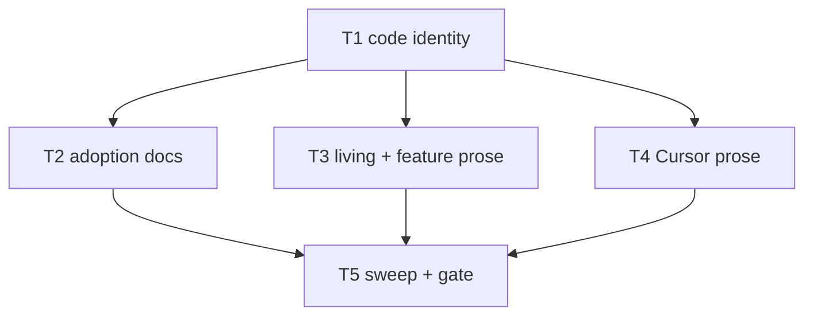

# Milestone 79 — Package Scope Rename Tasks

**Design**: [design.md](./design.md)  
**Spec**: [spec.md](./spec.md)  
**Context**: [context.md](./context.md)  
**Status**: Done  
**Note**: Large feature — STOP at Planned; Execute in a separate session via `orchestrator-implementer` after Status promotion. Do **not** rename `vitals-*` skill folders, bin `hotspot-scanner`, or `.hotspot-scanner.json`. Do **not** npm publish. Do **not** change schemas / JSON contract versions / scan API.

---

## Execution Plan

### Phase 1: Code identity

```
T1 package.json + PACKAGE_NAME + unit test
```

### Phase 2: Docs + Cursor sweep (parallel OK)

```
T1 ──┬→ T2 [P] adoption / product docs
     ├→ T3 [P] living docs + feature prose
     └→ T4 [P] Cursor surface prose
```

### Phase 3: Sweep verify + gate

```
T2 + T3 + T4 → T5 rg zero leftovers + project gate
```



### Diagram-Definition Cross-Check

| Task | Depends on (declared) | Diagram shows | Match |
| ---- | --------------------- | ------------- | ----- |
| T1   | None                  | Root          | yes   |
| T2   | T1                    | T1→T2         | yes   |
| T3   | T1                    | T1→T3         | yes   |
| T4   | T1                    | T1→T4         | yes   |
| T5   | T2, T3, T4            | T2/T3/T4→T5   | yes   |

### Path Conflict Check (Check 5)

| Task   | Module owner                | Paths (primary)                                                                                                                                                                            | Conflict with parallel peers               |
| ------ | --------------------------- | ------------------------------------------------------------------------------------------------------------------------------------------------------------------------------------------ | ------------------------------------------ |
| T1     | package root + `src/` entry | `package.json`, `src/index.ts`, `src/index.test.ts`                                                                                                                                        | None (no `[P]` peers)                      |
| T2 [P] | docs / product              | `README.md`, `CONTRIBUTING.md`, `docs/recipes.md`, `AGENTS.md`, `.specs/project/PROJECT.md`, `.specs/codebase/STACK.md`                                                                    | Disjoint from T3/T4                        |
| T3 [P] | living + features           | `.specs/codebase/*` (except STACK if done in T2), `.specs/project/ROADMAP.md` title, `.specs/project/STATE.md` title, `STATE-ARCHIVE.md`, `.specs/features/**` prose citing package string | Do not re-edit T2 files; STACK owned by T2 |
| T4 [P] | `.cursor/`                  | `.cursor/agents/**`, `.cursor/skills/**` prose (not folder renames), `.cursor/hooks/session-context.mjs`                                                                                   | Disjoint from T2/T3                        |
| T5     | gate                        | none (run only)                                                                                                                                                                            | After T2–T4                                |

> **`[P]`:** T2, T3, T4 — path-disjoint after T1. STACK.md is **T2 only**; other `.specs/codebase/*` are **T3**.

### Test Co-location Validation

| Task | Code layer                   | Required tests (TESTING.md) | Co-located in task               |
| ---- | ---------------------------- | --------------------------- | -------------------------------- |
| T1   | `src/index.ts` public export | unit                        | yes — `src/index.test.ts`        |
| T2   | docs                         | none                        | n/a                              |
| T3   | docs / prose                 | none                        | n/a                              |
| T4   | Cursor prose                 | none                        | n/a                              |
| T5   | gate                         | full                        | `pnpm build && pnpm test` + `rg` |

### Granularity Check (Check 1)

| Task | Scope                                             | Status         |
| ---- | ------------------------------------------------- | -------------- |
| T1   | package name + PACKAGE_NAME + one unit assertion  | ✅ Granular    |
| T2   | adoption/product identity citations (one concern) | ✅ OK cohesive |
| T3   | living + historical package-string citations      | ✅ OK cohesive |
| T4   | Cursor prose identity citations                   | ✅ OK cohesive |
| T5   | verify-only                                       | ✅ Granular    |

---

## Requirement → Task Mapping

| IDs                                                   | Task            |
| ----------------------------------------------------- | --------------- |
| HOTSPOT-1700, HOTSPOT-1701, HOTSPOT-1702              | T1              |
| HOTSPOT-1703, HOTSPOT-1704                            | T2              |
| HOTSPOT-1705, HOTSPOT-1706, HOTSPOT-1709              | T3              |
| HOTSPOT-1707, HOTSPOT-1710 (skills folders unchanged) | T4              |
| HOTSPOT-1708, HOTSPOT-1710 (bin + gate)               | T5              |
| HOTSPOT-1711–1719                                     | Reserved unused |

---

## Tasks

### T1: Code identity — package.json + PACKAGE_NAME + unit test

**What:** Set npm package identity to `@taranti/hotspot-scanner` in `package.json` `"name"`, `PACKAGE_NAME` in `src/index.ts`, and the assertion in `src/index.test.ts`. Leave `bin`, `exports`, `imports`, and schema paths unchanged.  
**Where:** `package.json`, `src/index.ts`, `src/index.test.ts`  
**Reuses:** Existing `PACKAGE_NAME` export + package unit suite  
**Done when:**

- [x] `package.json` `"name"` is `@taranti/hotspot-scanner`
- [x] `PACKAGE_NAME === "@taranti/hotspot-scanner"`
- [x] Unit test expects the new string
- [x] `"bin"."hotspot-scanner"` and `#` imports unchanged

**Tests:** `src/index.test.ts`  
**Gate:** `pnpm test -- src/index.test.ts`  
**Depends on:** None  
**Requirement:** HOTSPOT-1700, HOTSPOT-1701, HOTSPOT-1702

---

### T2: Adoption / product docs identity [P]

**What:** Replace exact `@vitals/hotspot-scanner` with `@taranti/hotspot-scanner` in adoption and product identity surfaces. Keep CLI examples on bin `hotspot-scanner` / `pnpm exec hotspot-scanner`.  
**Where:** `README.md`, `CONTRIBUTING.md`, `docs/recipes.md`, `AGENTS.md`, `.specs/project/PROJECT.md`, `.specs/codebase/STACK.md`  
**Reuses:** Exact-string replace; existing package-vs-bin wording patterns  
**Done when:**

- [x] Listed files contain zero `@vitals/hotspot-scanner`
- [x] Package citations use `@taranti/hotspot-scanner`
- [x] Bin invocations remain `hotspot-scanner` (not scoped)

**Tests:** none  
**Gate:** none beyond review (project gate in T5)  
**Depends on:** T1  
**Requirement:** HOTSPOT-1703, HOTSPOT-1704

---

### T3: Living docs + historical feature prose [P]

**What:** Sweep remaining living docs and historical feature/archive prose for the exact package string. Update ROADMAP/STATE **title** lines if still `@vitals/…`. Do not change schema bodies, JSON `version` fields, or invent package fields in contracts. Do not re-edit T2-owned files (including STACK.md).  
**Where:** `.specs/codebase/ARCHITECTURE.md`, `CONCERNS.md`, `CONVENTIONS.md`, `DOC-OWNERSHIP.md`, `INTEGRATIONS.md`, `STRUCTURE.md`, `TESTING.md` (and any other codebase docs with hits); `.specs/project/ROADMAP.md` (title), `.specs/project/STATE.md` (title), `.specs/project/STATE-ARCHIVE.md`; `.specs/features/**` files that still cite `@vitals/hotspot-scanner`  
**Reuses:** Exact-string replace  
**Done when:**

- [x] T3 paths have zero `@vitals/hotspot-scanner`
- [x] Schemas / contract `version` values unchanged
- [x] No accidental edits to T2 files

**Tests:** none  
**Gate:** none beyond review (project gate in T5)  
**Depends on:** T1  
**Requirement:** HOTSPOT-1705, HOTSPOT-1706, HOTSPOT-1709

---

### T4: Cursor surface prose [P]

**What:** Update `.cursor/` agent and skill **prose** plus `session-context.mjs` to `@taranti/hotspot-scanner`. Do **not** rename skill directories (`vitals-*` stay). Do not change hook behavior beyond the identity string.  
**Where:** `.cursor/agents/**`, `.cursor/skills/**` (`SKILL.md` + references that cite the package string), `.cursor/hooks/session-context.mjs`  
**Reuses:** Exact-string replace  
**Done when:**

- [x] `.cursor/` has zero `@vitals/hotspot-scanner`
- [x] `ls .cursor/skills` still shows `vitals-*` directory names
- [x] `#` import map in `package.json` untouched (owned by T1; verify unchanged)

**Tests:** none  
**Gate:** none beyond review (project gate in T5)  
**Depends on:** T1  
**Requirement:** HOTSPOT-1707, HOTSPOT-1710

---

### T5: Sweep verify + project gate

**What:** Prove the identity sweep is complete and the project gate is green. Confirm bin key remains `hotspot-scanner`.  
**Where:** repo root (verify only — no intentional content edits unless leftover cleanup of missed hits)  
**Reuses:** Project gate; `rg`  
**Done when:**

- [x] `rg '@vitals/hotspot-scanner'` at repo root returns **zero** matches
- [x] `package.json` `"bin"` still exposes `hotspot-scanner`
- [x] `pnpm build && pnpm test` exits 0

**Tests:** full suite via project gate  
**Gate:** `pnpm build && pnpm test`  
**Depends on:** T2, T3, T4  
**Requirement:** HOTSPOT-1708, HOTSPOT-1710  
**Verify:**

```bash
rg '@vitals/hotspot-scanner' || true   # expect no matches
pnpm build && pnpm test
```

---

## Suggested execution order

1. T1 (code)
2. T2 ∥ T3 ∥ T4
3. T5 (sweep + gate)
