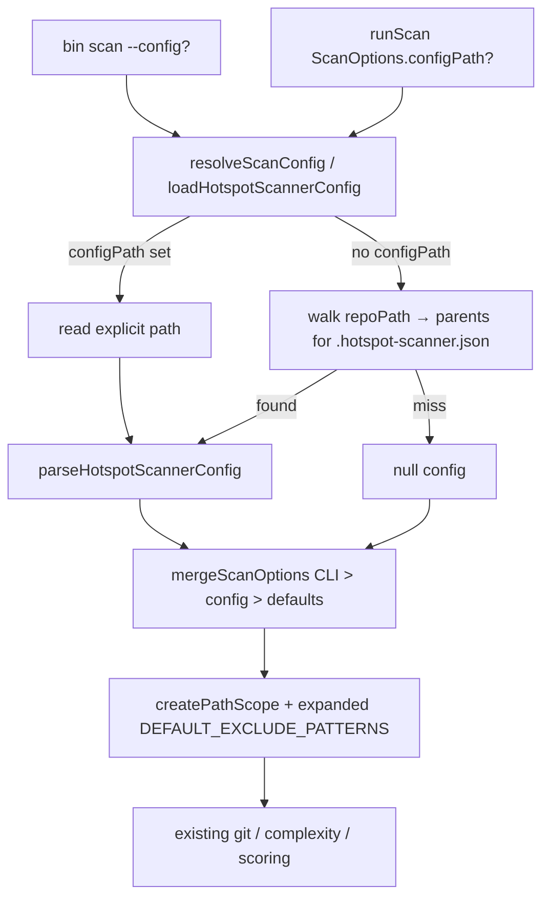

# Milestone 30 — Path & Config DX Design

**Spec**: [`.specs/features/path-config-dx/spec.md`](./spec.md)  
**Context**: [`.specs/features/path-config-dx/context.md`](./context.md)  
**Status**: Planned (planning session)  
**Design SoT**: [ARCHITECTURE.md](../../codebase/ARCHITECTURE.md)

---

## Architecture Overview

M30 extends two existing modules without new packages:

1. **`src/paths/`** — grow `DEFAULT_EXCLUDE_PATTERNS`; all consumers (`createPathScope`, discovery prune, git filter) inherit automatically.
2. **`src/config/`** — extend load API with parent walk + optional explicit path; **`mergeScanOptions` unchanged** (precedence already correct).
3. **`bin/` + `src/scan.ts` + `ScanOptions`** — thread `--config` / `configPath` into the shared resolver so CLI pre-merge for `top` and `runScan` stay consistent.



---

## Code Reuse Analysis

| Component                                                                | Location                                                                         | How to use                                                 |
| ------------------------------------------------------------------------ | -------------------------------------------------------------------------------- | ---------------------------------------------------------- |
| `DEFAULT_EXCLUDE_PATTERNS` / `createPathScope`                           | `src/paths/scope.ts`                                                             | Append locked patterns; tests in `scope.test.ts`           |
| `loadHotspotScannerConfig` / `parseHotspotScannerConfig` / `ConfigError` | `src/config/load-config.ts`                                                      | Extend signature; keep parse/validation                    |
| `mergeScanOptions`                                                       | `src/config/merge-options.ts`                                                    | **No logic change** — re-verify with walked/explicit loads |
| `resolveScanConfig`                                                      | `src/scan.ts`                                                                    | Pass `configPath` into loader                              |
| CLI override detection                                                   | `bin/hotspot-scanner.ts` (`isExplicitCliOption`, `buildCliConfigOverrides`)      | Add `--config`; pass through to load + `runScan`           |
| M21 / M7 tests                                                           | `src/config/*.test.ts`, `src/paths/scope.test.ts`, `bin/hotspot-scanner.test.ts` | Extend; do not weaken                                      |

### Fragile / concern notes

- Config + bin **double-load** today (bin for `top`, `runScan` for pipeline). Design requires identical discovery args — prefer both calling the same `loadHotspotScannerConfig(repoPath, { configPath })` / `resolveScanConfig`.
- Do not touch git miner / McCabe / scoring formulas (CONCERNS.md fragile areas).
- Path exclude changes affect discovery prune performance positively; nested `**/out/**` may over-exclude rare source folders named `out` — accepted per context.md (same class as M7 `build/`).

---

## Components

### Extended `DEFAULT_EXCLUDE_PATTERNS`

- **Purpose**: Always-on monorepo noise dirs
- **Location**: `src/paths/scope.ts`
- **Change**: Append:
  - `**/.next/**`
  - `**/out/**`
  - `**/vendor/**`
  - `**/storybook-static/**`
  - `**/__snapshots__/**`
- **Unchanged**: Existing five M7 entries’ string forms
- **Reuses**: `createPathScope` merge of defaults + user excludes

### `loadHotspotScannerConfig` (extended)

- **Purpose**: Resolve config file via explicit path or parent walk
- **Location**: `src/config/load-config.ts`
- **Interfaces** (illustrative):

```typescript
export interface LoadConfigOptions {
  /** When set, load this file and skip parent walk. Missing → ConfigError. */
  configPath?: string;
}

export async function loadHotspotScannerConfig(
  repoPath: string,
  options?: LoadConfigOptions,
): Promise<HotspotScannerConfig | null>;
```

- **Algorithm (discovery)**:
  1. If `options.configPath` → `readFile` that path; ENOENT → `ConfigError`; else parse
  2. Else `let dir = resolve(repoPath)`; loop: try `join(dir, HOTSPOT_SCANNER_CONFIG_FILENAME)`; on ENOENT go to `dirname(dir)` until root; other read errors propagate; invalid JSON → `ConfigError`
- **Dependencies**: `node:fs/promises`, `node:path`
- **Reuses**: `parseHotspotScannerConfig`, `ConfigError`, filename constant

### `ScanOptions.configPath` + wiring

- **Purpose**: Programmatic parity with `--config`
- **Location**: `src/types/domain.ts` (`ScanOptions`), `src/scan.ts` (`resolveScanConfig`), `bin/hotspot-scanner.ts`
- **CLI**: `.option("--config <path>", "…")` on `scan`; not a merge key (not part of `HotspotScannerConfig`)
- **Bin**: When loading for `top` and when calling `runScan`, pass the same `configPath`

### Docs

- **Location**: `README.md`, `.specs/codebase/ARCHITECTURE.md` (config + path-scoping bullets), brief `STRUCTURE.md` if needed
- **Remove/replace** M21 wording that says “no parent walk” / “no `--config`”

---

## Data Models

No new config keys. Optional field only:

```typescript
// ScanOptions addition
configPath?: string;
```

`HotspotScannerConfig` / merge shape unchanged.

---

## Error Handling Strategy

| Scenario                                  | Handling      | User impact                          |
| ----------------------------------------- | ------------- | ------------------------------------ |
| Discovery: no file on walk                | `null`        | Defaults + CLI only                  |
| Discovery: invalid JSON / types           | `ConfigError` | Non-zero exit                        |
| Explicit `--config`: ENOENT               | `ConfigError` | Non-zero exit, message includes path |
| Explicit `--config`: invalid JSON / types | `ConfigError` | Non-zero exit                        |
| Unknown keys in file                      | Ignore (M21)  | No failure                           |

---

## Tech Decisions

| Decision            | Choice                                | Rationale                                                                |
| ------------------- | ------------------------------------- | ------------------------------------------------------------------------ |
| Walk vs `--config`  | Both                                  | User/ROADMAP locked                                                      |
| Nearest wins        | First found ascending from `repoPath` | Predictable; repo-local overrides workspace                              |
| Walk stop           | Filesystem root                       | Simple; no git-root-only stop (would no-op when `.git` is at `repoPath`) |
| New exclude globs   | `**/name/**`                          | Nested monorepo artifacts                                                |
| M7 pattern rewrite  | Out of scope                          | YAGNI / avoid surprise                                                   |
| mergeScanOptions    | Unchanged                             | Precedence already correct                                               |
| Alternate filenames | Forbidden on walk                     | M21 lock                                                                 |

---

## Testing strategy

| Layer                           | What                                                                                                                 |
| ------------------------------- | -------------------------------------------------------------------------------------------------------------------- |
| Unit `src/paths/`               | Pattern membership; nested paths out of scope; prune                                                                 |
| Unit `src/config/`              | Walk chain; nearest wins; root miss → null; explicit path success/ENOENT; still only `.hotspot-scanner.json` on walk |
| Unit/CLI `bin/` + `src/scan.ts` | `--config` wiring; CLI overrides config from walked/explicit file; help mentions `--config`                          |
| Full gate                       | `pnpm build && pnpm test` on final task                                                                              |

No new runtime dependencies (INTEGRATIONS.md unchanged).
