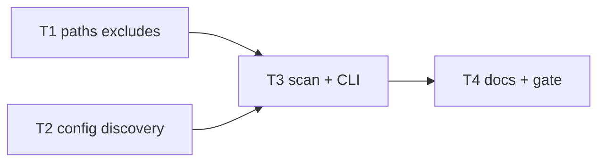

# Milestone 30 — Path & Config DX Tasks

**Design**: [`.specs/features/path-config-dx/design.md`](./design.md)  
**Spec**: [`.specs/features/path-config-dx/spec.md`](./spec.md)  
**Context**: [`.specs/features/path-config-dx/context.md`](./context.md)  
**Status**: Planned

---

## Execution Plan

```
T1 [P] default excludes ──┐
                          ├──→ T3 CLI + scan wiring → T4 docs + full gate
T2 [P] config walk/load ──┘
```



### Diagram-Definition Cross-Check

| Task | Depends on (body) | Diagram shows | Status |
| ---- | ----------------- | ------------- | ------ |
| T1   | None              | Root          | ✅ Match |
| T2   | None              | Root          | ✅ Match |
| T3   | T1, T2            | T1→T3, T2→T3  | ✅ Match |
| T4   | T3                | T3→T4         | ✅ Match |

### Path Conflict Check

| Task | Module owner | Paths | Conflict |
| ---- | ------------ | ----- | -------- |
| T1   | `src/paths/` | `scope.ts`, `scope.test.ts` | None vs T2 — `[P]` OK |
| T2   | `src/config/` | `load-config.ts`, `load-config.test.ts`, `index.ts` if needed | None vs T1 — `[P]` OK |
| T3   | `src/scan.ts` + `src/types/` + `bin/` | wiring + CLI tests | After T1+T2; owns scan/bin — sequential |
| T4   | docs | README, ARCHITECTURE, STRUCTURE | After T3 |

### Test Co-location Validation

| Task | Code layer | Matrix / TESTING.md | Task Tests | Status |
| ---- | ---------- | ------------------- | ---------- | ------ |
| T1   | `src/paths/` | unit co-located | unit | ✅ OK |
| T2   | `src/config/` | unit co-located | unit | ✅ OK |
| T3   | `src/scan.ts`, `bin/` | unit + CLI | unit + CLI | ✅ OK |
| T4   | docs only | none | none + full gate | ✅ OK |

### Granularity Check

| Task | Scope | Status |
| ---- | ----- | ------ |
| T1 | One concern: default exclude patterns + path tests | ✅ Granular |
| T2 | One concern: load discovery API + config unit tests | ✅ Granular |
| T3 | Cohesive wiring: types + resolveScanConfig + CLI `--config` + tests | ✅ OK (same feature slice) |
| T4 | Docs + full gate | ✅ Granular |

---

## Task Breakdown

### T1: Expand default excludes `[P]`

**What**: Append locked patterns to `DEFAULT_EXCLUDE_PATTERNS` and extend unit tests for nested paths and prune behavior.

**Where**: `src/paths/scope.ts`, `src/paths/scope.test.ts`

**Depends on**: None

**Reuses**: `createPathScope`, `isPathInScope`, `shouldPruneDirectory`; [context.md](./context.md) exclude table

**Requirement**: HOTSPOT-266, HOTSPOT-267

**Tools**:

- MCP: NONE
- Skill: `coding-guidelines`, `vitals-pipeline-domain` (paths)

**Done when**:

- [ ] Patterns include `**/.next/**`, `**/out/**`, `**/vendor/**`, `**/storybook-static/**`, `**/__snapshots__/**`
- [ ] M7 patterns unchanged in form (`node_modules/**`, `.git/**`, `dist/**`, `coverage/**`, `build/**`)
- [ ] Tests assert nested example paths are out of scope / pruned
- [ ] Gate check passes: `pnpm exec vitest run src/paths/`
- [ ] Test count does not drop silently

**Tests**: unit  
**Gate**: `pnpm exec vitest run src/paths/`

**Verify**:

```bash
pnpm exec vitest run src/paths/
```

---

### T2: Config parent walk + explicit path loader `[P]`

**What**: Extend `loadHotspotScannerConfig(repoPath, { configPath? })` with nearest-wins parent walk for `.hotspot-scanner.json` only; explicit `configPath` skips walk and errors on missing file. Unit tests for walk chain, nearest wins, miss→null, explicit ENOENT→ConfigError, invalid JSON, no alternate filenames on walk.

**Where**: `src/config/load-config.ts`, `src/config/load-config.test.ts`, export updates in `src/config/index.ts` if needed

**Depends on**: None

**Reuses**: `parseHotspotScannerConfig`, `ConfigError`, `HOTSPOT_SCANNER_CONFIG_FILENAME`; M21 validation

**Requirement**: HOTSPOT-268, HOTSPOT-269, HOTSPOT-270, HOTSPOT-272, HOTSPOT-274

**Tools**:

- MCP: NONE
- Skill: `coding-guidelines`, `vitals-pipeline-domain` (config)

**Done when**:

- [ ] Walk loads nearest `.hotspot-scanner.json` above `repoPath`
- [ ] Discovery miss returns `null`
- [ ] `configPath` loads that file only; ENOENT throws `ConfigError`
- [ ] Walk never opens `.hotspotrc` or other names
- [ ] Gate check passes: `pnpm exec vitest run src/config/`
- [ ] Test count does not drop silently

**Tests**: unit  
**Gate**: `pnpm exec vitest run src/config/`

**Verify**:

```bash
pnpm exec vitest run src/config/
```

---

### T3: Wire `configPath` / `--config` into scan + CLI

**What**: Add `ScanOptions.configPath`; thread through `resolveScanConfig` / `runScan`; add CLI `--config <path>`; ensure bin’s pre-scan config load for `top` uses the same `configPath` as `runScan`. Tests: CLI override beats walked/explicit config; `--config` missing → non-zero; help lists `--config`. Re-confirm merge precedence (HOTSPOT-273).

**Where**: `src/types/domain.ts` (or types export path), `src/scan.ts`, `src/scan.test.ts` (if present), `bin/hotspot-scanner.ts`, `bin/hotspot-scanner.test.ts`

**Depends on**: T1, T2

**Reuses**: `mergeScanOptions`, `buildCliConfigOverrides` / `isExplicitCliOption`; T2 loader API

**Requirement**: HOTSPOT-271, HOTSPOT-272, HOTSPOT-273, HOTSPOT-275, HOTSPOT-277

**Tools**:

- MCP: NONE
- Skill: `coding-guidelines`, `vitals-cli-validation`

**Done when**:

- [ ] `--config` and `ScanOptions.configPath` honored end-to-end
- [ ] Bin and `runScan` discovery args match (no divergent config)
- [ ] CLI flag overrides config values from walked or explicit file
- [ ] `--help` mentions `--config`
- [ ] Gate check passes: `pnpm exec vitest run src/config/ src/paths/ src/scan.ts bin/hotspot-scanner.test.ts` (adjust to actual scan test paths)
- [ ] Test count does not drop silently

**Tests**: unit + CLI  
**Gate**: `pnpm exec vitest run src/config/ src/paths/ src/scan.ts bin/hotspot-scanner.test.ts`

**Verify**:

```bash
pnpm exec vitest run src/config/ src/paths/ src/scan.ts bin/hotspot-scanner.test.ts
pnpm exec hotspot-scanner scan --help   # shows --config
```

---

### T4: Documentation + full quality gate

**What**: Update README and ARCHITECTURE (and STRUCTURE if needed) for expanded defaults, parent walk, `--config`, filename-only discovery, and CLI > config > defaults. Replace M21 “no parent walk / no `--config`” wording. Run full project gate.

**Where**: `README.md`, `.specs/codebase/ARCHITECTURE.md`, `.specs/codebase/STRUCTURE.md` (brief if stale)

**Depends on**: T3

**Reuses**: [context.md](./context.md) locks; M21 doc sections as edit base

**Requirement**: HOTSPOT-276, HOTSPOT-277

**Tools**:

- MCP: NONE
- Skill: NONE

**Done when**:

- [ ] Docs match locked decisions (no `.hotspotrc`; walk + `--config` described)
- [ ] Default exclude list in ARCHITECTURE includes M30 names
- [ ] Full gate green: `pnpm build && pnpm test`

**Tests**: none (docs)  
**Gate**: `pnpm build && pnpm test`

**Verify**:

```bash
pnpm build && pnpm test
```

**Commit** (propose only — do not commit unless user asks):  
`feat(config): parent config walk, --config, and monorepo default excludes`

---

## Parallel Execution Map

```
Phase 1 (Parallel):
  ├── T1 [P]  src/paths/
  └── T2 [P]  src/config/

Phase 2 (Sequential):
  T1 + T2 complete → T3 → T4
```

**Parallelism constraint:** T1 and T2 touch disjoint prefixes and unit-only tests — `[P]` allowed. T3 owns `src/scan.ts` + `bin/` — not parallel with further wiring tasks.

---

## Requirement → Task map

| Requirement ID | Task |
| -------------- | ---- |
| HOTSPOT-266 | T1 |
| HOTSPOT-267 | T1 |
| HOTSPOT-268 | T2 |
| HOTSPOT-269 | T2 |
| HOTSPOT-270 | T2 |
| HOTSPOT-271 | T3 |
| HOTSPOT-272 | T2, T3 |
| HOTSPOT-273 | T3 |
| HOTSPOT-274 | T2 |
| HOTSPOT-275 | T3 |
| HOTSPOT-276 | T4 |
| HOTSPOT-277 | T3, T4 |

**Coverage:** 12 requirements, 0 unmapped

---

## Handoff

Planning session ends here (**Status: Planned**).

Next: user promotes Status to `Approved` / `Ready for Execute` → **new development session** → `orchestrator-implementer`.

**Do not** start Execute in the planning session.  
**ROADMAP/STATE sync:** deferred to parent agent (per planning request).
