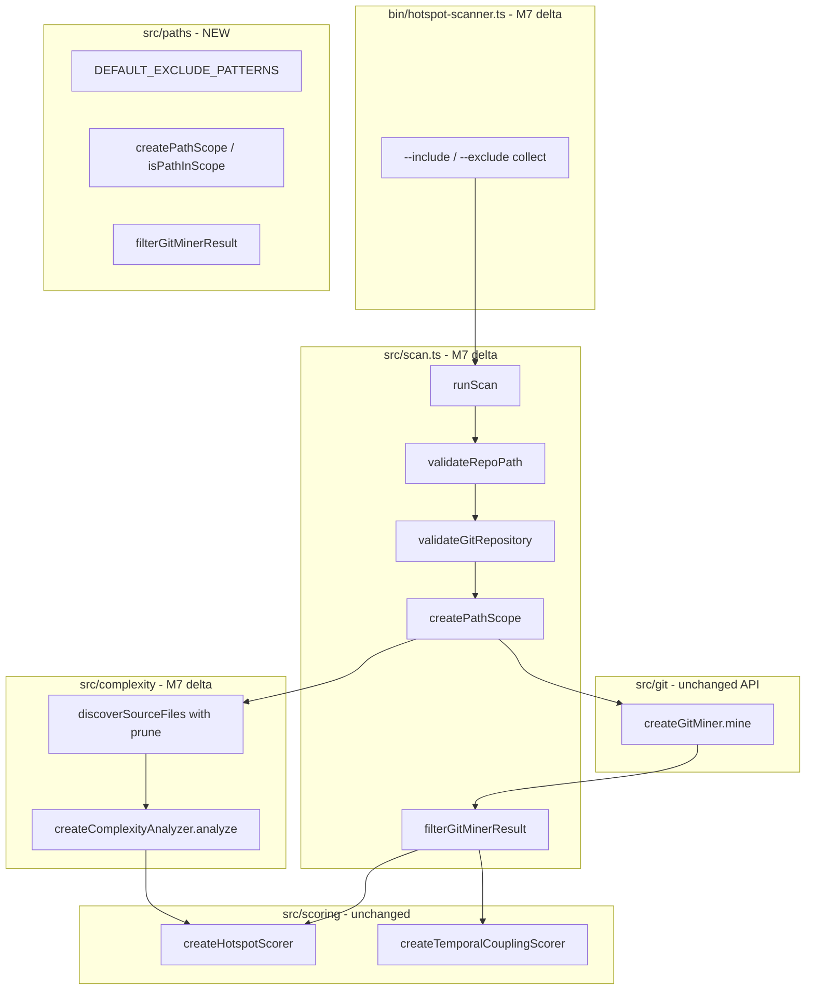

# Milestone 7 — Path Scoping Design

**Spec**: [`.specs/features/path-scoping/spec.md`](./spec.md)  
**Context**: [`.specs/features/path-scoping/context.md`](./context.md)  
**Status**: Done

---

## Architecture Overview

M7 introduces a shared **path scope** module and wires it through the existing M6 pipeline. The CLI gains `--include` / `--exclude` flags. `runScan()` validates Git early, builds a `PathScope`, passes it to complexity discovery, and filters Git miner output before scoring. `GitMiner` and scorers remain unchanged at the API level.



**IMPL reference:** §4 pipeline, §6.1 CLI, §8.4 errors. **ROADMAP:** M7 Path Scoping.

---

## Code Reuse Analysis

### Existing Components to Leverage

| Component | Location | How to Use |
| --------- | -------- | ---------- |
| `runScan` pipeline | `src/scan.ts` | Extend with scope build + git filter; add `validateGitRepository` |
| `validateRepoPath` | `src/scan.ts` | Keep; run before Git validation |
| `discoverSourceFiles` | `src/complexity/discover.ts` | Add optional `PathScope`; prune excluded directories |
| `createComplexityAnalyzer` | `src/complexity/index.ts` | Accept `scope` in options; pass to discover |
| `createGitMiner` | `src/git/index.ts` | No API change — filter output in `runScan` |
| Scorers | `src/scoring/` | Unchanged — receive pre-filtered inputs |
| CLI flag patterns | `bin/hotspot-scanner.ts` | Mirror `--min-cochange` collect pattern for include/exclude |
| `ScanOptions` | `src/types/domain.ts` | Add `include?: string[]`, `exclude?: string[]` |
| Integration fixture | `tests/fixtures/repos/small-ts/` | Extend with `node_modules` stub for T7 |

### Integration Points

| System | M7 behavior | Notes |
| ------ | ----------- | ----- |
| `src/paths/` | **New** — scope + git filter | Only module importing `picomatch` |
| `src/complexity/discover.ts` | Prune + file filter | Fragile area — update `discover.test.ts` |
| `src/complexity/index.ts` | Forward scope | Optional `scope` on `ComplexityAnalyzerOptions` |
| `src/scan.ts` | Git validate, scope, filter | Primary orchestration delta |
| `src/git/` | Unchanged | Post-filter preserves streaming |
| `bin/hotspot-scanner.ts` | New flags | No domain logic |
| `package.json` | Add `picomatch` | Document in INTEGRATIONS.md |

---

## Design Decisions

| # | Decision | Rationale |
| - | -------- | --------- |
| D1 | New module `src/paths/` (`scope.ts`, `filter-git.ts`, `index.ts`) | Single owner for scope rules and git filtering |
| D2 | Runtime dependency `picomatch` | Glob matching for CLI patterns; no Node built-in |
| D3 | Paths always posix-relative to `repoPath` | Matches `discover.ts` and git canonical paths |
| D4 | Default excludes always active; user `--exclude` additive | [context.md](./context.md); ROADMAP M7 |
| D5 | Include narrows; exclude wins over include | User-confirmed product semantics |
| D6 | Git filter post-`mine()` via `filterGitMinerResult` | ADR-2026-020 single-pass; stable `GitMiner` API |
| D7 | Git validation via `access(join(repoPath, '.git'))` | ROADMAP; supports worktree `.git` file |
| D8 | No git∩complexity intersection (M6 C1 stands) | Scope rules apply per stage; churn=0 for in-scope files without git history |
| D9 | Prune excluded directories during walk | Performance on large `node_modules` trees |
| D10 | Reporter/CLI output unchanged | Scope affects data, not report format |

---

## Components

### Path scope (`src/paths/scope.ts`)

- **Purpose**: Build and evaluate path scope from include/exclude options.
- **Exports**:

```typescript
export const DEFAULT_EXCLUDE_PATTERNS = [
  "node_modules/**",
  ".git/**",
  "dist/**",
  "coverage/**",
  "build/**",
] as const;

export interface PathScope {
  includes: string[] | undefined;
  excludes: string[];
}

export interface PathScopeOptions {
  include?: string[];
  exclude?: string[];
}

export function createPathScope(options?: PathScopeOptions): PathScope;

export function isPathInScope(filePath: string, scope: PathScope): boolean;

/** True when a directory entry should not be descended into during walk. */
export function shouldPruneDirectory(
  dirRelativePath: string,
  scope: PathScope,
): boolean;
```

- **Matching rules** (implements [context.md](./context.md)):
  1. Normalize `filePath` to posix (no leading `./`)
  2. If any exclude pattern matches → out of scope
  3. If `includes` is defined and non-empty → in scope only if at least one include matches
  4. If `includes` is undefined or empty → in scope (passed exclude check)

- **Dependencies**: `picomatch` (compile patterns once in `createPathScope`)
- **Tests**: `src/paths/scope.test.ts` — default excludes, include narrows, exclude wins, posix paths

---

### Git result filter (`src/paths/filter-git.ts`)

- **Purpose**: Remove out-of-scope paths from miner output before scoring.
- **Signature**:

```typescript
import type { CoChangeEvent, FileChangeStats } from "../types/index.js";
import type { GitMinerResult } from "../git/index.js";
import type { PathScope } from "./scope.js";

export function filterGitMinerResult(
  result: GitMinerResult,
  scope: PathScope,
): GitMinerResult;
```

- **Behavior**:
  - `fileStats`: delete map entries where `!isPathInScope(filePath, scope)`
  - `coChangeEvents`: map each event's `filesChanged` to in-scope paths (dedupe); drop events with `< 2` files
  - `warnings`: pass through unchanged

- **Tests**: `src/paths/filter-git.test.ts` — partial co-change, full exclude, rename canonical paths

---

### Git repository validation (`src/scan.ts`)

- **Purpose**: Fail fast when scan target is not a Git repo.
- **Implementation sketch**:

```typescript
import { access } from "node:fs/promises";
import { join } from "node:path";

async function validateGitRepository(repoPath: string): Promise<void> {
  try {
    await access(join(repoPath, ".git"));
  } catch {
    throw new Error(`repoPath is not a git repository: ${repoPath}`);
  }
}
```

- **Call order in `runScan`**: `validateRepoPath` → `validateGitRepository` → build scope → mine → filter → analyze → score

---

### Complexity discovery (`src/complexity/discover.ts`)

- **Purpose**: Discover eligible source files within scope.
- **API change**:

```typescript
export async function discoverSourceFiles(
  repoPath: string,
  scope?: PathScope,
): Promise<string[]>;
```

- **Walk behavior**:
  - Default scope when omitted: `createPathScope()` (defaults only) for backward-compatible tests
  - Before recursing into subdirectory: `shouldPruneDirectory(relativePosixPath, scope)` → skip descent
  - Before adding file: `isPathInScope(relativePosixPath, scope)`

---

### Pipeline orchestrator (`src/scan.ts`)

- **M7 delta sketch**:

```typescript
export async function runScan(options: ScanOptions): Promise<ScanResult> {
  await validateRepoPath(options.repoPath);
  await validateGitRepository(options.repoPath);

  const scope = createPathScope({
    include: options.include,
    exclude: options.exclude,
  });

  const since = options.since ?? DEFAULT_SINCE;
  const minCochange = options.minCochange ?? DEFAULT_MIN_COCHANGE;

  const miner = createGitMiner();
  const rawGit = await miner.mine({ repoPath: options.repoPath, since, onProgress: options.onProgress });
  const { fileStats, coChangeEvents, warnings: gitWarnings } =
    filterGitMinerResult(rawGit, scope);

  // ... forward gitWarnings ...

  const analyzer = createComplexityAnalyzer();
  const { results, warnings: complexityWarnings } = await analyzer.analyze({
    repoPath: options.repoPath,
    scope,
  });

  // ... score as M6 ...
}
```

---

### CLI (`bin/hotspot-scanner.ts`)

- **New options**:

```typescript
.option("--include <glob>", "Include only paths matching glob (repeatable)", collect, [])
.option("--exclude <glob>", "Exclude paths matching glob (repeatable)", collect, [])
```

- **Parsing**: Use commander `collect` reducer (same pattern as repeatable flags elsewhere). Reject empty string patterns with `CliUsageError` (exit `2`).
- **Forward to `runScan`**: `include: options.include.length > 0 ? options.include : undefined`

---

## Data Models

### `ScanOptions` extension (`src/types/domain.ts`)

```typescript
export interface ScanOptions {
  repoPath: string;
  since?: string;
  top?: number;
  minCochange?: number;
  format?: "table" | "json";
  include?: string[];
  exclude?: string[];
  onWarning?: (message: string) => void;
  onProgress?: (progress: { commitsProcessed: number }) => void;
}
```

No changes to `ScanResult`, `HotspotScore`, or `CouplingPair`.

---

## Error Handling Strategy

| Scenario | Behavior | Test |
| -------- | -------- | ---- |
| `repoPath` not found / not directory | Throw before Git check (M5/M6) | `scan.test.ts` |
| Directory without `.git` | Throw `not a git repository` before `git log` | `scan.test.ts` (update) |
| Empty `--include ""` or `--exclude ""` | `CliUsageError`, exit `2` | `bin/*.test.ts` |
| No in-scope files | Empty rankings, exit `0` | Integration test |
| Invalid glob (picomatch throws) | Propagate or wrap with context | `scope.test.ts` edge case |

---

## Test Strategy

| Layer | File | Focus |
| ----- | ---- | ----- |
| Unit | `src/paths/scope.test.ts` | Match rules, defaults, include/exclude interaction |
| Unit | `src/paths/filter-git.test.ts` | fileStats filter, co-change sanitization |
| Unit | `src/complexity/discover.test.ts` | Prune `node_modules`, respect include |
| Unit | `src/scan.test.ts` | Git validation message; non-git temp dir |
| Integration | `src/scan.integration.test.ts` or scoped test file | `small-ts` + `node_modules` stub excluded |
| CLI | `bin/hotspot-scanner.test.ts` | Flag parsing, empty glob error |

**Mock boundaries** ([TESTING.md](../../codebase/TESTING.md)):

- Do not mock `picomatch` — test real pattern behavior
- Integration tests use real fixture repo, not mocked git

---

## Risks

| Risk | Mitigation |
| ---- | ---------- |
| Incorrect co-change filtering distorts coupling | Dedicated `filter-git.test.ts` with partial-commit cases |
| Walk prune skips in-scope nested paths | Test `src/pkg/node_modules/foo` vs pruned top-level `node_modules` |
| `picomatch` pattern surprises (dotfiles, `**`) | Document examples in spec; test `src/**` and `**/generated/**` |
| Breaking `scan.test.ts` non-git expectation | Update test to expect early Git validation message |
| New dependency scope creep | Restrict `picomatch` import to `src/paths/scope.ts` only |

---

## File Structure (new/changed)

```
src/
├── paths/
│   ├── index.ts
│   ├── scope.ts
│   ├── scope.test.ts
│   ├── filter-git.ts
│   └── filter-git.test.ts
├── scan.ts                         # M7: validateGit, scope, filter
├── scan.test.ts                    # M7: updated non-git test
├── complexity/
│   ├── discover.ts                 # M7: scope + prune
│   ├── discover.test.ts            # M7: prune tests
│   └── index.ts                    # M7: forward scope
└── types/
    └── domain.ts                   # M7: include/exclude on ScanOptions

bin/
└── hotspot-scanner.ts              # M7: --include / --exclude

tests/fixtures/repos/small-ts/
└── node_modules/                   # M7 T7: stub (not versioned as real deps)

package.json                        # picomatch dependency

.specs/codebase/
├── ARCHITECTURE.md                 # M7 T8: flags + scope flow
└── INTEGRATIONS.md                 # M7 T8: picomatch entry
```

---

## Out of Scope (design)

- `--no-default-excludes` — [context.md](./context.md)
- `git log -- pathspec` filtering — post-aggregation only
- `.gitignore` integration — future milestone
- Reporter/JSON schema changes — M8
- Scoring formula changes — M4 closed

---
