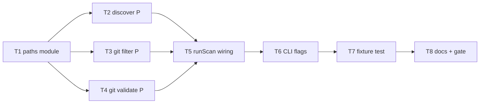

# Milestone 7 — Path Scoping Tasks

**Design**: [`.specs/features/path-scoping/design.md`](./design.md)  
**Spec**: [`.specs/features/path-scoping/spec.md`](./spec.md)  
**Context**: [`.specs/features/path-scoping/context.md`](./context.md)  
**Status**: Done

---

## Execution Plan

### Phase 1: Path scope core (Sequential)

```
T1 paths module (scope + picomatch)
```

### Phase 2: Pipeline integration (Parallel after T1)

```
T2 [P] complexity discovery prune
T3 [P] git result filter
T4 [P] git repository validation
```

### Phase 3: Orchestration + CLI (Sequential)

```
T5 runScan wiring
T6 CLI --include / --exclude flags
```

### Phase 4: Fixture + docs + gate (Sequential)

```
T7 scoped fixture integration test
T7 → T8 docs sync + project gate
```



### Diagram-Definition Cross-Check

| Task | Depends on (declared) | Appears in diagram after deps | Match |
| ---- | --------------------- | ----------------------------- | ----- |
| T1   | None                  | Root                          | ✅    |
| T2   | T1                    | T1 → T2                       | ✅    |
| T3   | T1                    | T1 → T3                       | ✅    |
| T4   | T1                    | T1 → T4                       | ✅    |
| T5   | T2, T3, T4            | T2,T3,T4 → T5                 | ✅    |
| T6   | T5                    | T5 → T6                       | ✅    |
| T7   | T6                    | T6 → T7                       | ✅    |
| T8   | T7                    | T7 → T8                       | ✅    |

### Test Co-location Validation

| Task | Code layer                   | TESTING.md expectation | Tests in same task                            | Match |
| ---- | ---------------------------- | ---------------------- | --------------------------------------------- | ----- |
| T1   | `src/paths/`                 | Unit required          | `scope.test.ts`                               | ✅    |
| T2   | `src/complexity/discover.ts` | Unit required          | `discover.test.ts` update                     | ✅    |
| T3   | `src/paths/filter-git.ts`    | Unit required          | `filter-git.test.ts`                          | ✅    |
| T4   | `src/scan.ts` validation     | Unit required          | `scan.test.ts` update                         | ✅    |
| T5   | `src/scan.ts` orchestration  | Integration            | `scan.integration.test.ts` or extend existing | ✅    |
| T6   | `bin/hotspot-scanner.ts`     | CLI unit               | `bin/*.test.ts`                               | ✅    |
| T7   | Fixture + integration        | Integration            | Scoped integration test                       | ✅    |
| T8   | Docs only                    | Gate                   | `pnpm build && pnpm test`                     | ✅    |

---

## Task Breakdown

### T1: Path scope module

**What**: Create `src/paths/` with `DEFAULT_EXCLUDE_PATTERNS`, `createPathScope`, `isPathInScope`, `shouldPruneDirectory`. Add `picomatch` to `package.json`. Unit tests for match rules.

**Where**: `src/paths/scope.ts`, `src/paths/index.ts`, `src/paths/scope.test.ts`, `package.json`

**Depends on**: None

**Reuses**: [design.md](./design.md) § Path scope; [context.md](./context.md) include/exclude semantics

**Requirement**: HOTSPOT-61, HOTSPOT-65

**Tools**:

- MCP: NONE
- Skill: `vitals-pipeline-domain`

**Done when**:

- [x] `DEFAULT_EXCLUDE_PATTERNS` includes `node_modules`, `.git`, `dist`, `coverage`, `build` (as glob patterns)
- [x] `createPathScope({ include, exclude })` merges user exclude with defaults
- [x] `isPathInScope` implements: no include → all minus excludes; with include → match include AND not exclude; exclude wins
- [x] `shouldPruneDirectory` returns true for excluded directory segments (e.g. `node_modules`)
- [x] `picomatch` is the only external import in `src/paths/scope.ts`
- [x] `pnpm build` succeeds

**Tests**: `src/paths/scope.test.ts` — default excludes, include narrows, exclude wins, posix paths, empty include list

**Gate**: `pnpm exec vitest run src/paths/scope.test.ts`

---

### T2: Complexity discovery prune [P]

**What**: Extend `discoverSourceFiles(repoPath, scope?)` to prune excluded directories and filter files via `isPathInScope`. Forward `scope` through `ComplexityAnalyzerOptions` and `createComplexityAnalyzer().analyze()`.

**Where**: `src/complexity/discover.ts`, `src/complexity/index.ts`, `src/complexity/discover.test.ts`

**Depends on**: T1

**Reuses**: T1 `PathScope`, `isPathInScope`, `shouldPruneDirectory`

**Requirement**: HOTSPOT-61

**Tools**:

- MCP: NONE
- Skill: `vitals-pipeline-domain`

**Done when**:

- [x] Walk does not descend into `node_modules/` (and other default excludes)
- [x] Files under excluded paths are not returned
- [x] When `scope` includes `src/**`, only `src/` files discovered
- [x] Backward compatible: `discoverSourceFiles(repoPath)` uses default scope (defaults only)
- [x] Returned paths remain posix-relative and sorted

**Tests**: `discover.test.ts` — temp tree with `src/app.ts` + `node_modules/lib/index.ts`; include-only case

**Gate**: `pnpm exec vitest run src/complexity/discover.test.ts`

---

### T3: Git result filter [P]

**What**: Implement `filterGitMinerResult(result, scope)` — filter `fileStats` map keys and sanitize `coChangeEvents` (dedupe in-scope files, drop events with < 2 files).

**Where**: `src/paths/filter-git.ts`, `src/paths/filter-git.test.ts`, export from `src/paths/index.ts`

**Depends on**: T1

**Reuses**: T1 `isPathInScope`; `GitMinerResult` from `src/git/index.ts`

**Requirement**: HOTSPOT-62

**Tools**:

- MCP: NONE
- Skill: `vitals-pipeline-domain`

**Done when**:

- [x] Out-of-scope `fileStats` entries removed
- [x] `coChangeEvents` filtered per-file; events with < 2 in-scope files dropped
- [x] Warnings array passed through unchanged
- [x] Partial co-change (one file in scope, one out) drops the event

**Tests**: `filter-git.test.ts` — mixed scope events, empty result, all excluded

**Gate**: `pnpm exec vitest run src/paths/filter-git.test.ts`

---

### T4: Git repository validation [P]

**What**: Add `validateGitRepository(repoPath)` in `src/scan.ts` using `access(join(repoPath, '.git'))`. Update `scan.test.ts` non-git temp dir test to expect early validation error (not `git log failed`).

**Where**: `src/scan.ts`, `src/scan.test.ts`

**Depends on**: T1

**Reuses**: Existing `validateRepoPath` call order in `runScan` (validation only in this task — wiring in T5)

**Requirement**: HOTSPOT-63

**Tools**:

- MCP: NONE
- Skill: NONE

**Done when**:

- [x] `validateGitRepository` throws when `.git` is missing
- [x] Error message includes `repoPath` and indicates not a git repository
- [x] `validateGitRepository` is exported or tested via `runScan` once T5 lands; unit test may call it directly if exported
- [x] `scan.test.ts` updated for non-git directory expectation

**Tests**: `scan.test.ts` — temp dir without `.git`

**Gate**: `pnpm exec vitest run src/scan.test.ts`

**Note**: Export `validateGitRepository` for direct unit testing, or test through `runScan` after T5 — prefer export for T4 isolation.

---

### T5: `runScan` wiring

**What**: Wire M7 pipeline in `runScan`: build `PathScope` from `options.include` / `options.exclude`, call `validateGitRepository`, `filterGitMinerResult` after mine, pass `scope` to analyzer. Extend `ScanOptions` in `src/types/domain.ts`.

**Where**: `src/scan.ts`, `src/types/domain.ts`, `src/scan.integration.test.ts` (or existing integration test file)

**Depends on**: T2, T3, T4

**Reuses**: T1–T4; M6 pipeline structure

**Requirement**: HOTSPOT-65

**Tools**:

- MCP: NONE
- Skill: `vitals-pipeline-domain`, `vitals-cli-validation`

**Done when**:

- [x] `ScanOptions` includes optional `include?: string[]` and `exclude?: string[]`
- [x] `runScan` validates Git before mining
- [x] Same `PathScope` instance used for git filter and complexity analysis
- [x] Existing `small-ts` integration test still passes (no scope flags)
- [x] `runScan({ include: ["src/**"] })` on fixture limits output paths to `src/`

**Tests**: Integration test on `tests/fixtures/repos/small-ts/` — baseline pass + include filter

**Gate**: `pnpm exec vitest run src/scan.integration.test.ts` (or equivalent integration file)

---

### T6: CLI `--include` / `--exclude` flags

**What**: Add repeatable `--include <glob>` and `--exclude <glob>` to commander. Reject empty patterns with `CliUsageError` (exit `2`). Forward arrays to `runScan`.

**Where**: `bin/hotspot-scanner.ts`, `bin/hotspot-scanner.test.ts`

**Depends on**: T5

**Reuses**: M5 CLI patterns (`parsePositiveInteger`, `CliUsageError`, collect reducer)

**Requirement**: HOTSPOT-64, HOTSPOT-66

**Tools**:

- MCP: NONE
- Skill: `vitals-cli-validation`

**Done when**:

- [x] `--include` repeatable; collected into `include` when non-empty
- [x] `--exclude` repeatable; always forwarded (may be empty array)
- [x] Empty `--include ""` or `--exclude ""` → `CliUsageError`, exit `2`
- [x] CLI tests mock `runScan` and assert parsed scope options
- [x] Help text documents both flags

**Tests**: `bin/hotspot-scanner.test.ts` — flag parsing, empty glob error

**Gate**: `pnpm exec vitest run bin/hotspot-scanner.test.ts`

---

### T7: Scoped fixture integration test

**What**: Add `node_modules/` stub under `tests/fixtures/repos/small-ts/` (or test-only setup) with a high-complexity TS file. Assert scan output excludes `node_modules/` paths. Document in fixture README if needed.

**Where**: `tests/fixtures/repos/small-ts/node_modules/` (stub), integration test file, optional `README.md` update

**Depends on**: T6

**Reuses**: `small-ts` fixture, `vitals-cli-validation` smoke command

**Requirement**: HOTSPOT-67

**Tools**:

- MCP: NONE
- Skill: `vitals-cli-validation`
- Agent: `fixture-builder` (optional — stub can be simple static file)

**Done when**:

- [x] Fixture tree contains `node_modules/` with at least one `.ts` file on disk
- [x] `runScan` on fixture: no hotspot `filePath` starts with `node_modules/`
- [x] CLI `scan small-ts --format json` also excludes `node_modules/` paths
- [x] Stub is minimal (no real npm install); committed as static test data

**Tests**: Integration test asserting excluded paths

**Gate**: `pnpm exec vitest run` (scoped test file passes)

---

### T8: Documentation sync + project gate

**What**: Update `ARCHITECTURE.md` (path scoping flow, new flags), `INTEGRATIONS.md` (`picomatch` entry), `ROADMAP.md` (mark M7 items done after verification). Optional `STATE.md` entry for picomatch decision.

**Where**: `.specs/codebase/ARCHITECTURE.md`, `.specs/codebase/INTEGRATIONS.md`, `.specs/project/ROADMAP.md`, `.specs/project/STATE.md` (optional)

**Depends on**: T7

**Reuses**: [roadmap-sync.md](../../../.cursor/skills/vitals-common/references/roadmap-sync.md)

**Requirement**: HOTSPOT-68

**Tools**:

- MCP: NONE
- Skill: `vitals-spec-driven` (roadmap-sync)
- Agent: `verifier-quality-gates` (recommended for final gate)

**Done when**:

- [x] ARCHITECTURE.md documents `--include`, `--exclude`, default excludes, and scope application points
- [x] INTEGRATIONS.md documents `picomatch` — role, version, `src/paths/` only
- [x] ROADMAP.md M7 checkboxes marked `[x]` with link to spec
- [x] `tasks.md` Status → `Done` (orchestrator sets on completion)
- [x] `pnpm build && pnpm test` passes
- [x] `pnpm exec hotspot-scanner scan tests/fixtures/repos/small-ts` succeeds

**Tests**: none (doc + gate)

**Gate**: `pnpm build && pnpm test`

---

## Requirement Traceability (Tasks)

| Requirement ID | Task(s) |
| -------------- | ------- |
| HOTSPOT-61     | T1, T2  |
| HOTSPOT-62     | T1, T3  |
| HOTSPOT-63     | T4      |
| HOTSPOT-64     | T6      |
| HOTSPOT-65     | T1, T5  |
| HOTSPOT-66     | T6      |
| HOTSPOT-67     | T7      |
| HOTSPOT-68     | T8      |

---

## Parallelism Notes

- **T2, T3, T4** may run in parallel after T1 — disjoint file ownership (`discover.ts`, `filter-git.ts`, `scan.ts` validation export).
- **T5** must wait for T2–T4 — merges all integration paths in `runScan`.
- Do not parallelize T5 and T6 — CLI depends on `runScan` accepting scope options.

---

## Handoff

```
Planejamento concluído para path-scoping.

Artefatos: spec.md, context.md, design.md, tasks.md (Status: Planned)
Próximo passo: revisar tasks.md, promover Status para Approved/Ready for Execute,
abrir sessão de dev e invocar orchestrator-implementer.
Gate final esperado: pnpm build && pnpm test
```

---
