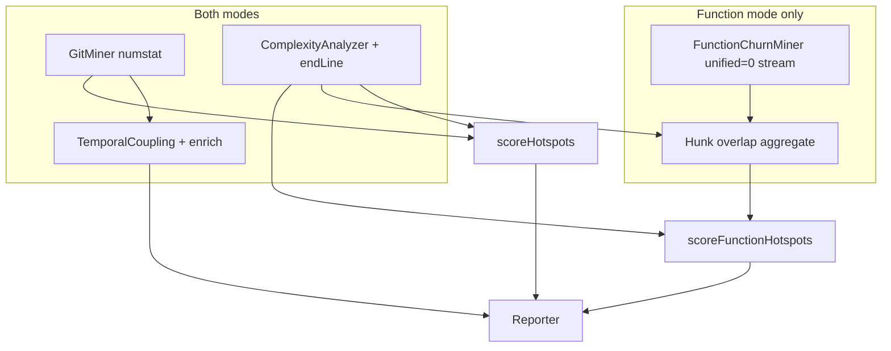

# Milestone 23 — Per-Function Git Churn Design

**Spec**: [`.specs/features/per-function-churn/spec.md`](./spec.md)  
**Context**: [`.specs/features/per-function-churn/context.md`](./context.md)  
**Status**: Done

---

## Architecture Overview

M23 extends the scan pipeline with a **function-mode-only** second git stream that attributes churn by **hunk overlap** against current working-tree function ranges. File mode keeps the existing single `--numstat` GitMiner (ADR-2026-020). Function mode still uses numstat for **coupling**; the patch stream is **additional** and only for per-function churn.



**Pipeline sketch (locked):**

```
GitMiner numstat (file mode + coupling)
Complexity (with endLine)
FunctionChurn hunk-overlap miner (function mode only)
scoreFunctionHotspots(per-function churn map)
Report
```

**IMPL references:** ARCHITECTURE § Function granularity (update), CONCERNS § Git Change Miner, INTEGRATIONS.md (spawn only in `src/git/`), RT-001 streaming, RT-003 renames, M11 context superseded for churn source.

---

## Code Reuse Analysis

### Existing Components to Leverage

| Component                     | Location                                       | How to Use                                                                 |
| ----------------------------- | ---------------------------------------------- | -------------------------------------------------------------------------- |
| Numstat GitMiner              | `src/git/spawn.ts`, `parse.ts`, `aggregate.ts` | **Unchanged** for file churn + coupling; do not fold patch into this parse |
| `PathAliasMap`                | `src/git/rename.ts`                            | Reuse for path canonicalization in function churn aggregate                |
| `GitLogError` / spawn pattern | `src/git/spawn.ts`                             | Mirror for patch spawn (separate argv builder)                             |
| `FunctionComplexityResult`    | `src/types/domain.ts`                          | Add `endLine`; keep `line` as start                                        |
| `scoreFunctionHotspots`       | `src/scoring/function-hotspot-scorer.ts`       | Swap churn input source; keep normalize + harmonic                         |
| `normalizeLogMinMax`          | `src/scoring/normalize.ts`                     | Unchanged                                                                  |
| `runScan` granularity branch  | `src/scan.ts`                                  | Wire miner only on `function` branch                                       |
| Git-log fixtures pattern      | `tests/fixtures/git-log/`                      | Mirror under e.g. `tests/fixtures/git-patch/` for synthetic patches        |

### Integration Points

| System           | M23 behavior                                                                                         |
| ---------------- | ---------------------------------------------------------------------------------------------------- |
| `git` subprocess | Second spawn only in function mode; argv with `--unified=0` (or minimal equivalent) + same `--since` |
| `ts-morph`       | `getEndLineNumber()` in `analyze-file.ts` only — no historical Project                               |
| JSON / schemas   | No shape change; churn **semantics** in function mode change                                         |
| Reporter         | No field changes expected                                                                            |

---

## Design Decisions

| #   | Decision                                                                           | Rationale                                                                      |
| --- | ---------------------------------------------------------------------------------- | ------------------------------------------------------------------------------ |
| D1  | Separate FunctionChurnMiner module under `src/git/` (not mutate numstat parse)     | Avoid regressing file-mode streaming parse; Clear Path Conflict ownership      |
| D2  | Hunk overlap vs current `[line, endLine]`                                          | User locked; YAGNI vs historical AST                                           |
| D3  | Nested overlap credits all N                                                       | User locked                                                                    |
| D4  | `endLine` on `FunctionComplexityResult`; optional omission from public JSON        | Pipeline needs range; no contract break                                        |
| D5  | Churn map key: `filePath` + `functionName` + `line` (same identity as compare/M11) | Stable join to complexity results without requiring `endLine` in scorer output |
| D6  | `linesChanged`: sum of `                                                           | added                                                                          | +   | deleted | ` from hunks that intersect the function (intersecting hunk contributes full hunk line delta — simple, deterministic; document in CONCERNS) | Avoid per-line split inside hunk without blame; YAGNI |
| D7  | Additional stream only in function mode                                            | User locked cost model                                                         |
| D8  | Reuse `PathAliasMap`; document post-rename imprecision                             | RT-003; no historical AST                                                      |

---

## Components

### 1. Complexity — emit `endLine`

- **Purpose**: Provide closed line ranges for overlap.
- **Location**: `src/complexity/analyze-file.ts`, `src/types/domain.ts`
- **Interfaces**:

```typescript
interface FunctionComplexityResult {
  filePath: string;
  functionName: string;
  line: number; // getStartLineNumber()
  endLine: number; // getEndLineNumber() — NEW
  complexity: number;
}
```

- **Dependencies**: ts-morph node APIs (existing)
- **Reuses**: `collectFunctionsInScope`, M22 naming

### 2. Function churn spawn

- **Purpose**: Stream `git log` patch output with minimal context for hunk headers.
- **Location**: `src/git/function-churn/spawn.ts` (or `src/git/hunk-spawn.ts` — prefer subdirectory for isolation)
- **Interfaces**:

```typescript
interface FunctionChurnSpawnOptions {
  repoPath: string;
  since?: string;
}

/** Yields lines from git log patch stream. Must not buffer full stdout. */
async function* streamGitPatchLog(
  options: FunctionChurnSpawnOptions,
): AsyncGenerator<string>;
```

- **Git command (indicative)**:

```bash
git -C <repoPath> log -p --unified=0 --pretty=format:"COMMIT|%H|%ad|%an" [--since=<since>]
```

Exact flags may be adjusted in Execute if rename lines need `--name-status` / `-M` parity with numstat miner — **must** keep streaming and unified=0 (or equivalent). Prefer documenting final argv in ARCHITECTURE after implementation.

- **Dependencies**: `child_process.spawn`, readline
- **Reuses**: `GitLogError` pattern from `spawn.ts`
- **Constraint**: Do **not** change `buildGitLogArgv` / numstat stream behavior

### 3. Hunk parse + overlap aggregate

- **Purpose**: Parse patch lines into commits/files/hunks; attribute commits to functions by range intersection; aggregate stats.
- **Location**: `src/git/function-churn/parse.ts`, `src/git/function-churn/aggregate.ts`, `src/git/function-churn/index.ts`
- **Interfaces** (indicative):

```typescript
interface FunctionChangeStats {
  filePath: string;
  functionName: string;
  line: number;
  commitCount: number;
  linesChanged: number;
  authors: Set<string>;
}

interface FunctionChurnMinerResult {
  functionStats: Map<string, FunctionChangeStats>; // key: `${filePath}\0${functionName}\0${line}` or helper
  warnings: string[];
}

interface FunctionChurnMiner {
  mine(options: {
    repoPath: string;
    since?: string;
    functions: FunctionComplexityResult[];
    /** Optional: reuse alias map from numstat pass if scan shares one; else build during patch parse */
  }): Promise<FunctionChurnMinerResult>;
}

function rangesOverlap(
  hunkStart: number,
  hunkEnd: number,
  fnStart: number,
  fnEnd: number,
): boolean;
```

- **Overlap rule**: Hunk new-file line span (from `@@` header) intersects `[fn.line, fn.endLine]` (inclusive) → attribute commit (+ author) to that function; add hunk’s added+deleted counts to `linesChanged` (D6).
- **Nested**: Test all functions in the file (or index by filePath); credit every intersecting function.
- **Renames**: Parse rename metadata when present; `PathAliasMap.link` / resolve to canonical path matching complexity `filePath`; emit warnings for ambiguous renames (existing patterns).
- **Dependencies**: `PathAliasMap`, spawn stream, complexity results (ranges)
- **Reuses**: Author string from commit header (same pretty format family as numstat)

### 4. Function hotspot scorer

- **Purpose**: Rank functions with per-function churn.
- **Location**: `src/scoring/function-hotspot-scorer.ts`, `src/scoring/index.ts`
- **Interface change**:

```typescript
// Before (M11): fileStats: Map<string, FileChangeStats>
// After (M23):
function scoreFunctionHotspots(
  functionStats: Map<string, FunctionChangeStats>, // or lookup helper
  functions: FunctionComplexityResult[],
): FunctionHotspotScore[];
```

- Lookup by `filePath` + `functionName` + `line`. Missing → zeros.
- Normalization / harmonic / sort: unchanged.
- **Factory** `createFunctionHotspotScorer` signature updated accordingly; update callers/tests.

### 5. Scan wiring

- **Purpose**: Orchestrate function-only path.
- **Location**: `src/scan.ts`
- **Behavior**:

```
numstat GitMiner → complexity → coupling enrich
if function:
  FunctionChurnMiner.mine({ functions: functionComplexity, since, repoPath })
  scoreFunctionHotspots(functionStats, functionComplexity)
else:
  scoreHotspots(fileStats, results)
```

- Forward miner warnings via `onWarning`.
- **Do not** call FunctionChurnMiner in file mode.

### 6. Fixtures

- **Location**: `tests/fixtures/git-patch/` (synthetic text logs) and/or small fixture snippets co-located with unit tests
- **Purpose**: Overlap, nested, no-overlap, multi-commit authors, rename imprecision documentation cases
- **Not** requiring a full git repo for unit parse tests (feed AsyncIterable lines like `git-log` fixtures)

---

## Data Models

### `FunctionComplexityResult` (extended)

```typescript
interface FunctionComplexityResult {
  filePath: string;
  functionName: string;
  line: number;
  endLine: number;
  complexity: number;
}
```

### `FunctionChangeStats` (new, internal domain)

```typescript
interface FunctionChangeStats {
  filePath: string;
  functionName: string;
  line: number;
  commitCount: number;
  linesChanged: number;
  authors: Set<string>;
}
```

**Relationships**: One `FunctionChangeStats` per scored function identity; joined to `FunctionComplexityResult` / `FunctionHotspotScore` by `(filePath, functionName, line)`.

### `FunctionHotspotScore` (unchanged public shape)

Fields unchanged. Semantics of churn fields = per-function overlap (not parent file).

---

## Error Handling Strategy

| Error Scenario                | Handling                                                                                                             | User Impact                   |
| ----------------------------- | -------------------------------------------------------------------------------------------------------------------- | ----------------------------- |
| Patch `git log` non-zero exit | Throw `GitLogError` (or shared subclass) with repoPath/command/stderr                                                | Non-zero CLI exit             |
| Malformed hunk header         | Skip hunk + warning (prefer continue) or fail-fast if unrecoverable — prefer warn+skip aligned with parse resilience | Partial churn; stderr warning |
| Rename ambiguous              | Existing PathAliasMap warning                                                                                        | Documented imprecision        |
| Empty functions list          | Skip spawn or spawn no-op — prefer **skip spawn** for cost                                                           | Empty `functions` array       |

---

## Risks (from CONCERNS.md)

| Risk                         | Mitigation in design                                                                                                                                                                |
| ---------------------------- | ----------------------------------------------------------------------------------------------------------------------------------------------------------------------------------- |
| RT-001 memory on large repos | Function-only stream; `--unified=0`; line-by-line; never buffer full patch                                                                                                          |
| RT-003 rename distortion     | PathAliasMap + explicit docs that current ranges ≠ historical hunk lines after moves                                                                                                |
| Git parse fragility          | Isolated module + fixtures; numstat path untouched                                                                                                                                  |
| Scoring silent reorder       | Unit tests with fixed per-function churn proving sibling divergence                                                                                                                 |
| ADR-2026-020 “single pass”   | Clarified: single **numstat** pass remains for file churn+coupling; function mode adds a second **optional** stream (document ADR note / ARCHITECTURE — not a silent contradiction) |

---

## Tech Decisions (non-obvious)

| Decision                     | Choice                       | Rationale                                  |
| ---------------------------- | ---------------------------- | ------------------------------------------ |
| Module layout                | `src/git/function-churn/*`   | Path Conflict isolation from numstat parse |
| `linesChanged` attribution   | Full intersecting hunk delta | Deterministic without intra-hunk blame     |
| Skip spawn when no functions | Yes                          | Cost                                       |
| Public JSON `endLine`        | Omit by default              | No shape break; pipeline-internal          |

---

## Living docs targets (Execute)

| Doc                   | Update                                                                  |
| --------------------- | ----------------------------------------------------------------------- |
| ARCHITECTURE.md       | Function granularity: hunk-overlap; pipeline diagram; ADR-2026-020 note |
| CONCERNS.md           | New function-churn parse / rename imprecision / streaming               |
| TESTING.md            | `tests/fixtures/git-patch/` (or chosen path)                            |
| STRUCTURE.md          | `src/git/function-churn/`                                               |
| INTEGRATIONS.md       | Second git log invocation (function mode)                               |
| STATE.md / ROADMAP.md | Supersede M11 inherited churn; M23 progress                             |

---

## Tips for Execute

- Mock git only at FunctionChurnMiner / spawn boundary (TESTING.md)
- Do not change McCabe nodes or M22 collection beyond `endLine`
- Keep `version: "1.0"`; update contract tests only if semantics assertions hard-code inherited churn equality to file stats
- Propose Conventional Commit per task; commit only if user asks
