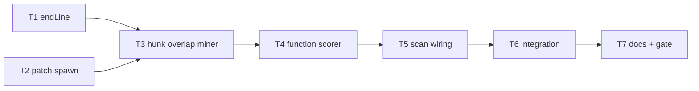

# Milestone 23 — Per-Function Git Churn Tasks

**Design**: [`.specs/features/per-function-churn/design.md`](./design.md)  
**Spec**: [`.specs/features/per-function-churn/spec.md`](./spec.md)  
**Context**: [`.specs/features/per-function-churn/context.md`](./context.md)  
**Status**: Done

---

## Execution Plan

### Phase 1: Foundation (Parallel OK)

```
T1 endLine [P] ──┐
                 ├──→ T3
T2 patch spawn [P] ─┘
```

### Phase 2: Miner core (Sequential)

```
T1 + T2 → T3 parse/aggregate + fixtures → T4 scorer
```

### Phase 3: Pipeline + validation (Sequential)

```
T4 → T5 scan wiring → T6 integration → T7 docs + gate
```



### Diagram-Definition Cross-Check

| Task | Depends on (task body) | Diagram shows | Match |
| ---- | ---------------------- | ------------- | ----- |
| T1   | None                   | Root          | ✅    |
| T2   | None                   | Root          | ✅    |
| T3   | T1, T2                 | T1→T3, T2→T3  | ✅    |
| T4   | T3                     | T3→T4         | ✅    |
| T5   | T4                     | T4→T5         | ✅    |
| T6   | T5                     | T5→T6         | ✅    |
| T7   | T6                     | T6→T7         | ✅    |

### Path Conflict Check

| Task | Module owner                       | Paths                                      | Conflict                                                  |
| ---- | ---------------------------------- | ------------------------------------------ | --------------------------------------------------------- |
| T1   | `src/complexity/` (+ `src/types/`) | `domain.ts`, `analyze-file.ts`, tests      | None vs T2                                                |
| T2   | `src/git/function-churn/`          | spawn only under function-churn            | Disjoint from T1; do **not** edit numstat `spawn.ts` argv |
| T3   | `src/git/function-churn/`          | parse, aggregate, index, fixtures          | After T2 — same prefix, sequential                        |
| T4   | `src/scoring/`                     | `function-hotspot-scorer.ts`, index, tests | Disjoint after T3 type export                             |
| T5   | `src/scan.ts`                      | scan + scan tests                          | Sole scan owner                                           |
| T6   | integration / CLI                  | fixture repos or scan/bin tests            | After T5                                                  |
| T7   | docs                               | `.specs/codebase/*`, ROADMAP, STATE        | After T6                                                  |

### Test Co-location Validation

| Task | Code layer                 | TESTING.md expectation | Task `Tests`                  | Match |
| ---- | -------------------------- | ---------------------- | ----------------------------- | ----- |
| T1   | complexity analyze-file    | unit                   | unit                          | ✅    |
| T2   | git spawn (function-churn) | unit                   | unit                          | ✅    |
| T3   | git parse/aggregate        | unit + fixtures        | unit                          | ✅    |
| T4   | scoring                    | unit                   | unit                          | ✅    |
| T5   | scan orchestration         | integration / unit     | unit + integration assertions | ✅    |
| T6   | CLI / scan integration     | integration            | integration                   | ✅    |
| T7   | docs                       | full gate              | full gate                     | ✅    |

---

## Task Breakdown

### T1: Emit `endLine` on FunctionComplexityResult [P]

**What**: Add `endLine` to `FunctionComplexityResult` and set it from `node.getEndLineNumber()` in `analyze-file.ts`. Keep `line` as start. Update complexity unit tests / any constructors of the type in complexity tests. Do **not** add `endLine` to public `FunctionHotspotScore` / JSON in this task.

**Where**: `src/types/domain.ts`, `src/complexity/analyze-file.ts`, `src/complexity/analyze-file.test.ts` (and other complexity test helpers that construct `FunctionComplexityResult` if they fail to compile)

**Depends on**: None

**Reuses**: Existing `collectFunctionsInScope` emission site; [context.md](./context.md) § endLine

**Requirement**: HOTSPOT-181

**Tools**:

- MCP: NONE
- Skill: `vitals-pipeline-domain`, `coding-guidelines`

**Done when**:

- [ ] `FunctionComplexityResult` includes `endLine: number`
- [ ] Emission uses `getEndLineNumber()`; `line` unchanged
- [ ] Nested functions each have correct independent ranges in unit tests
- [ ] Gate check passes: `pnpm exec vitest run src/complexity/analyze-file.test.ts`
- [ ] Test count: no silent deletions vs pre-task baseline for this file

**Tests**: unit  
**Gate**: `pnpm exec vitest run src/complexity/analyze-file.test.ts`

**Commit**: `feat(complexity): emit endLine on FunctionComplexityResult`

---

### T2: Patch stream spawn (`--unified=0`) [P]

**What**: Add isolated function-churn spawn that streams `git log` patch output with `--unified=0` (or minimal equivalent) and the same `--since` option pattern as numstat. Reuse `GitLogError` pattern. **Do not** modify numstat `buildGitLogArgv` / `streamGitLog` behavior. Unit-test argv builder and streaming contract (no full-buffer).

**Where**: `src/git/function-churn/spawn.ts`, `src/git/function-churn/spawn.test.ts` (create `function-churn/` package subtree)

**Depends on**: None

**Reuses**: `src/git/spawn.ts` error/stream patterns; [design.md](./design.md) § Function churn spawn

**Requirement**: HOTSPOT-183, HOTSPOT-190

**Tools**:

- MCP: NONE
- Skill: `vitals-pipeline-domain`, `coding-guidelines`

**Done when**:

- [ ] `streamGitPatchLog` / argv builder exists under `src/git/function-churn/`
- [ ] Argv includes unified=0 (or documented minimal equivalent) and optional `--since`
- [ ] Numstat `src/git/spawn.ts` unchanged in behavior
- [ ] Unit tests cover argv + error wrapping
- [ ] Gate check passes: `pnpm exec vitest run src/git/function-churn/spawn.test.ts`

**Tests**: unit  
**Gate**: `pnpm exec vitest run src/git/function-churn/spawn.test.ts`

**Commit**: `feat(git): add function-churn patch log spawn`

---

### T3: Hunk parse, overlap aggregate, fixtures

**What**: Implement streaming hunk parse + overlap aggregation into `FunctionChangeStats` map. Credit commits to all intersecting functions (nested). Apply `--since`/author rules parity with file miner. Reuse `PathAliasMap` for renames; emit warnings for ambiguous cases. Add synthetic fixtures under `tests/fixtures/git-patch/` (or design-chosen path). Export `createFunctionChurnMiner` from `src/git/function-churn/index.ts` and re-export from `src/git` as needed without breaking existing GitMiner API.

**Where**: `src/git/function-churn/parse.ts`, `aggregate.ts`, `index.ts`, co-located `*.test.ts`, `tests/fixtures/git-patch/*`, `src/types/domain.ts` (`FunctionChangeStats` if not already added)

**Depends on**: T1, T2

**Reuses**: `PathAliasMap`; [context.md](./context.md) overlap/nested/renames; [design.md](./design.md) D6 linesChanged

**Requirement**: HOTSPOT-182, HOTSPOT-184, HOTSPOT-187, HOTSPOT-188, HOTSPOT-191

**Tools**:

- MCP: NONE
- Skill: `vitals-pipeline-domain`, `coding-guidelines`
- Agent (optional): `fixture-builder` for fixture tree only

**Done when**:

- [ ] Overlap / nested / no-overlap / multi-author cases covered by unit tests + fixtures
- [ ] Rename path resolution uses `PathAliasMap`; warning path exists
- [ ] Streaming parse does not accumulate full patch string
- [ ] Gate check passes: `pnpm exec vitest run src/git/function-churn`
- [ ] Test count: no silent deletions

**Tests**: unit  
**Gate**: `pnpm exec vitest run src/git/function-churn`

**Commit**: `feat(git): attribute function churn via hunk overlap`

---

### T4: scoreFunctionHotspots — per-function churn input

**What**: Change `scoreFunctionHotspots` (and `createFunctionHotspotScorer`) to consume the per-function churn map instead of inheriting parent `FileChangeStats`. Preserve `log1p`+min-max, harmonic combiner, sort, and `FunctionHotspotScore` field names. Update unit tests so siblings in the same file can differ on churn.

**Where**: `src/scoring/function-hotspot-scorer.ts`, `src/scoring/function-hotspot-scorer.test.ts`, `src/scoring/index.ts`, `src/scoring/index.test.ts` (if signatures break)

**Depends on**: T3

**Reuses**: `normalizeLogMinMax`; [context.md](./context.md) § Signals and scoring math

**Requirement**: HOTSPOT-185

**Tools**:

- MCP: NONE
- Skill: `vitals-pipeline-domain`, `coding-guidelines`

**Done when**:

- [ ] No inheritance of parent file `commitCount` for function churn fields
- [ ] Missing churn entry → zeros
- [ ] Unit tests prove divergent churn for two functions in one file
- [ ] Formula/sort regression tests updated and green
- [ ] Gate check passes: `pnpm exec vitest run src/scoring/function-hotspot-scorer.test.ts src/scoring/index.test.ts`

**Tests**: unit  
**Gate**: `pnpm exec vitest run src/scoring/function-hotspot-scorer.test.ts src/scoring/index.test.ts`

**Commit**: `feat(scoring): use per-function churn in function hotspots`

---

### T5: Wire function branch in `runScan`

**What**: On `granularity === "function"`, after complexity, call FunctionChurnMiner (skip spawn when functions list empty), pass stats to scorer, forward warnings. File mode must not call the miner. Coupling remains numstat-based. Keep JSON `version: "1.0"`. Update scan unit/integration tests that assumed inherited file churn.

**Where**: `src/scan.ts`, related `src/scan*.test.ts` / integration tests that assert function churn

**Depends on**: T4

**Reuses**: [design.md](./design.md) § Scan wiring; existing warning forwarding

**Requirement**: HOTSPOT-183, HOTSPOT-186, HOTSPOT-189

**Tools**:

- MCP: NONE
- Skill: `vitals-pipeline-domain`, `coding-guidelines`

**Done when**:

- [ ] Function branch uses FunctionChurnMiner + updated scorer
- [ ] File branch never invokes patch spawn (assert via injectable deps or spy)
- [ ] `version === "1.0"`; public function score shape unchanged
- [ ] Gate check passes: `pnpm exec vitest run src/scan.ts` → prefer `pnpm exec vitest run src/scan` / existing scan test paths
- [ ] Tests green for scan suite touched

**Tests**: unit (scan)  
**Gate**: `pnpm exec vitest run src/scan`

**Commit**: `feat(scan): wire per-function churn miner in function mode`

---

### T6: Integration / CLI validation

**What**: Add or extend integration coverage proving (1) function mode churn reflects overlap fixtures / repo behavior, (2) file mode unchanged, (3) CLI `--granularity function` still exit 0 on `tests/fixtures/repos/small-ts` (or dedicated fixture). Follow `vitals-cli-validation` for exit codes. Fix any contract tests that incorrectly assumed function churn equals parent file stats.

**Where**: `tests/` integration paths, `bin/*` integration tests if present, `tests/contract/` only if assertions need semantic updates (no schema shape change)

**Depends on**: T5

**Reuses**: `vitals-cli-validation`; small-ts fixture

**Requirement**: HOTSPOT-189, HOTSPOT-193

**Tools**:

- MCP: NONE
- Skill: `vitals-cli-validation`, `coding-guidelines`

**Done when**:

- [ ] Integration/CLI checks document function vs file behavior
- [ ] No JSON schema shape break; `version: "1.0"`
- [ ] Gate check passes: targeted integration + `pnpm exec vitest run tests/contract` if touched
- [ ] Manual smoke (document in Done when):  
      `pnpm exec hotspot-scanner scan tests/fixtures/repos/small-ts --granularity function --format json`

**Tests**: integration  
**Gate**: `pnpm exec vitest run` (targeted suites for scan/bin/contract touched by this task)

**Commit**: `test: cover per-function churn integration and CLI`

---

### T7: Living docs + project gate

**What**: Update ARCHITECTURE (function granularity + pipeline + ADR-2026-020 note), CONCERNS (hunk overlap / rename imprecision / streaming), TESTING (patch fixtures), STRUCTURE (+ INTEGRATIONS if needed). Sync ROADMAP M23 checklist and STATE (supersede M11 inherited churn decision). Run full project gate.

**Where**: `.specs/codebase/ARCHITECTURE.md`, `CONCERNS.md`, `TESTING.md`, `STRUCTURE.md`, `INTEGRATIONS.md` (as needed), `.specs/project/ROADMAP.md`, `.specs/project/STATE.md`

**Depends on**: T6

**Reuses**: [design.md](./design.md) § Living docs targets; roadmap-sync reference

**Requirement**: HOTSPOT-192, HOTSPOT-193

**Tools**:

- MCP: NONE
- Skill: `vitals-spec-driven` (roadmap-sync), `coding-guidelines`

**Done when**:

- [ ] Docs no longer claim function mode inherits parent file churn as current behavior
- [ ] ROADMAP M23 items checked when Execute completes (this planning sync lists link; Execute marks Done)
- [ ] STATE records M23 hunk-overlap decision superseding M11 inheritance
- [ ] Gate check passes: `pnpm build && pnpm test`

**Tests**: none (docs) + full gate  
**Gate**: `pnpm build && pnpm test`

**Commit**: `docs: document per-function hunk-overlap churn (M23)`

---

## Parallel Execution Map

```
Phase 1 (Parallel):
  ├── T1 [P]  complexity endLine
  └── T2 [P]  function-churn spawn

Phase 2 (Sequential):
  T3 → T4

Phase 3 (Sequential):
  T5 → T6 → T7
```

**Parallelism constraint:** T1/T2 are `[P]` — disjoint prefixes (`src/complexity|types` vs `src/git/function-churn`). Unit tests parallel-safe. T3+ must be sequential (shared `src/git/function-churn/`, then scoring, then scan).

---

## Requirement → Task Mapping

| Requirement ID | Task(s) |
| -------------- | ------- |
| HOTSPOT-181    | T1      |
| HOTSPOT-182    | T3      |
| HOTSPOT-183    | T2, T5  |
| HOTSPOT-184    | T3      |
| HOTSPOT-185    | T4      |
| HOTSPOT-186    | T5      |
| HOTSPOT-187    | T3      |
| HOTSPOT-188    | T3      |
| HOTSPOT-189    | T5, T6  |
| HOTSPOT-190    | T2      |
| HOTSPOT-191    | T3      |
| HOTSPOT-192    | T7      |
| HOTSPOT-193    | T6, T7  |

**Coverage:** 13 / 13 mapped — no unmapped P1 IDs

---

## Granularity Check

| Task | Scope                                             | Status         |
| ---- | ------------------------------------------------- | -------------- |
| T1   | endLine type + emit                               | ✅ Granular    |
| T2   | spawn only                                        | ✅ Granular    |
| T3   | parse+aggregate+fixtures (cohesive git submodule) | ✅ OK cohesive |
| T4   | scorer signature + tests                          | ✅ Granular    |
| T5   | scan wiring                                       | ✅ Granular    |
| T6   | integration/CLI                                   | ✅ Granular    |
| T7   | docs + full gate                                  | ✅ Granular    |

---

## Handoff

Planning session ends here (**Status: Planned**).

Next: user promotes Status to `Approved` / `Ready for Execute` → **new session** → `orchestrator-implementer`.

Proposed final commit theme (Execute): `feat: per-function git churn via hunk overlap (M23)`
