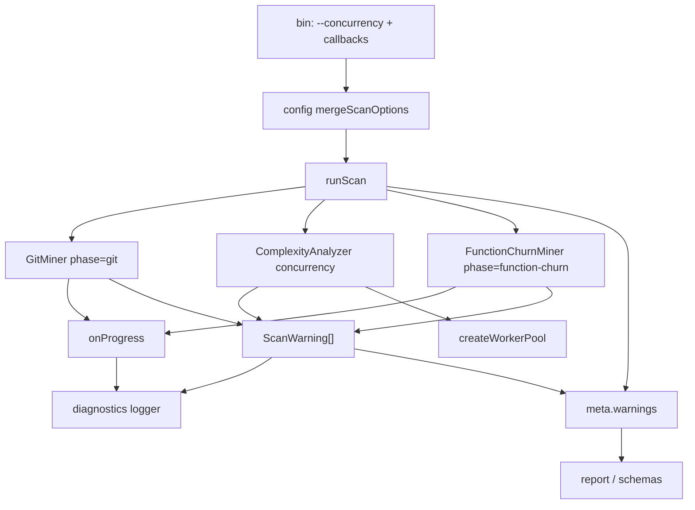

# Milestone 28 — Performance & Diagnostics UX Design

**Spec**: [`.specs/features/perf-diagnostics-ux/spec.md`](./spec.md)  
**Context**: [`.specs/features/perf-diagnostics-ux/context.md`](./context.md)  
**Status**: Done

---

## Architecture Overview

M28 is a **cross-cutting UX/control** milestone on top of existing M15 pool + M5 diagnostics + M23 function-churn. It does not add pipeline stages. Changes cluster in three bands:

1. **Concurrency control** — config/CLI → `MergedScanConfig` → `runScan` → `createComplexityAnalyzer({ concurrency })`
2. **Phase-aware progress** — miners emit `{ phase, commitsProcessed }` → diagnostics logger → stderr
3. **Structured warnings** — emitters produce `ScanWarning` → `onWarning` + `meta.warnings` → reporters/schemas



**Fragile areas (CONCERNS):** AST concurrency default must stay `min(availableParallelism(), 4)` unless overridden; git/function-churn streaming must remain line-by-line; do not touch M26 rename-confidence product content.

---

## Code Reuse Analysis

### Existing Components to Leverage

| Component                                         | Location                                                | How to Use                                       |
| ------------------------------------------------- | ------------------------------------------------------- | ------------------------------------------------ |
| `DEFAULT_WORKER_CONCURRENCY` / `createWorkerPool` | `src/complexity/pool.ts`                                | Reuse default; pass `concurrency` from scan deps |
| `ComplexityAnalyzerDependencies.concurrency`      | `src/complexity/index.ts`                               | Already injectable — wire from `runScan`         |
| `maybeLogProgress` / `logWarning`                 | `src/diagnostics/logger.ts`                             | Extend for phase + severity prefixes             |
| `onProgress` / `onWarning` hooks                  | `src/types/domain.ts`, miners, `scan.ts`                | Evolve payload/types                             |
| Config merge / CLI overrides                      | `src/config/merge-options.ts`, `bin/hotspot-scanner.ts` | Add `concurrency` like `top`                     |
| Compare warnings                                  | `src/compare/compare.ts`                                | Emit `ScanWarning` instead of string             |
| JSON schemas + contract tests                     | `schemas/`, `tests/contract/`                           | Additive `ScanWarning` defs                      |

### Integration Points

| System                        | Integration Method                                                         |
| ----------------------------- | -------------------------------------------------------------------------- |
| Complexity pool (M15)         | Pass resolved concurrency into `createComplexityAnalyzer({ concurrency })` |
| Function churn (M23)          | Add `phase: "function-churn"` to existing `onProgress` calls               |
| Reporter / CSV compare meta   | Render `ScanWarning` objects; update CSV `meta.json` warnings shape        |
| Package `#diagnostics` export | Export new helpers/types as needed without breaking existing named exports |

---

## Components

### Domain types (`src/types/domain.ts`)

- **Purpose**: Canonical `ScanProgress`, `ScanWarning`, `DiagnosticSeverity`; update `ScanOptions`, `ScanMeta`, `CompareMeta`.
- **Interfaces** (contracts):

```ts
export type DiagnosticSeverity = "info" | "warning" | "error";

export type ScanProgressPhase = "git" | "function-churn";

export interface ScanProgress {
  phase: ScanProgressPhase;
  commitsProcessed: number;
}

export interface ScanWarning {
  severity: DiagnosticSeverity;
  message: string;
  code?: string;
}

// ScanOptions
onWarning?: (warning: ScanWarning) => void;
onProgress?: (progress: ScanProgress) => void;

// ScanMeta
warnings: ScanWarning[];
```

- **Reuses**: Existing `ScanOptions` callback slots; keep `version: "1.0"`.

### Diagnostics (`src/diagnostics/`)

- **Purpose**: Stderr formatting + throttle; optional `createScanWarning` helper for consistent codes.
- **Interfaces**:
  - `logWarning(warning: ScanWarning): void` — or overload keeping string shim that defaults severity `warning` (prefer single structured API)
  - `logProgress(phase: ScanProgressPhase, commitsProcessed: number): void`
  - `maybeLogProgress(phase, commitsProcessed, interval?): boolean` — per-phase throttle (caller may keep last-emitted map, or logger tracks `Map<phase, lastLoggedBucket>`)
- **Design note:** Simplest throttle: CLI passes phase into `maybeLogProgress`; function remains pure on `(phase, commitsProcessed, interval)` and only needs commitsProcessed % interval — phase is for message text only (counters already per-phase from emitters).
- **Reuses**: `PROGRESS_LOG_INTERVAL = 1000`.

### Config (`src/config/`)

- **Purpose**: Accept `concurrency?: number` in `HotspotScannerConfig` / `MergedScanConfig`.
- **Changes**: `KNOWN_KEYS`, parse positive integer, `mergeScanOptions` pickRequired with fallback `DEFAULT_WORKER_CONCURRENCY` **or** leave undefined and let scan resolve default from complexity module (prefer merge includes resolved number so CLI/docs see one place).
- **Locked preference:** `MergedScanConfig.concurrency: number` always set — default = `DEFAULT_WORKER_CONCURRENCY` imported from complexity pool (avoid duplicating formula).

### Scan orchestration (`src/scan.ts`)

- **Purpose**: Pass `merged.concurrency` into analyzer; aggregate `ScanWarning[]` into `meta.warnings`; forward phased `onProgress`; invoke `onWarning` with structured warnings.
- **Mapping helper:** When a module still returns legacy strings temporarily during a task, map at boundary — target end-state: modules return `ScanWarning[]` (or scan maps with known codes). Prefer updating miners/complexity in the same feature to return `ScanWarning[]`.
- **Reuses**: Existing stage order; no stage overlap.

### Git miners (`src/git/index.ts`, `src/git/function-churn/index.ts`)

- **Purpose**: Emit `onProgress({ phase, commitsProcessed })`; return `warnings: ScanWarning[]` with codes `EMPTY_SINCE_WINDOW` / `RENAME_HISTORY_INCOMPLETE`.
- **Message text:** Keep existing human strings (or minimal prefix-compatible wording); do not add M26-only copy.

### Complexity (`src/complexity/`)

- **Purpose**: Parse failures → `ScanWarning` with `code: "PARSE_FAILED"`, `severity: "warning"`; accept concurrency from scan (already supported via deps).
- **No** pool algorithm changes beyond receiving CLI-resolved concurrency.

### Compare (`src/compare/`)

- **Purpose**: `COMPARE_SINCE_MISMATCH` as `ScanWarning`; `CompareMeta.warnings: ScanWarning[]`.

### CLI (`bin/hotspot-scanner.ts`)

- **Purpose**: `--concurrency <n>` option; parse via existing positive-integer helper; wire diagnostics:

```ts
onWarning: (w) => logWarning(w),
onProgress: ({ phase, commitsProcessed }) =>
  maybeLogProgress(phase, commitsProcessed),
```

### Schemas & reporters

- **Purpose**: `$defs.ScanWarning`; `ScanMeta.warnings` required array; compare schema update; table/markdown/csv/json render objects (`severity`, `message`, optional `code`).
- **CSV:** `meta.json` warnings become object array (update tests).

---

## Data Models

### ScanWarning / ScanProgress

See Components § Domain types.

### Warning code catalog (M28)

| Code                        | Severity | Emitter              | Operator interpretation (docs)                                                        |
| --------------------------- | -------- | -------------------- | ------------------------------------------------------------------------------------- |
| `EMPTY_SINCE_WINDOW`        | warning  | git / function-churn | No commits in `--since`; rankings may be empty or sparse — widen window               |
| `RENAME_HISTORY_INCOMPLETE` | warning  | git / function-churn | Rename tracking incomplete for path — history may split; see M26 for deeper rename UX |
| `PARSE_FAILED`              | warning  | complexity           | File skipped in complexity — fix syntax or exclude path                               |
| `COMPARE_SINCE_MISMATCH`    | warning  | compare              | Baseline/current `--since` differ — deltas less comparable                            |

---

## Error Handling Strategy

| Error Scenario                      | Handling                    | User Impact                              |
| ----------------------------------- | --------------------------- | ---------------------------------------- |
| `--concurrency` ≤ 0 / non-integer   | `CliUsageError` before scan | Non-zero exit; no partial report         |
| Config `concurrency` invalid        | `ConfigError`               | Non-zero exit                            |
| Worker throw (unchanged)            | Propagate from analyzer     | Scan fails with context                  |
| Parse failure (unchanged semantics) | `ScanWarning` + skip file   | Scan continues; warning in meta + stderr |
| Empty `--since` window              | `ScanWarning`               | Scan continues                           |

---

## Tech Decisions

| ID  | Decision            | Choice                                     | Rationale                                                     |
| --- | ------------------- | ------------------------------------------ | ------------------------------------------------------------- |
| D1  | Concurrency surface | CLI + config                               | ROADMAP + existing merge pattern                              |
| D2  | Default             | Unchanged `min(availableParallelism(), 4)` | CONCERNS / M15                                                |
| D3  | Progress phases     | `git` \| `function-churn` only             | Patch-stream UX; YAGNI complexity phase                       |
| D4  | Warning shape       | `ScanWarning` objects                      | Severity + codes for docs/JSON                                |
| D5  | Schema version      | Keep `"1.0"`                               | Additive scan field; compare warnings shape change documented |
| D6  | M26 boundary        | No new rename-confidence warnings          | ROADMAP hard boundary                                         |
| D7  | Batch size flag     | Out of scope                               | M15 context                                                   |

### CONCERNS mitigations

| Concern                           | Design response                                                               |
| --------------------------------- | ----------------------------------------------------------------------------- |
| RT-001 memory (N workers × batch) | Document that raising `--concurrency` increases memory; default cap 4 remains |
| Fragile git/complexity            | Co-located tests; no parse/McCabe semantic changes                            |
| Rename warnings                   | Only re-wrap existing incomplete-rename string; M26 owns new content          |

---

## Testing Strategy

| Layer             | Focus                                                                                                                 |
| ----------------- | --------------------------------------------------------------------------------------------------------------------- |
| Unit              | config merge concurrency; diagnostics phase/severity; miner progress phase; warning codes; compare structured warning |
| Contract          | `schemas/scan-result.json`, `schemas/compare-result.json` + `tests/contract/json-schema.test.ts`                      |
| Integration / CLI | `--concurrency` valid/invalid; function-mode JSON `meta.warnings`; progress callbacks                                 |
| Gate              | `pnpm build && pnpm test`                                                                                             |

Mock boundaries unchanged (TESTING.md): mock git at miner boundary; mock pool via `createWorkerPool` / `concurrency: 1`.

---

## Documentation Updates (Execute)

| Doc          | Update                                                                      |
| ------------ | --------------------------------------------------------------------------- |
| README       | `--concurrency`, default formula, warning codes / severity, progress phases |
| ARCHITECTURE | CLI concurrency wiring; progress phases; `meta.warnings`                    |
| CONCERNS     | Operator override note under AST concurrency                                |
| TESTING      | Contract notes for `ScanWarning`                                            |
| INTEGRATIONS | Only if export surface of `#diagnostics` changes materially                 |

ROADMAP/STATE: **deferred to parent** per planning request.
