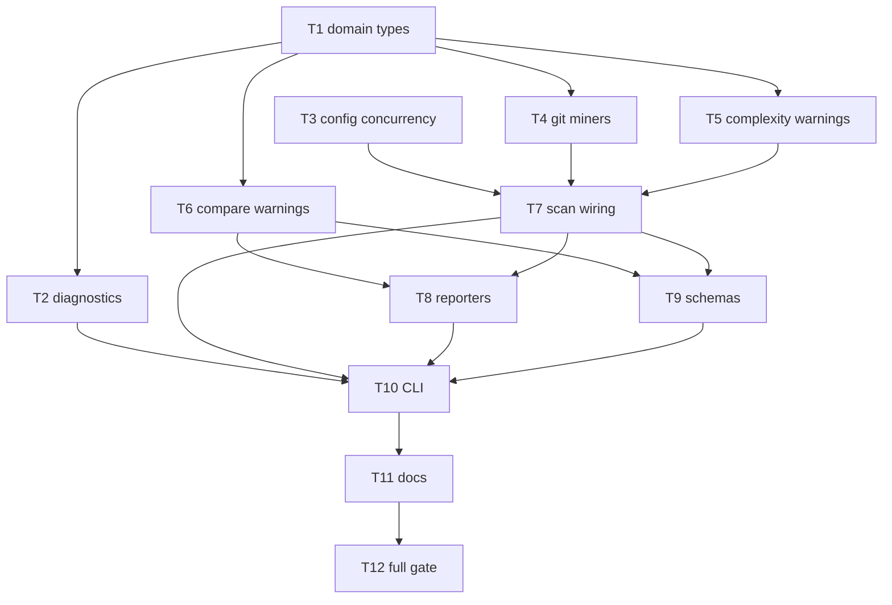

# Milestone 28 — Performance & Diagnostics UX Tasks

**Design**: [`.specs/features/perf-diagnostics-ux/design.md`](./design.md)  
**Spec**: [`.specs/features/perf-diagnostics-ux/spec.md`](./spec.md)  
**Context**: [`.specs/features/perf-diagnostics-ux/context.md`](./context.md)  
**Status**: Done

---

## Execution Plan

### Phase 1: Foundation (Parallel OK)

```
T1 types ──┐
           ├──→ Phase 2
T3 config ─┘
```

### Phase 2: Emitters + diagnostics (Parallel OK after T1)

```
T1 ──┬→ T2 diagnostics ──────────────┐
     ├→ T4 git progress + warnings ──┼──→ T7 scan
     ├→ T5 complexity warnings ──────┤
     └→ T6 compare warnings ─────────┘
T3 ──────────────────────────────────→ T7
```

### Phase 3: Pipeline + contracts (Sequential fan-in)

```
T7 scan → T8 reporters [P] ─┐
       └→ T9 schemas      ─┴→ T10 CLI → T11 docs → T12 gate
```



### Diagram-Definition Cross-Check

| Task | Depends on (task body) | Diagram shows   | Match |
| ---- | ---------------------- | --------------- | ----- |
| T1   | None                   | Root            | ✅    |
| T2   | T1                     | T1→T2           | ✅    |
| T3   | None                   | Root            | ✅    |
| T4   | T1                     | T1→T4           | ✅    |
| T5   | T1                     | T1→T5           | ✅    |
| T6   | T1                     | T1→T6           | ✅    |
| T7   | T3, T4, T5             | T3/T4/T5→T7     | ✅    |
| T8   | T6, T7                 | T6/T7→T8        | ✅    |
| T9   | T6, T7                 | T6/T7→T9        | ✅    |
| T10  | T2, T7, T8, T9         | T2/T7/T8/T9→T10 | ✅    |
| T11  | T10                    | T10→T11         | ✅    |
| T12  | T11                    | T11→T12         | ✅    |

### Path Conflict Check (Check 5)

| Task | Module owner          | Paths                                                                          | Conflict                                                    |
| ---- | --------------------- | ------------------------------------------------------------------------------ | ----------------------------------------------------------- |
| T1   | `src/types/`          | `src/types/domain.ts` (+ barrel if needed)                                     | Sole owner                                                  |
| T2   | `src/diagnostics/`    | `src/diagnostics/logger.ts`, `index.ts`, `*.test.ts`                           | Sole owner; `[P]` vs T3/T4/T5/T6                            |
| T3   | `src/config/`         | `load-config.ts`, `merge-options.ts`, `*.test.ts`                              | Sole owner; `[P]` vs T1                                     |
| T4   | `src/git/`            | `src/git/index.ts`, `function-churn/index.ts`, related `*.test.ts`             | Sole git owner this feature; not `[P]` with other git tasks |
| T5   | `src/complexity/`     | `analyze-batch.ts`, `index.ts`, related `*.test.ts`                            | Sole complexity owner; do not change pool algorithm         |
| T6   | `src/compare/`        | `compare.ts`, `*.test.ts`                                                      | Sole compare owner                                          |
| T7   | `src/scan.ts`         | `src/scan.ts`, `src/scan.test.ts`, `src/scan.integration.test.ts` as needed    | Sole scan owner — **no `[P]` with other scan editors**      |
| T8   | `src/report/`         | compare/scan reporters touching warnings                                       | Sole report owner; `[P]` with T9                            |
| T9   | `schemas/` + contract | `schemas/scan-result.json`, `schemas/compare-result.json`, `tests/contract/**` | Sole schema owner; `[P]` with T8                            |
| T10  | `bin/`                | `bin/hotspot-scanner.ts`, `bin/*.test.ts`                                      | Sole bin owner                                              |
| T11  | docs                  | README + `.specs/codebase/*` listed in task                                    | Docs only                                                   |
| T12  | verification          | no module ownership edits beyond checkbox hygiene                              | After T11                                                   |

### Test Co-location Validation

| Task | Code layer           | TESTING.md expectation        | Task `Tests`                            | Match |
| ---- | -------------------- | ----------------------------- | --------------------------------------- | ----- |
| T1   | `src/types/`         | none (excluded from coverage) | none — compile consumers in later tasks | ✅    |
| T2   | diagnostics          | unit                          | unit                                    | ✅    |
| T3   | config               | unit                          | unit                                    | ✅    |
| T4   | git / function-churn | unit                          | unit                                    | ✅    |
| T5   | complexity           | unit                          | unit                                    | ✅    |
| T6   | compare              | unit                          | unit                                    | ✅    |
| T7   | scan orchestration   | unit + integration as needed  | unit (+ integration touch)              | ✅    |
| T8   | report               | unit                          | unit                                    | ✅    |
| T9   | schemas / contract   | contract                      | contract                                | ✅    |
| T10  | bin CLI              | CLI / integration             | CLI unit + integration                  | ✅    |
| T11  | docs                 | none                          | N/A — doc review                        | ✅    |
| T12  | full gate            | `pnpm build && pnpm test`     | full gate                               | ✅    |

### Granularity Check

| Task | Scope                                       | Status              |
| ---- | ------------------------------------------- | ------------------- |
| T1   | Domain type contracts                       | ✅ Granular         |
| T2   | Diagnostics logger API                      | ✅ Granular         |
| T3   | Config concurrency key + merge              | ✅ Granular         |
| T4   | Both miners progress+warnings (same domain) | ✅ OK cohesive      |
| T5   | Complexity warning shape                    | ✅ Granular         |
| T6   | Compare warning shape                       | ✅ Granular         |
| T7   | Scan wiring only                            | ✅ Granular         |
| T8   | Reporter warning render                     | ✅ Granular         |
| T9   | Schemas + contract                          | ✅ Granular         |
| T10  | CLI flag + callback wiring                  | ✅ Granular         |
| T11  | Living docs                                 | ✅ OK cohesive docs |
| T12  | Verification gate                           | ✅ Granular         |

---

## Requirement → Task Mapping

| Requirement | Tasks      |
| ----------- | ---------- |
| HOTSPOT-251 | T3, T10    |
| HOTSPOT-252 | T3         |
| HOTSPOT-253 | T7, T10    |
| HOTSPOT-254 | T11        |
| HOTSPOT-255 | T1, T4     |
| HOTSPOT-256 | T2, T10    |
| HOTSPOT-257 | T2         |
| HOTSPOT-258 | T1, T2     |
| HOTSPOT-259 | T7, T9     |
| HOTSPOT-260 | T2, T10    |
| HOTSPOT-261 | T6, T8, T9 |
| HOTSPOT-262 | T11        |
| HOTSPOT-263 | T4, T5, T6 |
| HOTSPOT-264 | T11        |
| HOTSPOT-265 | T12        |

---

## Task Breakdown

### T1: Domain types — progress phase + ScanWarning

**What**: Add `DiagnosticSeverity`, `ScanProgressPhase`, `ScanProgress`, `ScanWarning`. Update `ScanOptions.onProgress` / `onWarning`, `ScanMeta.warnings`, `CompareMeta.warnings` to structured shapes. Keep `ScanResult.version` `"1.0"`.

**Where**: `src/types/domain.ts` (and `src/types/index.ts` if re-exports need refresh)

**Depends on**: None

**Reuses**: Existing `ScanOptions` / `ScanMeta` / `CompareMeta` patterns

**Requirement**: HOTSPOT-255, HOTSPOT-258

**Tools**:

- MCP: NONE
- Skill: `coding-guidelines`

**Done when**:

- [x] Types match [design.md](./design.md) / [context.md](./context.md) and are exported from the types barrel
- [x] `ScanMeta.warnings` and `CompareMeta.warnings` are typed as `ScanWarning[]`
- [x] `ScanOptions.onProgress` / `onWarning` use `ScanProgress` / `ScanWarning`

**Tests**: none (types layer excluded from coverage)  
**Gate**: none for T1 alone — orchestrator must complete Phase 2 (T2–T6) before expecting a green typecheck/build; do not mark the feature Done on T1

**Commit** (propose only): `feat(types): add ScanWarning and phased ScanProgress`

---

### T2: Diagnostics — phase progress + severity prefixes [P]

**What**: Update logger to accept structured warnings and phase-aware progress. `logWarning(ScanWarning)` writes `info:` / `warning:` / `error:` prefixes. `logProgress` / `maybeLogProgress` take `phase` and emit `Processing <phase> commit <N>...`. Keep `PROGRESS_LOG_INTERVAL = 1000`. Export via `src/diagnostics/index.ts`. Optionally add `createScanWarning(code, message, severity?)` helper.

**Where**: `src/diagnostics/logger.ts`, `src/diagnostics/index.ts`, `src/diagnostics/logger.test.ts`

**Depends on**: T1

**Reuses**: Existing throttle semantics from reporter-cli

**Requirement**: HOTSPOT-256, HOTSPOT-257, HOTSPOT-258, HOTSPOT-260

**Tools**:

- MCP: NONE
- Skill: `coding-guidelines`

**Done when**:

- [x] Unit tests cover severity prefixes and phase-labeled progress + throttle
- [x] Gate check passes: `pnpm test -- src/diagnostics`
- [x] Test count does not silently drop

**Tests**: unit  
**Gate**: `pnpm test -- src/diagnostics`

**Commit** (propose only): `feat(diagnostics): phase progress and severity-aware warnings`

---

### T3: Config — `concurrency` key + merge [P]

**What**: Add `concurrency?: number` to `HotspotScannerConfig`; validate positive integer; include in `KNOWN_KEYS`; merge into `MergedScanConfig.concurrency: number` with default `DEFAULT_WORKER_CONCURRENCY` from `src/complexity/pool.ts`. Precedence CLI > config > default.

**Where**: `src/config/load-config.ts`, `src/config/merge-options.ts`, co-located `*.test.ts`

**Depends on**: None

**Reuses**: `assertPositiveInteger` pattern; M15 `DEFAULT_WORKER_CONCURRENCY`

**Requirement**: HOTSPOT-251, HOTSPOT-252

**Tools**:

- MCP: NONE
- Skill: `coding-guidelines`, `vitals-pipeline-domain`

**Done when**:

- [x] Merge tests cover default, config-only, CLI override
- [x] Invalid config concurrency throws `ConfigError`
- [x] Gate check passes: `pnpm test -- src/config`

**Tests**: unit  
**Gate**: `pnpm test -- src/config`

**Commit** (propose only): `feat(config): add concurrency merge and validation`

---

### T4: Git miners — phased progress + ScanWarning[] [P]

**What**: Emit `onProgress({ phase: "git" | "function-churn", commitsProcessed })`. Change miner `warnings` to `ScanWarning[]` with codes `EMPTY_SINCE_WINDOW` and `RENAME_HISTORY_INCOMPLETE` (existing messages). Update unit tests. **Do not** add new M26 rename-confidence warnings.

**Where**: `src/git/index.ts`, `src/git/function-churn/index.ts`, related `*.test.ts`; adjust `filter-git` only if it must pass through `ScanWarning[]`

**Depends on**: T1

**Reuses**: Existing warning string content; PathAliasMap rename incomplete pattern

**Requirement**: HOTSPOT-255, HOTSPOT-263

**Tools**:

- MCP: NONE
- Skill: `coding-guidelines`, `vitals-pipeline-domain`

**Done when**:

- [x] Progress tests assert `phase`
- [x] Warning tests assert `severity` + `code`
- [x] Gate check passes: `pnpm test -- src/git`

**Tests**: unit  
**Gate**: `pnpm test -- src/git`

**Commit** (propose only): `feat(git): phased progress and structured warnings`

---

### T5: Complexity — PARSE_FAILED as ScanWarning [P]

**What**: Change `ComplexityAnalyzerResult.warnings` (and batch output) to `ScanWarning[]` with `code: "PARSE_FAILED"`, `severity: "warning"`, message retaining file path + error text. Update complexity unit tests. No pool/default formula changes.

**Where**: `src/complexity/analyze-batch.ts`, `src/complexity/index.ts`, related `*.test.ts`

**Depends on**: T1

**Reuses**: Existing parse-failure skip semantics (RT-002)

**Requirement**: HOTSPOT-263

**Tools**:

- MCP: NONE
- Skill: `coding-guidelines`, `vitals-pipeline-domain`

**Done when**:

- [x] Invalid-syntax fixture yields structured `PARSE_FAILED` warning
- [x] Gate check passes: `pnpm test -- src/complexity`

**Tests**: unit  
**Gate**: `pnpm test -- src/complexity`

**Commit** (propose only): `feat(complexity): emit structured PARSE_FAILED warnings`

---

### T6: Compare — structured meta.warnings [P]

**What**: Emit since-mismatch as `ScanWarning` with `code: "COMPARE_SINCE_MISMATCH"`. Type `CompareMeta.warnings` as `ScanWarning[]`. Update compare unit tests.

**Where**: `src/compare/compare.ts`, `src/compare/compare.test.ts` (and helpers if any)

**Depends on**: T1

**Reuses**: Existing since-mismatch continue behavior

**Requirement**: HOTSPOT-261, HOTSPOT-263

**Tools**:

- MCP: NONE
- Skill: `coding-guidelines`

**Done when**:

- [x] Compare test asserts structured warning (not bare string)
- [x] Gate check passes: `pnpm test -- src/compare`

**Tests**: unit  
**Gate**: `pnpm test -- src/compare`

**Commit** (propose only): `feat(compare): structured ScanWarning in meta.warnings`

---

### T7: Scan wiring — concurrency + aggregate meta.warnings

**What**: Resolve `merged.concurrency` into `createComplexityAnalyzer({ concurrency })`. Aggregate git/complexity/function-churn `ScanWarning[]` into `ScanResult.meta.warnings`. Forward `onWarning(ScanWarning)` and phased `onProgress`. Update `pickCliOverrides` / `ScanOptions` for `concurrency` if programmatic API needs it. Update scan unit/integration tests.

**Where**: `src/scan.ts`, `src/scan.test.ts`, `src/scan.integration.test.ts` as needed; `src/types` only if `ScanOptions.concurrency` added here (prefer types already in T1)

**Depends on**: T3, T4, T5

**Reuses**: Existing sequential pipeline; filterGitMinerResult warning passthrough

**Requirement**: HOTSPOT-253, HOTSPOT-259

**Tools**:

- MCP: NONE
- Skill: `coding-guidelines`, `vitals-pipeline-domain`

**Done when**:

- [x] `meta.warnings` always present (array, possibly empty)
- [x] Analyzer receives merged concurrency
- [x] Gate check passes: `pnpm test -- src/scan`

**Tests**: unit (+ integration assertions in same files as needed)  
**Gate**: `pnpm test -- src/scan`

**Commit** (propose only): `feat(scan): wire concurrency and meta.warnings`

---

### T8: Reporters — render ScanWarning [P]

**What**: Update compare table/markdown/csv (and any scan JSON path that prints meta) to render `ScanWarning` objects (`severity`, `message`, optional `code`) without treating warnings as bare strings. Fix reporter unit tests / CSV meta.json expectations.

**Where**: `src/report/compare-table.ts`, `compare-markdown.ts`, `compare-csv.ts`, related `*.test.ts`; scan JSON reporter only if it serializes `meta` directly

**Depends on**: T6, T7

**Reuses**: Existing compare warning footers

**Requirement**: HOTSPOT-261

**Tools**:

- MCP: NONE
- Skill: `coding-guidelines`

**Done when**:

- [x] Reporter tests pass with object warnings
- [x] Gate check passes: `pnpm test -- src/report`

**Tests**: unit  
**Gate**: `pnpm test -- src/report`

**Commit** (propose only): `feat(report): render structured meta.warnings`

---

### T9: Schemas + contract tests [P]

**What**: Add `$defs.ScanWarning`; require `meta.warnings` on `ScanMeta`; update `compare-result.json` warnings items to `ScanWarning`. Update `tests/contract/json-schema.test.ts` and fixtures as needed. Keep `version` const `"1.0"`.

**Where**: `schemas/scan-result.json`, `schemas/compare-result.json`, `tests/contract/**`

**Depends on**: T6, T7

**Reuses**: Existing contract test harness

**Requirement**: HOTSPOT-259, HOTSPOT-261

**Tools**:

- MCP: NONE
- Skill: `coding-guidelines`

**Done when**:

- [x] Contract tests assert `ScanWarning` shape
- [x] Gate check passes: `pnpm test -- tests/contract`

**Tests**: contract  
**Gate**: `pnpm test -- tests/contract`

**Commit** (propose only): `feat(schemas): ScanWarning in scan and compare meta`

---

### T10: CLI — `--concurrency` + diagnostics callbacks

**What**: Add `--concurrency <n>` to commander; parse positive integer; include in `buildCliConfigOverrides` when explicitly set; pass structured `onWarning` / phased `onProgress` into `runScan`. Update CLI unit/integration tests (valid concurrency, invalid concurrency ≠ 0, function-mode JSON `meta.warnings` objects). Use `vitals-cli-validation` patterns.

**Where**: `bin/hotspot-scanner.ts`, `bin/hotspot-scanner.integration.test.ts` (and unit tests if present)

**Depends on**: T2, T7, T8, T9

**Reuses**: `parsePositiveInteger`, `isExplicitCliOption`, diagnostics exports

**Requirement**: HOTSPOT-251, HOTSPOT-253, HOTSPOT-256, HOTSPOT-260

**Tools**:

- MCP: NONE
- Skill: `coding-guidelines`, `vitals-cli-validation`

**Done when**:

- [x] `--help` lists `--concurrency`
- [x] Invalid value exits ≠ 0
- [x] Function-mode `--format json` includes `meta.warnings` array of objects
- [x] Gate check passes: `pnpm test -- bin/`

**Tests**: CLI unit + integration  
**Gate**: `pnpm test -- bin/`

**Commit** (propose only): `feat(cli): add --concurrency and structured diagnostics wiring`

---

### T11: Living docs — concurrency, progress, warning interpretation

**What**: Document default concurrency formula, `--concurrency` / config key, progress phases, severity vs exit codes, and M28 warning code catalog. Note M26 boundary (no RT-003 content invented here). Update README + ARCHITECTURE + CONCERNS (+ TESTING/INTEGRATIONS if needed).

**Where**: `README.md`, `.specs/codebase/ARCHITECTURE.md`, `.specs/codebase/CONCERNS.md`, optionally `.specs/codebase/TESTING.md`, `.specs/codebase/INTEGRATIONS.md`

**Depends on**: T10

**Reuses**: [context.md](./context.md) locked tables

**Requirement**: HOTSPOT-254, HOTSPOT-262, HOTSPOT-264

**Tools**:

- MCP: NONE
- Skill: `coding-guidelines`

**Done when**:

- [x] README documents `--concurrency` default `min(availableParallelism(), 4)`
- [x] Warning codes table present with one-line interpretation each
- [x] ARCHITECTURE/CONCERNS mention CLI override + structured `meta.warnings`
- [x] M26 boundary called out

**Tests**: N/A — doc review  
**Gate**: none (full gate in T12)

**Commit** (propose only): `docs: concurrency, progress phases, and warning severity guide`

---

### T12: Integration verification + project gate

**What**: Confirm cross-cutting acceptance (concurrency, phased progress, structured warnings) via existing/extended tests; run full project quality gate. Mark feature tasks complete only after green gate. **Do not** edit ROADMAP/STATE here if parent owns sync — optional checkbox note only.

**Where**: verification only (fix any last-mile test gaps in the owning module from T7/T10)

**Depends on**: T11

**Reuses**: `tests/fixtures/repos/small-ts/`, CLI integration patterns

**Requirement**: HOTSPOT-265

**Tools**:

- MCP: NONE
- Skill: `vitals-cli-validation`

**Done when**:

- [x] Manual/CLI spot-check: `pnpm exec hotspot-scanner scan tests/fixtures/repos/small-ts --concurrency 1 --format json` exits 0
- [x] Invalid concurrency exits ≠ 0
- [x] Gate check passes: `pnpm build && pnpm test`
- [x] All HOTSPOT-251..265 acceptance covered

**Tests**: full suite  
**Gate**: `pnpm build && pnpm test`

**Commit** (propose only): `test: verify perf-diagnostics-ux quality gate`

---

## Parallel Execution Map

```
Phase 1:
  ├── T1 [P]
  └── T3 [P]

Phase 2 (after T1; T3 may already be done):
  ├── T2 [P]
  ├── T4 [P]
  ├── T5 [P]
  └── T6 [P]

Phase 3:
  T7 (sequential — owns scan.ts)

Phase 4:
  ├── T8 [P]
  └── T9 [P]

Phase 5–7 (sequential):
  T10 → T11 → T12
```

**Parallelism notes:**

- Never parallelize two tasks that edit `src/scan.ts` or `bin/hotspot-scanner.ts`
- T8/T9 are `[P]` (disjoint `src/report/` vs `schemas/` + contract)
- T4 owns all `src/git/` changes for this feature (no split `[P]` inside git)

---

## Handoff

Planning session ends here (`Status: Planned`).

Next: user promotes Status to `Approved` / `Ready for Execute` → **new session** → `orchestrator-implementer`.

Final gate expected: `pnpm build && pnpm test`  
ROADMAP/STATE sync: **deferred to parent**
