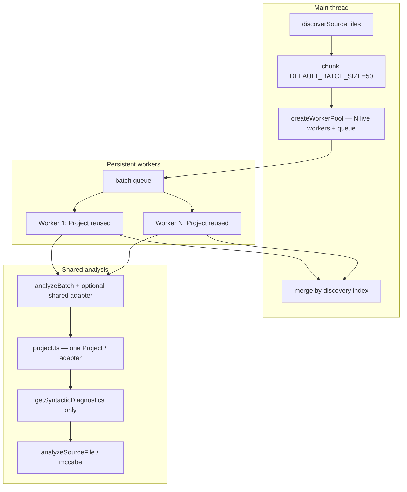

# Milestone 31 — Persistent AST Workers Design

**Spec**: [`.specs/features/persistent-ast-workers/spec.md`](./spec.md)  
**Status**: Approved for planning (Tasks → Status `Planned`)  
**Sisters**: [ast-parallelization/design.md](../ast-parallelization/design.md) (M15), [perf-diagnostics-ux/design.md](../perf-diagnostics-ux/design.md) (M28 concurrency wiring)

---

## Architecture Overview

M31 changes **only** how the complexity worker pool and ts-morph `Project` lifecycle work. Discovery, batch size (50), merge/reorder, McCabe, CLI `--concurrency`, and scan orchestration stay as today.

**Today (M15):** each batch → `new Worker(workerData)` → worker runs `analyzeBatch` once → exit; each `loadBatch` → `new Project()`.

**Target (M31):** spawn ≤ `concurrency` long-lived workers → message queue of batches → each worker reuses one `TsMorphProjectAdapter` / `Project` across batches (clearing source files between batches) → terminate workers when `runBatches` finishes. Inline path (`concurrency === 1`) never spawns workers but still reuses one Project across the sequential batch loop.



**Baseline constraints (locked):**

- Rankings / formulas / JSON `"1.0"` unchanged
- No historical AST
- `--concurrency` semantics unchanged (CLI > config > `DEFAULT_WORKER_CONCURRENCY`)
- Gate: `pnpm build && pnpm test`; timing manual in `scripts/benchmark-scan.md`

---

## Code Reuse Analysis

### Existing Components to Leverage

| Component                         | Location                                         | How to Use                                                                    |
| --------------------------------- | ------------------------------------------------ | ----------------------------------------------------------------------------- |
| `createWorkerPool` / `WorkerPool` | `src/complexity/pool.ts`                         | Replace spawn-per-batch with persistent pool; keep public options shape       |
| `analyzeBatch`                    | `src/complexity/analyze-batch.ts`                | Accept optional shared `TsMorphProjectAdapter`; keep warn-skip contract       |
| `createTsMorphProject`            | `src/complexity/project.ts`                      | Hold one `Project` for adapter lifetime; clear files between `loadBatch`      |
| Syntactic diagnostics             | `project.ts` (already `getSyntacticDiagnostics`) | **Lock** — do not regress to pre-emit/semantic                                |
| `worker.ts`                       | `src/complexity/worker.ts`                       | Replace one-shot `workerData` script with message loop                        |
| `createComplexityAnalyzer`        | `src/complexity/index.ts`                        | Prefer **no API change**; still `poolFactory({ concurrency })` + `runBatches` |
| Injectable deps                   | `ComplexityAnalyzerDependencies`                 | Preserve `createWorkerPool` + `concurrency` seams                             |
| McCabe fixtures                   | `tests/fixtures/complexity/`                     | Regression gate — expected values unchanged                                   |
| Pool / index tests                | `pool.test.ts`, `index.test.ts`                  | Update for persistent protocol; add reuse + equivalence cases                 |
| M28 concurrency wiring            | `bin/`, `src/config/`, `src/scan.ts`             | **Do not modify** unless a regression forces a one-line fix                   |

### Integration Points

| System              | Integration Method                                                                              |
| ------------------- | ----------------------------------------------------------------------------------------------- |
| `src/scan.ts`       | Unchanged — still passes merged `concurrency` into analyzer                                     |
| CLI `--concurrency` | Unchanged — M28                                                                                 |
| `ts-morph`          | Still only inside `src/complexity/` ([INTEGRATIONS.md](../../codebase/INTEGRATIONS.md))         |
| `worker_threads`    | Same module boundary; protocol changes from `workerData`-once to `parentPort` messages          |
| Coverage            | Keep `src/complexity/worker.ts` in `coverage.exclude` ([TESTING.md](../../codebase/TESTING.md)) |

### Fragile areas (CONCERNS)

| Concern                           | Design mitigation                                                                                           |
| --------------------------------- | ----------------------------------------------------------------------------------------------------------- |
| RT-001 memory (N workers × batch) | Cap concurrency unchanged; **remove** prior `SourceFile`s between batches so reuse does not accumulate heap |
| RT-005 McCabe drift               | Do not edit `mccabe.ts`; fixtures must pass; diagnostics change is syntactic-only gating                    |
| RT-002 parse skip                 | Same `PARSE_FAILED` warning construction in `analyze-batch.ts`                                              |
| Worker ESM path                   | Reuse `defaultWorkerScript()` resolution from M15                                                           |

---

## Design Decisions

| #   | Decision                                                                                | Rationale                                                                     |
| --- | --------------------------------------------------------------------------------------- | ----------------------------------------------------------------------------- |
| D1  | Persistent pool: spawn `min(concurrency, batches.length)` workers once per `runBatches` | Avoids per-batch cold start; never more workers than work                     |
| D2  | Message protocol over `workerData`-only                                                 | Enables multiple batches per worker lifetime                                  |
| D3  | One `Project` per adapter; clear source files between `loadBatch`                       | Cold-start win without unbounded heap (preserves M3 batch memory intent)      |
| D4  | `analyzeBatch(input, project?)` optional shared adapter                                 | Worker + inline reuse; unit call sites stay simple                            |
| D5  | Keep syntactic diagnostics only                                                         | Already present; lock against semantic/pre-emit regression (ROADMAP / RT-005) |
| D6  | Inline when `concurrency === 1` (no `Worker`)                                           | Preserve M15 D6 + deterministic tests                                         |
| D7  | Terminate all workers at end of `runBatches` (success or failure)                       | No leaked threads across scans                                                |
| D8  | No `index.ts` public contract change                                                    | YAGNI; orchestration already correct                                          |
| D9  | If a worker receives a different `repoPath`, recreate adapter                           | Defensive; production scan always one repo                                    |

---

## Components

### Project adapter (`src/complexity/project.ts`)

- **Purpose**: Own one ts-morph `Project` for the adapter lifetime; load batches with syntactic-only parse gating; release prior files between batches.
- **Interfaces** (evolve):

```ts
export interface TsMorphProjectAdapter {
  loadBatch(paths: string[]): Promise<SourceFile[]>;
  getParseFailures(): ParseFailure[];
}

export function createTsMorphProject(
  options: TsMorphProjectOptions,
): TsMorphProjectAdapter;
```

- **Behavior**:
  1. Construct `new Project({ compilerOptions: { allowJs: true }, skipAddingFilesFromTsConfig: true })` **once** in the factory (not inside each `loadBatch`).
  2. At start of `loadBatch`: reset `parseFailures`; remove all existing project source files (or remove only those added by prior batches — prefer clear-all for simplicity).
  3. For each path: `addSourceFileAtPath` → on success, `getProgram().getSyntacticDiagnostics(sourceFile)` → non-empty → parse failure + skip; else keep.
  4. **Forbidden:** `getPreEmitDiagnostics`, `getSemanticDiagnostics`, or whole-program semantic checks for gating.
- **Reuses**: Existing failure recording and relative-path handling.

### Batch analysis (`src/complexity/analyze-batch.ts`)

- **Purpose**: Shared analysis for inline + worker paths.
- **Interfaces**:

```ts
export async function analyzeBatch(
  input: BatchAnalysisInput,
  project?: TsMorphProjectAdapter,
): Promise<BatchAnalysisOutput>;
```

- **Behavior**: `const adapter = project ?? createTsMorphProject({ repoPath })`; then existing load → `analyzeSourceFile` → collect `PARSE_FAILED` warnings.
- **Reuses**: Current warning helper and path normalization.

### Persistent worker (`src/complexity/worker.ts`)

- **Purpose**: Long-lived thread entry; process batch messages until shutdown.
- **Protocol** (illustrative — implementer may use equivalent field names):

```ts
// Main → Worker
type WorkerInbound =
  | { type: "analyze"; id: number; repoPath: string; batch: string[] }
  | { type: "shutdown" };

// Worker → Main
type WorkerOutbound =
  | { type: "result"; id: number; ok: true; output: BatchAnalysisOutput }
  | { type: "result"; id: number; ok: false; error: string };
```

- **Behavior**:
  1. On first `analyze` (or when `repoPath` changes): `createTsMorphProject({ repoPath })`.
  2. `await analyzeBatch({ repoPath, batch }, adapter)` → post `result`.
  3. On `shutdown`: exit cleanly (`process.exit(0)` or allow parent `worker.terminate()`).
- **Note**: Drop one-shot `workerData` as the sole input path. Optional: ignore empty `workerData` or use it only for script bootstrap.
- **Coverage**: Remains excluded from Vitest coverage (exercise via `pool.test.ts` with real workers).

### Persistent pool (`src/complexity/pool.ts`)

- **Purpose**: Bounded concurrency with **live** workers + batch queue.
- **Public API** (keep):

```ts
export interface WorkerPool {
  runBatches(
    repoPath: string,
    batches: string[][],
  ): Promise<BatchAnalysisOutput[]>;
}

export function createWorkerPool(options: WorkerPoolOptions): WorkerPool;
```

- **Dispatch algorithm**:
  1. Empty batches → `[]`.
  2. `concurrency === 1` → create **one** `createTsMorphProject({ repoPath })`; sequentially `analyzeBatch(..., project)` for each batch; return (no `Worker`).
  3. Else: spawn `workerCount = min(concurrency, batches.length)` workers via existing `defaultWorkerScript()`.
  4. Maintain `nextIndex`, results array aligned to batch order, free-worker set / in-flight map keyed by message `id`.
  5. Assign next pending batch to a free worker (`postMessage` analyze).
  6. On success: store at index; if more batches, reuse same worker; else mark free / idle.
  7. On failure: set rejected; terminate all workers; reject with enriched error (`repoPath`, batch paths).
  8. On all done: send shutdown and/or `terminate()` all workers; resolve results.
- **Reuses**: Error enrichment style from current `runBatchInWorker`; `WorkerPoolOptions.workerScript` for tests.

### Orchestrator (`src/complexity/index.ts`)

- **Purpose**: Unchanged flow — discover → chunk → `effectiveConcurrency` (force 1 when ≤1 batch) → `pool.runBatches` → merge.
- **Expected diff**: None required if pool/project/worker absorb the feature. Touch only if exports or tests need a re-export.

---

## Data Models

No domain JSON / `ScanResult` schema changes. Internal message types only (see worker protocol above).

---

## Error Handling Strategy

| Error scenario         | Handling                                                  | User impact                       |
| ---------------------- | --------------------------------------------------------- | --------------------------------- |
| Worker analyze throws  | Post `{ ok: false, error }`; pool rejects `runBatches`    | Scan fails non-zero (same as M15) |
| Worker unexpected exit | Treat as failure; terminate siblings; reject with context | Same                              |
| Parse failure in file  | Warn-skip inside batch; worker stays alive                | Partial results + `PARSE_FAILED`  |
| Inline path throw      | Propagate from `analyzeBatch`                             | Same as today                     |
| Pool reject mid-flight | Terminate remaining workers before reject                 | No leak                           |

---

## Testing Strategy

| Layer                | Approach                                                                                                                                                                   |
| -------------------- | -------------------------------------------------------------------------------------------------------------------------------------------------------------------------- |
| Project unit         | Reuse across two `loadBatch` calls; files from batch1 not retained; syntactic path locked (spy optional); invalid syntax still fails                                       |
| Pool unit            | `concurrency === 1` no spawn; multi-batch with real workers — worker construct count ≤ concurrency; result order; error enrichment; post-run no live workers (best-effort) |
| Analyzer equivalence | Multi-batch temp repo: `concurrency: 1` vs `>1` deep-equal                                                                                                                 |
| McCabe               | Existing fixtures — zero expected-value changes                                                                                                                            |
| Integration          | `small-ts` / existing scan integration — rankings unchanged                                                                                                                |
| Mock boundary        | Injected `createWorkerPool` still works for `index` tests                                                                                                                  |

**Gate commands:** per-task Vitest path gates; final `pnpm build && pnpm test`.

---

## Risks

| Risk                                                 | Likelihood | Impact | Mitigation                                                     |
| ---------------------------------------------------- | ---------- | ------ | -------------------------------------------------------------- |
| Project reuse retains SourceFiles → OOM              | Medium     | High   | Explicit remove between batches; keep batch size 50            |
| Message-id races / wrong result slot                 | Medium     | High   | Monotonic `id` + results\[batchIndex\]; unit tests             |
| Worker terminate races on reject                     | Medium     | Medium | `rejected` flag + terminate-all; ignore late messages          |
| Syntactic-only misses some “parse” cases vs old path | Low        | Medium | Current code already syntactic; fixtures + parse-failure tests |
| Flaky real-worker tests                              | Medium     | Low    | Prefer deterministic asserts (order, counts); no wall-clock    |
| Accidental `mccabe.ts` edit                          | Low        | High   | Spec forbids; tasks call out RT-005                            |

---

## Documentation Sync Targets (Execute docs task)

| File                                                                        | Update                                                                                    |
| --------------------------------------------------------------------------- | ----------------------------------------------------------------------------------------- |
| [scripts/benchmark-scan.md](../../../scripts/benchmark-scan.md)             | M31 section: persistent pool + Project reuse; compare wall time; note `--concurrency`     |
| [ARCHITECTURE.md](../../codebase/ARCHITECTURE.md)                           | § Complexity stage parallelism — persistent workers, Project reuse, syntactic diagnostics |
| [CONCERNS.md](../../codebase/CONCERNS.md)                                   | § Performance RT-001 — replace “fresh Project per batch” wording                          |
| [ROADMAP.md](../../project/ROADMAP.md) / [STATE.md](../../project/STATE.md) | **Deferred to parent agent** (do not edit in planning or unless parent assigns)           |

---

## Out of Scope (design boundary)

- Changing `DEFAULT_BATCH_SIZE` or default concurrency formula
- CLI/config surface for concurrency
- Pipeline overlap (M34), coupling aggregate (M32), static enrich cache (M33)
- Historical AST
- CI performance thresholds
- Editing `mccabe.ts` decision nodes
