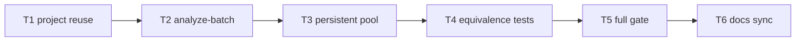

# Milestone 31 — Persistent AST Workers Tasks

**Design**: [`.specs/features/persistent-ast-workers/design.md`](./design.md)  
**Spec**: [`.specs/features/persistent-ast-workers/spec.md`](./spec.md)  
**Status**: Planned

---

## Execution Plan

### Phase 1: Project reuse + syntactic diagnostics (Sequential)

```
T1 project.ts reuse + clear between batches + project tests
```

### Phase 2: analyzeBatch shared adapter (Sequential)

```
T1 → T2 analyze-batch optional project + tests
```

### Phase 3: Persistent worker + pool (Sequential)

```
T2 → T3 worker message loop + pool persistent queue + pool tests
```

### Phase 4: Equivalence + analyzer regression (Sequential)

```
T3 → T4 index/pool equivalence + parse-failure + McCabe gate
```

### Phase 5: Full quality gate (Sequential)

```
T4 → T5 pnpm build && pnpm test
```

### Phase 6: Docs (Sequential)

```
T5 → T6 benchmark-scan.md + ARCHITECTURE + CONCERNS
```



### Diagram-Definition Cross-Check

| Task | Depends on (body) | Diagram shows | Status |
| ---- | ----------------- | ------------- | ------ |
| T1 | None | Root | ✅ Match |
| T2 | T1 | T1 → T2 | ✅ Match |
| T3 | T2 | T2 → T3 | ✅ Match |
| T4 | T3 | T3 → T4 | ✅ Match |
| T5 | T4 | T4 → T5 | ✅ Match |
| T6 | T5 | T5 → T6 | ✅ Match |

### Path Conflict Check (Check 5)

| Task | Module owner | Paths | Conflict |
| ---- | ------------ | ----- | -------- |
| T1 | `src/complexity/` | `project.ts`, `project.test.ts` | Sole owner |
| T2 | `src/complexity/` | `analyze-batch.ts` (+ co-located test if added/updated) | After T1 — sequential |
| T3 | `src/complexity/` | `worker.ts`, `pool.ts`, `pool.test.ts` | After T2 — sequential (shared batch API) |
| T4 | `src/complexity/` | `index.test.ts`, `pool.test.ts` (extend), optionally `index.ts` only if needed | After T3 — sequential |
| T5 | repo gate | none (run only) | After T4 |
| T6 | docs | `scripts/benchmark-scan.md`, `.specs/codebase/ARCHITECTURE.md`, `.specs/codebase/CONCERNS.md` | After T5 — no `src/` overlap |

**Verdict:** All implementation tasks sequential under `src/complexity/` — **no `[P]`**. Docs after gate.

### Test Co-location Validation

| Task | Code layer | TESTING.md / practice | Task `Tests` | Status |
| ---- | ---------- | --------------------- | ------------ | ------ |
| T1 | `src/complexity/project.ts` | unit required | unit (`project.test.ts`) | ✅ OK |
| T2 | `src/complexity/analyze-batch.ts` | unit required | unit (extend/add analyze-batch or project/index coverage of shared adapter) | ✅ OK |
| T3 | `src/complexity/pool.ts` (+ worker via pool) | unit required; `worker.ts` coverage-excluded | unit (`pool.test.ts`) | ✅ OK |
| T4 | `src/complexity/index.ts` / pool equivalence | unit + complexity fixtures | unit (`index.test.ts` / pool) | ✅ OK |
| T5 | full project | full gate | `pnpm build && pnpm test` | ✅ OK |
| T6 | docs only | none for docs | none + already gated by T5 | ✅ OK |

### Granularity Check

| Task | Scope | Status |
| ---- | ----- | ------ |
| T1 | One module (`project` + tests) | ✅ Granular |
| T2 | One module (`analyze-batch` + tests) | ✅ Granular |
| T3 | Pool + worker protocol (cohesive thread boundary) | ✅ Cohesive |
| T4 | Equivalence / regression tests | ✅ Cohesive |
| T5 | Gate only | ✅ Granular |
| T6 | Docs trio listed in ROADMAP | ✅ Cohesive |

### Requirement → Task Mapping

| Requirement ID | Tasks |
| -------------- | ----- |
| HOTSPOT-300 | T3 |
| HOTSPOT-301 | T3 |
| HOTSPOT-302 | T3 |
| HOTSPOT-303 | T1, T2, T3 |
| HOTSPOT-304 | T1 |
| HOTSPOT-305 | T1 |
| HOTSPOT-306 | T4 |
| HOTSPOT-307 | T3 |
| HOTSPOT-308 | T4 (regression; no bin/config edits) |
| HOTSPOT-309 | T4 |
| HOTSPOT-310 | T2, T4 |
| HOTSPOT-311 | T3, T4 |
| HOTSPOT-312 | T6 |
| HOTSPOT-313 | T6 |

**Unused IDs (reserved):** HOTSPOT-314 … HOTSPOT-319

---

## Task Breakdown

### T1: Reuse Project across loadBatch + lock syntactic diagnostics

**What**: Change `createTsMorphProject` so the underlying ts-morph `Project` is created once per adapter. Each `loadBatch` clears prior source files, then loads paths using **only** `getProgram().getSyntacticDiagnostics(sourceFile)` for parse gating (no semantic/pre-emit). Update `project.test.ts` for multi-batch reuse and heap-bound clearing.

**Where**: `src/complexity/project.ts`, `src/complexity/project.test.ts`

**Depends on**: None

**Reuses**: [design.md](./design.md) § Project adapter, D3, D5; existing parse-failure recording

**Requirement**: HOTSPOT-303, HOTSPOT-304, HOTSPOT-305

**Module owner**: `src/complexity/`

**Tools**:

- MCP: NONE
- Skill: `vitals-pipeline-domain`, `coding-guidelines`

**Done when**:

- [ ] Adapter constructs one `Project` for its lifetime (not `new Project()` inside every `loadBatch`)
- [ ] Second `loadBatch` on same adapter succeeds; prior batch files are not retained as live project source files
- [ ] Parse gating uses syntactic diagnostics only
- [ ] Invalid syntax / missing file still produce `ParseFailure` entries
- [ ] Gate check passes: `pnpm exec vitest run src/complexity/project.test.ts`
- [ ] Per-file coverage thresholds for `project.ts` still met

**Tests**: unit  
**Gate**: `pnpm exec vitest run src/complexity/project.test.ts`

**Verify**: Two-batch temp repo through one adapter; invalid file skipped; no `getPreEmitDiagnostics` / `getSemanticDiagnostics` in `project.ts`.

**Commit** (propose only): `perf(complexity): reuse ts-morph Project across batches`

---

### T2: analyzeBatch accepts shared Project adapter

**What**: Extend `analyzeBatch` to accept an optional `TsMorphProjectAdapter`. When provided, reuse it; when omitted, create via `createTsMorphProject` (one-shot). Preserve `PARSE_FAILED` warning format/severity. Add/extend unit coverage proving shared-adapter multi-batch analysis.

**Where**: `src/complexity/analyze-batch.ts`, and co-located test (`analyze-batch` coverage via new `analyze-batch.test.ts` **or** extend `project.test.ts` / existing complexity tests — prefer `src/complexity/analyze-batch.test.ts` if none exists)

**Depends on**: T1

**Reuses**: [design.md](./design.md) § Batch analysis, D4; current warning helper

**Requirement**: HOTSPOT-303, HOTSPOT-310

**Module owner**: `src/complexity/`

**Tools**:

- MCP: NONE
- Skill: `vitals-pipeline-domain`, `coding-guidelines`

**Done when**:

- [ ] `analyzeBatch(input, project?)` signature available
- [ ] Shared adapter used for two batches yields correct `results` / `functions` / `warnings`
- [ ] Omitted adapter still works (creates own project)
- [ ] Parse-failure path unchanged (`Failed to parse …` / `PARSE_FAILED`)
- [ ] Gate check passes: targeted Vitest for analyze-batch / related tests
- [ ] No edits to `mccabe.ts`

**Tests**: unit  
**Gate**: `pnpm exec vitest run src/complexity/analyze-batch.test.ts src/complexity/project.test.ts` (adjust to files actually touched)

**Verify**: Shared adapter across two batches; one invalid file → warning + partial results.

**Commit** (propose only): `refactor(complexity): allow shared Project in analyzeBatch`

---

### T3: Persistent worker loop + pool queue

**What**: Replace one-shot `workerData` worker with a persistent message loop (`analyze` / `shutdown`). Rewrite `createWorkerPool` so `concurrency > 1` spawns at most `min(concurrency, batches.length)` live workers, dispatches batches from a queue, reuses each worker’s Project via `analyzeBatch(..., project)`, and terminates all workers when `runBatches` settles. Keep `concurrency === 1` inline (no `Worker`) with **one** shared Project across the sequential loop. Update `pool.test.ts` for spawn-count, ordering, inline path, and error enrichment.

**Where**: `src/complexity/worker.ts`, `src/complexity/pool.ts`, `src/complexity/pool.test.ts`

**Depends on**: T2

**Reuses**: [design.md](./design.md) § Persistent worker / pool, D1, D2, D6, D7; `defaultWorkerScript()`; M15 error context style

**Requirement**: HOTSPOT-300, HOTSPOT-301, HOTSPOT-302, HOTSPOT-307, HOTSPOT-311

**Module owner**: `src/complexity/`

**Tools**:

- MCP: NONE
- Skill: `vitals-pipeline-domain`, `coding-guidelines`, `vitals-cli-validation` (only if validating scan smoke)

**Done when**:

- [ ] Multi-batch `concurrency > 1` does not call `new Worker()` once per batch (≤ concurrency workers for the call)
- [ ] Results array aligned to input batch order
- [ ] `concurrency === 1` never spawns `Worker` and reuses one Project across batches
- [ ] Workers terminated after success and after rejection (no intentional leak)
- [ ] Worker errors reject with `repoPath` + batch context
- [ ] Empty batches → `[]` without spawn
- [ ] `pool.test.ts` covers above; `worker.ts` remains coverage-excluded
- [ ] Gate check passes: `pnpm exec vitest run src/complexity/pool.test.ts`

**Tests**: unit  
**Gate**: `pnpm exec vitest run src/complexity/pool.test.ts`

**Verify**: Temp repo with ≥3 batches, concurrency 2 — order stable; concurrency 1 — no worker script needed; bad `workerScript` still enriched error.

**Commit** (propose only): `perf(complexity): persistent AST worker pool`

---

### T4: Output equivalence + McCabe / concurrency regression

**What**: Ensure analyzer output equivalence between inline (`concurrency: 1`) and persistent workers (`concurrency ≥ 2`) on a multi-batch temp repo. Confirm parse-failure collection across batches. Confirm existing McCabe fixtures and M28 concurrency wiring tests still pass (no bin/config changes unless a proven break). Touch `index.ts` only if a minimal fix is required for pool factory usage (prefer zero change).

**Where**: `src/complexity/index.test.ts`, `src/complexity/pool.test.ts` (extend as needed); `src/complexity/index.ts` only if required; do **not** edit `mccabe.ts`

**Depends on**: T3

**Reuses**: M15 equivalence approach; [TESTING.md](../../codebase/TESTING.md) mock boundary; fixtures under `tests/fixtures/complexity/`

**Requirement**: HOTSPOT-306, HOTSPOT-308, HOTSPOT-309, HOTSPOT-310, HOTSPOT-311

**Module owner**: `src/complexity/`

**Tools**:

- MCP: NONE
- Skill: `vitals-pipeline-domain`, `coding-guidelines`

**Done when**:

- [ ] Equivalence test: deep-equal `results` / `functions` / `warnings` for concurrency 1 vs ≥2
- [ ] Discovery-order merge behavior unchanged
- [ ] McCabe fixture expectations unchanged (existing tests green)
- [ ] Injectable `createWorkerPool` / `concurrency` deps still work
- [ ] No JSON schema / version `"1.0"` changes
- [ ] Gate check passes: `pnpm exec vitest run src/complexity/`

**Tests**: unit  
**Gate**: `pnpm exec vitest run src/complexity/`

**Verify**: Multi-batch temp repo equivalence; `pnpm exec vitest run src/complexity/mccabe.test.ts` green without fixture edits.

**Commit** (propose only): `test(complexity): equivalence for persistent AST workers`

---

### T5: Full project quality gate

**What**: Run the mandatory project gate. Fix only regressions caused by T1–T4 (no scope expansion).

**Where**: repo root (no intentional source edits)

**Depends on**: T4

**Reuses**: [TESTING.md](../../codebase/TESTING.md) § Coverage; AGENTS.md quality gate

**Requirement**: (gate for HOTSPOT-300–311)

**Module owner**: n/a (verification)

**Tools**:

- MCP: NONE
- Skill: none (or invoke `verifier-quality-gates` in Execute session)

**Done when**:

- [ ] `pnpm build && pnpm test` exits 0
- [ ] Per-file coverage thresholds met for all included files touched by this feature
- [ ] No silent test deletions / weakened assertions

**Tests**: full suite  
**Gate**: `pnpm build && pnpm test`

**Verify**: Gate command green once.

**Commit** (propose only): omit if no code changes; otherwise `test: green gate after persistent AST workers`

---

### T6: Benchmark + ARCHITECTURE + CONCERNS sync

**What**: Document M31 persistent workers and Project reuse. Update manual benchmark notes. Update ARCHITECTURE complexity parallelism section and CONCERNS Performance RT-001 notes (syntactic diagnostics + reuse). **Do not** edit `ROADMAP.md` / `STATE.md` (parent syncs).

**Where**: `scripts/benchmark-scan.md`, `.specs/codebase/ARCHITECTURE.md`, `.specs/codebase/CONCERNS.md`

**Depends on**: T5

**Reuses**: [design.md](./design.md) § Documentation Sync Targets; existing M15 benchmark section as template

**Requirement**: HOTSPOT-312, HOTSPOT-313

**Module owner**: docs

**Tools**:

- MCP: NONE
- Skill: none

**Done when**:

- [ ] `scripts/benchmark-scan.md` has an M31 section (persistent pool, Project reuse, qualitative timing, `--concurrency` note)
- [ ] ARCHITECTURE § Complexity stage parallelism no longer claims “fresh Project per batch” / “new Worker per batch” as current behavior
- [ ] CONCERNS § Performance reflects persistent workers + Project reuse + syntactic diagnostics
- [ ] No `src/` / `bin/` / `tests/` changes in this task
- [ ] Re-run gate if desired: `pnpm build && pnpm test` (docs-only should already be green)

**Tests**: none  
**Gate**: `pnpm build && pnpm test` (confirm still green after doc-only edits)

**Verify**: Grep docs for “persistent” / M31; confirm outdated “per batch” worker/Project wording removed or historically framed.

**Commit** (propose only): `docs: record M31 persistent AST workers`

---

## Parallel Execution Map

```
Phase 1–6 (all sequential — shared src/complexity ownership):

T1 → T2 → T3 → T4 → T5 → T6
```

**No `[P]` tasks** — Check 5 path conflict: all code tasks own overlapping `src/complexity/` surfaces.

---

## Handoff

- **Status**: `Planned` (planning session complete)
- **Next**: User/parent promotes Status to `Approved` or `Ready for Execute`
- **Execute**: New session → `orchestrator-implementer` (phases A→F)
- **Final gate**: `pnpm build && pnpm test`
- **ROADMAP / STATE sync**: Deferred to parent agent
