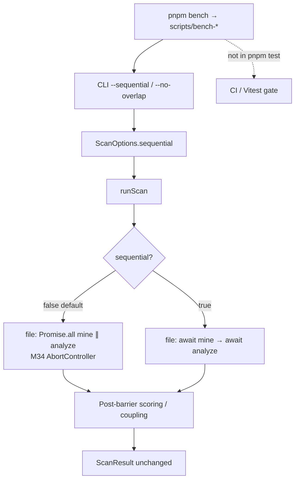

# Milestone 49 — Pipeline Perf Controls Design

**Spec**: [`.specs/features/pipeline-perf-controls/spec.md`](./spec.md)  
**Context**: [`.specs/features/pipeline-perf-controls/context.md`](./context.md)  
**Status**: Draft (planning) → Approved at Execute promotion

---

## Architecture Overview

M49 is a thin **orchestration + CLI + tooling** change. Domain modules (git, complexity, scoring) stay unchanged. The only pipeline behavioral fork is whether file-mode starts mine and analyze concurrently.



**Fragile areas (CONCERNS):** `src/scan.ts` stage order — preserve M34 overlap cancel path when sequential is off; do not weaken streaming or worker abort tests; no wall-clock asserts in Vitest.

---

## Code Reuse Analysis

### Existing Components to Leverage

| Component | Location | How to Use |
| --------- | -------- | ---------- |
| Overlap orchestrator | `src/scan.ts` | Branch on `options.sequential` before starting stages |
| `ScanOptions` | `src/types/domain.ts` | Add optional `sequential?: boolean` |
| CLI flag patterns | `bin/hotspot-scanner.ts` | Mirror boolean flags (`--quiet`); help text |
| `buildScanOptions` / `executeScan` | `bin/scan-actions.ts` | Forward `sequential` outside `HotspotScannerConfig` |
| Overlap unit tests | `src/scan.test.ts` | Invert concurrency assertion for sequential; keep overlap tests |
| Integration parity | `src/scan.integration.test.ts` | Compare sequential vs default on `small-ts` |
| Manual bench doc | `scripts/benchmark-scan.md` | Evolve into harness operator guide |
| Complexity concurrency | `--concurrency` / M15–M36 pool | Unchanged; orthogonal to stage overlap |

### Integration Points

| System | Integration Method |
| ------ | ------------------ |
| Commander | `--sequential` + `--no-overlap` on scan / compare / baseline save |
| Config merge | **No** new key; do not add to `HotspotScannerConfig` |
| package.json | Add `"bench"` script only; leave `"test"` without bench |
| JSON schemas | **No change** |

---

## Components

### 1. `ScanOptions.sequential` + `runScan` branch

- **Purpose**: Opt out of file-mode git∥complexity overlap.
- **Location**: `src/types/domain.ts`, `src/scan.ts`
- **Interfaces**:
  - `ScanOptions.sequential?: boolean` — when `true`, file mode runs `await miner.mine(...)` then `await analyzer.analyze(...)` (function-mode allowlist path unchanged in spirit: still git-before-analyze)
  - Default / undefined → existing M34 `AbortController` + `Promise.all` path
- **Dependencies**: Existing miner/analyzer factories
- **Reuses**: Current abort + warning aggregation after both stages settle
- **Tests**: Unit — sequential non-overlap; failure fail-closed; overlap regression

**Normative file-mode sequential sketch:**

```ts
if (options.sequential) {
  const rawGit = await miner.mine({ …, signal? });
  const cxResult = await analyzer.analyze({ …, signal? });
  // then filter / score as today
} else {
  // existing M34 Promise.all + abort sibling path
}
```

Function mode may keep today’s `cxPromise` that awaits `gitPromise` for allowlist; `sequential: true` must not break that path.

### 2. CLI wiring (primary + alias)

- **Purpose**: Expose opt-out on operator commands.
- **Location**: `bin/hotspot-scanner.ts`, `bin/scan-actions.ts`
- **Interfaces**:
  - `.option("--sequential", "…")`
  - `.option("--no-overlap", "Alias for --sequential — disable M34 git∥complexity overlap")`
  - Resolve: `sequential = Boolean(options.sequential || options.noOverlap)` (Commander property names as implemented)
  - Pass into `executeScan` / `buildScanOptions` as `ScanOptions.sequential` — **not** via `HotspotScannerConfig`
- **Dependencies**: Commander
- **Reuses**: `isExplicitCliOption` only if needed; boolean flags typically read directly
- **Tests**: `bin/hotspot-scanner.test.ts` — help strings, forward to `runScan` mock, both flags, function-mode accept

### 3. Benchmark harness

- **Purpose**: Repeatable wall-clock + counts outside Vitest.
- **Location**: `scripts/bench-scan.mjs` (or equivalent), `package.json` `"bench"`, update `scripts/benchmark-scan.md`
- **Interfaces** (suggested CLI for the script):
  - Positional or `--repo <path>` (required or default to generated synthetic under `/tmp` or `os.tmpdir()`)
  - `--sequential` / default overlap; or `--compare-modes` to run both and print two rows
  - Print machine-readable-ish lines: `wall_ms=…`, `commits=…` and/or `files=…` (exact labels documented in markdown)
- **Dependencies**: Built CLI (`pnpm build` prerequisite documented); Node stdlib only preferred
- **Reuses**: Synthetic repo recipe already in `benchmark-scan.md` Option B
- **Tests**: **none in Vitest** — policy HOTSPOT-725; Done when script exists + docs; optional manual smoke in task Verify

### 4. Living docs

- **Purpose**: Discoverability and policy.
- **Location**: `.specs/codebase/ARCHITECTURE.md` (M34 section), `CONCERNS.md` Performance, `TESTING.md` Performance / Pipeline overlap, `scripts/benchmark-scan.md`, brief README Advanced/perf note if ARCHITECTURE already linked
- **Tests**: none (doc checklist)

---

## Data Models

```typescript
// src/types/domain.ts — additive
export interface ScanOptions {
  // …existing fields…
  /**
   * When true, file mode runs git mine then complexity analyze sequentially
   * (disables M34 overlap). CLI: --sequential / --no-overlap. Not a config key.
   */
  sequential?: boolean;
}
```

**Relationships:** Orthogonal to `concurrency` (pool size inside complexity stage).

---

## Error Handling Strategy

| Error Scenario | Handling | User Impact |
| -------------- | -------- | ----------- |
| Git fails under sequential | Rethrow original; no scoring | Non-zero exit; same as today |
| Complexity fails under sequential | Rethrow original; no scoring | Non-zero exit |
| Overlap path failure | Unchanged M34 sibling abort | Unchanged |
| Both CLI flags set | Treat as sequential | No usage error |
| Bench repo missing / git fail | Script non-zero; message clear | Operator fixes path; not CI |

---

## Tech Decisions

| Decision | Choice | Rationale |
| -------- | ------ | --------- |
| Primary flag | `--sequential` | Affirmative stage order; alias keeps M34 wording |
| Config | CLI / `ScanOptions` only | YAGNI; matches quiet/explain class |
| Bench entry | `pnpm bench` | ROADMAP; discoverable |
| Bench vs gate | Separate from `pnpm test` | Existing policy; M51 also excludes timing gates |
| Equivalence | Structural + fixture parity | No flaky wall-clock in CI (TESTING.md M34 precedent) |

---

## Risks

| Risk | Mitigation |
| ---- | ---------- |
| Accidental regression of M34 overlap default | Unit test asserts overlap still concurrent when sequential unset |
| Function-mode allowlist path broken by refactor | Keep function branch; CLI accept test; integration still green |
| Bench script becomes a hidden CI dependency | Explicit docs + package.json: only `"bench"` references script |
| Path conflict on `src/scan.ts` | Single owner task for orchestration branch |

---

## Requirement → Component Mapping

| IDs | Component |
| --- | --------- |
| HOTSPOT-710, 712, 713, 714, 715 | `runScan` + `ScanOptions` |
| HOTSPOT-711, 717, 718 | CLI / scan-actions |
| HOTSPOT-716, 719, 720 | Unit + integration tests |
| HOTSPOT-721–726 | Bench harness + benchmark-scan.md |
| HOTSPOT-727–729 | Living docs + full gate |
