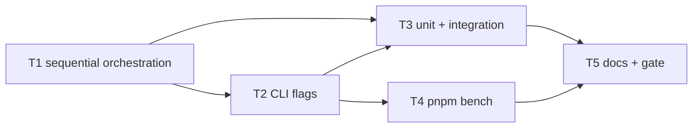

# Milestone 49 — Pipeline Perf Controls Tasks

**Design**: [`.specs/features/pipeline-perf-controls/design.md`](./design.md)  
**Spec**: [`.specs/features/pipeline-perf-controls/spec.md`](./spec.md)  
**Context**: [`.specs/features/pipeline-perf-controls/context.md`](./context.md)  
**Status**: Planned

---

## Execution Plan

```
T1 ScanOptions + runScan sequential ──→ T2 CLI flags
         │                                    │
         └──────────────┬─────────────────────┘
                        │
              ┌─────────┴─────────┐
              ▼                   ▼
         T3 tests [P]        T4 bench [P]
              │                   │
              └─────────┬─────────┘
                        ▼
                   T5 docs + full gate
```



### Diagram-Definition Cross-Check

| Task | Depends on (body) | Diagram shows | Status |
| ---- | ----------------- | ------------- | ------ |
| T1 | None | Root | ✅ Match |
| T2 | T1 | T1→T2 | ✅ Match |
| T3 | T1, T2 | T1→T3, T2→T3 | ✅ Match |
| T4 | T2 | T2→T4 | ✅ Match |
| T5 | T3, T4 | T3→T5, T4→T5 | ✅ Match |

### Path Conflict Check (Check 5)

| Task | Module owner | Paths | Conflict |
| ---- | ------------ | ----- | -------- |
| T1 | `src/scan.ts` + `src/types/` | `domain.ts`, `scan.ts`, `scan.test.ts` (orchestration unit) | Sole owner of sequential branch |
| T2 | `bin/` | `hotspot-scanner.ts`, `scan-actions.ts`, bin tests | After T1; does not edit scan orchestration |
| T3 | `src/` tests | `scan.test.ts` (remaining), `scan.integration.test.ts` | May extend T1 tests; no bin/scripts |
| T4 | `scripts/` + `package.json` | bench script, `benchmark-scan.md`, `"bench"` | Disjoint from T3 `[P]` |
| T5 | docs | ARCHITECTURE, CONCERNS, TESTING, README (brief) | After T3/T4 |

### Test Co-location Validation

| Task | Code layer | Matrix / TESTING.md | Task Tests | Status |
| ---- | ---------- | ------------------- | ---------- | ------ |
| T1 | `src/scan.ts` / types | unit co-located | unit | ✅ OK |
| T2 | `bin/` | CLI Vitest | CLI unit | ✅ OK |
| T3 | scan unit + integration | unit + integration | unit + integration | ✅ OK |
| T4 | scripts / package.json | Performance: manual / not CI | none (policy) | ✅ OK |
| T5 | docs | none | none + full gate | ✅ OK |

### Granularity Check

| Task | Scope | Status |
| ---- | ----- | ------ |
| T1 | One option + orchestration branch + core unit proofs | ✅ Cohesive scan slice |
| T2 | CLI flag pair + forward | ✅ Granular |
| T3 | Structural + fixture parity tests | ✅ Granular |
| T4 | Bench harness + docs for harness | ✅ Cohesive tooling |
| T5 | Living docs + project gate | ✅ Granular |

### Requirement → Task Mapping

| Requirement ID | Task |
| -------------- | ---- |
| HOTSPOT-710 | T1 |
| HOTSPOT-711 | T2 |
| HOTSPOT-712 | T1 |
| HOTSPOT-713 | T1, T2 |
| HOTSPOT-714 | T2, T3 |
| HOTSPOT-715 | T1 |
| HOTSPOT-716 | T3 |
| HOTSPOT-717 | T2 |
| HOTSPOT-718 | T2 |
| HOTSPOT-719 | T1, T3 |
| HOTSPOT-720 | T3 |
| HOTSPOT-721 | T4 |
| HOTSPOT-722 | T4 |
| HOTSPOT-723 | T4 |
| HOTSPOT-724 | T4 |
| HOTSPOT-725 | T4 |
| HOTSPOT-726 | T4 |
| HOTSPOT-727 | T5 |
| HOTSPOT-728 | T5 |
| HOTSPOT-729 | T5 |

**Coverage:** 20/20 mapped, 0 unmapped

---

## Task Breakdown

### T1: `ScanOptions.sequential` + file-mode sequential orchestration

**What**: Add `sequential?: boolean` to `ScanOptions`; when true in file mode, run `await mine` then `await analyze` instead of M34 `Promise.all` overlap; keep default overlap path intact; fail-closed on stage errors; add core unit proofs (non-overlap when sequential; overlap still concurrent when unset; sequential failures).

**Where**: `src/types/domain.ts`, `src/scan.ts`, `src/scan.test.ts`

**Depends on**: None

**Reuses**: Existing M34 abort path (else branch); miner/analyzer factories; delayed-mock overlap tests pattern in `scan.test.ts`

**Requirement**: HOTSPOT-710, HOTSPOT-712, HOTSPOT-713, HOTSPOT-715, HOTSPOT-719

**Tools**:

- MCP: NONE
- Skill: `coding-guidelines`, `vitals-pipeline-domain`, `task-implementer`

**Done when**:

- [ ] `ScanOptions.sequential` documented as CLI/API-only (not a config key)
- [ ] File mode + `sequential: true` → stages not concurrently in-flight (unit assert)
- [ ] File mode + sequential unset → M34 overlap still observed (unit assert)
- [ ] Sequential git or complexity failure rejects without scoring
- [ ] Function-mode path still completes with `sequential: true` (unit or thin integration in T3)
- [ ] Gate check passes: `pnpm exec vitest run src/scan.test.ts`
- [ ] Test count: no silent deletions

**Tests**: unit  
**Gate**: `pnpm exec vitest run src/scan.test.ts`

**Verify**:

```bash
pnpm exec vitest run src/scan.test.ts
```

**Commit**: `feat(scan): add sequential opt-out for M34 stage overlap`

---

### T2: CLI `--sequential` / `--no-overlap` wiring

**What**: Register primary `--sequential` and alias `--no-overlap` on `scan`, `compare`, and `baseline save` (same surface as `--concurrency`); help text documents alias relationship; forward `sequential` into `runScan` via `scan-actions` **outside** `HotspotScannerConfig`.

**Where**: `bin/hotspot-scanner.ts`, `bin/scan-actions.ts`, `bin/hotspot-scanner.test.ts` (+ integration CLI smoke if pattern exists)

**Depends on**: T1

**Reuses**: Boolean option patterns (`--quiet`); `executeScan` / `buildScanOptions` extension for non-config fields

**Requirement**: HOTSPOT-711, HOTSPOT-713, HOTSPOT-714, HOTSPOT-717, HOTSPOT-718

**Tools**:

- MCP: NONE
- Skill: `coding-guidelines`, `vitals-cli-validation`, `task-implementer`

**Done when**:

- [ ] Help lists `--sequential` and `--no-overlap` with alias language
- [ ] Either flag sets `ScanOptions.sequential: true` on mocked `runScan`
- [ ] Both flags together do not throw `CliUsageError`
- [ ] Function-mode CLI with `--sequential` exits 0 on `small-ts` (or unit accepts granularity function)
- [ ] No `sequential` key added to config types / merge
- [ ] Gate check passes: `pnpm exec vitest run bin/hotspot-scanner.test.ts`
- [ ] Test count: no silent deletions

**Tests**: CLI unit  
**Gate**: `pnpm exec vitest run bin/hotspot-scanner.test.ts`

**Verify**:

```bash
pnpm exec vitest run bin/hotspot-scanner.test.ts
pnpm build && pnpm exec hotspot-scanner scan --help | rg "sequential|no-overlap"
```

**Commit**: `feat(cli): add --sequential / --no-overlap for pipeline overlap opt-out`

---

### T3: Equivalence + structural coverage [P]

**What**: Harden unit structural proofs if needed; add file-mode integration parity — default overlap vs `sequential: true` on `tests/fixtures/repos/small-ts` under fixed options (hotspots + coupling order/top entries); confirm function mode accepts sequential without ranking breakage.

**Where**: `src/scan.test.ts`, `src/scan.integration.test.ts`

**Depends on**: T1, T2

**Reuses**: M34 integration describe / expected ranking baselines in `scan.integration.test.ts`

**Requirement**: HOTSPOT-714, HOTSPOT-716, HOTSPOT-719, HOTSPOT-720

**Tools**:

- MCP: NONE
- Skill: `coding-guidelines`, `vitals-pipeline-domain`, `task-implementer`

**Done when**:

- [ ] Integration: sequential vs default file-mode rankings match on `small-ts`
- [ ] Unit: sequential non-overlap + default overlap regression both present
- [ ] Function-mode with sequential completes (exit path / integration)
- [ ] Gate check passes: `pnpm exec vitest run src/scan.test.ts src/scan.integration.test.ts`
- [ ] Test count: no silent deletions

**Tests**: unit + integration  
**Gate**: `pnpm exec vitest run src/scan.test.ts src/scan.integration.test.ts`

**Verify**:

```bash
pnpm exec vitest run src/scan.test.ts src/scan.integration.test.ts
```

**Commit**: `test(scan): prove sequential vs overlap ranking parity`

---

### T4: `pnpm bench` harness + benchmark docs [P]

**What**: Add `scripts/` bench entry (Node stdlib preferred) and `"bench"` script in `package.json`; print wall-clock + counts; support overlap vs `--sequential` A/B; update `scripts/benchmark-scan.md`; ensure `"test"` does not invoke bench and no duration fail policy.

**Where**: `scripts/bench-scan.mjs` (or equivalent), `package.json`, `scripts/benchmark-scan.md`

**Depends on**: T2

**Reuses**: Synthetic repo recipe and metric table from existing `benchmark-scan.md`; built CLI via `pnpm exec hotspot-scanner`

**Requirement**: HOTSPOT-721, HOTSPOT-722, HOTSPOT-723, HOTSPOT-724, HOTSPOT-725, HOTSPOT-726

**Tools**:

- MCP: NONE
- Skill: `coding-guidelines`, `task-implementer`

**Done when**:

- [ ] `pnpm bench` is defined and documented
- [ ] Output includes wall-clock and at least one scale count field
- [ ] A/B (or documented flag) exercises default vs `--sequential`
- [ ] `package.json` `"test"` unchanged regarding bench (no bench dependency)
- [ ] `benchmark-scan.md` states harness is not part of CI / `pnpm test`
- [ ] Gate check: none for timing — verify script exists + `node --check` or dry help; do **not** add Vitest timing tests

**Tests**: none  
**Gate**: `test -f scripts/bench-scan.mjs` (or chosen path) && `node --check <script>` (adjust if TypeScript runner)

**Verify**:

```bash
pnpm build
# Prefer a tiny fixture for smoke — full large-repo optional for operators
pnpm bench -- --repo tests/fixtures/repos/small-ts --since "12 months ago" || true
# Confirm test script has no bench:
node -e "const p=require('./package.json'); if(/bench/.test(p.scripts.test||'')) process.exit(1)"
```

**Commit**: `chore(bench): add pnpm bench harness for scan wall-clock`

---

### T5: Living docs + full project gate

**What**: Sync ARCHITECTURE (M34 section + sequential opt-out), CONCERNS Performance, TESTING (pipeline overlap + performance layers), optional README Advanced one-liner; run full project gate.

**Where**: `.specs/codebase/ARCHITECTURE.md`, `.specs/codebase/CONCERNS.md`, `.specs/codebase/TESTING.md`, `README.md` (brief if needed)

**Depends on**: T3, T4

**Reuses**: Existing M34 doc sections; M15/M31/M36 bench notes stay qualitative

**Requirement**: HOTSPOT-727, HOTSPOT-728, HOTSPOT-729

**Tools**:

- MCP: NONE
- Skill: `coding-guidelines`, `task-implementer`

**Done when**:

- [ ] ARCHITECTURE documents `--sequential` / `--no-overlap` and default overlap
- [ ] CONCERNS + TESTING note sequential opt-out and bench outside Vitest gate
- [ ] Gate check passes: `pnpm build && pnpm test`
- [ ] Test count: no silent deletions vs pre-task baseline

**Tests**: none  
**Gate**: `pnpm build && pnpm test`

**Verify**:

```bash
pnpm build && pnpm test
```

**Commit**: `docs: document sequential overlap opt-out and bench harness`

---

## Parallel Execution Map

```
Phase 1 (Sequential):
  T1 ──→ T2

Phase 2 (Parallel):
  T2 complete, then:
    ├── T3 [P]
    └── T4 [P]

Phase 3 (Sequential):
  T3, T4 complete, then:
    T5
```

**Parallelism notes:** T3 and T4 touch disjoint paths (`src/**` tests vs `scripts/` + `package.json`). T1 must not run in parallel with T2 (shared sequential option contract). No `[P]` on tasks that both edit `src/scan.ts`.

---

## Suggested commit order

1. `feat(scan): add sequential opt-out for M34 stage overlap`
2. `feat(cli): add --sequential / --no-overlap for pipeline overlap opt-out`
3. `test(scan): prove sequential vs overlap ranking parity`
4. `chore(bench): add pnpm bench harness for scan wall-clock`
5. `docs: document sequential overlap opt-out and bench harness`

Propose messages only during Execute unless the user explicitly asks to commit.
