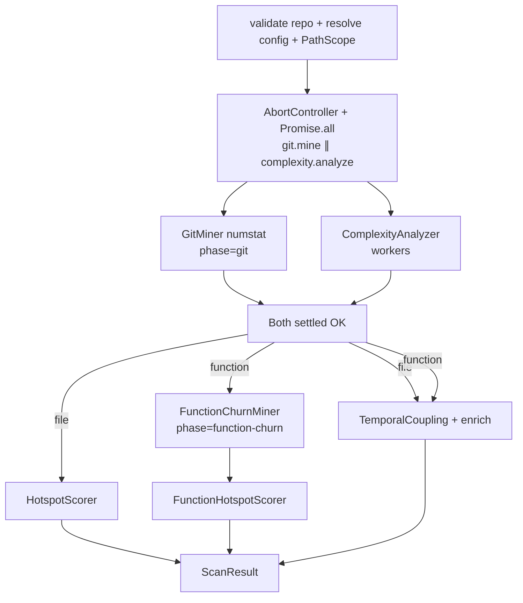

# Milestone 34 — Pipeline Stage Overlap Design

**Spec**: [`.specs/features/pipeline-stage-overlap/spec.md`](./spec.md)  
**Context**: [`.specs/features/pipeline-stage-overlap/context.md`](./context.md)  
**Status**: Draft (planning) → Approved at Execute promotion

---

## Architecture Overview

M34 changes **orchestration timing** in `runScan()` only: the first two pipeline stages become concurrent. Domain modules keep the same outputs. Abort plumbing is a thin, optional `AbortSignal` on existing git spawn and complexity pool adapters so the orchestrator can cancel a sibling on failure.



**Failure path:** first rejection → `controller.abort()` → sibling best-effort stop → await sibling settle → rethrow original error → no scoring.

**Fragile areas (CONCERNS):** `src/scan.ts` stage order; git streaming must remain line-by-line; complexity workers must not leak on abort; do not touch scoring formulas or function-churn∥numstat.

---

## Code Reuse Analysis

### Existing Components to Leverage

| Component                                       | Location                          | How to Use                                                                         |
| ----------------------------------------------- | --------------------------------- | ---------------------------------------------------------------------------------- |
| `runScan` orchestration                         | `src/scan.ts`                     | Replace sequential `await mine` → `await analyze` with overlapping start + barrier |
| `createGitMiner` / `streamGitLog`               | `src/git/`                        | Add optional `signal`; kill child on abort                                         |
| `createComplexityAnalyzer` / `createWorkerPool` | `src/complexity/`                 | Add optional `signal`; terminate workers / stop scheduling                         |
| `createFunctionChurnMiner`                      | `src/git/function-churn/`         | **Unchanged** — still after complexity only                                        |
| Progress / warnings                             | M28 `ScanProgress`, `ScanWarning` | Forward as today; phases unchanged                                                 |
| PathScope / config merge                        | `src/paths/`, `src/config/`       | Unchanged pre-stage setup                                                          |
| Fixture `small-ts`                              | `tests/fixtures/repos/small-ts/`  | Equivalence / integration                                                          |

### Integration Points

| System                             | Integration Method                                                                                       |
| ---------------------------------- | -------------------------------------------------------------------------------------------------------- |
| Git spawn (`child_process`)        | Listen `AbortSignal`; `child.kill()`; end readline; reject or abort-complete without unhandled rejection |
| Complexity pool (`worker_threads`) | On abort: `worker.terminate()` for in-flight; reject pending batch promises consistently                 |
| CLI / reporters                    | No flag changes; errors still throw → non-zero exit                                                      |
| JSON schemas                       | **No change**                                                                                            |

---

## Components

### 1. Git abort plumbing

- **Purpose**: Allow orchestrator to stop an in-flight numstat stream.
- **Location**: `src/git/spawn.ts`, `src/git/index.ts` (options typing)
- **Interfaces**:
  - Extend `GitLogSpawnOptions` / miner options with `signal?: AbortSignal`
  - On `abort`: kill child, stop yielding, settle generator/mine promise (prefer reject with `AbortError` **only when abort was the cause**; if mine already failed for another reason, preserve that)
- **Dependencies**: `node:child_process`
- **Reuses**: Existing `streamGitLog` / `GitLogError` patterns
- **Tests**: Unit in `src/git/spawn.test.ts` — abort mid-stream kills child; no hang

### 2. Complexity abort plumbing

- **Purpose**: Stop worker pool when sibling git fails.
- **Location**: `src/complexity/pool.ts`, `src/complexity/index.ts`
- **Interfaces**:
  - `analyze({ …, signal?: AbortSignal })` and/or pool `run(…, signal?)`
  - On abort: terminate workers; fail fast remaining batches; no new schedules
- **Dependencies**: `worker_threads`
- **Reuses**: M15 pool lifecycle
- **Tests**: Unit — abort stops further batches; in-flight terminate invoked

### 3. Overlap orchestrator (`runScan`)

- **Purpose**: Concurrent git ∥ complexity with barriers and cancel.
- **Location**: `src/scan.ts` (prefer keep helper private in-file unless file grows past clarity — YAGNI no new package)
- **Algorithm** (normative):

```ts
const ac = new AbortController();
const signal = ac.signal;

const gitPromise = miner.mine({ …, signal, onProgress });
const cxPromise = analyzer.analyze({ …, signal });

let gitResult, cxResult;
try {
  [gitResult, cxResult] = await Promise.all([gitPromise, cxPromise]);
} catch (err) {
  ac.abort();
  await Promise.allSettled([gitPromise, cxPromise]);
  throw err; // original
}

// filter git → collect warnings from both (deterministic order)
// then file scoring OR function-churn → function scoring; coupling after git OK
```

- **Warning order (locked for tests):** After both succeed: forward/aggregate **git warnings first**, then **complexity warnings** (matches prior sequential observable order). Function-churn warnings still after churn stage.
- **Dependencies**: Git + complexity abort support
- **Reuses**: `filterGitMinerResult`, `forwardWarnings`, scorers, enricher

### 4. Tests

- **Unit (`src/scan.test.ts`)**: Mock boundaries — inject delayed `mine`/`analyze` to assert overlap; reject paths assert abort + original error; function mode asserts churn starts only after complexity resolves and not overlapping numstat.
- **Integration (`src/scan.integration.test.ts`)**: File + function fixture scans; ranking smoke / stable tops; file mode no patch spawn (existing assertion patterns).
- **Adapter unit**: spawn/pool abort coverage.

### 5. Documentation

- **ARCHITECTURE** § Data flow step 3: sequential → overlap note + barriers
- **CONCERNS** § Performance: peak RSS trade-off
- **TESTING** (light): note overlap unit strategy (structural, not wall-clock)

---

## Data Models

No new public domain types. Optional:

```ts
// Git / Complexity option bags only
signal?: AbortSignal;
```

`ScanProgressPhase` remains `"git" | "function-churn"`.  
`ScanResult` / schemas unchanged.

---

## Error Handling Strategy

| Error Scenario                      | Handling                                                          | User Impact                |
| ----------------------------------- | ----------------------------------------------------------------- | -------------------------- |
| Git fails mid-overlap               | Abort complexity; await settle; throw `GitLogError` (or existing) | Non-zero exit; no rankings |
| Complexity fails mid-overlap        | Abort git; await settle; throw analyzer error                     | Non-zero exit; no rankings |
| Abort races natural completion      | Discard sibling success if peer failed                            | No partial `ScanResult`    |
| Pre-stage validation fails          | Unchanged — no overlap started                                    | Same as today              |
| Function-churn fails (post-barrier) | Unchanged sequential throw; git/complexity already done           | Non-zero exit              |

---

## Tech Decisions

| #   | Decision          | Choice                                             | Rationale                                              |
| --- | ----------------- | -------------------------------------------------- | ------------------------------------------------------ |
| D1  | Overlap pair      | numstat ∥ complexity only                          | User/ROADMAP locked                                    |
| D2  | Function-churn    | After complexity; never ∥ numstat                  | Ranges + rename complexity                             |
| D3  | Cancel mechanism  | Orchestrator `AbortController` + optional `signal` | Coherent cancel without CLI cancel API                 |
| D4  | Progress          | Phases unchanged                                   | M28 contract; ROADMAP allowed unchanged                |
| D5  | Warning order     | Git then complexity after both OK                  | Preserve sequential observability for tests            |
| D6  | Equivalence proof | Fixture semantics + structural unit overlap        | Avoid flaky timing CI                                  |
| D7  | Module surface    | Prefer in-`scan.ts` helper; abort in adapters      | YAGNI; Path Conflict: git vs complexity vs scan owners |
| D8  | Rankings/JSON     | Unchanged                                          | Locked                                                 |

---

## Risks (from CONCERNS)

| Risk                                | Mitigation                                         |
| ----------------------------------- | -------------------------------------------------- |
| Peak memory (RT-001)                | Document; keep streaming; abort sibling on failure |
| Orphan workers / git child          | Abort plumbing + `allSettled` after abort          |
| Ranking drift                       | Equivalence tests; no scoring changes              |
| Fragile `scan.ts` order             | Integration + unit ordering tests before Complete  |
| Accidental function-churn ∥ numstat | Explicit barrier + test asserting call order       |

---

## Out of Scope (design)

- AbortSignal on `FunctionChurnMiner` for M34 sibling-cancel (not overlapping with numstat; optional follow-up if useful for SIGINT later)
- Changing `DEFAULT_WORKER_CONCURRENCY` or discovery (M36)
- Patch-stream pathspec limits (M35)
