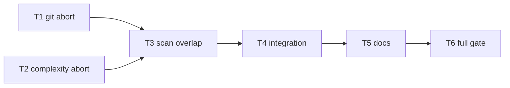

# Milestone 34 — Pipeline Stage Overlap Tasks

**Design**: [`.specs/features/pipeline-stage-overlap/design.md`](./design.md)  
**Spec**: [`.specs/features/pipeline-stage-overlap/spec.md`](./spec.md)  
**Context**: [`.specs/features/pipeline-stage-overlap/context.md`](./context.md)  
**Status**: Planned

---

## Execution Plan

### Phase 1: Abort plumbing (Parallel OK)

```
T1 [P] git spawn/mine AbortSignal
T2 [P] complexity pool/analyze AbortSignal
```

### Phase 2: Orchestrator overlap (Sequential)

```
T1 + T2 → T3 runScan overlap + barriers + cancel + unit tests
```

### Phase 3: Integration equivalence (Sequential)

```
T3 → T4 integration file/function + cancel smoke
```

### Phase 4: Docs + full gate (Sequential)

```
T4 → T5 ARCHITECTURE/CONCERNS/TESTING docs
T5 → T6 pnpm build && pnpm test
```



---

## Path Conflict Check (Check 5)

| Task | Primary owner prefix | Notes |
| ---- | -------------------- | ----- |
| T1 | `src/git/` | spawn + miner options; do **not** edit `src/scan.ts` |
| T2 | `src/complexity/` | pool + analyze options; do **not** edit `src/scan.ts` |
| T3 | `src/scan.ts` (+ `src/scan.test.ts`) | Sole overlap wiring owner |
| T4 | `src/scan.integration.test.ts` | May touch scan tests only; no adapter redesign |
| T5 | `.specs/codebase/` | Docs only |
| T6 | gate | No product code unless fix from gate failures |

T1 ∥ T2 are `[P]` — disjoint prefixes. T3+ sequential (shared scan ownership).

---

## Task Breakdown

### T1: Git numstat AbortSignal + kill [P]

**What**: Add optional `signal?: AbortSignal` to numstat `streamGitLog` / `GitMiner.mine` options; on abort, kill the git child and settle without hanging; unit-test abort mid-stream.
**Where**: `src/git/spawn.ts`, `src/git/index.ts`, `src/git/spawn.test.ts` (and miner test if options surface there)
**Depends on**: None
**Reuses**: Existing spawn/readline pattern; `GitLogError` for non-abort failures
**Requirement**: HOTSPOT-376

**Tools**:

- Skill: `coding-guidelines`, `vitals-pipeline-domain`
- MCP: NONE

**Done when**:

- [ ] `signal` accepted on numstat stream/mine path
- [ ] Abort kills child and does not hang the async iterator/mine promise
- [ ] Non-abort git failures still throw `GitLogError` as today
- [ ] Gate check passes: `pnpm exec vitest run src/git/spawn.test.ts src/git/index.test.ts`
- [ ] Test count: no silent deletions

**Tests**: unit  
**Gate**: `pnpm exec vitest run src/git/spawn.test.ts src/git/index.test.ts`

**Commit**: `feat(git): support AbortSignal on numstat log stream`

---

### T2: Complexity pool AbortSignal + terminate [P]

**What**: Add optional `signal?: AbortSignal` to complexity `analyze` / worker pool; on abort, stop scheduling batches and terminate in-flight workers; unit-test abort behavior.
**Where**: `src/complexity/pool.ts`, `src/complexity/index.ts`, co-located `*.test.ts`
**Depends on**: None
**Reuses**: M15 `createWorkerPool` lifecycle
**Requirement**: HOTSPOT-377

**Tools**:

- Skill: `coding-guidelines`, `vitals-pipeline-domain`
- MCP: NONE

**Done when**:

- [ ] `signal` accepted on analyze/pool path
- [ ] Abort terminates in-flight workers and prevents new batch schedules
- [ ] Successful analyze path unchanged when signal omitted/aborted-never
- [ ] Gate check passes: `pnpm exec vitest run src/complexity`
- [ ] Test count: no silent deletions

**Tests**: unit  
**Gate**: `pnpm exec vitest run src/complexity`

**Commit**: `feat(complexity): support AbortSignal on worker pool`

---

### T3: Overlap git ∥ complexity in `runScan` + unit tests

**What**: Wire concurrent `mine` ∥ `analyze` with shared `AbortController`; on failure abort sibling + `allSettled` + rethrow original; enforce file barrier before scoring/coupling; function mode: function-churn only after complexity, never overlapping numstat; keep progress phases unchanged; aggregate warnings git-then-complexity after success; add unit tests for overlap, barriers, cancel, and warning order.
**Where**: `src/scan.ts`, `src/scan.test.ts`
**Depends on**: T1, T2
**Reuses**: [design.md](./design.md) algorithm; `filterGitMinerResult`, scorers, enricher, M28 progress/warnings
**Requirement**: HOTSPOT-360, HOTSPOT-361, HOTSPOT-362, HOTSPOT-363, HOTSPOT-364, HOTSPOT-365, HOTSPOT-366, HOTSPOT-367, HOTSPOT-368, HOTSPOT-369, HOTSPOT-371, HOTSPOT-372

**Tools**:

- Skill: `coding-guidelines`, `vitals-pipeline-domain`, `task-implementer`
- MCP: NONE

**Done when**:

- [ ] `runScan` starts numstat and complexity concurrently (structural unit proof)
- [ ] File mode: scoring/coupling only after both succeed
- [ ] Function mode: churn after complexity; churn not concurrent with numstat; coupling waits for git
- [ ] First failure aborts sibling; original error propagates; no unhandledRejection; no partial rankings
- [ ] `ScanProgress.phase` remains only `"git" | "function-churn"`
- [ ] File mode does not spawn function-churn
- [ ] Gate check passes: `pnpm exec vitest run src/scan.test.ts`
- [ ] Test count: no silent deletions

**Tests**: unit  
**Gate**: `pnpm exec vitest run src/scan.test.ts`

**Commit**: `feat(scan): overlap git miner with complexity analysis`

---

### T4: Integration equivalence + cancel smoke

**What**: Extend integration coverage so file/function fixture scans remain semantically correct under overlap; assert file mode still has zero patch spawn; add or extend a cancel/failure smoke at scan integration or unit-adjacent level proving non-zero failure without partial result; follow `vitals-cli-validation` if CLI invoked.
**Where**: `src/scan.integration.test.ts` (and related scan tests if needed)
**Depends on**: T3
**Reuses**: `tests/fixtures/repos/small-ts/`; existing M28/M23 assertions
**Requirement**: HOTSPOT-370, HOTSPOT-378

**Tools**:

- Skill: `vitals-cli-validation`, `coding-guidelines`
- MCP: NONE

**Done when**:

- [ ] File-mode fixture rankings remain coherent/stable under fixed options
- [ ] Function-mode fixture scan succeeds with expected non-empty functions where applicable
- [ ] File mode: no function-churn/patch spawn regression
- [ ] Failure path coverage exists (abort/reject → no rankings)
- [ ] Gate check passes: `pnpm exec vitest run src/scan.integration.test.ts src/scan.test.ts`
- [ ] Test count: no silent deletions

**Tests**: integration  
**Gate**: `pnpm exec vitest run src/scan.integration.test.ts src/scan.test.ts`

**Commit**: `test(scan): cover overlapped pipeline equivalence`

---

### T5: Document overlap + peak-memory trade-off

**What**: Update ARCHITECTURE data-flow for git ∥ complexity and post-barrier ordering; update CONCERNS Performance for peak-RSS trade-off and abort note; lightly update TESTING mock/strategy note for structural overlap tests; do **not** edit ROADMAP/STATE in this planning-deferred sync (Execute may sync ROADMAP checklist when feature Done — per session lock, T5 skips ROADMAP/STATE unless user lifts lock at Execute).
**Where**: `.specs/codebase/ARCHITECTURE.md`, `.specs/codebase/CONCERNS.md`, `.specs/codebase/TESTING.md` (optional README one-liner only if already documenting scan stages)
**Depends on**: T4
**Reuses**: [context.md](./context.md) doc decisions; sister M28 progress docs
**Requirement**: HOTSPOT-373, HOTSPOT-374, HOTSPOT-375

**Tools**:

- Skill: `vitals-spec-driven` refs as needed
- MCP: NONE

**Done when**:

- [ ] ARCHITECTURE § Data flow describes overlap + file/function barriers + no function-churn∥numstat
- [ ] CONCERNS § Performance documents higher peak memory vs sequential
- [ ] Docs state rankings/JSON unchanged
- [ ] No ROADMAP/STATE edits unless Execute session explicitly allows (planning lock)

**Tests**: none  
**Gate**: none (docs-only; verified in T6)

**Commit**: `docs: document pipeline stage overlap and memory trade-off`

---

### T6: Full project quality gate

**What**: Run `pnpm build && pnpm test`; fix any threshold or breakage from T1–T5; mark feature tasks complete only when green.
**Where**: repo root (fix only if gate fails)
**Depends on**: T5
**Reuses**: [TESTING.md](../../codebase/TESTING.md) thresholds
**Requirement**: HOTSPOT-379

**Tools**:

- Agent: `verifier-quality-gates` (preferred) or inline
- Skill: `vitals-cli-validation` if CLI regressions

**Done when**:

- [ ] `pnpm build && pnpm test` exits 0
- [ ] Coverage per-file thresholds intact
- [ ] No silent test deletions vs pre-task baseline

**Tests**: full suite  
**Gate**: `pnpm build && pnpm test`

**Commit**: (only if fixes needed) `fix: clear M34 quality gate failures`

---

## Parallel Execution Map

```
Phase 1 (Parallel):
  ├── T1 [P]  src/git abort
  └── T2 [P]  src/complexity abort

Phase 2 (Sequential):
  T1 + T2 complete → T3 scan overlap + unit

Phase 3 (Sequential):
  T3 → T4 integration

Phase 4 (Sequential):
  T4 → T5 docs → T6 full gate
```

**Parallelism constraint:** Only T1/T2 are `[P]`. Unit tests for git vs complexity are parallel-safe (disjoint files). Scan tasks are sequential.

---

## Requirement → Task Mapping

| Requirement ID | Task(s) |
| -------------- | ------- |
| HOTSPOT-360 | T3 |
| HOTSPOT-361 | T3 |
| HOTSPOT-362 | T3 |
| HOTSPOT-363 | T3 |
| HOTSPOT-364 | T3 |
| HOTSPOT-365 | T3 |
| HOTSPOT-366 | T3 |
| HOTSPOT-367 | T3 |
| HOTSPOT-368 | T3 |
| HOTSPOT-369 | T3 |
| HOTSPOT-370 | T4 |
| HOTSPOT-371 | T3 |
| HOTSPOT-372 | T3 |
| HOTSPOT-373 | T5 |
| HOTSPOT-374 | T5 |
| HOTSPOT-375 | T5 |
| HOTSPOT-376 | T1 |
| HOTSPOT-377 | T2 |
| HOTSPOT-378 | T4 |
| HOTSPOT-379 | T6 |

**Coverage:** 20/20 mapped — 0 unmapped

---

## Diagram-Definition Cross-Check

| Task | Depends On (task body) | Diagram Shows | Status |
| ---- | ---------------------- | ------------- | ------ |
| T1 | None | No inbound arrows | ✅ Match |
| T2 | None | No inbound arrows | ✅ Match |
| T3 | T1, T2 | T1→T3, T2→T3 | ✅ Match |
| T4 | T3 | T3→T4 | ✅ Match |
| T5 | T4 | T4→T5 | ✅ Match |
| T6 | T5 | T5→T6 | ✅ Match |

---

## Test Co-location Validation

| Task | Code Layer Created/Modified | Matrix / layer expectation | Task Says | Status |
| ---- | --------------------------- | -------------------------- | --------- | ------ |
| T1 | Git miner / spawn | unit (Git Miner layer) | unit | ✅ OK |
| T2 | Complexity pool/analyzer | unit (Complexity layer) | unit | ✅ OK |
| T3 | Pipeline `src/scan.ts` | unit + fragile-area tests | unit | ✅ OK |
| T4 | Pipeline integration | integration (fixture E2E) | integration | ✅ OK |
| T5 | `.specs/codebase/` docs | none | none | ✅ OK |
| T6 | gate only | full suite | full suite | ✅ OK |

---

## Task Granularity Check

| Task | Scope | Status |
| ---- | ----- | ------ |
| T1 | Git abort plumbing + tests | ✅ Granular |
| T2 | Complexity abort plumbing + tests | ✅ Granular |
| T3 | scan overlap wiring + unit tests (one module owner) | ✅ Cohesive |
| T4 | Integration equivalence | ✅ Granular |
| T5 | Docs sync | ✅ Granular |
| T6 | Full gate | ✅ Granular |

---

## Handoff

Status is **Planned**. Promote to `Approved` / `Ready for Execute` in a **new** development session, then invoke `orchestrator-implementer`.

**Final gate expected:** `pnpm build && pnpm test`  
**ROADMAP / STATE sync:** deferred (per planning session lock)
