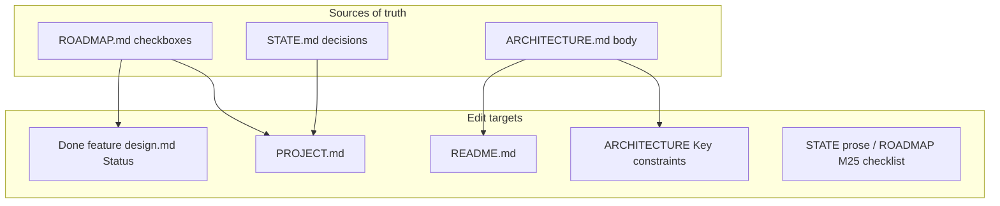

# Milestone 25 — Product Docs Sync Design

**Spec**: [`.specs/features/product-docs-sync/spec.md`](./spec.md)  
**Context**: [`.specs/features/product-docs-sync/context.md`](./context.md)  
**Status**: Done  
**Depth**: Thin (docs / Status metadata only — no `src/` architecture change)

---

## Architecture Overview

M25 does **not** change the scanner pipeline. It aligns living docs with shipped M19–M24.

| Concern                         | Owner doc                         | Action                                      |
| ------------------------------- | --------------------------------- | ------------------------------------------- |
| Shipped vs backlog              | `PROJECT.md`                      | Rewrite Scope shipped + Excludes            |
| Rename / not `--follow`         | ARCHITECTURE Key constraints + README | Add accurate bullets                        |
| Function-mode churn (M23)       | `README.md`                       | Align with ARCHITECTURE Function granularity |
| Stale Status                    | `.specs/features/*/design.md`     | `Planned` → `Done` where ROADMAP `[x]`      |
| Header / Active consistency     | `ROADMAP.md`, `STATE.md`          | Verify + light prose fixes; parent Specs links |

---

## Components / file ownership

| Task focus        | Paths                                                                 |
| ----------------- | --------------------------------------------------------------------- |
| PROJECT sync      | `.specs/project/PROJECT.md`                                           |
| Rename + Key constraints | `.specs/codebase/ARCHITECTURE.md` (§ Key constraints), `README.md` |
| README M23 gaps   | `README.md` (How it works / Features — surgical)                      |
| Status cleanup    | `.specs/features/function-ast-coverage/design.md`, `per-function-churn/design.md`, `package-dx/design.md` (+ others if found) |
| Consistency + gate | `.specs/project/ROADMAP.md`, `.specs/project/STATE.md` (prose only) |

**Forbidden paths for behavior edits:** `src/**`, `bin/**`, `tests/**` (except if a fixture README is clearly stale and in scope of rename docs — prefer leave alone; YAGNI).

---

## Data flow

N/A — documentation only.

---

## Error handling

N/A.

---

## Verification approach

| Check                         | Command / method                                      |
| ----------------------------- | ----------------------------------------------------- |
| No planned M20–M22 in PROJECT | `rg 'M20|M21|M22|planned' .specs/project/PROJECT.md`  |
| Rename constraint present     | `rg --follow\\|PathAliasMap\\|old => new` README + ARCHITECTURE |
| Status cleanup                | `rg 'Status: Planned' .specs/features/{function-ast-coverage,per-function-churn,package-dx}/` |
| Project gate                  | `pnpm build && pnpm test`                             |

---

## Risks

| Risk                                      | Mitigation                                              |
| ----------------------------------------- | ------------------------------------------------------- |
| Over-editing README (rewrite whole CLI)   | Surgical inserts only; reuse M19 sister pattern         |
| Duplicating M26 rename-confidence scope   | Document current PathAliasMap limits; no new warnings   |
| Fighting parent ROADMAP Specs link sync   | Verify prose; Specs URLs for M26–M30 may remain Pending |

---

## Reuse

- Sister: [docs-sync](../docs-sync/) (M19 tasks shape, docs-only gate)
- SoT for rename: STATE decision 2026-07-21; CONCERNS.md Git miner rows
- SoT for M23: ARCHITECTURE § Function granularity (M11, M23)
