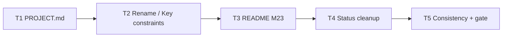

# Milestone 25 — Product Docs Sync Tasks

**Spec**: [`.specs/features/product-docs-sync/spec.md`](./spec.md)  
**Design**: [`.specs/features/product-docs-sync/design.md`](./design.md)  
**Context**: [`.specs/features/product-docs-sync/context.md`](./context.md)  
**Status**: Done  
**Note**: Medium / docs-only — thin design; sister [docs-sync](../docs-sync/tasks.md)

---

## Execution Plan

```
T1 PROJECT.md → T2 rename/--follow (ARCHITECTURE + README) → T3 README M23 gaps → T4 Status cleanup → T5 ROADMAP/STATE verify + gate
```



### Diagram-Definition Cross-Check

| Task | Depends on | Diagram | Match |
| ---- | ---------- | ------- | ----- |
| T1   | None       | Root    | ✅    |
| T2   | T1         | T1 → T2 | ✅    |
| T3   | T2         | T2 → T3 | ✅    |
| T4   | T3         | T3 → T4 | ✅    |
| T5   | T4         | T4 → T5 | ✅    |

### Path Conflict Check (Check 5)

| Task | Module owner | Paths                                                                                        | Conflict   |
| ---- | ------------ | -------------------------------------------------------------------------------------------- | ---------- |
| T1   | docs         | `.specs/project/PROJECT.md`                                                                  | Sequential |
| T2   | docs         | `.specs/codebase/ARCHITECTURE.md`, `README.md` (rename bullets)                              | After T1   |
| T3   | docs         | `README.md` (function-mode / dual-stream)                                                    | After T2   |
| T4   | docs         | `.specs/features/{function-ast-coverage,per-function-churn,package-dx}/design.md` (+ others) | After T3   |
| T5   | docs         | `.specs/project/ROADMAP.md`, `.specs/project/STATE.md`                                       | After T4   |

T2 and T3 both touch `README.md` — **not** `[P]`; sequential to avoid merge conflicts.

### Test Co-location Validation

| Task  | Code layer | Matrix requires | Task says                                                        | Match |
| ----- | ---------- | --------------- | ---------------------------------------------------------------- | ----- |
| T1–T4 | Docs only  | none            | none (grep verify)                                               | ✅    |
| T5    | Docs only  | none            | none + Gate `pnpm build && pnpm test` (sanity; no code expected) | ✅    |

### Granularity Check

| Task | Scope                           | Status      |
| ---- | ------------------------------- | ----------- |
| T1   | One file (PROJECT)              | ✅ Granular |
| T2   | Rename constraint across 2 docs | ✅ Cohesive |
| T3   | README M23 / dual-stream only   | ✅ Granular |
| T4   | Status fields on Done designs   | ✅ Cohesive |
| T5   | Consistency + project gate      | ✅ Granular |

---

## Task Breakdown

### T1: Sync PROJECT.md through M24

**What**: Update Scope shipped heading and bullets through M24; remove stale “M20–M22 planned” backlog line; keep true excludes; point forward work at ROADMAP post-M24 stubs.

**Where**: `.specs/project/PROJECT.md`

**Depends on**: None

**Reuses**: ROADMAP M19–M24 Done checklists; sister docs-sync PROJECT pattern; context D2

**Requirement**: HOTSPOT-221

**Tools**:

- MCP: NONE
- Skill: `coding-guidelines` (surgical doc edit)

**Done when**:

- [x] Shipped heading says through **M24** (not M18)
- [x] Shipped bullets include summary of M20 schemas, M21 config file, M22 function AST, M23 per-function hunk churn, M24 package DX (plus existing M7–M18; M14 coupling flag if coupling listed)
- [x] No “M20 / M21 / M22 — planned” (or equivalent) under Excludes / backlog
- [x] True non-goals retained (CI gate, non-TS/JS, relative churn)

**Tests**: none

**Gate**: none — verify with grep on `PROJECT.md`

**Verify**:

```bash
rg -n 'through M2|M20|M21|M22|planned|backlog' .specs/project/PROJECT.md
```

---

### T2: Rename / `--follow` in ARCHITECTURE Key constraints + README

**What**: Add Key constraints bullet: rename via `old => new` + `PathAliasMap`; global `git log --follow` is not used. Add matching short note in README How it works / Git. Remove any active `--follow`-as-miner guidance if found.

**Where**: `.specs/codebase/ARCHITECTURE.md` (§ Key constraints), `README.md` (rename note only)

**Depends on**: T1

**Reuses**: STATE rename decision; CONCERNS.md Git miner rows; context D3

**Requirement**: HOTSPOT-222

**Tools**:

- MCP: NONE
- Skill: `vitals-pipeline-domain` (rename wording)

**Done when**:

- [x] ARCHITECTURE Key constraints mentions `PathAliasMap` / `old => new` and not-`--follow`
- [x] README documents same rename model briefly
- [x] No active recommendation to use `--follow` for global mining in those files

**Tests**: none

**Gate**: none

**Verify**:

```bash
rg -n -- '--follow|PathAliasMap|old => new' README.md .specs/codebase/ARCHITECTURE.md
```

---

### T3: README function-mode M23 / dual-stream gaps

**What**: Update README How it works (and Features if needed) so function mode describes hunk-overlap churn on a patch stream and clarifies file mode remains numstat-only. Do not rewrite schemas/config/CSV sections that are already accurate.

**Where**: `README.md`

**Depends on**: T2

**Reuses**: ARCHITECTURE § Function granularity (M11, M23); context D4

**Requirement**: HOTSPOT-223

**Tools**:

- MCP: NONE
- Skill: NONE

**Done when**:

- [x] README states function-mode churn is hunk overlap / patch stream — not inherited file `FileChangeStats`
- [x] README does not claim a single Git pass covers function-mode churn
- [x] Existing M19–M24 product sections left consistent (schemas, config, CSV bundle)

**Tests**: none

**Gate**: none

**Verify**: Manual read of Features + How it works; `rg -n 'hunk|patch|inherited|granularity function|numstat' README.md`

---

### T4: Fix stale Status on Done feature designs

**What**: Set `Status: Done` on `design.md` for ROADMAP-complete milestones still marked Planned — at least `function-ast-coverage`, `per-function-churn`, `package-dx`. Grep other Done feature folders for the same drift and fix Status only (do not rewrite requirement tables).

**Where**: `.specs/features/function-ast-coverage/design.md`, `.specs/features/per-function-churn/design.md`, `.specs/features/package-dx/design.md` (+ others if found)

**Depends on**: T3

**Reuses**: ROADMAP `[x]` as SoT; sister docs-sync T2; context D6

**Requirement**: HOTSPOT-224

**Tools**:

- MCP: NONE
- Skill: NONE

**Done when**:

- [x] Listed M22–M24 `design.md` Status fields are `Done`
- [x] No remaining `Status: Planned` on those three design files
- [x] Post-M24 / non-Done features not marked Done

**Tests**: none

**Gate**: none

**Verify**:

```bash
rg -n 'Status: Planned' .specs/features/function-ast-coverage/ .specs/features/per-function-churn/ .specs/features/package-dx/
```

---

### T5: ROADMAP / STATE prose verify + project gate

**What**: Confirm ROADMAP header and STATE Active match delivered M24 + backlog stubs (M26-first order). Fix clearly stale Decision-row “Status Planned” wording for Done milestones if still present. Mark M25 ROADMAP checklist `[x]` when this feature’s doc work is complete. Leave Specs link sync for M25–M30 to parent if not already present. Run full project gate.

**Where**: `.specs/project/ROADMAP.md`, `.specs/project/STATE.md`

**Depends on**: T4

**Reuses**: context D5; ROADMAP suggested order M26→M25→…

**Requirement**: HOTSPOT-225, HOTSPOT-226

**Tools**:

- MCP: NONE
- Skill: NONE

**Done when**:

- [x] ROADMAP header / STATE Active prose consistent with M24 Done and post-M24 stubs (M26 listed before M25 in Active)
- [x] Stale “Status Planned” Decision rows for Done milestones corrected or noted for parent
- [x] M25 checklist items `[x]` when work complete (Specs URL optional — parent may add)
- [x] Diff has no intentional `src/` / `bin/` / test-logic behavior changes
- [x] Gate check passes: `pnpm build && pnpm test`

**Tests**: none (full gate sanity)

**Gate**: `pnpm build && pnpm test`

**Verify**:

```bash
rg -n 'Active|M24|M25|M26' .specs/project/STATE.md .specs/project/ROADMAP.md | head -40
pnpm build && pnpm test
```

**Commit** (propose only): `docs: sync product docs with M19–M24 shipped reality`

---

## Parallel Execution Map

```
Phase 1 (Sequential — shared README / docs consistency):
  T1 ──→ T2 ──→ T3 ──→ T4 ──→ T5
```

No `[P]` tasks — path overlap on `README.md` and sequential consistency checks.

---

## Requirement → Task map

| Requirement ID | Task |
| -------------- | ---- |
| HOTSPOT-221    | T1   |
| HOTSPOT-222    | T2   |
| HOTSPOT-223    | T3   |
| HOTSPOT-224    | T4   |
| HOTSPOT-225    | T5   |
| HOTSPOT-226    | T5   |

**Coverage:** 6 total, 6 mapped, 0 unmapped

---

## Handoff

Planning session ends here (**Status: Planned**).

Next: user reviews artifacts → promote Status to `Approved` / `Ready for Execute` → **new session** → `orchestrator-implementer`.

**Parent note:** Do not expect this planning session to edit ROADMAP/STATE Specs links for M25–M30; parent syncs those. Execute may still mark M25 checklist and fix Decision-row prose per T5.
