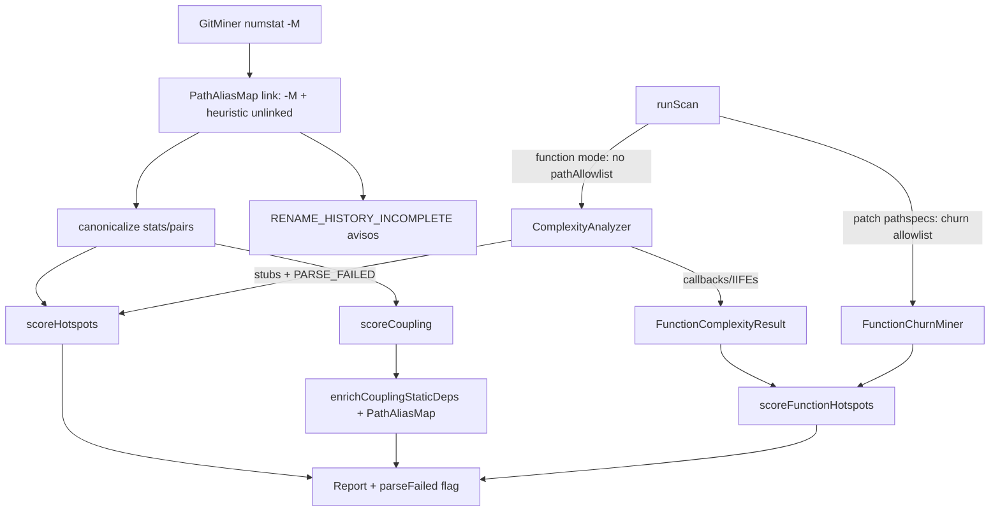

# Milestone 50 — Ranking Accuracy Plus Design

**Spec**: [`.specs/features/ranking-accuracy-plus/spec.md`](./spec.md)  
**Context**: [`.specs/features/ranking-accuracy-plus/context.md`](./context.md)  
**Status**: Planned

---

## Architecture Overview

M50 is a **cross-cutting accuracy** milestone: five coordinated improvements that feed ranking quality without changing the harmonic formula or inventing historical AST.



**Baseline SoT:** [ARCHITECTURE.md](../../codebase/ARCHITECTURE.md) (rename confidence, enriched coupling, function AST, M35 efficiency), [CONCERNS.md](../../codebase/CONCERNS.md) (rename blind spots, enrich rename gap, PARSE_FAILED, zero-churn omission).

**Sister designs:** [rename-confidence](../rename-confidence/design.md), [coupling-enrichment](../coupling-enrichment/design.md), [function-ast-coverage-plus](../function-ast-coverage-plus/design.md), [function-mode-scan-efficiency](../function-mode-scan-efficiency/design.md).

---

## Code Reuse Analysis

### Existing Components to Leverage

| Component          | Location                                                              | How to Use                                                         |
| ------------------ | --------------------------------------------------------------------- | ------------------------------------------------------------------ |
| `PathAliasMap`     | `src/git/rename.ts`                                                   | `link` / `canonical` / ambiguous — extend callers, not reinvent    |
| Blind-spot helpers | `src/git/rename-warnings.ts`                                          | Strengthen `pathsLookLikeRename`; add `applyHeuristicRenameLinks`  |
| Aggregate / mine   | `src/git/aggregate.ts`, `src/git/index.ts`                            | After blind-spot record, apply heuristic links before canonicalize |
| Enricher           | `src/scoring/enrich-coupling-static.ts`                               | Optional canonicalize hook; M33 graph unchanged structurally       |
| Hotspot scorer     | `src/scoring/hotspot-scorer.ts`                                       | Split norm universe; set `parseFailed`                             |
| Analyze batch      | `src/complexity/analyze-batch.ts`                                     | Emit stub results for `getParseFailures()`                         |
| Collect functions  | `src/complexity/analyze-file.ts`                                      | Extend for CallExpression / IIFE; reuse `complexityForFunction`    |
| Allowlist builder  | `src/scan.ts` `buildFunctionModePathAllowlist`                        | Keep for **patch** only; stop passing to complexity                |
| Schemas / baseline | `schemas/scan-result.json`, `load-baseline.ts`                        | Additive `parseFailed`                                             |
| Fixtures           | `tests/fixtures/git-log/rename-unlinked.txt`, `repos/`, `complexity/` | Extend                                                             |

### Integration Points

| System        | Integration                                                                                                         |
| ------------- | ------------------------------------------------------------------------------------------------------------------- |
| `runScan`     | Retain alias map from miner; pass to enrich; stop complexity `pathAllowlist` in function mode; keep patch allowlist |
| Reporters     | Surface `parseFailed`                                                                                               |
| JSON contract | Additive required field; version `"1.0"`                                                                            |
| Compare       | Consumes HotspotScore — must accept/require `parseFailed`                                                           |

### Fragile areas (CONCERNS.md)

| Area                               | Design mitigation                                                   |
| ---------------------------------- | ------------------------------------------------------------------- |
| Rename without `--follow`          | Heuristic link only on same-commit relatedness; still no `--follow` |
| False-positive rename links        | Stem/basename rules + cap; fixtures for negative cases              |
| Enrich false negatives on renames  | PathAliasMap pass-through (this milestone)                          |
| PARSE_FAILED skip                  | Stub rows; exclude from norm universe                               |
| McCabe drift (RT-005)              | Do not edit `mccabe.ts` decision nodes                              |
| Zero-churn ranking / norm dilution | Document intentional; keep patch pathspecs for I/O                  |
| Harmonic formula                   | Untouched for successful rows                                       |

---

## Components

### 1. Heuristic rename linker (`src/git/rename-warnings.ts` + mine wiring)

- **Purpose:** Strengthen relatedness; apply `PathAliasMap.link` for high-confidence unlinked pairs; keep warning families.
- **Location:** `src/git/rename-warnings.ts`, `src/git/index.ts` (and aggregate if links applied mid-stream)
- **Interfaces (illustrative):**

```typescript
/** Strengthened relatedness per context.md */
export function pathsLookLikeRename(a: string, b: string): boolean;

/** Deterministic pairs: sort deletes/adds; greedy first unused related match */
export function pairUnlinkedRenames(
  deleted: string[],
  added: string[],
): Array<{ from: string; to: string }>;

export function applyHeuristicRenameLinks(
  aliasMap: PathAliasMap,
  pairs: Array<{ from: string; to: string }>,
): void;
```

- **Dependencies:** `PathAliasMap`
- **Reuses:** `recordBlindSpotsFromCommit`, warning formatters, `RENAME_HISTORY_INCOMPLETE`

**Relatedness algorithm (locked for Execute):**

1. Identical full basename → match
2. Else: strip final extension; if stems equal **and** both extensions ∈ `{.ts,.tsx,.js,.jsx,.mjs,.cjs}` → match
3. Else: identical basename **and** identical immediate parent directory name (e.g. `a/foo/x.ts` ↔ `b/foo/x.ts`) → match (redundant with 1 when basename identical — treat as documentation of intent; implementers may fold into 1)

Pairing: sort deleted and added paths lexicographically; for each deleted in order, take the first unused related added.

---

### 2. Rename-aware enrich (`src/scoring/enrich-coupling-static.ts`)

- **Purpose:** Canonicalize peer paths and pair endpoints before graph build / label.
- **Location:** `src/scoring/enrich-coupling-static.ts`
- **Interfaces:**

```typescript
export function enrichCouplingStaticDeps(
  pairs: CouplingPair[],
  repoPath: string,
  options?: { canonicalizePath?: (path: string) => string },
): CouplingPair[];
```

- **Dependencies:** Existing `TsconfigPathMap`, `PackageExportsMap`, M33 graph
- **Reuses:** Relative/alias/exports resolution unchanged after canonical peer keys
- **Wiring:** `runScan` passes `(p) => aliasMap.canonical(p)` (or equivalent public API)

---

### 3. PARSE_FAILED hotspot rows

- **Purpose:** Surface unparsable files in rankings without distorting successful norms.
- **Locations:**
  - `src/complexity/analyze-batch.ts` (+ analyzer merge) — stub `ComplexityResult` per failure
  - `src/types/domain.ts` — `parseFailed: boolean` on `HotspotScore`
  - `src/scoring/hotspot-scorer.ts` — split universe; force zeros on failed
  - `schemas/scan-result.json` + `load-baseline.ts` + reporters

```typescript
interface HotspotScore {
  // ...existing fields
  parseFailed: boolean;
}
```

**Scorer algorithm:**

1. Partition `complexity` into `ok` / `failed` (failed = stub marker: either explicit flag on ComplexityResult **or** convention `functionCount === 0 && cyclomaticComplexity === 0` plus path in failure set — **prefer explicit `parseFailed?: boolean` on `ComplexityResult`** to avoid false positives on empty files).
2. Run existing normalize + harmonic **only on `ok`**.
3. Map `failed` → HotspotScore with zeros + `parseFailed: true` + churn from `fileStats` (commit/lines/authors may be non-zero for display; norms and hotspotScore stay 0 per context).
4. Concatenate and sort by existing comparator.

**ComplexityResult extension (preferred):** additive optional or required `parseFailed?: boolean` on internal complexity type — if kept internal-only, scorer receives parallel `parseFailedPaths: Set<string>` from analyzer. Prefer **internal set or flag** so empty valid files are not mis-flagged.

---

### 4. Function AST — callbacks / IIFEs (`src/complexity/analyze-file.ts`)

- **Purpose:** Collect call-argument callables and IIFEs; McCabe unchanged.
- **Location:** `src/complexity/analyze-file.ts`
- **Logic sketch:**
  - On `CallExpression`: for each arg, if ArrowFunction / FunctionExpression → push + recurse body (skip if node already collected — use identity set or skip when parent already handled).
  - IIFE: `CallExpression` whose expression is `FunctionExpression` / `ArrowFunction`, or `ParenthesizedExpression` wrapping those → collect callee function node.
  - Naming: default `<anonymous>:L{line}` via existing `resolveFunctionName` fallback.
- **Dependencies:** `complexityForFunction` only — **do not** change `mccabe.ts`
- **Reuses:** M29 collection helpers / body recursion

---

### 5. Function-mode discovery (`src/scan.ts`)

- **Purpose:** Full AST discovery in function mode; keep patch allowlist.
- **Change:** Stop setting `analyzeOptions.pathAllowlist` in function mode. Continue `buildFunctionModePathAllowlist` for `createFunctionChurnMiner({ paths })`.
- **Tests:** Invert zero-churn omission; retain file-mode zero patch spawn and churned-order smoke.

---

## Data Models

### HotspotScore (additive)

| Field         | Type      | Notes                                                  |
| ------------- | --------- | ------------------------------------------------------ |
| `parseFailed` | `boolean` | Required in JSON schema; `false` for successful parses |

### Complexity internal marker

Prefer `parseFailedPaths` from analyzer batch merge or `ComplexityResult.parseFailed?: boolean` (pipeline-internal acceptable if not in JSON).

---

## Error Handling Strategy

| Scenario                        | Handling                         | User impact                                      |
| ------------------------------- | -------------------------------- | ------------------------------------------------ |
| Heuristic rename false positive | Relatedness + cap; still warn    | Possible churn merge — documented trust tradeoff |
| Enrich without alias map        | Identity canonicalize            | Pre-M50 behavior                                 |
| Parse failure                   | Stub + warning + flagged score 0 | Visible in ranking                               |
| Baseline missing `parseFailed`  | Reject load                      | Re-scan                                          |
| IIFE / callback parse OK        | Collected                        | Higher file/function counts                      |

---

## Tech Decisions

| Decision           | Choice                      | Rationale                               |
| ------------------ | --------------------------- | --------------------------------------- |
| Link vs warn-only  | Link + warn                 | Stronger RT-003 accuracy                |
| Warning codes      | Unchanged catalog           | M28/M42 stability                       |
| Enrich API         | Optional `canonicalizePath` | Avoid hard git import cycle; scan wires |
| PARSE_FAILED norms | Exclude from universe       | Preserve successful ranking             |
| Zero-churn         | AST full; patch restricted  | Accuracy + keep M35 I/O                 |
| McCabe             | Untouched                   | RT-005                                  |
| Formula            | Untouched                   | Locked out of scope                     |

---

## Risks

| Risk                                  | Mitigation                                                |
| ------------------------------------- | --------------------------------------------------------- |
| Heuristic links merge unrelated files | Strict relatedness; negative fixtures                     |
| `parseFailed` baseline break          | Clear reject message; document in CHANGELOG/ARCHITECTURE  |
| Function-mode wall-clock regression   | Accepted; patch pathspecs still limited; note in CONCERNS |
| Double-collect callbacks              | Node identity / parent-handled skip                       |
| Path conflict on `src/scan.ts`        | Sequential tasks T2 → T5 only                             |
