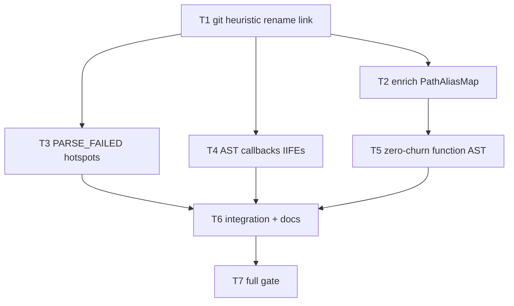

# Milestone 50 — Ranking Accuracy Plus Tasks

**Design**: [`.specs/features/ranking-accuracy-plus/design.md`](./design.md)  
**Spec**: [`.specs/features/ranking-accuracy-plus/spec.md`](./spec.md)  
**Context**: [`.specs/features/ranking-accuracy-plus/context.md`](./context.md)  
**Status**: Planned

---

## Execution Plan

```
T1 (git heuristic link) ──┬──→ T2 (enrich + scan wire alias) ──→ T5 (zero-churn AST) ──┐
                          ├──→ T3 (PARSE_FAILED ranking) ─────────────────────────────┼──→ T6 (integration + docs) ──→ T7 (full gate)
                          └──→ T4 [P] (AST callbacks/IIFEs) ──────────────────────────┘
```



### Diagram-Definition Cross-Check

| Task | Depends on (body) | Diagram | Status |
| ---- | ----------------- | ------- | ------ |
| T1 | None | Root | ✅ Match |
| T2 | T1 | T1 → T2 | ✅ Match |
| T3 | T1 | T1 → T3 | ✅ Match |
| T4 | T1 | T1 → T4 | ✅ Match |
| T5 | T2 | T2 → T5 | ✅ Match |
| T6 | T3, T4, T5 | T3/T4/T5 → T6 | ✅ Match |
| T7 | T6 | T6 → T7 | ✅ Match |

### Path Conflict Check (Check 5)

| Task | Module owner | Primary paths | Conflict |
| ---- | ------------ | ------------- | -------- |
| T1 | `src/git/` | `rename-warnings.ts`, `index.ts`, fixtures `git-log/` | Sole git owner |
| T2 | `src/scoring/` + `src/scan.ts` | `enrich-coupling-static.ts`, `scan.ts` (alias wire only) | Before T5 — sequential on `scan.ts` |
| T3 | `src/complexity/` + `src/scoring/` + types/schema/report | `analyze-batch.ts`, `hotspot-scorer.ts`, `domain.ts`, schemas, report | No `scan.ts`; sequential vs T4 on complexity — **T3 before T4 not required** if T3 touches only `analyze-batch` and T4 only `analyze-file` — mark no `[P]` between T3/T4 for safety? T4 is `[P]` with T2/T3 — different files OK |
| T4 | `src/complexity/` | `analyze-file.ts` (+ fixtures) | Disjoint file from T3 `analyze-batch` — `[P]` OK |
| T5 | `src/scan.ts` | Allowlist wiring + integration test updates | After T2 |
| T6 | docs + integration | `.specs/codebase/*`, `scan.integration.test.ts` | After implementers |
| T7 | gate | — | Final |

**Verdict:** T2→T5 sequential for `scan.ts`. T3∥T4∥T2 after T1 (T4 `[P]`). No two unfinished tasks own the same file.

### Test Co-location Validation

| Task | Code layer | Matrix / practice | Task `Tests` | Status |
| ---- | ---------- | ----------------- | ------------ | ------ |
| T1 | git miner / rename | unit + git-log fixtures | unit | ✅ OK |
| T2 | scoring enrich + scan wire | unit (+ scan unit for wire) | unit | ✅ OK |
| T3 | complexity batch + scoring + schema/report | unit + contract | unit + contract | ✅ OK |
| T4 | complexity analyze-file | unit + complexity fixtures | unit | ✅ OK |
| T5 | scan orchestration | unit + integration | unit + integration | ✅ OK |
| T6 | integration + docs | integration; docs none | integration | ✅ OK |
| T7 | full gate | build+test | full | ✅ OK |

### Granularity Check

| Task | Scope | Status |
| ---- | ----- | ------ |
| T1 | Heuristic link + relatedness + fixtures | ✅ Cohesive git domain |
| T2 | Enrich canonicalize + scan pass-through | ✅ Cohesive |
| T3 | PARSE_FAILED end-to-end in ranking contract | ✅ Cohesive accuracy slice |
| T4 | AST collection extension | ✅ Cohesive |
| T5 | Zero-churn allowlist revisit | ✅ Cohesive |
| T6 | Integration + living docs | ✅ Cohesive |
| T7 | Gate only | ✅ |

---

## Task Breakdown

### T1: Stronger unlinked-rename linking

**What:** Strengthen `pathsLookLikeRename` / pairing per [context.md](./context.md) and [design.md](./design.md); apply `PathAliasMap.link` for heuristic pairs before canonicalize; keep `RENAME_HISTORY_INCOMPLETE` warnings (stable code, cap 5+summary); no `--follow`, no historical AST. Extend `rename-unlinked` fixtures and unit tests for positive link, negative non-match, stem/extension relatedness, and no double-link when `renameFrom` present.

**Where:** `src/git/rename-warnings.ts`, `src/git/rename-warnings.test.ts`, `src/git/index.ts` (and/or `aggregate.ts` if links applied there), `tests/fixtures/git-log/rename-unlinked.txt` (+ new fixture if needed)

**Depends on:** None

**Reuses:** `PathAliasMap`, M26 blind-spot recording/formatters

**Requirement:** HOTSPOT-730, HOTSPOT-731, HOTSPOT-732, HOTSPOT-733, HOTSPOT-734, HOTSPOT-735, HOTSPOT-736

**Tools:**

- MCP: NONE
- Skill: `vitals-pipeline-domain`, `coding-guidelines`

**Done when:**

- [ ] Heuristic pairs call `link(from, to)` and canonicalize unifies churn under the new path
- [ ] Relatedness matches design (basename / stem+eligible ext); negatives do not link
- [ ] Warnings still use `code: "RENAME_HISTORY_INCOMPLETE"`; cap preserved
- [ ] `-M` / `renameFrom` paths are not treated as unlinked
- [ ] Deterministic pairing for multi-match
- [ ] Unit + fixture tests cover above
- [ ] Gate: `pnpm exec vitest run src/git/rename-warnings.test.ts src/git/index.test.ts src/git/canonicalize.test.ts`

**Tests:** unit  
**Gate:** `pnpm exec vitest run src/git/rename-warnings.test.ts src/git/index.test.ts src/git/canonicalize.test.ts`

**Verify:**

```bash
pnpm exec vitest run src/git/rename-warnings.test.ts src/git/index.test.ts
```

**Commit:** `feat(git): heuristic PathAliasMap link for unlinked renames`

---

### T2: PathAliasMap-aware static enrich

**What:** Add optional `canonicalizePath` (or equivalent) to `enrichCouplingStaticDeps`; build peer graph and label pairs using canonical paths; wire `runScan` to pass the file miner’s `PathAliasMap` canonicalizer. Do not change coupling formulas or M27 field invariants. Unit-test rename-aware edge true; regression without canonicalize ≡ identity.

**Where:** `src/scoring/enrich-coupling-static.ts`, `src/scoring/enrich-coupling-static.test.ts`, `src/scan.ts`, `src/scan.test.ts` (wire assertion only)

**Depends on:** T1

**Reuses:** M33 `buildStaticEdgeGraph`, M27/M44 resolution, `PathAliasMap.canonical`

**Requirement:** HOTSPOT-738, HOTSPOT-739, HOTSPOT-740, HOTSPOT-741, HOTSPOT-742, HOTSPOT-743, HOTSPOT-744

**Tools:**

- MCP: NONE
- Skill: `vitals-pipeline-domain`, `coding-guidelines`

**Done when:**

- [ ] Enrich accepts canonicalize hook; peers/edges use canonical paths
- [ ] `runScan` passes alias map from miner
- [ ] `couplingStrength` / order unchanged in tests
- [ ] Without hook, prior enrich tests still pass
- [ ] Gate: `pnpm exec vitest run src/scoring/enrich-coupling-static.test.ts src/scan.test.ts`

**Tests:** unit  
**Gate:** `pnpm exec vitest run src/scoring/enrich-coupling-static.test.ts src/scan.test.ts`

**Verify:**

```bash
pnpm exec vitest run src/scoring/enrich-coupling-static.test.ts
```

**Commit:** `feat(scoring): canonicalize paths in static coupling enrich`

---

### T3: PARSE_FAILED files in hotspot ranking [P]

**What:** Emit stub complexity results for parse failures (explicit parse-failed marker — not empty-file ambiguity); extend `HotspotScore` with required `parseFailed`; score with zeros and exclude failed rows from `normalizeLogMinMax` universe; keep `PARSE_FAILED` warning code; update JSON schema, `loadBaseline`, reporters (table/markdown/CSV), and unit/contract tests. Successful-file order parity locked. No function rows for failed files.

**Where:** `src/complexity/analyze-batch.ts` (+ tests), `src/complexity/index.ts` if merge needed, `src/types/domain.ts`, `src/scoring/hotspot-scorer.ts`, `src/scoring/hotspot-scorer.test.ts`, `schemas/scan-result.json`, `src/compare/load-baseline.ts` (+ tests), `src/report/*` hotspot surfaces (+ tests), `tests/contract/json-schema.test.ts` / fixtures as needed

**Depends on:** T1

**Reuses:** Existing `createParseFailedWarning`, `scoreHotspots` harmonic path for OK rows

**Requirement:** HOTSPOT-746, HOTSPOT-747, HOTSPOT-748, HOTSPOT-749, HOTSPOT-750, HOTSPOT-751, HOTSPOT-752, HOTSPOT-753

**Tools:**

- MCP: NONE
- Skill: `vitals-pipeline-domain`, `coding-guidelines`

**Done when:**

- [ ] Parse failures → stub + warning + `parseFailed: true` hotspot with `hotspotScore: 0`
- [ ] Successful rows’ relative order matches scoring without stubs in the norm set
- [ ] Schema requires `parseFailed`; baseline rejects missing field
- [ ] Reporters expose the flag
- [ ] Gate: `pnpm exec vitest run src/scoring/hotspot-scorer.test.ts src/complexity/analyze-batch.test.ts src/compare/load-baseline.test.ts tests/contract/json-schema.test.ts`

**Tests:** unit + contract  
**Gate:** `pnpm exec vitest run src/scoring/hotspot-scorer.test.ts src/complexity/analyze-batch.test.ts src/compare/load-baseline.test.ts tests/contract/json-schema.test.ts`

**Verify:**

```bash
pnpm exec vitest run src/scoring/hotspot-scorer.test.ts tests/contract/json-schema.test.ts
```

**Commit:** `feat(scoring): include PARSE_FAILED files in hotspots as score 0`

---

### T4: Collect callbacks and IIFEs in function AST [P]

**What:** Extend `collectFunctionsInScope` / call-site handling to collect CallExpression argument ArrowFunction/FunctionExpression and IIFE forms; naming default `<anonymous>:L{line}`; no double-collect; **do not** change `mccabe.ts` decision nodes. Add complexity fixtures + unit tests; update file totals where fixtures intentionally grow.

**Where:** `src/complexity/analyze-file.ts`, `src/complexity/analyze-file.test.ts`, `tests/fixtures/complexity/` (e.g. `callbacks-iife.ts`)

**Depends on:** T1

**Reuses:** M29 collection helpers, `complexityForFunction`

**Requirement:** HOTSPOT-754, HOTSPOT-755, HOTSPOT-756, HOTSPOT-757, HOTSPOT-758, HOTSPOT-759, HOTSPOT-760

**Tools:**

- MCP: NONE
- Skill: `vitals-pipeline-domain`, `coding-guidelines`

**Done when:**

- [ ] Callbacks and IIFEs collected with documented names/complexities
- [ ] `mccabe.ts` decision-node semantics unchanged
- [ ] No double-collect of the same node
- [ ] Fixtures + unit tests lock values
- [ ] Gate: `pnpm exec vitest run src/complexity/analyze-file.test.ts`

**Tests:** unit  
**Gate:** `pnpm exec vitest run src/complexity/analyze-file.test.ts`

**Verify:**

```bash
pnpm exec vitest run src/complexity/analyze-file.test.ts
```

**Commit:** `feat(complexity): collect call callbacks and IIFEs`

---

### T5: Include zero-churn-file functions in function mode

**What:** Stop passing `pathAllowlist` to complexity in function mode (full in-scope discovery). Keep `buildFunctionModePathAllowlist` for patch pathspecs only. Invert M35 tests that asserted omission of `untouched.ts` from `functions`; keep file-mode zero patch spawn and typical churned ranking smoke. Document ranking/normalization impact in task notes for T6.

**Where:** `src/scan.ts`, `src/scan.test.ts`, `src/scan.integration.test.ts` (M35 describe), optionally `src/complexity/index.test.ts` if allowlist-only cases need scan-level clarification

**Depends on:** T2

**Reuses:** `buildFunctionModePathAllowlist` for patch only; M35 pathspec threshold behavior

**Requirement:** HOTSPOT-761, HOTSPOT-762, HOTSPOT-763, HOTSPOT-764, HOTSPOT-765

**Tools:**

- MCP: NONE
- Skill: `vitals-pipeline-domain`, `vitals-cli-validation`, `coding-guidelines`

**Done when:**

- [ ] Function mode analyze call omits `pathAllowlist`
- [ ] Zero-churn eligible file functions appear in `ScanResult.functions`
- [ ] Patch miner still receives churn allowlist; file mode still zero patch spawns
- [ ] Integration tests updated (invert HOTSPOT-387/398 omission)
- [ ] Gate: `pnpm exec vitest run src/scan.test.ts src/scan.integration.test.ts`

**Tests:** unit + integration  
**Gate:** `pnpm exec vitest run src/scan.test.ts src/scan.integration.test.ts`

**Verify:**

```bash
pnpm exec vitest run src/scan.integration.test.ts -t "function-mode"
```

**Commit:** `feat(scan): include zero-churn functions in function mode`

---

### T6: Integration smoke + living docs

**What:** Add/adjust integration coverage for rename+enrich, PARSE_FAILED hotspot visibility, and function AST/zero-churn smokes (HOTSPOT-766–768). Sync [ARCHITECTURE.md](../../codebase/ARCHITECTURE.md), [CONCERNS.md](../../codebase/CONCERNS.md), [TESTING.md](../../codebase/TESTING.md) for: heuristic linking, enrich PathAliasMap reopen, PARSE_FAILED ranking, IIFE/callback collection, M35 D6 revisit. HOTSPOT-737/745/765 doc bullets satisfied here if not already.

**Where:** `src/scan.integration.test.ts` (and/or targeted module tests), `.specs/codebase/ARCHITECTURE.md`, `.specs/codebase/CONCERNS.md`, `.specs/codebase/TESTING.md`

**Depends on:** T3, T4, T5

**Reuses:** Existing fixture repos (`with-renames`, `small-ts`); add minimal fixtures only if needed (`fixture-builder` optional)

**Requirement:** HOTSPOT-737, HOTSPOT-745, HOTSPOT-766, HOTSPOT-767, HOTSPOT-768, HOTSPOT-769 (docs portion)

**Tools:**

- MCP: NONE
- Skill: `vitals-pipeline-domain`, `vitals-cli-validation`

**Done when:**

- [ ] Integration assertions cover the three smoke themes
- [ ] ARCHITECTURE / CONCERNS / TESTING reflect reopened boundaries
- [ ] Gate: `pnpm exec vitest run src/scan.integration.test.ts`

**Tests:** integration  
**Gate:** `pnpm exec vitest run src/scan.integration.test.ts`

**Verify:**

```bash
pnpm exec vitest run src/scan.integration.test.ts
```

**Commit:** `docs(codebase): sync M50 ranking-accuracy-plus architecture`

---

### T7: Full quality gate

**What:** Run project gate; fix any residual failures from M50; confirm requirement coverage complete.

**Where:** repo root (no feature code unless gate fixes)

**Depends on:** T6

**Reuses:** N/A

**Requirement:** HOTSPOT-769

**Tools:**

- MCP: NONE
- Skill: none (or invoke `verifier-quality-gates` in Execute)

**Done when:**

- [ ] `pnpm build && pnpm test` passes
- [ ] No silent test deletions; coverage thresholds hold

**Tests:** full  
**Gate:** `pnpm build && pnpm test`

**Verify:**

```bash
pnpm build && pnpm test
```

**Commit:** (none unless gate fixes — `test:` / `fix:` as needed)

---

## Parallel Execution Map

```
Phase 1 (Sequential):
  T1

Phase 2 (Parallel after T1):
  ├── T2
  ├── T3 [P]
  └── T4 [P]

Phase 3 (Sequential):
  T2 → T5

Phase 4 (Sequential):
  T3 + T4 + T5 complete → T6 → T7
```

**Parallelism notes:** T3 and T4 are `[P]` — disjoint files (`analyze-batch` vs `analyze-file`). T2 is not marked `[P]` relative to T5 (shared `scan.ts`). Unit tests are parallel-safe per TESTING.md.

---

## Requirement → Task Mapping

| Requirement IDs | Task |
| --------------- | ---- |
| HOTSPOT-730–736 | T1 |
| HOTSPOT-737, 745, 766–768 | T6 (docs + integration; 737/745 may land in T6) |
| HOTSPOT-738–744 | T2 |
| HOTSPOT-746–753 | T3 |
| HOTSPOT-754–760 | T4 |
| HOTSPOT-761–765 | T5 |
| HOTSPOT-769 | T6 (docs) + T7 (gate) |

---

## Handoff

**Status: Planned** — planning session complete. Promote to `Approved` / `Ready for Execute`, then open a **new** development session and invoke `orchestrator-implementer`.

**Suggested module owners for Execute:** T1 git → T2 scoring/scan → T3 scoring/complexity/report → T4 complexity → T5 scan → T6 docs/integration → T7 gate.
