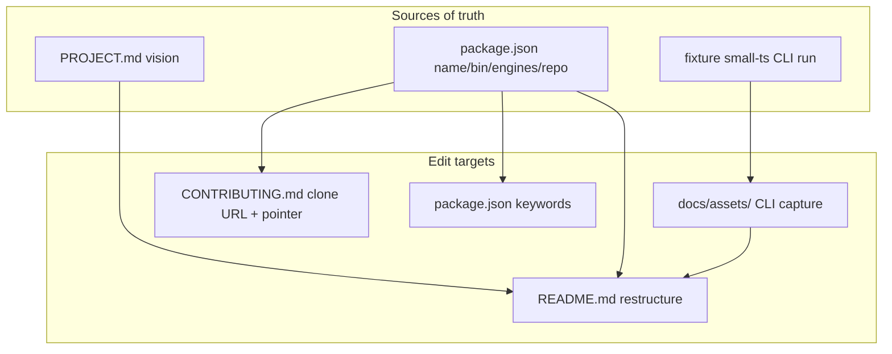

# Milestone 37 — README Adoption DX Design

**Spec**: [`.specs/features/readme-adoption-dx/spec.md`](./spec.md)  
**Status**: Planned  
**Depth**: Thin (docs + asset + `package.json` keywords only — no `src/` architecture change)  
**Sister**: [product-docs-sync](../product-docs-sync/design.md) (M25)

---

## Architecture Overview

M37 does **not** change the scanner pipeline. It improves first-run adoption of the GitHub-facing README and related metadata.

| Concern | Owner | Action |
| ------- | ----- | ------ |
| Broken fence | `README.md` | Remove duplicate closer; verify following sections |
| Adoption top | `README.md` | Problem→solution, TOC, sample, asset, privacy, workflows, essential flags |
| Advanced depth | `README.md` | Workers / mega-commit / rename detail + full flag ref + API |
| Visual proof | `docs/assets/` | Real PNG or GIF of table output |
| Install story | README + CONTRIBUTING | Real GitHub URL; clone+pnpm path only |
| Discovery prep | `package.json` | Expand `keywords` only |

---

## Target README structure (single file)

Default locked: **one** `README.md` (no required `docs/guide.md` split).

Suggested heading order (Execute may rename slightly; TOC must match):

1. **Cover** — H1 + one-line package vs bin + badges (license, Node 22+, repo) — **no npm version badge**
2. **Opening** — problem → solution (PROJECT.md tone) + brief vs-SaaS / local positioning + privacy callout
3. **TOC**
4. **Quick start** — clone URL, build, scan; **sample CLI table** (first ~60 lines target includes cover→sample); **screenshot** from `docs/assets/`
5. **Use this when…** — weekly triage; baseline/compare; markdown in PR
6. **How it works** — slim pipeline only
7. **Essential flags** — short table
8. **Requirements** — Node 22+, git, pnpm (dev)
9. **Configuration** — keep current accurate content (may stay mid-doc)
10. **CLI examples / baseline** — compare flow before API
11. **Programmatic API** — after CLI/baseline (or stub + Advanced link)
12. **Advanced** — concurrency/workers, mega-commit, rename confidence (product language + stable `code`s), full flag reference if not already slim above
13. **Limitations** — TS/JS only; commit-count churn; Node 22+; git required
14. **Contributing** — pointer to `CONTRIBUTING.md`
15. **License**

---

## `docs/assets/`

| Item | Decision |
| ---- | -------- |
| Folder | Create `docs/assets/` (new) |
| Content | Real capture of CLI **table** output from `tests/fixtures/repos/small-ts` |
| Format | PNG preferred; short GIF acceptable if terminal recording is easier |
| Naming | e.g. `docs/assets/cli-table-small-ts.png` (Execute chooses exact name; keep stable) |
| README | Early Markdown image referencing the versioned path |

Capture method (Execute): build if needed, run  
`pnpm exec hotspot-scanner scan tests/fixtures/repos/small-ts`  
and screenshot the table (or redirect + render — visual must look like terminal table).

---

## Allowed badges

| Badge | Allowed |
| ----- | ------- |
| License (MIT) | Yes |
| Node.js `>=22` | Yes |
| Repository / GitHub | Yes |
| npm version / downloads | **No** (publish deferred) |
| Coverage / build CI | Optional; not required for M37 |

---

## Keywords expansion (`package.json`)

Keep existing: `hotspot`, `complexity`, `git`, `maintenance`.  
Add discovery-oriented terms (Execute may tweak synonyms; include at least most of):

- `temporal-coupling`, `cyclomatic-complexity`, `refactoring`, `typescript`, `javascript`, `cli`, `code-churn`, `tech-debt`

No publish config changes.

---

## Components / file ownership

| Task focus | Paths |
| ---------- | ----- |
| Asset | `docs/assets/*` (new) |
| README adoption | `README.md` |
| Contribute URL / pointer | `CONTRIBUTING.md` |
| Keywords | `package.json` (`keywords` only) |
| Milestone prose | `.specs/project/ROADMAP.md`, `.specs/project/STATE.md` (planning already; Execute marks Done) |

**Forbidden for behavior edits:** `src/**`, `bin/**`, `tests/**` (running fixture for capture is OK; do not change fixture logic).

---

## Verification approach

| Check | Method |
| ----- | ------ |
| Fence fixed | Preview + no double-close around JSON sample |
| No `<repo-url>` | `rg '<repo-url>' README.md CONTRIBUTING.md` |
| No jargon | `rg 'M26\|M28\|M32\|RT-003' README.md` |
| No npm version badge | `rg -i 'npm.*version\|badge/npm' README.md` |
| Asset present | `ls docs/assets/` + README image link |
| Keywords | Diff `package.json` |
| Project gate | `pnpm build && pnpm test` |

---

## Risks

| Risk | Mitigation |
| ---- | ---------- |
| Full README rewrite loses accurate technical content | Move, don’t delete: Advanced keeps workers/mega-commit/rename/`code`s |
| Screenshot stale vs CLI columns | Capture after current build; prefer fixture for stability |
| Accidental npx docs creep | Out of scope #1/#13; STATE records npm publish as future backlog |
| CONTRIBUTING vs README install drift | Same clone URL; README minimal user path; CONTRIBUTING SoT for contribute |

---

## Reuse

- Sister: [product-docs-sync](../product-docs-sync/) — docs-only tasks, gate, Status Planned→Execute in new session
- Vision copy: [PROJECT.md](../../project/PROJECT.md)
- Package identity: `package.json` `name`, `bin`, `repository.url`, `engines`, `license`
- Sample source: `tests/fixtures/repos/small-ts`
