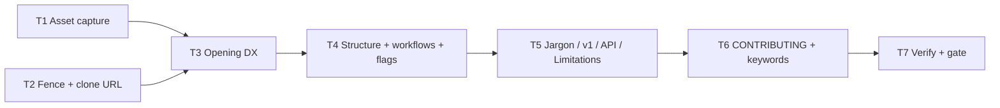

# Milestone 37 — README Adoption DX Tasks

**Spec**: [`.specs/features/readme-adoption-dx/spec.md`](./spec.md)  
**Design**: [`.specs/features/readme-adoption-dx/design.md`](./design.md)  
**Status**: Planned  
**Note**: Large / docs-only — thin design; sister [product-docs-sync](../product-docs-sync/tasks.md). **Do not Execute in the planning session.**

---

## Execution Plan

```
T1 docs/assets capture ──┐
                         ├→ T3 opening DX → T4 structure → T5 voice/limitations/API → T6 CONTRIBUTING+keywords → T7 verify+gate
T2 fence + install URL ──┘
```



### Diagram-Definition Cross-Check

| Task | Depends on | Diagram | Match |
| ---- | ---------- | ------- | ----- |
| T1 | None | Root | ✅ |
| T2 | None | Root | ✅ |
| T3 | T1, T2 | T1/T2 → T3 | ✅ |
| T4 | T3 | T3 → T4 | ✅ |
| T5 | T4 | T4 → T5 | ✅ |
| T6 | T5 | T5 → T6 | ✅ |
| T7 | T6 | T6 → T7 | ✅ |

### Path Conflict Check (Check 5)

| Task | Module owner | Paths | Conflict |
| ---- | ------------ | ----- | -------- |
| T1 | docs-assets | `docs/assets/*` (new) | None — `[P]` with T2 |
| T2 | docs | `README.md` (fence + Installation URL only), `CONTRIBUTING.md` (clone URL only) | Sequential before T3 README rewrite |
| T3 | docs | `README.md` (cover→sample→asset→TOC→privacy→positioning) | After T1+T2 |
| T4 | docs | `README.md` (How it works slim, Advanced shell, workflows, essential flags) | After T3 |
| T5 | docs | `README.md` (jargon, v1, API placement, Limitations) | After T4 |
| T6 | docs + package | `CONTRIBUTING.md` (dedupe pointer), `package.json` (`keywords` only) | After T5 (CONTRIBUTING already touched in T2 for URL — T6 is pointer/dedupe only) |
| T7 | docs | verify greps + ROADMAP/STATE Execute notes + gate | After T6 |

T3–T5 all own `README.md` — **not** `[P]`. T1 ‖ T2 only.

### Test Co-location Validation

| Task | Code layer | Matrix requires | Task says | Match |
| ---- | ---------- | --------------- | --------- | ----- |
| T1–T6 | Docs / keywords | none | none (grep / manual preview / `ls`) | ✅ |
| T7 | Docs only | none | none + Gate `pnpm build && pnpm test` | ✅ |

### Granularity Check

| Task | Scope | Status |
| ---- | ----- | ------ |
| T1 | Asset folder + one capture | ✅ Granular |
| T2 | Fence + clone URL sync | ✅ Cohesive |
| T3 | Opening adoption block | ✅ Cohesive |
| T4 | Structure / workflows / flags | ✅ Cohesive |
| T5 | Voice + Limitations + API place | ✅ Cohesive |
| T6 | CONTRIBUTING pointer + keywords | ✅ Cohesive |
| T7 | Verify + project gate | ✅ Granular |

---

## Task Breakdown

### T1: Capture CLI table asset under `docs/assets/` [P]

**What**: Create `docs/assets/` and add a real versioned PNG (or short GIF) of CLI **table** output from `tests/fixtures/repos/small-ts`.

**Where**: `docs/assets/` (new; e.g. `cli-table-small-ts.png`)

**Depends on**: None

**Reuses**: Fixture `tests/fixtures/repos/small-ts`; design § `docs/assets/`

**Requirement**: HOTSPOT-432

**Tools**:

- MCP: NONE
- Skill: `vitals-cli-validation` (fixture scan command)

**Done when**:

- [ ] `docs/assets/` exists in repo
- [ ] At least one real CLI table capture file is present (not a TODO placeholder)
- [ ] Capture was produced from a `small-ts` scan (command recorded in commit message or brief asset note optional)

**Tests**: none

**Gate**: none — `ls docs/assets/`

**Verify**:

```bash
pnpm build && pnpm exec hotspot-scanner scan tests/fixtures/repos/small-ts
ls -la docs/assets/
```

---

### T2: Fix duplicate fence + real clone URL [P]

**What**: Remove the duplicate Markdown fence that breaks rendering (~JSON sample close). Replace `<repo-url>` in README Installation and CONTRIBUTING local setup with `https://github.com/taranti/hotspot-scanner.git`. Keep clone → `pnpm install` → `pnpm build` as official path (no npm/npx primary).

**Where**: `README.md` (fence + Installation), `CONTRIBUTING.md` (clone URL only)

**Depends on**: None

**Reuses**: `package.json` `repository.url`; design install story

**Requirement**: HOTSPOT-420, HOTSPOT-439

**Tools**:

- MCP: NONE
- Skill: `coding-guidelines` (surgical doc edit)

**Done when**:

- [ ] No double-close fence around the large JSON example; following sections render
- [ ] README and CONTRIBUTING have zero `<repo-url>` placeholders
- [ ] Clone URL matches GitHub repo from package.json
- [ ] No npx/npm install presented as official path

**Tests**: none

**Gate**: none

**Verify**:

```bash
rg -n '<repo-url>' README.md CONTRIBUTING.md
rg -n 'github.com/taranti/hotspot-scanner' README.md CONTRIBUTING.md
# Manual: preview README around former L322 JSON sample
```

---

### T3: Opening DX — cover, badges, TOC, sample, asset, privacy, positioning

**What**: Restructure the README top for adoption: package vs bin naming; badges (license, Node 22+, repo — **no** npm version); problem→solution opening (PROJECT.md tone); brief vs-SaaS/local positioning; privacy/100% local callout; TOC; sample CLI table output in first ~60 lines; embed `docs/assets/` image early.

**Where**: `README.md` (cover through Quick start / early body)

**Depends on**: T1, T2

**Reuses**: PROJECT.md vision; T1 asset path; design target structure §1–5

**Requirement**: HOTSPOT-421, HOTSPOT-422, HOTSPOT-425, HOTSPOT-426, HOTSPOT-427, HOTSPOT-429, HOTSPOT-431, HOTSPOT-432

**Tools**:

- MCP: NONE
- Skill: NONE

**Done when**:

- [ ] Cover distinguishes `@vitals/hotspot-scanner` (package) vs `hotspot-scanner` (bin)
- [ ] Badges present without npm version/downloads badge
- [ ] Opening is problem → solution + short local/TS-JS positioning
- [ ] Privacy / 100% local callout near top
- [ ] TOC links major sections
- [ ] Sample table output appears in first ~60 lines; asset image referenced early
- [ ] Quick start still uses `pnpm exec hotspot-scanner` (or built bin), not scoped name as argv0

**Tests**: none

**Gate**: none

**Verify**: Manual read of first ~60 lines; `rg -n 'docs/assets/|shields|npm' README.md`

---

### T4: Structure — slim How it works, Advanced shell, workflows, essential flags

**What**: Keep a single README: slim “How it works” near top; move workers/mega-commit/rename depth into **Advanced**; add “Use this when…” workflows (weekly triage, baseline/compare, markdown in PR); essential-flags table early; full flag reference slim or at end (no triple full tables).

**Where**: `README.md`

**Depends on**: T3

**Reuses**: Existing accurate CLI/config content; design § target structure

**Requirement**: HOTSPOT-423, HOTSPOT-428, HOTSPOT-430, HOTSPOT-436

**Tools**:

- MCP: NONE
- Skill: NONE

**Done when**:

- [ ] Top How it works is a short pipeline summary
- [ ] Advanced section exists and holds former deep concurrency/mega-commit/rename detail (content preserved, may still need jargon pass in T5)
- [ ] Workflows block covers triage / baseline / PR markdown with command hints
- [ ] Essential flags early; full reference not duplicated thrice

**Tests**: none

**Gate**: none

**Verify**: TOC + heading order; `rg -n 'Use this when|How it works|Advanced|Essential' README.md`

---

### T5: Voice cleanup — jargon, v1, API placement, Limitations

**What**: Remove user-facing M26/M28/M32/RT-003 jargon (keep stable warning `code` values); remove/rephrase user-facing “v1” wording; place Programmatic API after CLI/baseline flow (or Advanced link + stub); add honest Limitations (TS/JS only, commit-count churn, Node 22+, git required).

**Where**: `README.md`

**Depends on**: T4

**Reuses**: Current API example; warning `code` table content

**Requirement**: HOTSPOT-424, HOTSPOT-433, HOTSPOT-435, HOTSPOT-438

**Tools**:

- MCP: NONE
- Skill: NONE

**Done when**:

- [ ] `rg 'M26|M28|M32|RT-003' README.md` is empty
- [ ] No user-facing “v1” product framing remains in README
- [ ] Programmatic API sits after CLI/baseline (or linked per AC)
- [ ] Limitations section present with four constraints; TOC links it

**Tests**: none

**Gate**: none

**Verify**:

```bash
rg -n 'M26|M28|M32|RT-003' README.md
rg -ni '\bv1\b' README.md
rg -n 'Limitations|Programmatic' README.md
```

---

### T6: CONTRIBUTING pointer + expand `keywords`

**What**: Ensure README Contributing points to CONTRIBUTING as SoT (minimal user install stays in README; no full duplicate of contribute gate). Expand `package.json` `keywords` per design (discovery prep; no publish).

**Where**: `README.md` (Contributing pointer if needed), `CONTRIBUTING.md` (dedupe only — URL already fixed in T2), `package.json` (`keywords` only)

**Depends on**: T5

**Reuses**: design § keywords list

**Requirement**: HOTSPOT-434, HOTSPOT-437

**Tools**:

- MCP: NONE
- Skill: NONE

**Done when**:

- [ ] README points to CONTRIBUTING for contribute/setup depth
- [ ] `keywords` expanded beyond the original four; includes design-oriented discovery terms
- [ ] No publish/registry install docs added

**Tests**: none

**Gate**: none

**Verify**: `rg -n 'CONTRIBUTING' README.md`; `node -e "console.log(require('./package.json').keywords)"`

---

### T7: Final docs verify + project gate

**What**: Run the verification greps from design; confirm no `src/`/`bin/` behavior edits; ensure ROADMAP M37 checklist can be marked on Execute complete; run full project gate. Update STATE/ROADMAP Execute completion only when this task finishes in the **dev** session (not during planning).

**Where**: verification across README, `docs/assets/`, CONTRIBUTING, `package.json`; gate at repo root; `.specs/project/ROADMAP.md` / `STATE.md` on Execute Done

**Depends on**: T6

**Reuses**: design verification table; sister M25 T5 gate pattern

**Requirement**: HOTSPOT-440

**Tools**:

- MCP: NONE
- Skill: NONE

**Done when**:

- [ ] All design verification greps pass
- [ ] Diff has no intentional `src/` / `bin/` behavior changes
- [ ] `pnpm build && pnpm test` passes
- [ ] On Execute completion: ROADMAP M37 bullets `[x]`; tasks.md Status `Done`; STATE Active updated

**Tests**: none

**Gate**: `pnpm build && pnpm test`

**Verify**:

```bash
rg -n '<repo-url>|M26|M28|M32|RT-003' README.md CONTRIBUTING.md
ls docs/assets/
pnpm build && pnpm test
```

---

## Parallel Execution Map

```
Phase 1 (Parallel):
  T1 [P]  docs/assets capture
  T2 [P]  fence + clone URL

Phase 2 (Sequential README):
  T3 → T4 → T5

Phase 3:
  T6 → T7 (full gate)
```

---

## Requirement → Task map

| Requirement | Task(s) |
| ----------- | ------- |
| HOTSPOT-420 | T2 |
| HOTSPOT-421 | T3 |
| HOTSPOT-422 | T3 |
| HOTSPOT-423 | T4 |
| HOTSPOT-424 | T5 |
| HOTSPOT-425 | T3 |
| HOTSPOT-426 | T3 |
| HOTSPOT-427 | T3 |
| HOTSPOT-428 | T4 |
| HOTSPOT-429 | T3 |
| HOTSPOT-430 | T4 |
| HOTSPOT-431 | T3 |
| HOTSPOT-432 | T1, T3 |
| HOTSPOT-433 | T5 |
| HOTSPOT-434 | T6 |
| HOTSPOT-435 | T5 |
| HOTSPOT-436 | T4 |
| HOTSPOT-437 | T6 |
| HOTSPOT-439 | T2 |
| HOTSPOT-438 | T5 |
| HOTSPOT-440 | T7 |

---

## Handoff (planning complete)

Status is **Planned**. Promote to `Approved` / `Ready for Execute` in a **new** session, then invoke `orchestrator-implementer`.

Expected final gate: `pnpm build && pnpm test`
