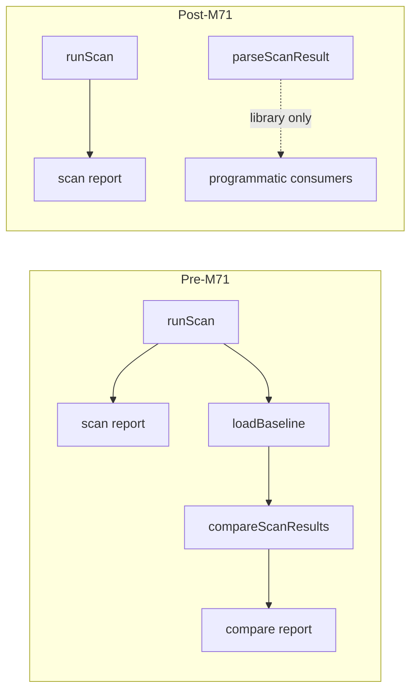

# Milestone 71 — Remove Compare & Baseline Design

**Spec**: [spec.md](./spec.md)  
**Context**: [context.md](./context.md)  
**Status**: Approved for planning (locked decisions)  
**Depth**: Complex  
**Precedent**: [remove-coupling-analysis/design.md](../remove-coupling-analysis/design.md) (M56)

---

## Architecture Overview

M71 is a **subtractive** breaking change. The product shrinks from:

```text
git → NCLOC → score → report
                 ↘ optional baseline → compare → delta report
```

to scan-only:

```text
git log → NCLOC → scoring → report (table / JSON / markdown / CSV)
```

Scan JSON stays **`version: "3.0"`**. Compare contract is deleted entirely. `parseScanResult` relocates to **`src/scan-result/`** with renamed **`ScanResultParseError`**.



### Safe removal order (compile + contract)

| Step | Why this order |
| ---- | -------------- |
| 1. Relocate `parseScanResult` + rename error + unit tests | Keep the one retained API compiling before deletes |
| 2. Strip CLI commands/flags + completions + scan-actions compare wiring | Stop bin from importing compare |
| 3. Delete compare domain leftovers + Compare* types + `#compare` + public compare exports | Domain gone after callers gone |
| 4. Delete report compare modules + scan index/glossary/summary compare branches | Report layer cleanup |
| 5. Delete compare schema export + retarget contract tests | Contract SoT matches product |
| 6. Purge fixtures + integration/parity; add negative CLI tests | Test tree matches product |
| 7. Living docs / skills / rules / AGENTS | Match shipped behavior |
| 8. Full gate | Prove green tree |

**Compile note:** Between early deletes and end of producer cleanup, full `pnpm build` may briefly be red. Tasks use **targeted Vitest gates** on owned paths until the tree reconnects; full `pnpm build && pnpm test` is the final task. Do not leave empty compare stubs.

**Historical specs:** Do not edit Done sister specs beyond optional one-line supersession in ROADMAP/STATE — not in those feature folders’ Status fields.

---

## Code Reuse Analysis

### Existing patterns to leverage

| Pattern | Location | How to use |
| ------- | -------- | ---------- |
| Hard-cut removal | M56 remove-coupling-analysis | Sequential delete map; no shim; supersession in ROADMAP/STATE |
| Scan explain (keep) | `src/report/explain.ts`, bin scan path | Leave scan `--explain` / `--fail-on-explain-miss` untouched |
| Shared path column | `src/report/path-column.ts` | Keep — used by scan table |
| Contract tests | `tests/contract/json-schema.test.ts` | Drop compare-result cases; keep scan `"3.0"` |
| CLI unknown → exit 2 | Commander + `CliUsageError` patterns | Negative tests for removed commands/flags |
| Public entry trim | `src/index.ts` (M55/M56 style) | Export parse only from former compare surface |

### Integration points

| System | Change |
| ------ | ------ |
| `bin/hotspot-scanner.ts`, `bin/scan-actions.ts`, `bin/completion-scripts.ts` | Remove compare/baseline/`--strict`/`--baseline` |
| `src/scan-result/` (**new**) | Home for `parseScanResult` + `ScanResultParseError` |
| `src/compare/` | **Delete entire directory** after relocation |
| `src/report/compare-*`, `explain-compare`, `slice-compare` | Delete; scrub index/summary/glossary compare branches |
| `src/types/domain.ts` | Remove Compare* / RankChange |
| `schemas/compare-result.json` | Delete; drop package export |
| `package.json` | Drop `#compare` and `./schemas/compare-result.json` export |
| `src/index.ts` | Export parse + parse error only from former compare surface |
| Docs / skills / AGENTS / fragile-areas | Scan-only; remove COMPARE_SINCE_MISMATCH / `--strict` |

**No new patterns** beyond relocating `parseScanResult` into `src/scan-result/`.

---

## Components

### Scan-result parse module (retained)

- **Purpose**: Validate/parse scan JSON (`version: "3.0"`) for programmatic consumers
- **Location**: `src/scan-result/parse-scan-result.ts` + `index.ts` + co-located unit test
- **Interfaces**:
  - `parseScanResult(raw: unknown): ScanResult`
  - `class ScanResultParseError extends Error` (no `BaselineError` alias)
- **Dependencies**: `src/types` (`ScanResult`, hotspot/meta shapes)
- **Reuses**: Logic from today’s `src/compare/load-baseline.ts` (`parseScanResult` body); drop `loadBaseline` / fs I/O; rewrite hint strings to scan-only (no `baseline save`)
- **Package surface**: Re-export from `src/index.ts` only — **no** `#scan-result` alias

### CLI surface (shrunk)

- **Purpose**: Scan / init / config / doctor / completion only
- **Location**: `bin/hotspot-scanner.ts`, `bin/scan-actions.ts`, `bin/completion-scripts.ts`
- **Remove**: `compare`, `baseline save`, `--baseline`, `--strict`, compare explain/strict/render/baseline-write helpers
- **Keep**: scan `--explain`, `--fail-on-explain-miss`, formats, `--output`, warnings bookend lifecycle for **scan** only

### Compare domain deletion

- **Purpose**: Remove dual-path domain
- **Location**: delete `src/compare/**` after T1 relocation (including `compare.ts`, `keys.ts`, `load-baseline.ts`, tests, barrel)
- **Types**: delete `CompareResult`, `CompareMeta`, `HotspotCompareSection`, `RankChange` from `src/types/domain.ts` (+ barrel)

### Report compare deletion

- **Purpose**: Remove delta reporters
- **Location**: delete `compare-table|markdown|json|csv|triage`, `explain-compare`, `slice-compare` (+ tests); scrub `src/report/index.ts`, `summary.ts`, `glossary.ts` compare branches
- **Keep**: scan reporters + shared helpers (`path-column`, `only`, `color`, scan explain, etc.)

### Contract / package

- **Purpose**: Publish scan-only schemas and imports
- **Location**: delete `schemas/compare-result.json`; trim `package.json` exports + `#compare`; update `tests/contract/json-schema.test.ts`

### Documentation / agent surface

- **Purpose**: Align SoT and agent guidance with scan-only product
- **Location**: see Docs touch list below

---

## Delete map (inventory)

### CLI / bin

| Path / symbol | Action |
| ------------- | ------ |
| Subcommands `compare`, `baseline` / `baseline save` | Delete |
| `scan --baseline`, `--strict` | Delete |
| `writeCompareExplainBlock`, `enforceStrictCompare`, `executeCompareAndRender`, `writeBaselineJson` | Delete |
| Completions: compare/baseline flags | Strip |
| Scan `--explain` / `--fail-on-explain-miss` | **Keep** |

### Domain / types / package

| Path | Action |
| ---- | ------ |
| `src/compare/**` | Delete after relocate |
| `src/scan-result/**` | **Create** (parse + error) |
| `CompareResult`, `CompareMeta`, `HotspotCompareSection`, `RankChange` | Delete from `domain.ts` |
| `src/index.ts` compare exports | Trim to parse + `ScanResultParseError` |
| `package.json` `#compare` | Delete |
| `package.json` `./schemas/compare-result.json` | Delete |

### Report

| Path | Action |
| ---- | ------ |
| `src/report/compare-{table,markdown,json,csv,triage}.ts` (+tests) | Delete |
| `src/report/explain-compare.ts` (+test) | Delete |
| `src/report/slice-compare.ts` (+test) | Delete |
| `index` / `summary` / `glossary` compare branches | Scrub |
| `path-column.ts` and other shared scan helpers | **Keep** |

### Schemas / fixtures / tests

| Path | Action |
| ---- | ------ |
| `schemas/compare-result.json` | Delete |
| `tests/fixtures/report/compare-*.json` | Delete |
| Compare unit/integration/contract cases | Delete or rewrite to scan-only / negative CLI |
| `parseScanResult` unit tests | Retain/move under `src/scan-result/` |

### Warnings

| Code | Action |
| ---- | ------ |
| `COMPARE_SINCE_MISMATCH` | Remove emitters + docs row |

---

## Exit-code table (post-M71)

| Exit code | Meaning |
| --------- | ------- |
| `0` | Scan completed successfully (`--explain` miss without `--fail-on-explain-miss` also exits `0`) |
| `1` | `--fail-on-explain-miss` with missing explain target |
| `2` | Invalid CLI args (including unknown `compare` / `baseline` / `--baseline` / `--strict`), invalid/missing config, usage errors |
| `130` | Cancelled by `SIGINT` |
| `143` | Cancelled by `SIGTERM` |

**Removed:** exit `1` for `--strict` + `COMPARE_SINCE_MISMATCH`; exit `2` specifically for baseline load/`BaselineError` (loader gone). `ScanResultParseError` is library-only unless future callers wrap it — CLI no longer loads baselines.

---

## Docs touch list (Execute T7)

| Area | Files (representative) |
| ---- | ---------------------- |
| Product | `README.md`, `docs/recipes.md`, `docs/warning-codes.md`, `AGENTS.md` (exit table), `.specs/project/PROJECT.md` |
| Codebase SoT | `ARCHITECTURE.md`, `STRUCTURE.md`, `TESTING.md`, `CONCERNS.md`, `INTEGRATIONS.md` (baseline/compare mentions) |
| Agents / skills / rules | `.cursor/skills/vitals-pipeline-domain/SKILL.md`, `.cursor/skills/vitals-cli-validation/SKILL.md`, `.cursor/skills/vitals-common/references/vitals-project.md`, `.cursor/rules/fragile-areas.mdc`, `.cursor/rules/integrations.mdc` |
| Completions / help | `bin/completion-scripts.ts` (also T2), help examples in `bin/hotspot-scanner.ts` |
| Supersession | ROADMAP/STATE already point at M71; do **not** rewrite Done sister feature specs |

---

## Error Handling Strategy

| Scenario | Handling | User impact |
| -------- | -------- | ----------- |
| `compare` / `baseline` argv | Commander unknown command | Exit `2` |
| `scan --baseline` / `--strict` | Commander unknown option | Exit `2` |
| Invalid JSON to `parseScanResult` | `ScanResultParseError` + scan-oriented hint | Library throw; no CLI baseline path |
| `--explain` miss + `--fail-on-explain-miss` | Existing scan path | Exit `1` |
| Leftover baseline files on disk | Ignored | User deletes manually |

---

## Tech Decisions

| Decision | Choice | Rationale |
| -------- | ------ | --------- |
| Soft deprecation? | No — hard cut | M56 precedent; YAGNI |
| Keep `parseScanResult`? | Yes | Locked public API |
| Error name | `ScanResultParseError` (no alias) | No “baseline” in public API |
| Module home | `src/scan-result/` | Clean; avoids `contract` vs `schemas/` confusion |
| New `#scan-result` alias? | No | YAGNI; export via `src/index.ts` |
| Scan JSON version | Stay `"3.0"` | Scan shape unchanged |
| Sister Done specs | Leave historical | M71 owns supersession |

---

## Risks (from CONCERNS.md)

| Fragile area | M71 mitigation |
| ------------ | -------------- |
| Compare / baseline (`src/compare/`, fragile-areas rule) | Entire module deleted after relocate; rewrite fragile-areas to `src/scan-result/` + scan schema only |
| JSON schemas / contract tests | Delete compare schema; keep scan `"3.0"` contract tests mandatory |
| Dual CLI paths / scan-actions complexity | Strip compare helpers in one CLI task; reduce compose risk |
| Docs / skills drift | Dedicated docs task + `rg` checklist excluding historical `.specs/features/**` |
| Coverage per-file | Deleting modules removes threshold targets; ensure no orphan imports leave empty stubs |
| Exit-code / warning docs drift | Explicit AGENTS + warning-codes updates in docs task |

---

## Check 5 — Path ownership (task planning)

| Owner prefix | Tasks that may edit |
| ------------ | ------------------- |
| `src/scan-result/` (+ move from `src/compare/load-baseline.ts` parse path) | T1 |
| `bin/` (CLI, scan-actions, completions + tests) | T2 |
| `src/compare/` delete + `src/types/` Compare* + `src/index.ts` + `package.json` `#compare` | T3 |
| `src/report/` compare modules + index/summary/glossary scrub | T4 |
| `schemas/` + `tests/contract/` + `package.json` schema export | T5 |
| `tests/fixtures/` + remaining integration/CLI negative tests | T6 |
| Docs / skills / rules / AGENTS / PROJECT / ROADMAP living notes | T7 |
| Gate only | T8 |

No `[P]` across overlapping producers — sequential removal is safer for Complex hard cut.

---

## `.specs/codebase/` refresh (Execute)

On Done, update at least: ARCHITECTURE (drop baseline/compare commands and optional compare step), STRUCTURE (module map: `src/scan-result/`, no `src/compare/`), TESTING (fixtures/contract notes), CONCERNS (compare/baseline fragile row → parse/scan-result), INTEGRATIONS (`loadBaseline` mentions), fragile-areas / integrations rules. PROJECT/README vision: scan-only pipeline.
