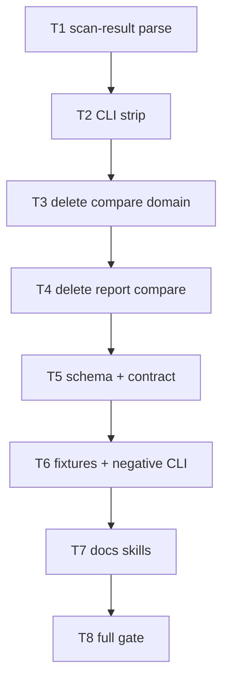

# Milestone 71 — Remove Compare & Baseline Tasks

**Design**: [design.md](./design.md)  
**Spec**: [spec.md](./spec.md)  
**Context**: [context.md](./context.md)  
**Status**: Planned

---

## Execution Plan

### Phase 1: Retain parse API (Sequential)

```
T1 relocate parseScanResult + ScanResultParseError + unit tests
```

### Phase 2: Stop calling compare (Sequential)

```
T1 → T2 strip CLI + completions + scan-actions
T2 → T3 delete compare domain + types + #compare + public compare exports
T3 → T4 delete report compare modules
T4 → T5 delete compare schema + contract tests
```

### Phase 3: Tests + docs + gate (Sequential)

```
T5 → T6 purge fixtures + negative CLI tests
T6 → T7 living docs / skills / rules / AGENTS
T7 → T8 full project gate
```



### Diagram-Definition Cross-Check

| Task | Depends on (declared) | Diagram shows | Match |
| ---- | --------------------- | ------------- | ----- |
| T1 | None | Root | ✅ |
| T2 | T1 | T1→T2 | ✅ |
| T3 | T2 | T2→T3 | ✅ |
| T4 | T3 | T3→T4 | ✅ |
| T5 | T4 | T4→T5 | ✅ |
| T6 | T5 | T5→T6 | ✅ |
| T7 | T6 | T6→T7 | ✅ |
| T8 | T7 | T7→T8 | ✅ |

### Path Conflict Check (Check 5)

| Task | Module owner | Paths (primary) | Conflict with parallel peers |
| ---- | ------------ | --------------- | ---------------------------- |
| T1 | `src/scan-result/` (+ temporary `src/compare/load-baseline.ts` trim) | New module; move parse from load-baseline; update re-exports so tree compiles | Sole — sequential |
| T2 | `bin/` | `bin/hotspot-scanner.ts`, `scan-actions.ts`, `completion-scripts.ts` (+tests) | After T1 |
| T3 | compare delete + types + index + `#compare` | Delete `src/compare/**`; `src/types/domain.ts`; `src/index.ts`; `package.json` imports `#compare` | After T2; no report deletes yet |
| T4 | `src/report/` | Delete compare-* / explain-compare / slice-compare; scrub index/summary/glossary | After T3 |
| T5 | schemas + contract | Delete `schemas/compare-result.json`; package schema export; `tests/contract/**` | After T4 |
| T6 | fixtures + CLI negative | `tests/fixtures/report/compare-*.json`; remaining integration/CLI tests | After T5 |
| T7 | docs / skills | `.specs/codebase/*`, README, AGENTS, recipes, warning-codes, vitals-* skills, fragile-areas, integrations rule, PROJECT | After T6 |
| T8 | gate | none (run only) | After T7 |

> **[P]**: None. Overlapping type/compile surface makes parallel unsafe for this hard cut.

### Test Co-location Validation

| Task | Code layer | TESTING.md expectation | Tests in same task | Match |
| ---- | ---------- | ---------------------- | ------------------ | ----- |
| T1 | parse / scan-result | Unit | `src/scan-result/parse-scan-result.test.ts` | ✅ |
| T2 | bin / CLI | Unit (+ CLI) | `bin/*.test.ts`, completion asserts | ✅ |
| T3 | types + public API + delete compare | Unit cleanup | Fix/remove compare unit tests as deleted; export asserts | ✅ |
| T4 | report | Unit | Remove/update co-located report tests with deletes | ✅ |
| T5 | schemas / contract | Contract | `tests/contract/json-schema.test.ts` | ✅ |
| T6 | fixtures + CLI negative | Unit/integration | Negative CLI + fixture purge; fix broken refs | ✅ |
| T7 | docs | none (docs) | Grep/manual checklist in Done when | ✅ |
| T8 | full tree | Full gate | `pnpm build && pnpm test` | ✅ |

---

## Task Breakdown

### T1: Relocate `parseScanResult` + rename `ScanResultParseError`

**What**: Create `src/scan-result/` with `parseScanResult` and `ScanResultParseError` (hard rename from `BaselineError` — **no alias**). Move unit tests for parse from `load-baseline.test.ts`. Update hint copy to scan-only (no `baseline save`). Leave `loadBaseline` / `compareScanResults` in place temporarily (may import/throw `ScanResultParseError`) so later tasks can delete them cleanly. Update barrels/`src/index.ts` exports: export new error name; stop exporting `BaselineError`.

**Where**: `src/scan-result/parse-scan-result.ts`, `src/scan-result/index.ts`, `src/scan-result/parse-scan-result.test.ts`, `src/compare/load-baseline.ts` (trim to load-only or re-export temporarily), `src/compare/index.ts`, `src/index.ts`, leftover `load-baseline.test.ts` (loadBaseline cases only until T3)

**Depends on**: None

**Reuses**: [context.md](./context.md) path + rename locks; existing parse validation in `load-baseline.ts`

**Requirement**: HOTSPOT-1303, HOTSPOT-1304

**Tools**:

- MCP: NONE
- Skill: `vitals-pipeline-domain`, `task-implementer`

**Done when**:

- [ ] `parseScanResult` and `ScanResultParseError` live under `src/scan-result/`
- [ ] No `BaselineError` symbol/export remains (no alias)
- [ ] Parse unit tests green under new path; valid `"3.0"` scan JSON still parses
- [ ] Hint strings have no `baseline save` wording
- [ ] Note: full-repo `pnpm build` may still fail until T2–T5 — acceptable per design if T1 gate green

**Tests**: unit (`src/scan-result/parse-scan-result.test.ts`)

**Gate**: `pnpm exec vitest run src/scan-result`

---

### T2: Strip CLI commands/flags + completions + scan-actions

**What**: Delete subcommands `compare` and `baseline`/`baseline save`; delete scan flags `--baseline` and `--strict`; remove compare-only wiring (`writeCompareExplainBlock`, `enforceStrictCompare`, `executeCompareAndRender`, `writeBaselineJson` and related imports). Update completion scripts. **Keep** scan `--explain`, `--fail-on-explain-miss`, formats, `--output`. Add/adjust bin unit tests for removed surface (unknown command/option → exit `2` may land fully in T6 — at minimum help/completion omit and parse fails).

**Where**: `bin/hotspot-scanner.ts`, `bin/scan-actions.ts`, `bin/completion-scripts.ts`, `bin/hotspot-scanner.test.ts`, `bin/completion-scripts.test.ts`, related bin integration tests as needed for compile

**Depends on**: T1

**Reuses**: Existing scan explain path; Commander unknown-option/command behavior

**Requirement**: HOTSPOT-1300, HOTSPOT-1301, HOTSPOT-1315

**Tools**:

- MCP: NONE
- Skill: `vitals-cli-validation`, `task-implementer`

**Done when**:

- [ ] No `compare` / `baseline` subcommands in Commander tree
- [ ] No `--baseline` / `--strict` on scan
- [ ] Compare-only helpers absent from bin
- [ ] Completions omit removed commands/flags
- [ ] Scan `--explain` / `--fail-on-explain-miss` still wired
- [ ] Bin/completion unit tests green for this slice

**Tests**: unit (`bin/`)

**Gate**: `pnpm exec vitest run bin`

---

### T3: Delete compare domain + Compare* types + public compare exports

**What**: Delete remaining `src/compare/` (after T1 relocation). Remove `CompareResult`, `CompareMeta`, `HotspotCompareSection`, `RankChange` from `src/types/domain.ts` (+ barrels). Trim `src/index.ts` so public API keeps `parseScanResult` + `ScanResultParseError` and drops `compareScanResults` / `loadBaseline` / Compare* types. Remove `package.json` `#compare` import alias. Fix any remaining non-report imports.

**Where**: `src/compare/**` (delete), `src/types/domain.ts`, `src/types/index.ts`, `src/index.ts`, `package.json` (`imports.#compare`), `tsconfig*.json` only if `#compare` paths referenced

**Depends on**: T2

**Reuses**: T1 `src/scan-result/` as sole parse home

**Requirement**: HOTSPOT-1305, HOTSPOT-1308 (domain half), HOTSPOT-1309, HOTSPOT-1311

**Tools**:

- MCP: NONE
- Skill: `vitals-pipeline-domain`, `task-implementer`

**Done when**:

- [ ] `src/compare/` directory gone
- [ ] Compare* / RankChange types gone
- [ ] `src/index.ts` exports match locked public API
- [ ] `#compare` absent from `package.json`
- [ ] No production imports of deleted compare modules remain outside report (report cleaned in T4)
- [ ] Targeted typecheck/build for non-report packages as far as possible

**Tests**: unit cleanup (delete obsolete compare unit tests with the module); assert exports via existing index/smoke tests if present

**Gate**: `pnpm exec vitest run src/scan-result src/types 2>/dev/null; pnpm exec tsc -p tsconfig.json --noEmit` (adjust if report still breaks compile — then `pnpm exec vitest run src/scan-result` + note T4 unblocks full `tsc`; prefer fixing import errors only in owned paths)

---

### T4: Delete report compare modules

**What**: Delete `src/report/compare-*.ts`, `explain-compare.ts`, `slice-compare.ts` and co-located tests. Scrub compare branches from `src/report/index.ts`, `summary.ts`, `glossary.ts`, and any other scan report files that reference compare types/helpers. Keep shared scan helpers (`path-column`, scan explain, etc.).

**Where**: `src/report/**` (compare touchpoints listed in design delete map)

**Depends on**: T3

**Reuses**: Scan reporters unchanged aside from removed compare branches

**Requirement**: HOTSPOT-1308 (report half), HOTSPOT-1310 (emitters in report if any)

**Tools**:

- MCP: NONE
- Skill: `vitals-pipeline-domain`, `task-implementer`

**Done when**:

- [ ] Glob for `src/report/compare-*`, `explain-compare`, `slice-compare` → empty
- [ ] Report index/summary/glossary have no compare-only paths
- [ ] Report unit suite for remaining modules green
- [ ] `pnpm build` expected green after this task (schema export may linger until T5)

**Tests**: unit (`src/report`)

**Gate**: `pnpm exec vitest run src/report && pnpm build`

---

### T5: Remove compare schema export + contract tests

**What**: Delete `schemas/compare-result.json`. Remove `package.json` `"exports"` entry for `./schemas/compare-result.json`. Update `tests/contract/json-schema.test.ts` (and related) to drop compare cases; keep scan `"3.0"` (+ config) contract coverage. Ensure no test or doc fixture in contract tree still requires compare schema.

**Where**: `schemas/compare-result.json` (delete), `package.json` exports, `tests/contract/**`

**Depends on**: T4

**Reuses**: Existing scan contract assertions; locked stay-at-`"3.0"`

**Requirement**: HOTSPOT-1306, HOTSPOT-1307

**Tools**:

- MCP: NONE
- Skill: `vitals-pipeline-domain`

**Done when**:

- [ ] `schemas/compare-result.json` absent
- [ ] Package no longer exports compare schema
- [ ] Contract tests pass for scan `"3.0"` only (no compare-result)
- [ ] Scan schema version unchanged (`"3.0"`)

**Tests**: contract (`tests/contract/json-schema.test.ts`)

**Gate**: `pnpm exec vitest run tests/contract`

---

### T6: Purge fixtures + integration parity; add negative CLI tests

**What**: Delete `tests/fixtures/report/compare-*.json` and any other compare-only fixtures still referenced. Remove/rewrite integration or parity tests that exercised compare/`scan --baseline`/`baseline save`. Add negative CLI tests: unknown `compare` / `baseline` command and unknown `--baseline` / `--strict` → exit `2`. Confirm `COMPARE_SINCE_MISMATCH` absent from runtime test expectations.

**Where**: `tests/fixtures/report/compare-*.json`, `bin/hotspot-scanner.integration.test.ts`, other tests still referencing compare/baseline (grep-driven), negative cases in `bin/*.test.ts`

**Depends on**: T5

**Reuses**: Existing CLI exit-code test patterns

**Requirement**: HOTSPOT-1302, HOTSPOT-1312, HOTSPOT-1310 (test expectations)

**Tools**:

- MCP: NONE
- Skill: `vitals-cli-validation`, `fixture-builder` only if fixture cleanup needs structured replace; else NONE

**Done when**:

- [ ] Compare report fixtures gone / unreferenced
- [ ] No integration tests require compare path
- [ ] Negative CLI tests assert exit `2` for removed commands/flags
- [ ] Grep for `COMPARE_SINCE_MISMATCH` in `src/` / `bin/` / `tests/` → empty (docs deferred to T7)
- [ ] `pnpm build` succeeds

**Tests**: unit/integration (bin + touched suites)

**Gate**: `pnpm build && pnpm exec vitest run bin tests/contract src/scan-result src/report`

---

### T7: Sync living docs / skills / rules / AGENTS

**What**: Update product and SoT docs to scan-only pipeline; strip compare/baseline/`--strict`/`COMPARE_SINCE_MISMATCH` claims; update AGENTS exit-code table (exit `1` = explain-miss only); refresh ARCHITECTURE/STRUCTURE/TESTING/CONCERNS/INTEGRATIONS; update vitals-* skills and fragile-areas/integrations rules to `src/scan-result/` (no `src/compare/`); mark supersession in living docs. Do **not** rewrite historical Done sister feature specs.

**Where**: `README.md`, `docs/recipes.md`, `docs/warning-codes.md`, `AGENTS.md`, `.specs/project/PROJECT.md`, `.specs/codebase/{ARCHITECTURE,STRUCTURE,TESTING,CONCERNS,INTEGRATIONS}.md`, `.cursor/skills/vitals-pipeline-domain/SKILL.md`, `.cursor/skills/vitals-cli-validation/SKILL.md`, `.cursor/skills/vitals-spec-driven/references/vitals-project.md`, `.cursor/rules/fragile-areas.mdc`, `.cursor/rules/integrations.mdc` (and any other living doc hits from grep)

**Depends on**: T6

**Reuses**: [design.md](./design.md) docs touch list; M56 docs-task pattern

**Requirement**: HOTSPOT-1310 (docs), HOTSPOT-1313, HOTSPOT-1314

**Tools**:

- MCP: NONE
- Skill: NONE

**Done when**:

- [ ] Living docs describe scan-only workflows
- [ ] AGENTS exit table has no `--strict` / `COMPARE_SINCE_MISMATCH`
- [ ] warning-codes has no `COMPARE_SINCE_MISMATCH` row
- [ ] Skills/rules point at `src/scan-result/` not compare/baseline loaders
- [ ] Historical sister specs left Done (no Status reopen / content rewrite)
- [ ] Optional `rg` sanity for stale “scan --baseline” / `compareScanResults` in living docs (exclude `.specs/features/**` historical)

**Tests**: none (docs)

**Gate**: Doc checklist complete; optional `rg` sanity as above

---

### T8: Final project gate

**What**: Run full quality gate; fix any residual failures from T1–T7 without expanding scope.

**Where**: repo root (run only)

**Depends on**: T7

**Reuses**: AGENTS.md quality gate

**Requirement**: all HOTSPOT-1300–1315 (verification)

**Tools**:

- MCP: NONE
- Skill: none (or invoke verifier-quality-gates in orchestrator Phase E)

**Done when**:

- [ ] `pnpm build && pnpm test` exits 0
- [ ] No silent test deletions to force green (investigate failures)
- [ ] tasks.md ready to mark Complete by orchestrator after verify phases

**Tests**: full suite with coverage

**Gate**: `pnpm build && pnpm test`

**Commit** (propose only unless user asks): `feat(m71)!: remove compare and baseline (scan-only)`

---

## Requirement → Task Mapping

| Requirement | Task(s) |
| ----------- | ------- |
| HOTSPOT-1300 | T2 |
| HOTSPOT-1301 | T2 |
| HOTSPOT-1302 | T6 (primary); T2 prepares surface |
| HOTSPOT-1303 | T1 |
| HOTSPOT-1304 | T1 |
| HOTSPOT-1305 | T3 |
| HOTSPOT-1306 | T5 |
| HOTSPOT-1307 | T5 |
| HOTSPOT-1308 | T3, T4 |
| HOTSPOT-1309 | T3 |
| HOTSPOT-1310 | T4, T6, T7 |
| HOTSPOT-1311 | T3 |
| HOTSPOT-1312 | T6 |
| HOTSPOT-1313 | T7 |
| HOTSPOT-1314 | T7 |
| HOTSPOT-1315 | T2 |

**Coverage:** 16/16 mapped. No unmapped P1. IDs 1316–1329 reserved.

---

## Parallel Execution Map

```
Phase 1: T1
Phase 2: T2 → T3 → T4 → T5
Phase 3: T6 → T7 → T8
```

All sequential — no `[P]` tasks.

---

## Handoff

Planning complete. Promote **Status** to `Approved` or `Ready for Execute` in a **new** session, then invoke `orchestrator-implementer`.

Expected final gate: `pnpm build && pnpm test`
