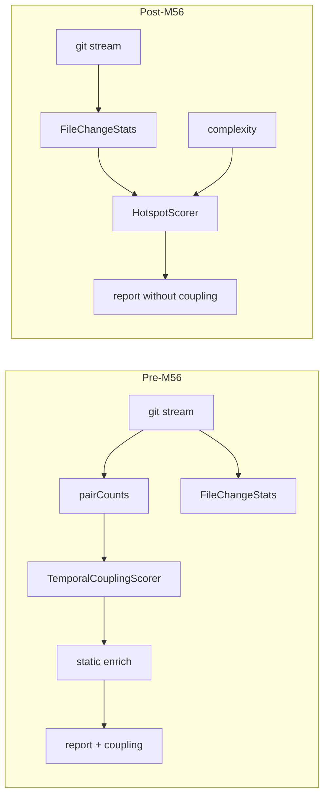

# Milestone 56 — Remove Coupling Analysis Design

**Spec**: [spec.md](./spec.md)  
**Context**: [context.md](./context.md)  
**Status**: Approved for planning (locked decisions)  
**Depth**: Complex

---

## Architecture Overview

M56 is a **subtractive** breaking change. The scan pipeline shrinks from:

```text
git (churn + pairCounts) → complexity → hotspot score + coupling score → enrich → report
```

to:

```text
git (churn only) → complexity → hotspot score → report
```

Optional `--baseline` compare remains for **hotspots** / **functions** only. JSON contract bumps to `"2.0"` without a `coupling` property.



### Safe removal order (compile + contract)

| Step | Why this order |
| ---- | -------------- |
| 1. Schemas + domain types + baseline reject | Contract SoT first; fail closed on old baselines |
| 2. Pipeline producers (scan, compare, reporters, CLI/config) | Stop constructing/emitting removed fields so `pnpm build` can recover |
| 3. Git miner pair/mega-commit | Drop unused aggregation after callers gone |
| 4. Delete coupling-only modules + fixtures | No dangling imports |
| 5. Living docs / skills / vision | Match shipped behavior |
| 6. Full gate | Prove green tree |

**Compile note:** Between step 1 and end of step 2, full `pnpm build` may be red. Tasks use **targeted Vitest gates** on owned paths until producers are updated; full `pnpm build && pnpm test` is the final task. Do not leave empty `coupling: []` stubs.

**Historical specs:** Do not edit Done sister specs beyond optional one-line “superseded by M56” in ROADMAP/STATE — not in those feature folders’ Status fields.

---

## Code Reuse Analysis

### Existing patterns to leverage

| Pattern | Location | How to use |
| ------- | -------- | ---------- |
| Hard-cut breaking change | M18 csv-bundle, M12 removal | No legacy flag; document supersession |
| Baseline reject + re-scan hint | `src/compare/load-baseline.ts` (M20/M27) | Extend for `"2.0"` + reject `coupling` key / `"1.0"` |
| Contract tests | `tests/contract/json-schema.test.ts` | Retarget schemas to 2.0; assert absence of `coupling` |
| Unknown config keys | M55 `UNKNOWN_CONFIG_KEY` | Leftover `minCochange` / `megaCommitThreshold` in user config → warn-only, no apply |
| CSV bundle stem write | `src/report/csv-bundle.ts`, CLI multi-write | Drop coupling keys from `CsvBundle`; compare 3 data CSVs + meta |
| `--only` validation | `src/report/only.ts` | Remove `coupling` from allowed set |

### Integration points

| System | Change |
| ------ | ------ |
| `schemas/*.json` | version enum/const `"2.0"`; remove `coupling` |
| `src/types/domain.ts` | Remove coupling types/fields/options |
| `src/scan.ts` | Stop scoreCoupling / enrichCouplingStaticDeps |
| `src/compare/*` | Remove `compareCoupling`, `couplingKey`, baseline coupling asserts |
| `src/report/*` | Omit coupling from all formats + interpretation UX |
| `src/git/*` | Remove pairCounts path + mega-commit coupling skip |
| `src/config/*`, `bin/*` | Remove flags/keys/completion |
| `src/index.ts` | Drop public coupling exports |
| Docs / skills / `package.json` | Vision + keyword cleanup |

---

## Components (removal / shrink)

### Contract layer

- **Purpose**: Publish and enforce JSON `"2.0"` without coupling; reject legacy baselines
- **Location**: `schemas/`, `src/types/domain.ts`, `src/compare/load-baseline.ts`, `tests/contract/`
- **Interfaces**: `parseScanResult` expects `version === "2.0"`; throws `BaselineError` on `"1.0"` or `'coupling' in json`
- **Reuses**: Existing `BaselineError` + re-scan hint pattern

### Pipeline producers

- **Purpose**: Build `ScanResult` / `CompareResult` and render without coupling
- **Location**: `src/scan.ts`, `src/scoring/index.ts` (exports only), `src/compare/compare.ts`, `src/compare/keys.ts`, `src/report/**`, `src/config/**`, `bin/**`
- **Reuses**: Hotspot/function paths unchanged; interpretation UX keeps hotspot/function rules only

### Git miner shrink

- **Purpose**: Stream-aggregate churn only
- **Location**: `src/git/aggregate.ts`, `canonicalize.ts`, `mega-commit-warnings.ts`, `index.ts`, `src/paths/filter-git.ts`
- **Reuses**: Existing numstat parse + `FileChangeStats`; delete pair/mega coupling branches

### Coupling module deletion

- **Purpose**: Remove dead scoring/enrich/report helpers and fixtures
- **Location**: listed in context.md blast inventory + `tests/fixtures/repos/alias-coupling/`, `package-exports-coupling/`, `tests/fixtures/scoring/coupling-pairs.json`
- **Depends on**: Producers no longer import these modules

### Documentation / agent surface

- **Purpose**: Align vision and SoT docs with complexity+churn product
- **Location**: `.specs/codebase/*`, `.specs/project/PROJECT.md`, README, AGENTS, CONTRIBUTING, `docs/*`, `.cursor/skills/vitals-pipeline-domain/SKILL.md`, `.cursor/rules/fragile-areas.mdc`, `package.json` keywords; STATE ADR-2026-020 revisit

---

## Data Models (post-M56)

```typescript
// Conceptual — Exact fields match existing hotspot/function/meta types minus coupling.
interface ScanResultV2 {
  version: "2.0";
  hotspots: HotspotScore[];
  functions: FunctionHotspotScore[];
  // coupling: removed — do not keep []
  meta: ScanMeta;
}

interface CompareResultV2 {
  version: "2.0";
  hotspots: CompareSection<HotspotScore>;
  functions: CompareSection<FunctionHotspotScore>;
  // coupling: removed
  meta: CompareMeta;
}
```

**Removed types (delete or stop exporting):** `CouplingPair`, `CoChangeEvent`, `CoChangePairCount`, enrich direction/kind enums only used by coupling, `GitMinerResult.pairCounts`, `DEFAULT_MIN_COCHANGE`, `createTemporalCouplingScorer`.

**CSV scan keys (post):** `meta.json` + (`hotspots.csv` XOR `functions.csv`) — no `coupling.csv`.  
**CSV compare keys (post):** ranking trio only + `meta.json` — no coupling trio.

---

## Error Handling Strategy

| Scenario | Handling | User impact |
| -------- | -------- | ----------- |
| Baseline `version: "1.0"` | `BaselineError` + re-scan hint | Exit ≠ 0; must re-scan |
| Baseline has `coupling` | `BaselineError` + re-scan hint | Exit ≠ 0 |
| Unknown CLI `--min-cochange` | Commander unknown option | Exit ≠ 0 |
| `--only coupling` | Validation error listing `hotspots, functions` | Exit ≠ 0 |
| Config still has `minCochange` / `megaCommitThreshold` | Warn-only unknown key (M55); values not applied | Scan continues without coupling knobs |

---

## Tech Decisions

| Decision | Choice | Rationale |
| -------- | ------ | --------- |
| Empty `coupling: []`? | No | Hard cut; contract clarity |
| Header-only coupling CSV? | No | Omit files; supersede M18 always-emit |
| Config leftover keys | Unknown-key warn | Matches M55; no silent apply |
| Delete vs stub enrich modules | Delete | YAGNI; coverage thresholds on dead files |
| ADR-2026-020 | Revisit wording | Stream still single-pass for churn; coupling half removed |
| Sister Done specs | Leave historical | Avoid rewriting history; M56 owns supersession |

---

## Risks (from CONCERNS.md)

| Fragile area | M56 mitigation |
| ------------ | -------------- |
| Git streaming / pair aggregation | Remove pair path carefully; keep churn aggregation tests green; delete mega-commit coupling warnings |
| JSON schemas / baseline | Strong reject of 1.0 and `coupling`; contract tests mandatory in T1 |
| Scoring formulas | Do not touch hotspot harmonic combiner |
| CSV bundle consumers | Document breaking path set in README/recipes |
| Coverage per-file | Deleting modules removes threshold targets; ensure no orphan imports leave empty stubs |
| Dual-stream docs drift | Docs task must scrub ARCHITECTURE/CONCERNS/skills in one pass |

---

## Check 5 — Path ownership (task planning)

| Owner prefix | Tasks that may edit |
| ------------ | ------------------- |
| `schemas/` + `src/types/` + `src/compare/load-baseline.ts` + `tests/contract/` | T1 |
| `src/scan.ts` + `src/scoring/index.ts` (wiring/exports only) | T2 |
| `src/compare/` (except load-baseline already done) | T3 |
| `src/report/` | T4 |
| `src/config/` + `bin/` + `src/index.ts` | T5 |
| `src/git/` + `src/paths/filter-git.ts` | T6 |
| Delete coupling modules + fixtures + leftover report helpers | T7 |
| Docs / skills / rules / PROJECT / package.json keyword / STATE ADR | T8 |
| Gate only | T9 |

No `[P]` across overlapping producers — sequential removal is safer for Complex hard cut.

---

## `.specs/codebase/` refresh (Execute)

On Done, update at least: ARCHITECTURE (pipeline diagram, enriched coupling section remove/supersede), CONCERNS (coupling rows), STRUCTURE (module map), TESTING (fixture list / contract notes), INTEGRATIONS if coupling mentioned. PROJECT.md vision: hotspots = complexity + churn only.
