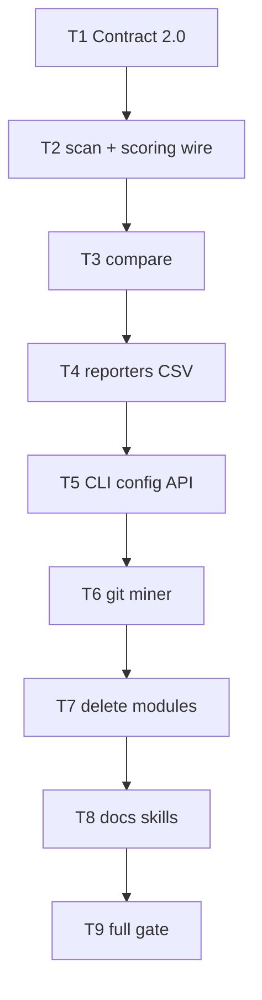

# Milestone 56 — Remove Coupling Analysis Tasks

**Design**: [design.md](./design.md)  
**Spec**: [spec.md](./spec.md)  
**Context**: [context.md](./context.md)  
**Status**: Planned

---

## Execution Plan

### Phase 1: Contract (Sequential)

```
T1 schemas 2.0 + types + baseline reject + contract/unit tests
```

### Phase 2: Stop emitting coupling (Sequential)

```
T1 → T2 scan + scoring wiring
T2 → T3 compare (non-baseline)
T3 → T4 reporters / interpretation / CSV
T4 → T5 CLI + config + completion + public exports
```

### Phase 3: Git miner + delete (Sequential)

```
T5 → T6 git miner + filter-git (pairCounts / mega-commit)
T6 → T7 delete coupling modules + fixtures + orphan tests
```

### Phase 4: Docs + gate (Sequential)

```
T7 → T8 living docs / skills / rules / PROJECT / keyword / ADR
T8 → T9 full project gate
```



### Diagram-Definition Cross-Check

| Task | Depends on (declared) | Diagram shows | Match |
| ---- | --------------------- | ------------- | ----- |
| T1 | None | Root | ✅ |
| T2 | T1 | T1→T2 | ✅ |
| T3 | T2 | T2→T3 | ✅ |
| T4 | T3 | T3→T4 | ✅ |
| T5 | T4 | T4→T5 | ✅ |
| T6 | T5 | T5→T6 | ✅ |
| T7 | T6 | T6→T7 | ✅ |
| T8 | T7 | T7→T8 | ✅ |
| T9 | T8 | T8→T9 | ✅ |

### Path Conflict Check (Check 5)

| Task | Module owner | Paths (primary) | Conflict with parallel peers |
| ---- | ------------ | --------------- | ---------------------------- |
| T1 | schemas + types + compare/load-baseline + contract | `schemas/*.json`, `src/types/domain.ts`, `src/compare/load-baseline.ts` (+test), `tests/contract/**` | Sole — sequential |
| T2 | scan + scoring index | `src/scan.ts` (+integration as needed), `src/scoring/index.ts` | After T1; do not delete scorer files yet |
| T3 | compare | `src/compare/compare.ts`, `keys.ts` (+tests); **not** re-open load-baseline except import fix | After T2 |
| T4 | report | `src/report/**` (table, md, json, csv, slice, summary, glossary, triage, only, color, compare-*, coupling-format) | After T3 |
| T5 | config + bin + index | `src/config/**`, `bin/**`, `src/index.ts` | After T4 |
| T6 | git + paths | `src/git/**`, `src/paths/filter-git.ts` | After T5 |
| T7 | scoring delete + fixtures | Delete coupling scoring/enrich/map modules + tests; fixture trees; sample JSON coupling fields | After T6; no imports remain |
| T8 | docs / skills | `.specs/codebase/*`, PROJECT, README, AGENTS, CONTRIBUTING, `docs/*`, pipeline-domain skill, fragile-areas, package.json keyword, STATE ADR | After T7 |
| T9 | gate | none (run only) | After T8 |

> **[P]**: None. Overlapping type/compile surface makes parallel unsafe for this hard cut.

### Test Co-location Validation

| Task | Code layer | TESTING.md expectation | Tests in same task | Match |
| ---- | ---------- | ---------------------- | ------------------ | ----- |
| T1 | schemas, load-baseline, types | Unit + contract | `load-baseline.test.ts`, `tests/contract/json-schema.test.ts` | ✅ |
| T2 | scan / scoring wire | Integration/unit as touched | Update `scan` / scoring index tests; drop coupling asserts | ✅ |
| T3 | compare | Unit | `compare.test.ts`, `keys.test.ts` | ✅ |
| T4 | report | Unit | Co-located report `*.test.ts` for touched files | ✅ |
| T5 | config + bin | Unit (+ CLI) | config + `bin/*.test.ts` / completion asserts | ✅ |
| T6 | git / filter-git | Unit | aggregate / canonicalize / mega-commit / filter-git tests | ✅ |
| T7 | deletions | Unit/integration cleanup | Remove orphan tests; fix any remaining refs | ✅ |
| T8 | docs | none (docs) | Grep/manual checklist in Done when | ✅ |
| T9 | full tree | Full gate | `pnpm build && pnpm test` | ✅ |

---

## Task Breakdown

### T1: Schemas 2.0 + domain types + baseline reject

**What**: Bump JSON schemas and domain types to `"2.0"` without top-level `coupling`; remove coupling-only domain types/options from `domain.ts`; update `parseScanResult` / `loadBaseline` to accept only `"2.0"`, reject `"1.0"`, and reject any payload with a top-level `coupling` key via `BaselineError` + re-scan hint. Update contract + load-baseline tests.

**Where**: `schemas/scan-result.json`, `schemas/compare-result.json`, `src/types/domain.ts`, `src/compare/load-baseline.ts`, `src/compare/load-baseline.test.ts`, `tests/contract/json-schema.test.ts` (and related contract fixtures)

**Depends on**: None

**Reuses**: [context.md](./context.md) JSON + baseline decisions; M20/M27 `BaselineError` hint pattern

**Requirement**: HOTSPOT-890, HOTSPOT-891, HOTSPOT-892, HOTSPOT-893, HOTSPOT-894, HOTSPOT-895, HOTSPOT-896

**Tools**:

- MCP: NONE
- Skill: `vitals-pipeline-domain` (contract orientation)

**Done when**:

- [ ] Schemas describe `version: "2.0"` and do not require/define top-level `coupling`
- [ ] `ScanResult` / `CompareResult` types have no `coupling`; coupling-only option fields removed from scan options types as applicable
- [ ] `parseScanResult` rejects `1.0` and rejects presence of `coupling`
- [ ] Valid minimal `"2.0"` baseline without `coupling` parses
- [ ] Contract + load-baseline tests updated and passing for this slice
- [ ] Note: full-repo `pnpm build` may still fail until T2–T5 — acceptable per design

**Tests**: unit (`load-baseline.test.ts`) + contract (`tests/contract/json-schema.test.ts`)

**Gate**: `pnpm exec vitest run src/compare/load-baseline.test.ts tests/contract/json-schema.test.ts`

---

### T2: Stop scan + scoring wiring from coupling

**What**: Update `runScan` / scoring barrel so the pipeline no longer scores temporal coupling or runs static enrich; construct `ScanResult` at version `"2.0"` without `coupling`. Adjust scoring `index.ts` exports (stop exporting coupling factories/defaults). Leave coupling module **files** in place until T7 if needed for incremental compile — prefer stop all imports from scan.

**Where**: `src/scan.ts`, `src/scan.integration.test.ts` (and related scan tests), `src/scoring/index.ts`

**Depends on**: T1

**Reuses**: Hotspot / function scoring paths unchanged

**Requirement**: HOTSPOT-897

**Tools**:

- MCP: NONE
- Skill: `vitals-pipeline-domain`, `task-implementer`

**Done when**:

- [ ] `runScan` never calls coupling scorer or `enrichCouplingStaticDeps`
- [ ] Returned `ScanResult.version === "2.0"` and has no `coupling` property
- [ ] Integration/unit tests that asserted `coupling` length/content updated or removed
- [ ] No new empty `coupling: []` stub

**Tests**: unit/integration for scan as touched

**Gate**: `pnpm exec vitest run src/scan.integration.test.ts src/scoring/index.ts` (adjust to actual scoring index test path if present; include updated scan tests)

---

### T3: Compare without coupling

**What**: Remove `compareCoupling` / coupling sections from `compareScanResults` and `couplingKey` from keys helper; `CompareResult` is `"2.0"` without `coupling`. Update compare unit tests.

**Where**: `src/compare/compare.ts`, `src/compare/keys.ts`, `src/compare/compare.test.ts`, `src/compare/keys.test.ts` (paths as exist)

**Depends on**: T2

**Reuses**: Hotspot/function compare unchanged; baseline already 2.0 from T1

**Requirement**: HOTSPOT-898

**Tools**:

- MCP: NONE
- Skill: `vitals-pipeline-domain`

**Done when**:

- [ ] Compare output has no `coupling` section
- [ ] `couplingKey` and coupling compare helpers removed
- [ ] Unit tests pass without coupling cases (or cases assert absence)

**Tests**: unit (`compare` / `keys`)

**Gate**: `pnpm exec vitest run src/compare/compare.test.ts src/compare/keys.test.ts`

---

### T4: Reporters omit coupling (including CSV)

**What**: Remove coupling from table, markdown, JSON, CSV bundle, slice, summary, glossary, triage, color, compare reporters, and `--only` allowed values (`hotspots` \| `functions` only). Omit `{stem}.coupling.csv` and compare `coupling.*.csv` (not header-only). Delete or hollow `coupling-format` if unused. Update all co-located report tests and sample JSON fixtures under report fixtures as needed for compile of this layer.

**Where**: `src/report/**` (all coupling touchpoints listed in surface inventory)

**Depends on**: T3

**Reuses**: M18 CSV stem layout minus coupling keys; M41 interpretation without coupling rules

**Requirement**: HOTSPOT-899, HOTSPOT-900, HOTSPOT-901

**Tools**:

- MCP: NONE
- Skill: `vitals-pipeline-domain`

**Done when**:

- [ ] Human formats have no coupling sections
- [ ] JSON render has no `coupling` key
- [ ] CSV bundle keys exclude all `coupling*` files
- [ ] `--only coupling` invalid; error lists `hotspots, functions`
- [ ] Report unit tests green

**Tests**: unit (touched `src/report/*.test.ts`)

**Gate**: `pnpm exec vitest run src/report`

---

### T5: CLI, config, completion, public API

**What**: Remove `--min-cochange` and `--mega-commit-threshold` from Commander wiring and scan-actions; remove `minCochange` / `megaCommitThreshold` from config merge + exemplar; update completion scripts; strip coupling exports from `src/index.ts`. Ensure leftover config keys warn-only (M55) and are not applied.

**Where**: `bin/hotspot-scanner.ts`, `bin/scan-actions.ts`, `bin/completion-scripts.ts` (+tests), `src/config/merge-options.ts`, `load-config.ts`, `exemplar.ts` (+tests), `src/index.ts`

**Depends on**: T4

**Reuses**: M55 unknown-key warn; M38 CLI patterns

**Requirement**: HOTSPOT-902, HOTSPOT-903, HOTSPOT-907, HOTSPOT-912

**Tools**:

- MCP: NONE
- Skill: `vitals-cli-validation`

**Done when**:

- [ ] Flags absent from help/parse; unknown if passed
- [ ] Exemplar/docs keys omit `minCochange` / `megaCommitThreshold`
- [ ] Completion omits removed flags and `coupling` only-value
- [ ] `src/index.ts` does not export coupling scorers/types
- [ ] CLI/config unit tests green
- [ ] `pnpm build` expected green after this task (modules may still exist unused until T7)

**Tests**: unit (bin + config)

**Gate**: `pnpm exec vitest run bin src/config && pnpm build`

---

### T6: Git miner — remove pairCounts and mega-commit coupling

**What**: Remove stream `pairCounts` aggregation, `canonicalizePairCounts`, mega-commit coupling skip / `MEGA_COMMIT_SKIPPED`, and `GitMinerResult.pairCounts`. Update `filter-git` to stop filtering pairCounts. Update/delete related unit tests.

**Where**: `src/git/aggregate.ts`, `canonicalize.ts`, `mega-commit-warnings.ts`, `index.ts` (+tests), `src/paths/filter-git.ts` (+tests)

**Depends on**: T5

**Reuses**: Churn/`FileChangeStats` aggregation unchanged; PathAliasMap unchanged

**Requirement**: HOTSPOT-904, HOTSPOT-911

**Tools**:

- MCP: NONE
- Skill: `vitals-pipeline-domain`

**Done when**:

- [ ] No `pairCounts` on miner result
- [ ] No `canonicalizePairCounts` / mega-commit coupling skip path
- [ ] No `MEGA_COMMIT_SKIPPED` emission
- [ ] Git/filter unit tests green

**Tests**: unit (`src/git`, `src/paths/filter-git`)

**Gate**: `pnpm exec vitest run src/git src/paths/filter-git.test.ts`

---

### T7: Delete coupling-only modules, tests, and fixtures

**What**: Delete coupling scorer, enrich, tsconfig-path-map, package-exports-map (and tests); any remaining coupling-only report helpers; fixtures `alias-coupling`, `package-exports-coupling`, `tests/fixtures/scoring/coupling-pairs.json`; scrub sample report/baseline fixtures still containing `coupling`. Remove orphan test files that only covered deleted modules. Fix any remaining references so the tree compiles.

**Where**: `src/scoring/coupling-scorer.ts*`, `enrich-coupling-static.ts*`, `tsconfig-path-map.ts*`, `package-exports-map.ts*`, related report leftovers, `tests/fixtures/repos/alias-coupling/**`, `tests/fixtures/repos/package-exports-coupling/**`, `tests/fixtures/scoring/coupling-pairs.json`, other fixture JSON still listing `coupling`

**Depends on**: T6

**Reuses**: N/A (deletion)

**Requirement**: HOTSPOT-905, HOTSPOT-906

**Tools**:

- MCP: NONE
- Skill: `fixture-builder` only if fixture cleanup needs structured replace; else NONE

**Done when**:

- [ ] Glob for deleted module basenames under `src/` returns empty
- [ ] Coupling-only fixture trees gone / unreferenced
- [ ] No test imports deleted modules
- [ ] `pnpm build` succeeds

**Tests**: cleanup + `pnpm build` (run targeted vitest on any remaining broken suites fixed in this task)

**Gate**: `pnpm build && pnpm exec vitest run src bin tests/contract`

---

### T8: Living docs, skills, vision, ADR revisit

**What**: Update product vision and SoT docs so hotspots = complexity + churn only; remove temporal-coupling product claims; scrub warning-codes / recipes; update `vitals-pipeline-domain` skill and `fragile-areas` rule; remove `temporal-coupling` from `package.json` keywords; revisit ADR-2026-020 in STATE (stream feeds churn only); note M56 supersession of historical coupling milestones without reopening Done sister specs.

**Where**: `.specs/project/PROJECT.md`, `.specs/codebase/{ARCHITECTURE,CONCERNS,STRUCTURE,TESTING,INTEGRATIONS}.md`, `README.md`, `AGENTS.md`, `CONTRIBUTING.md`, `docs/recipes.md`, `docs/warning-codes.md`, `.cursor/skills/vitals-pipeline-domain/SKILL.md`, `.cursor/rules/fragile-areas.mdc`, `package.json`, `.specs/project/STATE.md` (ADR row), `.cursor/skills/vitals-spec-driven/references/vitals-project.md` if it still lists coupling flags

**Depends on**: T7

**Reuses**: [design.md](./design.md) docs refresh list; roadmap-sync conventions

**Requirement**: HOTSPOT-908, HOTSPOT-909, HOTSPOT-910

**Tools**:

- MCP: NONE
- Skill: NONE

**Done when**:

- [ ] PROJECT/README/AGENTS vision: no temporal coupling as capability
- [ ] Codebase SoT docs match post-M56 pipeline
- [ ] Skills/rules/keywords updated
- [ ] ADR-2026-020 revisited in STATE
- [ ] Historical sister specs left Done (no Status reopen)

**Tests**: none (docs)

**Gate**: Doc checklist complete; optional `rg` sanity for stale “TemporalCouplingScorer” in living docs (exclude `.specs/features/**` historical)

---

### T9: Final project gate

**What**: Run full quality gate; fix any residual failures from T1–T8 without expanding scope.

**Where**: repo root (run only)

**Depends on**: T8

**Reuses**: AGENTS.md quality gate

**Requirement**: all HOTSPOT-890–912 (verification)

**Tools**:

- MCP: NONE
- Skill: none (or invoke verifier-quality-gates in orchestrator Phase E)

**Done when**:

- [ ] `pnpm build && pnpm test` exits 0
- [ ] No silent test deletions to force green (investigate failures)
- [ ] tasks.md ready to mark Complete by orchestrator after verify phases

**Tests**: full suite with coverage

**Gate**: `pnpm build && pnpm test`

**Commit** (propose only unless user asks): `feat(m56)!: remove temporal coupling analysis (JSON 2.0)`

---

## Requirement → Task Mapping

| Requirement | Task(s) |
| ----------- | ------- |
| HOTSPOT-890 | T1 |
| HOTSPOT-891 | T1 |
| HOTSPOT-892 | T1 |
| HOTSPOT-893 | T1 |
| HOTSPOT-894 | T1 |
| HOTSPOT-895 | T1 |
| HOTSPOT-896 | T1 |
| HOTSPOT-897 | T2 |
| HOTSPOT-898 | T3 |
| HOTSPOT-899 | T4 |
| HOTSPOT-900 | T4 |
| HOTSPOT-901 | T4 |
| HOTSPOT-902 | T5 |
| HOTSPOT-903 | T5 |
| HOTSPOT-904 | T6 |
| HOTSPOT-905 | T7 |
| HOTSPOT-906 | T7 |
| HOTSPOT-907 | T5 |
| HOTSPOT-908 | T8 |
| HOTSPOT-909 | T8 |
| HOTSPOT-910 | T8 |
| HOTSPOT-911 | T6 |
| HOTSPOT-912 | T5 |

**Coverage:** 23/23 mapped. No unmapped P1.

---

## Parallel Execution Map

```
Phase 1: T1
Phase 2: T2 → T3 → T4 → T5
Phase 3: T6 → T7
Phase 4: T8 → T9
```

All sequential — no `[P]` tasks.

---

## Handoff

Planning complete. Promote **Status** to `Approved` or `Ready for Execute` in a **new** session, then invoke `orchestrator-implementer`.

Expected final gate: `pnpm build && pnpm test`
