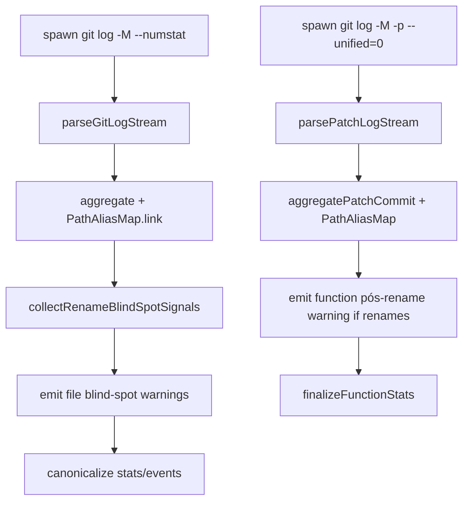

# Milestone 26 — Rename Confidence Design

**Spec**: [`.specs/features/rename-confidence/spec.md`](./spec.md)  
**Context**: [`.specs/features/rename-confidence/context.md`](./context.md)  
**Status**: Done

---

## Architecture Overview

M26 improves **trust signaling** around renames without changing scoring formulas or inventing historical AST. Two complementary changes:

1. **File GitMiner** — enable find-renames (`-M`), detect remaining blind spots, emit actionable `warnings[]`.
2. **Function churn miner** — when renames were observed, emit a single pós-rename overlap / confidence warning; keep hunk overlap vs current `[line, endLine]`.

Warnings continue to flow: miner `warnings` → `runScan` `onWarning` → stderr (`src/diagnostics/`). No `ScanResult.meta.warnings` in this milestone.



**Baseline SoT:** [ARCHITECTURE.md](../../codebase/ARCHITECTURE.md) (Git miner + function granularity), [CONCERNS.md](../../codebase/CONCERNS.md) RT-003 / function churn rows.  
**Sisters:** [git-change-miner](../git-change-miner/design.md), [per-function-churn](../per-function-churn/design.md).

---

## Code Reuse Analysis

### Existing Components to Leverage

| Component | Location | How to Use |
| --------- | -------- | ---------- |
| `PathAliasMap` | `src/git/rename.ts` | Keep `link` / `canonical` / `getAmbiguousPaths`; do not reinvent |
| File miner pipeline | `src/git/index.ts` | After aggregate loop, append new warning families |
| Function miner | `src/git/function-churn/index.ts` | Same pattern for overlap warning |
| Argv builders | `src/git/spawn.ts`, `src/git/function-churn/spawn.ts` | Add `-M` |
| Aggregate commit shapes | `src/git/parse.ts`, `function-churn/parse.ts` | `renameFrom`, add/del counts for heuristics |
| Warning channel | `src/scan.ts` + `src/diagnostics/logger.ts` | Forward only; no severity API |
| Fixtures | `tests/fixtures/git-log/`, `repos/with-renames/`, `git-patch/` | Extend |

### Integration Points

| System | Integration |
| ------ | ----------- |
| `runScan` | No API change; existing warning loops pick up new strings |
| Reporter / JSON | Unchanged shape (`version: "1.0"`) |
| Compare | Unaffected (scan stderr warnings only) |
| M28 | Must not introduce severity enums or progress redesign |

### Fragile areas (CONCERNS.md)

| Area | Design mitigation |
| ---- | ----------------- |
| Streaming parse must not load full log | Blind-spot collection is O(files per commit) during existing pass — no second full buffer |
| Rename without `--follow` | `-M` only; still no `--follow` |
| Function overlap vs historical hunks | Warning + docs; no AST |
| Heuristic false positives | Require relatedness (basename / path similarity); cap warnings |

---

## Components

### 1. Rename blind-spot signals + messages (`src/git/rename-warnings.ts`)

- **Purpose**: Pure helpers — collect signals and format stable warning strings for file and function miners.
- **Location**: `src/git/rename-warnings.ts` (+ co-located `rename-warnings.test.ts`)
- **Interfaces** (illustrative):

```typescript
export interface RenameBlindSpotSignals {
  ambiguousPaths: string[];
  /** In-window PathAliasMap links observed */
  renameLinkCount: number;
  /** Suspected delete+add pairs without rename metadata */
  unlinkedSuspectedRenames: Array<{ from: string; to: string }>;
}

export function formatAmbiguousRenameWarnings(paths: string[]): string[];
export function formatUnlinkedRenameWarnings(
  pairs: Array<{ from: string; to: string }>,
  options?: { maxPairs?: number },
): string[];
export function formatSinceTruncationWarning(since: string): string;
export function formatFunctionPostRenameOverlapWarning(): string;

/** Cheap relatedness: same basename OR Levenshtein/path-segment rule — pick one simple rule in Execute */
export function pathsLookLikeRename(a: string, b: string): boolean;
```

- **Dependencies**: none (pure)
- **Reuses**: Existing ambiguous message text pattern from `src/git/index.ts`

### 2. Per-commit unlinked-rename detection (file aggregate path)

- **Purpose**: During or after each commit aggregation, if no `renameFrom` was linked for a delete+add pair but `pathsLookLikeRename(deleted, added)`, record a suspected pair.
- **Location**: Prefer small hooks in `src/git/aggregate.ts` **or** a dedicated pass over parsed commits inside `createGitMiner` — **one module owner**: keep detection next to where commit file lists are available; export a `recordBlindSpotsFromCommit(commit, signals)` from `rename-warnings.ts` called from `index.ts` / aggregate.
- **Rule (locked intent)**:
  - Candidate “deleted”: numstat path with `additions === 0` and `deletions > 0` (or explicit delete representation already parsed)
  - Candidate “added”: `additions > 0` and `deletions === 0`
  - Exclude pairs where either side already has `renameFrom` / was `link`ed this commit
  - Match with `pathsLookLikeRename` (minimum: identical basename)
- **Dependencies**: `ParsedCommit` / file change types from parse
- **Reuses**: Parser rename line handling

### 3. File miner wiring (`src/git/index.ts` + `spawn.ts`)

- **Purpose**: `-M` on argv; after mine loop, push ambiguous + unlinked + optional since-truncation warnings.
- **Since truncation**: `options.since !== undefined && renameLinkCount > 0` → one summary warning.
- **Dependencies**: `rename-warnings`, PathAliasMap, existing canonicalize
- **Reuses**: Current empty-history and ambiguous loops

### 4. Function miner wiring (`src/git/function-churn/`)

- **Purpose**: `-M` on patch argv; track whether any `link` / ambiguous occurred; if so, append `formatFunctionPostRenameOverlapWarning()` once; keep existing ambiguous messages.
- **Dependencies**: shared `rename-warnings` messages
- **Reuses**: M23 aggregate rename `link` already present

### 5. Fixtures

| Fixture | Purpose |
| ------- | ------- |
| `tests/fixtures/git-log/rename-unlinked.txt` (name flexible) | Same-commit delete+add, no `=>`; expect unlinked warning; churn split |
| Existing `rename-multi.txt` | Still unifies; may also assert no unlinked warning |
| Stream + `since` unit case | Rename links present + `since` set → truncation warning |
| `tests/fixtures/repos/with-renames/` | Rebuild history so `-M` can detect renames (prefer content-preserving `git mv` steps, then edit); assert unified canonical churn + documented warnings |
| Patch fixture with rename | Function miner emits pós-rename warning |

Use `fixture-builder` agent for repo tree changes when Execute needs it.

### 6. Docs

- Update ARCHITECTURE Key constraints / Git miner notes: `-M`, warning families
- Update CONCERNS mitigation rows (remove “No warning today” for covered blind spots; note function avisos shipped)
- TESTING.md fixture table entries

---

## Data Models

No new domain types in `src/types/`. Internal signals stay in `src/git/rename-warnings.ts`.

Public contracts unchanged:

- `GitMinerResult.warnings: string[]`
- `FunctionChurnMinerResult.warnings: string[]`
- `ScanResult` / schemas — **no** new fields

---

## Error Handling Strategy

| Error Scenario | Handling | User Impact |
| -------------- | -------- | ----------- |
| Many unlinked pairs | Cap listed pairs (e.g. max 5) + “and N more” summary | Bounded stderr |
| Heuristic miss (true rename, no signal) | Accept; docs say limits remain | Possible silent split — mitigated by `-M` |
| Heuristic false positive | Basename/relatedness gate | Occasional extra warning (prefer over silence on real moves) |
| Malformed numstat | Existing parse resilience; skip pair | No new fatal path |
| Function mode, renames observed | One overlap warning | Clear confidence caveat |

---

## Tech Decisions (non-obvious)

| ID | Decision | Choice | Rationale |
| -- | -------- | ------ | --------- |
| D1 | Mitigation depth | Avisos + fixtures; no historical AST | User locked |
| D2 | Confidence representation | Warning text only | No JSON/schema churn; YAGNI |
| D3 | Find-renames | `-M` on file + function spawns | Makes PathAliasMap work on real repos; not `--follow` |
| D4 | Unlinked detection | Same-commit delete+add + basename relatedness | Actionable without similarity index reimplementation |
| D5 | Since truncation warning | Only if `since` set **and** renameLinkCount > 0 | Avoid warning every file in a window |
| D6 | Function warning trigger | Rename link or ambiguous in that mine | Avoid noise when no moves |
| D7 | Shared message module | `src/git/rename-warnings.ts` | One owner; file + function reuse |
| D8 | M28 boundary | No severity levels | ROADMAP |

### CONCERNS / RT mapping

| Concern | Mitigation in M26 |
| ------- | ----------------- |
| Rename blind spots (copy-paste, pre-since, no `=>`) | HOTSPOT-203–205 + fixtures HOTSPOT-207–208 |
| Function overlap current vs historical | HOTSPOT-209–210 avisos + docs |
| Post-rename hunk mismatch true fix | **Deferred** (historical AST — do not prioritize) |
| Paths / exports | M27 |
| Warning severity consolidation | M28 |

---

## Test Plan

| Layer | Where | Assert |
| ----- | ----- | ------ |
| Unit | `rename-warnings.test.ts` | Message formatting, relatedness, caps |
| Unit | `spawn.test.ts` / argv tests | `-M` present; no `--follow` |
| Unit | `src/git/index.test.ts` | Unlinked + since truncation warnings from fixtures |
| Unit | `function-churn/index.test.ts` | Pós-rename warning on/off |
| Integration | `with-renames` scan | Unified churn under final path; warnings per README |
| Gate | Project | `pnpm build && pnpm test` |

**Mock boundary:** Inject line streams at miner boundary; do not mock PathAliasMap internals for warning tests when fixtures suffice.
