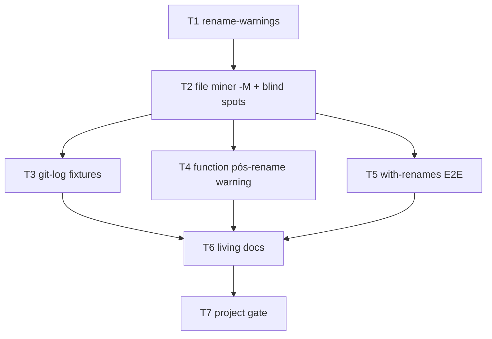

# Milestone 26 — Rename Confidence Tasks

**Design**: [`.specs/features/rename-confidence/design.md`](./design.md)  
**Spec**: [`.specs/features/rename-confidence/spec.md`](./spec.md)  
**Context**: [`.specs/features/rename-confidence/context.md`](./context.md)  
**Status**: Done

---

## Execution Plan

### Phase 1: Shared warnings + find-renames (Sequential)

```
T1 rename-warnings → T2 file-miner -M + blind spots
```

### Phase 2: Fixtures + function warning (Parallel OK after T2)

```
T2 ──┬→ T3 git-log fixtures [P]
     ├→ T4 function-miner warning [P]
     └→ T5 with-renames E2E
```

> T3 and T4 are `[P]` (disjoint paths). T5 depends on T2 (`-M` + warnings) and should wait for T3 if it asserts new git-log cases indirectly — **Depends on: T2 only** for repo E2E; T3 remains independent fixture work.

### Phase 3: Docs + gate (Sequential)

```
T3, T4, T5 → T6 docs → T7 project gate
```



### Diagram-Definition Cross-Check

| Task | Depends on (task body) | Diagram shows | Match |
| ---- | ---------------------- | ------------- | ----- |
| T1 | None | Root | ✅ |
| T2 | T1 | T1→T2 | ✅ |
| T3 | T2 | T2→T3 | ✅ |
| T4 | T2 | T2→T4 | ✅ |
| T5 | T2 | T2→T5 | ✅ |
| T6 | T3, T4, T5 | T3/T4/T5→T6 | ✅ |
| T7 | T6 | T6→T7 | ✅ |

### Path Conflict Check (Check 5)

| Task | Module owner | Paths | Conflict |
| ---- | ------------ | ----- | -------- |
| T1 | `src/git/` warnings helper | `src/git/rename-warnings.ts`, `rename-warnings.test.ts` | Sole owner |
| T2 | `src/git/` file miner | `src/git/spawn.ts`, `src/git/index.ts`, optionally `aggregate.ts`; tests `spawn`/`index` | After T1; does **not** edit `function-churn/` |
| T3 | fixtures git-log | `tests/fixtures/git-log/*` (+ tests that only consume new fixtures under `src/git/*.test.ts` if needed — prefer assertions in T2/T5) | Disjoint from T4/T5 source; if T3 adds test cases in `index.test.ts`, **sequentially after T2** and do not mark parallel with T2 — T3 is `[P]` vs **T4 only** |
| T4 | `src/git/function-churn/` | `function-churn/spawn.ts`, `function-churn/index.ts`, tests; import T1 helper | Disjoint from T2 paths after T2 complete |
| T5 | fixtures repos + integration | `tests/fixtures/repos/with-renames/`, integration/scan tests touching that fixture | Do not edit `src/git/` miners |
| T6 | docs | `.specs/codebase/ARCHITECTURE.md`, `CONCERNS.md`, `TESTING.md`, `README.md` as needed | Docs only |
| T7 | verification | Gate only; ROADMAP/STATE sync deferred to parent / Execute Done | — |

**Parallel rule:** T3 `[P]` with T4 only. T5 runs after T2; may run parallel with T3/T4 if no shared test file edits — **if T5 and T3 both edit the same `*.test.ts`, serialize**. Prefer T5 owning `with-renames` integration test file only.

### Test Co-location Validation

| Task | Code layer | TESTING.md expectation | Task `Tests` | Match |
| ---- | ---------- | ---------------------- | ------------ | ----- |
| T1 | `src/git/` helper | unit | unit | ✅ |
| T2 | `src/git/` miner/spawn | unit / Git Miner fixtures | unit | ✅ |
| T3 | fixtures | Git Miner fixtures | unit (consumed by miner tests) | ✅ |
| T4 | `src/git/function-churn/` | Function churn unit | unit | ✅ |
| T5 | fixture repo + integration | Integration | integration | ✅ |
| T6 | docs | none | none | ✅ |
| T7 | verification | full gate | `pnpm build && pnpm test` | ✅ |

### Granularity Check

| Task | Scope | Status |
| ---- | ----- | ------ |
| T1 | One helper module + tests | ✅ Granular |
| T2 | File miner wiring + `-M` | ✅ Cohesive (one pipeline) |
| T3 | git-log fixtures (+ assertions wiring) | ✅ Granular |
| T4 | Function miner warning + `-M` | ✅ Granular |
| T5 | with-renames E2E | ✅ Granular |
| T6 | Living docs | ✅ OK cohesive docs |
| T7 | Project gate | ✅ Granular |

---

## Task Breakdown

### T1: Shared rename warning helpers

**What**: Add `src/git/rename-warnings.ts` with relatedness helper, signal formatting for ambiguous / unlinked / since-truncation / function pós-rename overlap messages, and warning caps.

**Where**: `src/git/rename-warnings.ts`, `src/git/rename-warnings.test.ts`

**Depends on**: None

**Reuses**: Existing ambiguous message pattern from `src/git/index.ts`; [design.md](./design.md) § Components; [context.md](./context.md)

**Requirement**: HOTSPOT-203, HOTSPOT-204, HOTSPOT-205, HOTSPOT-209 (message strings)

**Tools**:

- Skill: `coding-guidelines`, `vitals-pipeline-domain`

**Done when**:

- [x] Exported formatters + `pathsLookLikeRename` (or equivalent) match design intent
- [x] Unit tests cover formatting, basename relatedness, and max-pair capping
- [x] Gate check passes: `pnpm build && pnpm test -- src/git/rename-warnings.test.ts`
- [x] Test count: no silent deletions in this file’s suite

**Tests**: unit  
**Gate**: `pnpm build && pnpm test -- src/git/rename-warnings.test.ts`

**Commit**: `feat(git): add rename blind-spot warning helpers`

---

### T2: File miner find-renames + blind-spot emission

**What**: Add `-M` to `buildGitLogArgv`; wire blind-spot collection (unlinked delete+add, rename link count, ambiguous) into `createGitMiner().mine()` using T1 helpers; keep empty-history warning behavior.

**Where**: `src/git/spawn.ts`, `src/git/index.ts`, optionally `src/git/aggregate.ts`; tests `src/git/spawn.test.ts` (or existing spawn tests), `src/git/index.test.ts`

**Depends on**: T1

**Reuses**: `PathAliasMap`, parse `renameFrom`, [design.md](./design.md) D3–D5

**Requirement**: HOTSPOT-203, HOTSPOT-204, HOTSPOT-205, HOTSPOT-206

**Tools**:

- Skill: `coding-guidelines`, `vitals-pipeline-domain`

**Done when**:

- [x] File miner argv includes find-renames (`-M` or `--find-renames`) and does **not** include `--follow`
- [x] Unlinked suspected rename + `--since`+renameLink warnings covered by unit tests (fixture stream injection OK)
- [x] Ambiguous-path warnings still emitted
- [x] Gate check passes: `pnpm build && pnpm test -- src/git/`
- [x] Test count: no silent deletions under `src/git/` (excluding function-churn if run filtered)

**Tests**: unit  
**Gate**: `pnpm build && pnpm test -- src/git/spawn.test.ts src/git/index.test.ts src/git/rename-warnings.test.ts`

**Commit**: `feat(git): warn on rename blind spots and enable -M`

---

### T3: Stronger git-log rename fixtures [P]

**What**: Add/update `tests/fixtures/git-log/` samples for unlinked delete+add (no `=>`) and document expected warnings; ensure rename-multi remains valid; add or adjust unit assertions that consume the new fixtures (prefer extending `index.test.ts` **only if** T2 left placeholders — otherwise keep assertions in this task with a single owner of that test file).

**Where**: `tests/fixtures/git-log/` (new + headers/comments); `src/git/index.test.ts` only if adding fixture-driven cases not already in T2

**Depends on**: T2

**Reuses**: Existing `rename-multi.txt` style; [design.md](./design.md) § Fixtures

**Requirement**: HOTSPOT-207

**Tools**:

- Skill: `vitals-pipeline-domain`
- Agent note: `fixture-builder` if hand-crafting is large

**Done when**:

- [x] At least one unlinked/copy-paste style fixture exists with documented expected warning
- [x] Tests assert miner warnings/churn behavior for that fixture
- [x] Gate check passes: `pnpm build && pnpm test -- src/git/index.test.ts`
- [x] Test count: no silent deletions

**Tests**: unit  
**Gate**: `pnpm build && pnpm test -- src/git/index.test.ts`

**Commit**: `test(git): add rename blind-spot log fixtures`

---

### T4: Function-miner pós-rename warning + `-M` [P]

**What**: Add `-M` to `buildGitPatchLogArgv`; when function-churn mine observes rename links or ambiguous paths, append the shared function pós-rename overlap / confidence warning once; unit tests on/off.

**Where**: `src/git/function-churn/spawn.ts`, `src/git/function-churn/index.ts`, `src/git/function-churn/*.test.ts`; optional `tests/fixtures/git-patch/` sample

**Depends on**: T2 (shared warning module landed; file argv pattern established)

**Reuses**: T1 `formatFunctionPostRenameOverlapWarning`; existing PathAliasMap usage in aggregate; [context.md](./context.md) function trigger

**Requirement**: HOTSPOT-206, HOTSPOT-209

**Tools**:

- Skill: `coding-guidelines`, `vitals-pipeline-domain`

**Done when**:

- [x] Patch argv includes find-renames; no `--follow`
- [x] Warning present when rename observed; absent otherwise
- [x] File-mode scan path unchanged (no function warning without function miner)
- [x] Gate check passes: `pnpm build && pnpm test -- src/git/function-churn/`
- [x] Test count: no silent deletions

**Tests**: unit  
**Gate**: `pnpm build && pnpm test -- src/git/function-churn/`

**Commit**: `feat(git): warn on function churn after renames`

---

### T5: Strengthen `with-renames` E2E

**What**: Rebuild/adjust `tests/fixtures/repos/with-renames/` so find-renames can unify churn under the final path (prefer content-preserving renames then edits); update README expected outcomes; add/extend integration test asserting canonical churn continuity and expected warning presence/absence.

**Where**: `tests/fixtures/repos/with-renames/` (`bootstrap-repo.mjs`, README, tree); integration test file(s) under `src/` or existing scan integration tests that target this fixture

**Depends on**: T2

**Reuses**: [TESTING.md](../../codebase/TESTING.md) integration layer; `fixture-builder` patterns; [design.md](./design.md) § Fixtures

**Requirement**: HOTSPOT-208

**Tools**:

- Skill: `vitals-cli-validation`
- Agent: `fixture-builder` recommended for repo bootstrap

**Done when**:

- [x] Fixture history documented; bootstrap reproducible
- [x] Integration/E2E asserts unified churn under canonical final path with `-M` enabled miners
- [x] Expected warnings documented and asserted where applicable
- [x] Gate check passes: `pnpm build && pnpm test --` (targeted integration test path)
- [x] Manual spot-check optional: `pnpm exec hotspot-scanner scan tests/fixtures/repos/with-renames`

**Tests**: integration  
**Gate**: `pnpm build && pnpm test -- src/scan.integration.test.ts` (or the concrete test file Execute adds — update this line if a dedicated file is created)

**Commit**: `test(fixtures): strengthen with-renames for rename confidence`

---

### T6: Living docs for M26 RT-003

**What**: Update ARCHITECTURE, CONCERNS, TESTING (and README if user-facing warning behavior should be mentioned) to document `-M`, blind-spot warning families, and function pós-rename overlap confidence warning; rewrite CONCERNS “No warning today” rows for mitigated items.

**Where**: `.specs/codebase/ARCHITECTURE.md`, `.specs/codebase/CONCERNS.md`, `.specs/codebase/TESTING.md`, `README.md` (only if needed)

**Depends on**: T3, T4, T5

**Reuses**: [spec.md](./spec.md) P2; CONCERNS maintenance note (move mitigated gaps out of open matrix)

**Requirement**: HOTSPOT-210

**Tools**:

- Skill: `vitals-spec-driven` docs awareness only — no Execute code

**Done when**:

- [x] ARCHITECTURE mentions find-renames + warning families; still forbids global `--follow`
- [x] CONCERNS reflects warning mitigation for covered blind spots + function avisos
- [x] TESTING lists new fixtures
- [x] No src/bin behavior changes in this task

**Tests**: none  
**Gate**: N/A (docs); verified by T7 full gate still green

**Commit**: `docs: document rename confidence warnings (M26)`

---

### T7: Project quality gate

**What**: Run full project gate; confirm all HOTSPOT-203–210 acceptance criteria covered by tests/docs; leave ROADMAP/STATE checkbox sync to parent or Execute Done policy (parent owns ROADMAP/STATE this planning session).

**Where**: verification only

**Depends on**: T6

**Reuses**: AGENTS.md quality gate; `verifier-quality-gates`

**Requirement**: HOTSPOT-203–HOTSPOT-210 (verification)

**Tools**:

- Agent: `verifier-quality-gates`

**Done when**:

- [x] `pnpm build && pnpm test` passes
- [x] No intentional test deletions vs pre-feature baseline
- [x] Spec success criteria checklist satisfied

**Tests**: full suite  
**Gate**: `pnpm build && pnpm test`

**Commit**: (none required — verification)

---

## Requirement → Task Mapping

| Requirement | Tasks |
| ----------- | ----- |
| HOTSPOT-203 | T1, T2, T3 |
| HOTSPOT-204 | T1, T2 |
| HOTSPOT-205 | T1, T2 |
| HOTSPOT-206 | T2, T4 |
| HOTSPOT-207 | T3 |
| HOTSPOT-208 | T5 |
| HOTSPOT-209 | T1, T4 |
| HOTSPOT-210 | T6 |
| Gate / all | T7 |

---

## Parallel Execution Map

```
Phase 1:
  T1 → T2

Phase 2 (after T2):
  ├── T3 [P]
  ├── T4 [P]
  └── T5      (sequential vs T3/T4 only if shared test files collide)

Phase 3:
  T3+T4+T5 → T6 → T7
```

**Parallelism constraint:** Unit tests under Vitest are parallel-safe across disjoint files. Do not run two implementers editing the same `index.test.ts` concurrently.

---

## Notes for Execute (handoff)

- Promote Status to `Approved` / `Ready for Execute` before `orchestrator-implementer`.
- Prefer `fixture-builder` for T5 bootstrap changes.
- Do **not** add confidence fields to JSON schemas.
- Do **not** implement M27 paths/`exports` or M28 severity consolidation.
- Parent will sync ROADMAP.md / STATE.md (deferred this planning session).
