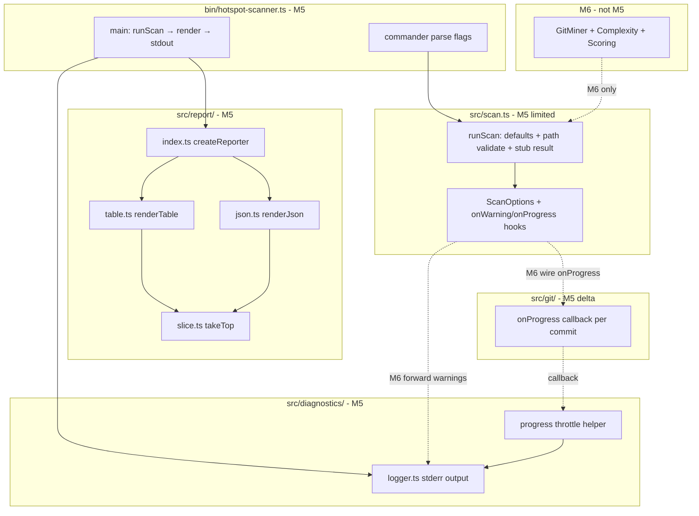

# Milestone 5 — Reporter + CLI Design

**Spec**: [`.specs/features/reporter-cli/spec.md`](./spec.md)  
**Context**: [`.specs/features/reporter-cli/context.md`](./context.md)  
**Status**: Draft

---

## Architecture Overview

M5 implements three layers: **diagnostics** (stderr warnings/progress), **reporter** (stdout table/JSON from `ScanResult`), and **CLI** (commander flag parsing → `runScan()` → `createReporter().render()`). `GitMiner` gains an optional progress callback. `runScan()` applies defaults and path validation but does **not** invoke upstream modules (M6).



**IMPL reference:** §4.3 Reporter, §6.1 CLI, §6.2 JSON conventions, §8.5 observability.

---

## Code Reuse Analysis

### Existing Components to Leverage

| Component | Location | How to Use |
| --------- | -------- | ---------- |
| Domain types | `src/types/domain.ts` | `ScanOptions`, `ScanResult`, `HotspotScore`, `CouplingPair` — extend `ScanOptions` with optional callbacks |
| Reporter contract | `src/report/index.ts` | Keep `Reporter` / `ReporterOptions`; replace throwing factory |
| `runScan` stub | `src/scan.ts` | Extend with defaults, exports, path validation, callback types |
| `DEFAULT_MIN_COCHANGE` | `src/scoring/index.ts` | CLI default for `--min-cochange`; import in `bin/` or `scan.ts` |
| Git miner warnings pattern | `src/git/index.ts` | Mirror callback style for `onProgress` |
| Complexity path validation | `src/complexity/index.ts` | Reuse `stat` + `isDirectory()` pattern in `runScan()` |
| CLI test patterns | `testing-patterns.mdc` | `vi.resetModules()`, mock `process.exit`, stderr capture |
| Commander integration | `INTEGRATIONS.md` | Add `commander` runtime dependency; parse only in `bin/` |

### Integration Points

| System | M5 behavior | Future milestone |
| ------ | ----------- | ---------------- |
| `src/git/` | Add `onProgress` to `GitMinerOptions` | M6: `runScan` calls miner with callback |
| `src/complexity/` | No changes | M6: warnings forwarded via `onWarning` |
| `src/scoring/` | Import `DEFAULT_MIN_COCHANGE` only | M6: scorer invocation |
| `src/scan.ts` | Defaults + hooks + stub result | M6: full pipeline |
| `bin/hotspot-scanner.ts` | Full commander CLI | — |
| `package.json` | Add `commander` dependency | — |

---

## Design Decisions

| # | Decision | Rationale |
| - | -------- | --------- |
| D1 | `commander` for CLI parsing | INTEGRATIONS.md; no hand-rolled argv in M5 |
| D2 | `DEFAULT_TOP = 20` (proposed) | context.md; pending user confirmation |
| D3 | Reporter applies `top` slice | Scorers return full sorted lists; reporter/CLI owns display limit |
| D4 | Warnings/progress on stderr | Keeps stdout clean for JSON redirection |
| D5 | Progress without total count | Single-pass git stream (ADR-2026-020); no second count pass |
| D6 | Throttle progress every 1000 commits | Balance feedback vs stderr noise; constant in `logger.ts` |
| D7 | `runScan()` no pipeline calls | M2–M4 isolation; M6 owns integration |
| D8 | Path validation in `runScan()` | Early fail for bad `<path>`; CLI maps throw → exit `!= 0` |
| D9 | Fixed 4-decimal numeric display in tables | Stable Vitest assertions |
| D10 | JSON `JSON.stringify(result, null, 2)` after slice | Pretty-print for human inspection; machine-parseable |
| D11 | `ScanOptions.onWarning` / `onProgress` optional callbacks | M5 wires from CLI; M6 forwards module events |
| D12 | No `authors` in any reporter output | STATE.md + domain types already exclude |

---

## Components

### Diagnostics logger (`src/diagnostics/logger.ts`)

- **Purpose**: Central stderr output for warnings and throttled progress messages.
- **Location**: `src/diagnostics/logger.ts`, `src/diagnostics/index.ts`
- **Interfaces**:

```typescript
export const PROGRESS_LOG_INTERVAL = 1000;

export function logWarning(message: string): void;

export function logProgress(commitsProcessed: number): void;

/** Returns true when a progress line was emitted (passed throttle). */
export function maybeLogProgress(
  commitsProcessed: number,
  interval?: number,
): boolean;
```

- **Behavior**:
  - `logWarning` → `console.error("warning:", message)` (or `process.stderr.write`)
  - `maybeLogProgress` → emit only when `commitsProcessed % interval === 0` (and `commitsProcessed > 0`)
- **Dependencies**: Node `process.stderr` only
- **Reuses**: None

---

### Git miner progress hook (`src/git/index.ts` — modify)

- **Purpose**: Notify consumers of streaming parse progress per commit.
- **Interfaces** (extend existing):

```typescript
export interface GitMinerProgress {
  commitsProcessed: number;
}

export interface GitMinerOptions {
  repoPath: string;
  since?: string;
  onProgress?: (progress: GitMinerProgress) => void;
}
```

- **Algorithm**: After `commitCount += 1` in the parse loop, call `options.onProgress?.({ commitsProcessed: commitCount })`
- **Dependencies**: None added
- **Reuses**: Existing `mine()` loop

---

### Top-N slice (`src/report/slice.ts`)

- **Purpose**: Apply `--top` limit consistently for table and JSON.
- **Interfaces**:

```typescript
import type { ScanResult } from "../types/index.js";

export function sliceScanResult(
  result: ScanResult,
  top?: number,
): ScanResult;
```

- **Behavior**: If `top` is undefined, return clone as-is. If defined, slice `hotspots` and `coupling` to `result.slice(0, top)`. Preserve `version` and `meta`.
- **Dependencies**: `src/types/`
- **Reuses**: None

---

### JSON reporter (`src/report/json.ts`)

- **Purpose**: Serialize sliced `ScanResult` to JSON string.
- **Interfaces**:

```typescript
import type { ScanResult } from "../types/index.js";

export function renderJson(result: ScanResult): string;
```

- **Behavior**: `JSON.stringify(result, null, 2)` + trailing newline
- **Dependencies**: `src/types/`
- **Reuses**: `sliceScanResult` called by factory before render

---

### Table reporter (`src/report/table.ts`)

- **Purpose**: Human-readable dual-table output with since header.
- **Interfaces**:

```typescript
import type { ScanResult } from "../types/index.js";

export function renderTable(result: ScanResult): string;
```

- **Output shape** (example):

```
Scan window: 12 months ago (scanned 2026-07-22T11:00:00.000Z)

Top Hotspots
Rank  File                      Score     Complexity  Churn
----  ------------------------  --------  ----------  ----------
1     src/hot.ts                0.8500    0.9000      0.9444
...

Top Coupling Pairs
Rank  File A                    File B                    Strength  Co-changes
----  ------------------------  ------------------------  --------  ----------
1     src/a.ts                  src/b.ts                    0.7500          5
...

```

- **Empty sections**: Print section header + `  (none)` line
- **Dependencies**: `src/types/`
- **Reuses**: Pad/truncate helpers private to module (YAGNI — no shared table library)

---

### Reporter factory (`src/report/index.ts`)

- **Purpose**: Public reporter entry — slice then dispatch.
- **Interfaces** (existing, behavior change):

```typescript
export function createReporter(): Reporter {
  return {
    render(result, options) {
      const sliced = sliceScanResult(result, options.top);
      return options.format === "json"
        ? renderJson(sliced)
        : renderTable(sliced);
    },
  };
}
```

- **Dependencies**: `slice.ts`, `json.ts`, `table.ts`
- **Reuses**: Existing `Reporter` / `ReporterOptions` types

---

### `runScan()` M5 updates (`src/scan.ts`)

- **Purpose**: Apply defaults, validate path, expose hooks; return stub `ScanResult`.
- **Exports**:

```typescript
export const DEFAULT_SINCE = "12 months ago";
export const DEFAULT_TOP = 20;

export async function runScan(options: ScanOptions): Promise<ScanResult>;
```

- **Extended `ScanOptions`** (in `src/types/domain.ts`):

```typescript
export interface ScanOptions {
  repoPath: string;
  since?: string;
  top?: number;
  minCochange?: number;
  format?: "table" | "json";
  onWarning?: (message: string) => void;
  onProgress?: (progress: { commitsProcessed: number }) => void;
}
```

- **M5 behavior**:
  1. Validate `repoPath` is existing directory (throw on failure)
  2. Resolve defaults: `since`, `top`, `minCochange` (import `DEFAULT_MIN_COCHANGE` from scoring)
  3. Do **not** call git/complexity/scoring
  4. Return empty `hotspots`/`coupling` with populated `meta`
- **Dependencies**: `fs/promises`, `src/types/`, `src/scoring/` (constant import only)
- **Reuses**: Path validation pattern from complexity analyzer

---

### CLI entry (`bin/hotspot-scanner.ts`)

- **Purpose**: Parse flags, wire diagnostics, invoke scan + reporter.
- **Flow**:

```typescript
program
  .name("hotspot-scanner")
  .command("scan")
  .argument("<path>", "Repository path")
  .option("--since <period>", "Git history window", DEFAULT_SINCE)
  .option("--format <format>", "Output format: table|json", "table")
  .option("--top <n>", "Top N results", String(DEFAULT_TOP))
  .option("--min-cochange <n>", "Min co-change threshold", String(DEFAULT_MIN_COCHANGE))
  .action(async (repoPath, opts) => { ... });
```

- **Validation**: Parse `--top` / `--min-cochange` as positive integers; reject invalid `--format`
- **Wiring**:

```typescript
const result = await runScan({
  repoPath,
  since: opts.since,
  top: parsedTop,
  minCochange: parsedMinCochange,
  format: parsedFormat,
  onWarning: logWarning,
  onProgress: (p) => maybeLogProgress(p.commitsProcessed),
});
const output = createReporter().render(result, { format: parsedFormat, top: parsedTop });
process.stdout.write(output.endsWith("\n") ? output : output + "\n");
```

- **Exit codes**: `0` success; `2` usage; `1` (or non-zero) validation/runtime errors
- **Dependencies**: `commander`, `#scan`, `../src/report/index.js`, `../src/diagnostics/index.js`
- **Reuses**: AGENTS.md CLI patterns

---

## Data Models

### ScanOptions extension (`src/types/domain.ts`)

Add optional callback fields (see above). No change to `ScanResult` shape.

### Fixture data (`tests/fixtures/report/sample-result.json`)

Hand-crafted `ScanResult` with 3+ hotspots and 2+ coupling pairs for reporter tests. Header comment documents expected table substrings and JSON field presence.

---

## Error Handling Strategy

| Error Scenario | Handling | User Impact |
| -------------- | -------- | ----------- |
| Missing `scan` / `<path>` | Usage on stderr, exit `2` | Clear invocation help |
| Invalid `--format` | Error on stderr, exit `!= 0` | Actionable message |
| Non-positive `--top` / `--min-cochange` | Error on stderr, exit `!= 0` | Actionable message |
| `repoPath` not a directory | `runScan` throws → CLI catches, stderr message, exit `!= 0` | Before long scan |
| Empty rankings (M5 stub) | Reporter renders empty sections | Exit `0` |
| Git errors | Not in M5 (`runScan` stub) | M6 handles |

---

## Risks and Mitigations

| Risk | Source | Mitigation |
| ---- | ------ | ---------- |
| Accidental pipeline wiring in M5 | M6 boundary | Spec + task Done when explicitly forbid imports; scan.test.ts guards |
| stdout/stderr mix breaks JSON redirect | IMPL §8.5 | All diagnostics to stderr; test with mock streams |
| Table layout drift | No IMPL column spec | Lock column headers + sample fixture in tests |
| `--top` default unresolved | IMPL §16 | context.md proposal; user confirms before Execute |
| Commander version API drift | New dependency | Pin semver in package.json; unit test flag parsing |
| Progress flood on small repos | Throttle interval | Only log every N commits; test throttle logic |
| Path conflict T3/T4/T5 on `src/report/` | tasks.md validation | Separate files per task; T5 owns `index.ts` only |

---

## Test Strategy

| Layer | Location | Focus |
| ----- | -------- | ----- |
| Unit — diagnostics | `src/diagnostics/logger.test.ts` | stderr output, throttle intervals |
| Unit — slice | `src/report/slice.test.ts` | top N edge cases, meta preservation |
| Unit — JSON | `src/report/json.test.ts` | schema fields, no authors, pretty JSON |
| Unit — table | `src/report/table.test.ts` | headers, columns, empty sections, since line |
| Integration — reporter | `src/report/index.test.ts` | factory dispatch, no throw |
| Unit — git progress | `src/git/index.test.ts` | onProgress call count with mock stream |
| Unit — scan | `src/scan.test.ts` | defaults, path validation, stub result |
| CLI | `bin/hotspot-scanner.test.ts` | flags, defaults, exit codes, stdout/stderr routing |
| Fixture | `tests/fixtures/report/sample-result.json` | Shared reporter input |

**Mock boundary:** CLI tests mock `runScan` and/or `createReporter` at dynamic import boundary per testing-patterns.mdc. Do not mock reporter internals in CLI tests.

**Coverage target:** Best effort on `src/report/**` and `src/diagnostics/**` (no 80% hard gate in TESTING.md yet — co-located tests required).

---

## File Layout (after M5)

```
src/diagnostics/
├── index.ts
├── logger.ts
└── logger.test.ts

src/report/
├── index.ts
├── slice.ts
├── json.ts
├── table.ts
├── slice.test.ts
├── json.test.ts
├── table.test.ts
└── index.test.ts

src/git/index.ts          # + onProgress in GitMinerOptions
src/scan.ts                 # + defaults, path validate, exports
src/types/domain.ts         # + callback fields on ScanOptions

bin/hotspot-scanner.ts      # commander CLI
bin/hotspot-scanner.test.ts

tests/fixtures/report/
└── sample-result.json
```

---

## Out of Scope (design)

- Full pipeline in `runScan()` — M6
- Fixture repo E2E scan — M6
- `--max-old-space-size` / memory tuning — deferred
- Configurable progress interval CLI flag — YAGNI
- HTML or markdown output formats — not in IMPL
