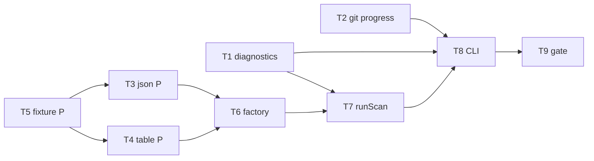

# Milestone 5 — Reporter + CLI Tasks

**Design**: [`.specs/features/reporter-cli/design.md`](./design.md)  
**Spec**: [`.specs/features/reporter-cli/spec.md`](./spec.md)  
**Context**: [`.specs/features/reporter-cli/context.md`](./context.md)  
**Status**: Done

---

## Execution Plan

### Phase 1: Foundation (Parallel OK)

```
T1 [P] diagnostics logger
T2 [P] git miner onProgress
T5 [P] report fixture
```

### Phase 2: Reporter modules (Parallel)

```
T5 (fixture) ──→ T3 [P] slice + JSON
T5 (fixture) ──→ T4 [P] table
T3, T4 ──→ T6 reporter factory
```

### Phase 3: Scan + CLI + Gate (Sequential)

```
T1, T6 ──→ T7 runScan
T1, T2, T6, T7 ──→ T8 CLI
T8 ──→ T9 gate + docs
```



---

## Task Breakdown

### T1: Diagnostics logger module [P]

**What**: Implement `src/diagnostics/logger.ts` with `logWarning`, `logProgress`, and `maybeLogProgress` (throttled, default interval 1000). Export via `src/diagnostics/index.ts`.

**Where**: `src/diagnostics/logger.ts`, `src/diagnostics/index.ts`, `src/diagnostics/logger.test.ts`

**Depends on**: None

**Reuses**: None

**Requirement**: HOTSPOT-46, HOTSPOT-47

**Tools**:

- MCP: NONE
- Skill: NONE

**Done when**:

- [ ] `logWarning("msg")` writes to stderr with consistent `warning:` prefix
- [ ] `maybeLogProgress(1000)` emits once; `maybeLogProgress(999)` does not (default interval)
- [ ] `maybeLogProgress(2000)` emits on second interval
- [ ] Unit tests mock stderr
- [ ] Gate check passes: `pnpm build && pnpm test -- src/diagnostics/logger.test.ts`

**Tests**: unit (`logger.test.ts`)

**Gate**: build + test

---

### T2: Git miner progress callback [P]

**What**: Add `onProgress?: (progress: { commitsProcessed: number }) => void` to `GitMinerOptions`. Invoke after each commit in the parse loop. Add test with injected mock stream verifying callback count matches commit count.

**Where**: `src/git/index.ts`, `src/git/index.test.ts` (supplement)

**Depends on**: None

**Reuses**: Existing `createGitMiner` + mock stream pattern from `index.test.ts`

**Requirement**: HOTSPOT-47

**Tools**:

- MCP: NONE
- Skill: `vitals-pipeline-domain` (reference only)

**Done when**:

- [ ] `onProgress` invoked once per parsed commit with incrementing `commitsProcessed`
- [ ] Mock stream with 3 commits → 3 callback invocations
- [ ] Omitting `onProgress` → no throw; existing git tests pass
- [ ] Gate check passes: `pnpm build && pnpm test -- src/git/index.test.ts`

**Tests**: unit (`index.test.ts` supplement)

**Gate**: build + test

---

### T3: Slice helper + JSON reporter [P]

**What**: Implement `sliceScanResult(result, top?)` and `renderJson(result)` — pretty-printed JSON with `version`, `hotspots`, `coupling`, `meta`.

**Where**: `src/report/slice.ts`, `src/report/json.ts`, `src/report/slice.test.ts`, `src/report/json.test.ts`

**Depends on**: T5

**Reuses**: `ScanResult` from `src/types/`, `tests/fixtures/report/sample-result.json`

**Requirement**: HOTSPOT-42, HOTSPOT-45

**Tools**:

- MCP: NONE
- Skill: NONE

**Done when**:

- [ ] `sliceScanResult` with `top: 2` returns at most 2 items per array; `meta` preserved
- [ ] `renderJson` output parses as JSON with `version`, `hotspots`, `coupling`, `meta`
- [ ] No `authors` key anywhere in serialized output
- [ ] Fixture-driven test uses `sample-result.json`
- [ ] Gate check passes: `pnpm build && pnpm test -- src/report/slice.test.ts src/report/json.test.ts`

**Tests**: unit (`slice.test.ts`, `json.test.ts`)

**Gate**: build + test

---

### T4: Table reporter [P]

**What**: Implement `renderTable(result)` — since header, **Top Hotspots** table, **Top Coupling Pairs** table, 4-decimal scores, `(none)` for empty sections.

**Where**: `src/report/table.ts`, `src/report/table.test.ts`

**Depends on**: T5

**Reuses**: `tests/fixtures/report/sample-result.json`

**Requirement**: HOTSPOT-43, HOTSPOT-44, HOTSPOT-45

**Tools**:

- MCP: NONE
- Skill: NONE

**Done when**:

- [ ] Output includes scan window line from `meta.since`
- [ ] Both section headers present with expected columns
- [ ] Empty arrays render `(none)` without throw
- [ ] Fixture-driven test asserts substring content and row limits with `top`
- [ ] Gate check passes: `pnpm build && pnpm test -- src/report/table.test.ts`

**Tests**: unit (`table.test.ts`)

**Gate**: build + test

---

### T5: Report fixture [P]

**What**: Create `tests/fixtures/report/sample-result.json` — hand-crafted `ScanResult` with ≥3 hotspots and ≥2 coupling pairs. Document assertions in `_comment`.

**Where**: `tests/fixtures/report/sample-result.json`

**Depends on**: None

**Reuses**: Domain types from `src/types/domain.ts`

**Requirement**: HOTSPOT-42, HOTSPOT-43 (test data)

**Tools**:

- MCP: NONE
- Skill: NONE

**Done when**:

- [ ] Fixture exists with valid `ScanResult` shape
- [ ] `_comment` documents provenance and expected reporter behavior
- [ ] Arrays pre-sorted desc by score/strength

**Tests**: none (fixture data only)

**Gate**: none

---

### T6: Reporter factory wiring

**What**: Replace throwing stub in `createReporter()`. Wire slice → json/table dispatch. Update `index.test.ts`.

**Where**: `src/report/index.ts`, `src/report/index.test.ts`

**Depends on**: T3, T4

**Reuses**: `slice.ts`, `json.ts`, `table.ts`

**Requirement**: HOTSPOT-49

**Tools**:

- MCP: NONE
- Skill: NONE

**Done when**:

- [ ] `createReporter().render()` works for `format: "json"` and `format: "table"`
- [ ] `top` option passed through to slicer
- [ ] `index.test.ts` no longer expects "Milestone 5" throw
- [ ] Gate check passes: `pnpm build && pnpm test -- src/report/index.test.ts`

**Tests**: integration (`index.test.ts`)

**Gate**: build + test

---

### T7: `runScan()` M5 updates

**What**: Export `DEFAULT_SINCE`, `DEFAULT_TOP`. Extend `ScanOptions` with `onWarning`/`onProgress`. Validate `repoPath` is directory. Default `minCochange` from `DEFAULT_MIN_COCHANGE`. Keep empty stub rankings.

**Where**: `src/scan.ts`, `src/scan.test.ts`, `src/types/domain.ts`

**Depends on**: T1 (types align; scan does not import diagnostics)

**Reuses**: `DEFAULT_MIN_COCHANGE` from `src/scoring/`, path validation from complexity analyzer pattern

**Requirement**: HOTSPOT-40, HOTSPOT-41, HOTSPOT-46, HOTSPOT-48

**Tools**:

- MCP: NONE
- Skill: NONE

**Done when**:

- [ ] `DEFAULT_TOP` exported (20 unless context.md updated by user)
- [ ] Invalid `repoPath` throws before returning result
- [ ] Defaults applied in `meta.since`; empty `hotspots`/`coupling` preserved
- [ ] `ScanOptions` extended with optional callbacks
- [ ] `scan.test.ts` confirms no git/complexity/scorer module calls
- [ ] Gate check passes: `pnpm build && pnpm test -- src/scan.test.ts`

**Tests**: unit (`scan.test.ts`)

**Gate**: build + test

---

### T8: Commander CLI

**What**: Add `commander` dependency. Implement full `scan` command with flags. Wire diagnostics callbacks, `runScan`, `createReporter`, stdout/stderr routing. CLI Vitest suite.

**Where**: `package.json`, `bin/hotspot-scanner.ts`, `bin/hotspot-scanner.test.ts`

**Depends on**: T1, T2, T6, T7

**Reuses**: `DEFAULT_MIN_COCHANGE`, `DEFAULT_SINCE`, `DEFAULT_TOP`, `logWarning`, `maybeLogProgress`

**Requirement**: HOTSPOT-39, HOTSPOT-40, HOTSPOT-41, HOTSPOT-46, HOTSPOT-47

**Tools**:

- MCP: NONE
- Skill: `vitals-cli-validation` (reference for exit codes)

**Done when**:

- [ ] All flags parse with correct defaults (`--since`, `--format`, `--top`, `--min-cochange`)
- [ ] Invalid `--format` or non-positive numeric flags → exit `!= 0`
- [ ] Missing command/path → exit `2`
- [ ] Successful scan → exit `0`; table on stdout
- [ ] `commander` listed in `package.json` `dependencies`
- [ ] Gate check passes: `pnpm build && pnpm test -- bin/hotspot-scanner.test.ts`

**Tests**: unit (`bin/hotspot-scanner.test.ts`)

**Gate**: build + test

**Commit**: `feat(cli): add reporter, flags, and diagnostics (M5)`

---

### T9: Coverage gate and docs sync

**What**: Run full project gate; update ROADMAP M5 link/checkboxes; update STRUCTURE.md for `src/report/`, `src/diagnostics/`, `bin/`; confirm INTEGRATIONS.md commander entry.

**Where**: `.specs/project/ROADMAP.md`, `.specs/codebase/STRUCTURE.md`

**Depends on**: T1–T8

**Reuses**: TESTING.md gate rules

**Requirement**: HOTSPOT-50

**Tools**:

- MCP: NONE
- Skill: `verifier-quality-gates` (optional)

**Done when**:

- [ ] Gate check passes: `pnpm build && pnpm test`
- [ ] No regressions in `src/git/**`, `src/complexity/**`, `src/scoring/**` tests
- [ ] ROADMAP M5 links to `.specs/features/reporter-cli/spec.md`
- [ ] STRUCTURE.md reflects implemented modules
- [ ] Manual smoke: `pnpm exec hotspot-scanner scan .` prints table with since header

**Tests**: project gate

**Gate**: full (`pnpm build && pnpm test`)

---

## Parallel Execution Map

```
Phase 1 (Parallel):
  T1 [P], T2 [P], T5 [P]

Phase 2 (Parallel after T5):
  T3 [P], T4 [P]  →  T6

Phase 3 (Sequential):
  T6 + T1 → T7 → T8 → T9
```

**Note:** T2 is independent of reporter work — can complete in Phase 1. T8 depends on T2 only for progress infrastructure readiness (CLI accepts callback; full E2E progress in M6).

---

## Task Granularity Check

| Task                   | Scope                     | Status      |
| ---------------------- | ------------------------- | ----------- |
| T1: diagnostics logger | 1 module                  | ✅ Granular |
| T2: git onProgress     | 1 hook in `git/index.ts`  | ✅ Granular |
| T3: slice + JSON       | 2 cohesive report files   | ✅ Granular |
| T4: table reporter     | 1 module                  | ✅ Granular |
| T5: fixture            | data file only            | ✅ Granular |
| T6: reporter factory   | 1 file (`index.ts`)       | ✅ Granular |
| T7: runScan updates    | `scan.ts` + types         | ✅ Granular |
| T8: commander CLI      | `bin/` + package.json dep | ✅ Granular |
| T9: gate + docs        | verification + docs       | ✅ Granular |

---

## Diagram-Definition Cross-Check

| Task | Depends On (task body) | Diagram Shows      | Status   |
| ---- | ---------------------- | ------------------ | -------- |
| T1   | None                   | Entry node         | ✅ Match |
| T2   | None                   | Entry node         | ✅ Match |
| T5   | None                   | Entry node         | ✅ Match |
| T3   | T5                     | T5 → T3            | ✅ Match |
| T4   | T5                     | T5 → T4            | ✅ Match |
| T6   | T3, T4                 | T3+T4 → T6         | ✅ Match |
| T7   | T1                     | T6 → T7 (T1 types) | ✅ Match |
| T8   | T1, T2, T6, T7         | T7 → T8            | ✅ Match |
| T9   | T1–T8                  | T8 → T9            | ✅ Match |

---

## Test Co-location Validation

| Task             | Code Layer Created/Modified      | Matrix Requires         | Task Says       | Status |
| ---------------- | -------------------------------- | ----------------------- | --------------- | ------ |
| T1: diagnostics  | `src/diagnostics/**`             | best effort unit        | unit            | ✅ OK  |
| T2: git progress | `src/git/index.ts`               | unit ≥80%               | unit supplement | ✅ OK  |
| T3: json + slice | `src/report/slice.ts`, `json.ts` | best effort unit        | unit            | ✅ OK  |
| T4: table        | `src/report/table.ts`            | best effort unit        | unit            | ✅ OK  |
| T5: fixture      | `tests/fixtures/report/`         | none                    | none            | ✅ OK  |
| T6: factory      | `src/report/index.ts`            | best effort integration | integration     | ✅ OK  |
| T7: runScan      | `src/scan.ts`                    | best effort unit        | unit            | ✅ OK  |
| T8: CLI          | `bin/hotspot-scanner.ts`         | CLI unit tests          | unit            | ✅ OK  |
| T9: gate         | docs only                        | project gate            | full gate       | ✅ OK  |

---

## Requirement → Task Mapping

| Requirement | Task(s)    |
| ----------- | ---------- |
| HOTSPOT-39  | T8         |
| HOTSPOT-40  | T7, T8     |
| HOTSPOT-41  | T7, T8     |
| HOTSPOT-42  | T3, T5     |
| HOTSPOT-43  | T4, T5     |
| HOTSPOT-44  | T4         |
| HOTSPOT-45  | T3, T4     |
| HOTSPOT-46  | T1, T7, T8 |
| HOTSPOT-47  | T1, T2, T8 |
| HOTSPOT-48  | T7         |
| HOTSPOT-49  | T6         |
| HOTSPOT-50  | T9         |

**Coverage:** 12 requirements, 12 mapped, 0 unmapped

---

## Module Owner Routing

| Task | Primary owner module                                        |
| ---- | ----------------------------------------------------------- |
| T1   | `src/diagnostics/`                                          |
| T2   | `src/git/index.ts`                                          |
| T3   | `src/report/slice.ts`, `src/report/json.ts`                 |
| T4   | `src/report/table.ts`                                       |
| T5   | `tests/fixtures/report/`                                    |
| T6   | `src/report/index.ts`                                       |
| T7   | `src/scan.ts`, `src/types/domain.ts`                        |
| T8   | `bin/hotspot-scanner.ts`, `package.json`                    |
| T9   | `.specs/project/ROADMAP.md`, `.specs/codebase/STRUCTURE.md` |

**Path conflict check:** Each production file owned by exactly one task. ✅ No conflicts.

| File                             | Owner task         |
| -------------------------------- | ------------------ |
| `src/diagnostics/*`              | T1                 |
| `src/git/index.ts`               | T2 (callback only) |
| `src/report/slice.ts`, `json.ts` | T3                 |
| `src/report/table.ts`            | T4                 |
| `src/report/index.ts`            | T6                 |
| `src/scan.ts`                    | T7                 |
| `src/types/domain.ts`            | T7                 |
| `bin/hotspot-scanner.ts`         | T8                 |

---

## Out of Scope Reminder

- Do **not** wire `GitMiner`, `ComplexityAnalyzer`, or scorers inside `runScan()` (M6)
- Do **not** add versioned fixture repo E2E (M6)
- Do **not** expose `authors` in reporter output
- Do **not** add pipeline integration tests in M5
