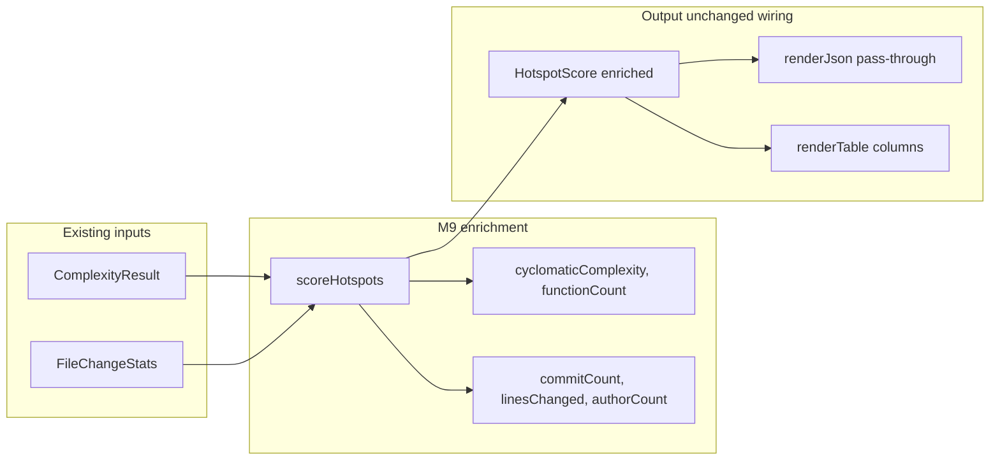

# Milestone 9 — Rich Output Design

**Spec**: [`.specs/features/rich-output/spec.md`](./spec.md)  
**Status**: Done

---

## Architecture Overview

M9 extends `HotspotScore` with five raw metric fields populated in `scoreHotspots()`. Reporters consume the enriched type — no enrichment logic in `scan.ts` or `bin/`. Scoring formulas, coupling output, and JSON `version` are unchanged.



**Baseline:** [`.specs/features/reporter-cli/design.md`](../reporter-cli/design.md) — M5 reporter architecture.  
**ROADMAP:** M9 Rich Output.

---

## Code Reuse Analysis

### Existing Components to Leverage

| Component | Location | How to Use |
| --------- | -------- | ---------- |
| `scoreHotspots` | `src/scoring/hotspot-scorer.ts` | Attach raw fields in `.map()` — already has `complexity` entry and `fileStats.get()` |
| `HotspotScore` | `src/types/domain.ts` | Extend interface with five numeric fields |
| `FileChangeStats.authors` | `src/types/domain.ts` | `authorCount = stats.authors.size` |
| `renderJson` | `src/report/json.ts` | Unchanged — `JSON.stringify(result)` serializes new fields automatically |
| `renderTable` | `src/report/table.ts` | Add columns to hotspots section only |
| `sample-result.json` | `tests/fixtures/report/` | Add raw field values for both reporter test files |
| Integration fixture | `tests/fixtures/repos/small-ts/` | Verify raw fields on top hotspot |

### Integration Points

| Consumer | Impact |
| -------- | ------ |
| `src/scan.ts` | None — returns `HotspotScore[]` from scorer unchanged call site |
| `src/report/slice.ts` | None — slices hotspot array; fields travel with entries |
| `bin/hotspot-scanner.ts` | None |
| `src/scoring/coupling-scorer.ts` | None |
| `src/scoring/normalize.ts` | None |

---

## Type Changes

### `HotspotScore` (`src/types/domain.ts`)

```typescript
export interface HotspotScore {
  filePath: string;
  complexityNormalized: number;
  churnNormalized: number;
  hotspotScore: number;
  cyclomaticComplexity: number;
  functionCount: number;
  commitCount: number;
  linesChanged: number;
  authorCount: number;
}
```

Remove stale comment on `FileChangeStats.authors` ("not exposed in JSON output") — M9 exposes count only.

### Field sourcing

| Field | Source | Missing `fileStats` default |
| ----- | ------ | --------------------------- |
| `cyclomaticComplexity` | `ComplexityResult.cyclomaticComplexity` | N/A (always from complexity entry) |
| `functionCount` | `ComplexityResult.functionCount` | N/A |
| `commitCount` | `FileChangeStats.commitCount` | `0` |
| `linesChanged` | `FileChangeStats.linesChanged` | `0` |
| `authorCount` | `FileChangeStats.authors.size` | `0` |

### Scorer implementation (`hotspot-scorer.ts`)

Inside existing `.map()`:

```typescript
const stats = fileStats.get(entry.filePath);
return {
  filePath: entry.filePath,
  complexityNormalized: c,
  churnNormalized: h,
  hotspotScore,
  cyclomaticComplexity: entry.cyclomaticComplexity,
  functionCount: entry.functionCount,
  commitCount: stats?.commitCount ?? 0,
  linesChanged: stats?.linesChanged ?? 0,
  authorCount: stats?.authors.size ?? 0,
};
```

**YAGNI:** Do not add `enrichHotspotScore()` helper — inline in `.map()`.

---

## JSON Output

- `renderJson()` remains one-line pass-through
- `version` stays `"1.0"` (additive schema)
- `authors` Set is never serialized — only `authorCount` number
- Coupling array schema unchanged

Example hotspot object after M9:

```json
{
  "filePath": "src/hot.ts",
  "hotspotScore": 0.85,
  "complexityNormalized": 0.9,
  "churnNormalized": 0.9444,
  "cyclomaticComplexity": 42,
  "functionCount": 8,
  "commitCount": 15,
  "linesChanged": 320,
  "authorCount": 3
}
```

---

## Table Layout

### Top Hotspots section

Expand column set (coupling section unchanged):

```
Rank  File                      Score     Cpx   CpxN      Churn  ChurnN  Funcs  Authors
----  ------------------------  --------  ----  --------  -----  ------  -----  -------
```

| Column | Source field | Format |
| ------ | ------------ | ------ |
| Rank | index + 1 | integer |
| File | `filePath` | pad/truncate 24 chars |
| Score | `hotspotScore` | 4 decimals |
| Cpx | `cyclomaticComplexity` | integer |
| CpxN | `complexityNormalized` | 4 decimals |
| Churn | `commitCount` | integer (raw churn signal per STATE.md) |
| ChurnN | `churnNormalized` | 4 decimals |
| Funcs | `functionCount` | integer |
| Authors | `authorCount` | integer |

**Note:** `linesChanged` is included in JSON per ROADMAP but omitted from table to limit width. Table focuses on primary triage signals; JSON carries full raw set.

**Integer formatting:** use `String(value)` — no `toFixed`.

**Normalized formatting:** reuse `formatScore()` / `SCORE_DECIMALS = 4`.

---

## Test Impact

| File | Change |
| ---- | ------ |
| `src/types/domain.ts` | Extend `HotspotScore`; update `FileChangeStats` comment |
| `src/scoring/hotspot-scorer.ts` | Attach raw fields in return object |
| `src/scoring/hotspot-scorer.test.ts` | Assert raw fields; missing fileStats → git zeros |
| `tests/fixtures/report/sample-result.json` | Add raw values per hotspot |
| `src/report/json.test.ts` | Assert raw fields in parsed JSON |
| `src/report/table.test.ts` | Assert column headers and integer values |
| `src/report/table.ts` | Expanded hotspots section |
| `src/scan.integration.test.ts` | Assert raw fields on `hotspots[0]` |

**Do not change:**

- `src/scoring/coupling-scorer.ts`
- `src/scoring/normalize.ts`
- `src/report/json.ts` (pass-through)
- `bin/hotspot-scanner.ts`

**Test helpers:** Any inline `HotspotScore` literals in tests (e.g. `table.test.ts` truncation test) must include raw fields after T1.

---

## Risks

| Risk | Mitigation |
| ---- | ---------- |
| Table too wide for narrow terminals | Accept for M9; path truncation preserved; `linesChanged` JSON-only |
| Fixture drift between json/table tests | Single `sample-result.json` updated atomically in T2 |
| Stale M5 schema docs | T4 sync ARCHITECTURE.md, STATE.md, path-scoping cross-ref |
| Test literals missing new required fields | TypeScript compile catches; grep `HotspotScore` literals in T1 gate |
| `authorCount = 0` for complexity-only files | Documented edge case; scorer defaults |

---

## Documentation Sync Targets

| File | Update |
| ---- | ------ |
| `.specs/project/STATE.md` | Decision: expose `authorCount` as bus factor; `authors` list remains internal |
| `.specs/codebase/ARCHITECTURE.md` | Document enriched hotspot JSON/table fields |
| `.specs/features/path-scoping/spec.md` | Fix Out of Scope: rich-output → M9, export → M10 |
| `.specs/project/ROADMAP.md` | Link spec; mark implementation checkboxes on Execute Done |
