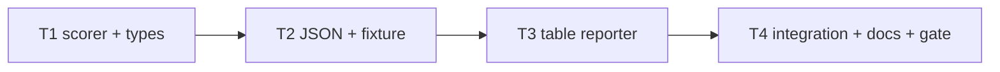

# Milestone 9 — Rich Output Tasks

**Design**: [`.specs/features/rich-output/design.md`](./design.md)  
**Spec**: [`.specs/features/rich-output/spec.md`](./spec.md)  
**Status**: Done

---

## Execution Plan

### Phase 1: Scorer enrichment (Sequential)

```
T1 HotspotScore type + scoreHotspots raw fields + unit tests
```

### Phase 2: JSON + fixture (Sequential)

```
T1 → T2 sample-result.json + json.test.ts
```

### Phase 3: Table reporter (Sequential)

```
T2 → T3 table.ts columns + table.test.ts
```

### Phase 4: Integration + docs + gate (Sequential)

```
T3 → T4 integration test + documentation sync + project gate
```



### Diagram-Definition Cross-Check

| Task | Depends on (declared) | Appears in diagram after deps | Match |
| ---- | --------------------- | ----------------------------- | ----- |
| T1 | None | Root | ✅ |
| T2 | T1 | T1 → T2 | ✅ |
| T3 | T2 | T2 → T3 | ✅ |
| T4 | T3 | T3 → T4 | ✅ |

### Test Co-location Validation

| Task | Code layer | TESTING.md expectation | Tests in same task | Match |
| ---- | ---------- | ---------------------- | ------------------ | ----- |
| T1 | `src/scoring/hotspot-scorer.ts`, `src/types/domain.ts` | Unit required | `hotspot-scorer.test.ts` update | ✅ |
| T2 | `src/report/json.ts` (fixture only) | Unit required | `json.test.ts` + `sample-result.json` | ✅ |
| T3 | `src/report/table.ts` | Unit required | `table.test.ts` update | ✅ |
| T4 | `src/scan.ts` integration + docs | Integration + gate | `scan.integration.test.ts` + full gate | ✅ |

---

## Task Breakdown

### T1: HotspotScore type + scorer raw enrichment

**What**: Extend `HotspotScore` with five raw fields. Populate them in `scoreHotspots()` from `ComplexityResult` and `FileChangeStats`. Update `FileChangeStats.authors` comment. Add unit tests for raw field values and missing-`fileStats` defaults.

**Where**: `src/types/domain.ts`, `src/scoring/hotspot-scorer.ts`, `src/scoring/hotspot-scorer.test.ts`

**Depends on**: None

**Reuses**: [design.md](./design.md) § Type Changes, § Scorer implementation; M8 harmonic combiner unchanged

**Requirement**: HOTSPOT-76, HOTSPOT-80

**Tools**:

- MCP: NONE
- Skill: `vitals-pipeline-domain`

**Done when**:

- [x] `HotspotScore` includes `cyclomaticComplexity`, `functionCount`, `commitCount`, `linesChanged`, `authorCount`
- [x] `scoreHotspots()` populates all raw fields per design sourcing table
- [x] Missing `fileStats` → `commitCount`, `linesChanged`, `authorCount` are `0`
- [x] `authorCount` equals `authors.size` when stats present
- [x] Normalized fields and harmonic `hotspotScore` behavior unchanged
- [x] `src/scoring/**` ≥80% line coverage maintained

**Tests**: `hotspot-scorer.test.ts` — raw fields on scored output; missing fileStats git-side zeros; authorCount from Set size

**Gate**: `pnpm exec vitest run src/scoring/hotspot-scorer.test.ts`

---

### T2: Reporter fixture + JSON tests

**What**: Add raw field values to `sample-result.json`. Update `json.test.ts` to assert all five raw fields on hotspot entries. Verify `version` remains `"1.0"` and output does not contain `authors` key.

**Where**: `tests/fixtures/report/sample-result.json`, `src/report/json.test.ts`

**Depends on**: T1

**Reuses**: T1 enriched `HotspotScore` shape; existing `renderJson` pass-through

**Requirement**: HOTSPOT-77, HOTSPOT-79

**Tools**:

- MCP: NONE
- Skill: NONE

**Done when**:

- [x] `sample-result.json` hotspots include all five raw fields with documented values
- [x] `_comment` documents M9 raw field additions
- [x] `json.test.ts` asserts raw fields via `toMatchObject`
- [x] JSON output still has `version: "1.0"` and no `authors` key

**Tests**: `json.test.ts` — serialized hotspot raw fields; empty arrays still valid

**Gate**: `pnpm exec vitest run src/report/json.test.ts`

---

### T3: Table reporter raw columns

**What**: Expand **Top Hotspots** section in `table.ts` per design § Table Layout. Update `table.test.ts` for new column headers and integer formatting. Update inline `HotspotScore` literals in tests to include raw fields.

**Where**: `src/report/table.ts`, `src/report/table.test.ts`

**Depends on**: T2

**Reuses**: [design.md](./design.md) § Table Layout; `sample-result.json` from T2; M5 `SCORE_DECIMALS` and path truncation

**Requirement**: HOTSPOT-78, HOTSPOT-79

**Tools**:

- MCP: NONE
- Skill: NONE

**Done when**:

- [x] Table hotspots section shows Cpx, CpxN, Churn, ChurnN, Funcs, Authors columns
- [x] Integer columns use no decimal places; normalized/score use 4 decimals
- [x] Coupling section unchanged
- [x] Empty hotspots still render `(none)`
- [x] Path truncation behavior preserved

**Tests**: `table.test.ts` — column headers, raw integer values, truncation, empty sections

**Gate**: `pnpm exec vitest run src/report/table.test.ts`

---

### T4: Integration verify + documentation sync + project gate

**What**: Assert raw fields on top hotspot in `scan.integration.test.ts`. Sync STATE.md (authorCount decision), ARCHITECTURE.md (enriched schema), path-scoping Out of Scope cross-refs. Mark ROADMAP M9 implementation checkboxes on Execute Done. Run full project gate.

**Where**: `src/scan.integration.test.ts`, `.specs/project/STATE.md`, `.specs/codebase/ARCHITECTURE.md`, `.specs/features/path-scoping/spec.md`, `.specs/project/ROADMAP.md`

**Depends on**: T3

**Reuses**: `tests/fixtures/repos/small-ts/`; [design.md](./design.md) § Documentation Sync Targets

**Requirement**: HOTSPOT-81, HOTSPOT-82

**Tools**:

- MCP: NONE
- Skill: `vitals-cli-validation`

**Done when**:

- [x] `hotspots[0]` on `small-ts` scan includes all five raw fields
- [x] `cyclomaticComplexity`, `commitCount`, `authorCount` on top hotspot are `> 0`
- [x] STATE.md records `authorCount` bus-factor decision
- [x] ARCHITECTURE.md documents enriched hotspot fields
- [x] path-scoping spec Out of Scope fixed (M9 rich-output, M10 export)
- [x] ROADMAP M9 implementation checkboxes marked `[x]` on Execute Done
- [x] `pnpm build && pnpm test` passes

**Tests**: `scan.integration.test.ts` — raw fields on top hotspot; full project gate

**Gate**: `pnpm build && pnpm test`

---

## Requirement Traceability (Tasks)

| Requirement ID | Tasks |
| -------------- | ----- |
| HOTSPOT-76 | T1 |
| HOTSPOT-77 | T2 |
| HOTSPOT-78 | T3 |
| HOTSPOT-79 | T2, T3 |
| HOTSPOT-80 | T1 |
| HOTSPOT-81 | T4 |
| HOTSPOT-82 | T4 |

**Coverage:** 7 total, 7 mapped to tasks, 0 unmapped
