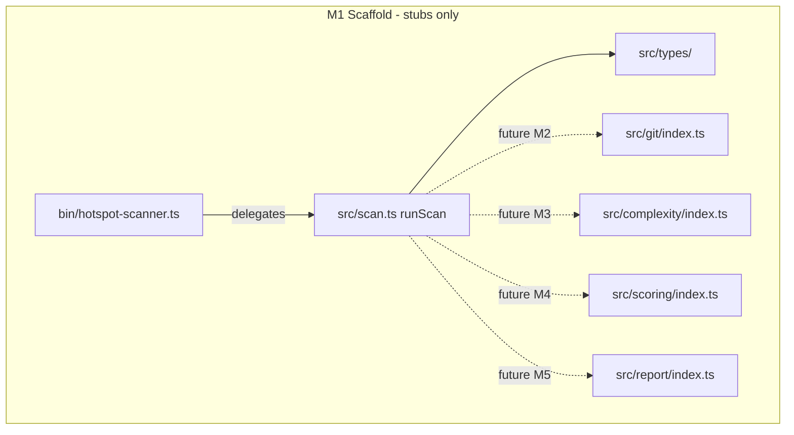

# Milestone 1 — Scaffold Design

**Spec**: [`.specs/features/scaffold/spec.md`](./spec.md)  
**Status**: Approved

---

## Architecture Overview

M1 establishes the pipeline skeleton: typed domain models, module boundaries with stub exports, a no-op `runScan()` orchestrator, and minimal CLI delegation. No external integrations are invoked.



**IMPL reference:** §4.1 container view, §4.3 component boundaries, §5.1 data model, §6.2 JSON output schema.

---

## Code Reuse Analysis

### Existing Components to Leverage

| Component | Location | How to Use |
| --------- | -------- | ---------- |
| Build scripts | `package.json` | Keep `build` and `test`; validate in T8 |
| Vitest config | `vitest.config.ts` | Keep include/exclude; no threshold changes in M1 |
| Dual TypeScript projects | `tsconfig.json`, `tsconfig.bin.json` | Unchanged; bin imports `../src/scan.js` |
| Package entry stub | `src/index.ts` | Extend to re-export `runScan` and public types |
| Package name test | `src/index.test.ts` | Extend to verify re-exports |
| CLI stub | `bin/hotspot-scanner.ts` | Replace `exit(2)` with minimal `scan <path>` delegation |

### Integration Points

| System | M1 behavior | Future milestone |
| ------ | ----------- | ---------------- |
| Git (`child_process` / simple-git) | Not invoked; `GitMiner` interface only | M2 |
| ts-morph | Not added as dependency; `ComplexityAnalyzer` interface only | M3 |
| commander | Not added; argv parsing in bin | M5 |
| Filesystem (repo under scan) | Not read in M1 | M2/M3 |

Per [INTEGRATIONS.md](../../codebase/INTEGRATIONS.md): adapter boundaries are declared in stubs but not wired in `runScan()` until respective milestones.

---

## Components

### Domain Types (`src/types/`)

- **Purpose**: Single source of truth for in-memory and JSON output shapes (IMPL §5.1, §6.2).
- **Location**: `src/types/domain.ts`, barrel `src/types/index.ts`
- **Rule**: Types only — no runtime logic ([CONVENTIONS.md](../../codebase/CONVENTIONS.md)); excluded from coverage thresholds ([TESTING.md](../../codebase/TESTING.md)).

```typescript
/** Per-file churn aggregated from git log (IMPL §5.1). */
export interface FileChangeStats {
  filePath: string;
  commitCount: number;
  linesChanged: number;
  /** Collected in M2; not exposed in JSON output (IMPL §5.2, §6.2). */
  authors: Set<string>;
  lastModified: Date;
}

/** McCabe complexity per file (IMPL §5.1). */
export interface ComplexityResult {
  filePath: string;
  cyclomaticComplexity: number;
  functionCount: number;
}

/** Ranked hotspot entry (IMPL §5.1). */
export interface HotspotScore {
  filePath: string;
  complexityNormalized: number;
  churnNormalized: number;
  hotspotScore: number;
}

/** Co-change event from a single commit (IMPL §5.1). */
export interface CoChangeEvent {
  commitHash: string;
  filesChanged: string[];
}

/** Ranked temporal coupling pair (IMPL §4.3, §6.2). */
export interface CouplingPair {
  fileA: string;
  fileB: string;
  coChangeCount: number;
  couplingStrength: number;
}

/** Scan input — flags optional until M5. */
export interface ScanOptions {
  repoPath: string;
  since?: string;
  top?: number;
  minCochange?: number;
  format?: "table" | "json";
}

/** Scan metadata included in every result. */
export interface ScanMeta {
  since: string;
  scannedAt: string;
}

/** Full scan output (IMPL §6.2 JSON schema). */
export interface ScanResult {
  version: "1.0";
  hotspots: HotspotScore[];
  coupling: CouplingPair[];
  meta: ScanMeta;
}
```

**Decision:** `authors` uses `Set<string>` for M2 aggregation efficiency; JSON serialization omits it in M5.

---

### Git Change Miner stub (`src/git/`)

- **Purpose**: Declare `GitMiner` contract for streaming git log parse (IMPL §4.3).
- **Location**: `src/git/index.ts`
- **Interfaces**:

```typescript
import type { CoChangeEvent, FileChangeStats } from "../types/index.js";

export interface GitMinerOptions {
  repoPath: string;
  since?: string;
}

export interface GitMinerResult {
  fileStats: Map<string, FileChangeStats>;
  coChangeEvents: CoChangeEvent[];
}

export interface GitMiner {
  mine(options: GitMinerOptions): Promise<GitMinerResult>;
}

export function createGitMiner(): GitMiner {
  throw new Error("GitMiner not implemented — see Milestone 2");
}
```

- **Dependencies**: `src/types/`
- **Reuses**: None (greenfield stub)

---

### Complexity Analyzer stub (`src/complexity/`)

- **Purpose**: Declare AST complexity contract (IMPL §4.3, ADR-2026-019).
- **Location**: `src/complexity/index.ts`
- **Interfaces**:

```typescript
import type { ComplexityResult } from "../types/index.js";

export interface ComplexityAnalyzerOptions {
  repoPath: string;
}

export interface ComplexityAnalyzer {
  analyze(options: ComplexityAnalyzerOptions): Promise<ComplexityResult[]>;
}

export function createComplexityAnalyzer(): ComplexityAnalyzer {
  throw new Error("ComplexityAnalyzer not implemented — see Milestone 3");
}
```

- **Dependencies**: `src/types/`
- **Reuses**: None

---

### Scoring stubs (`src/scoring/`)

- **Purpose**: Declare hotspot and coupling scorer contracts (IMPL §4.3).
- **Location**: `src/scoring/index.ts`
- **Interfaces**:

```typescript
import type {
  CoChangeEvent,
  ComplexityResult,
  CouplingPair,
  FileChangeStats,
  HotspotScore,
} from "../types/index.js";

export interface HotspotScorer {
  score(
    fileStats: Map<string, FileChangeStats>,
    complexity: ComplexityResult[],
  ): HotspotScore[];
}

export interface TemporalCouplingScorer {
  score(
    coChangeEvents: CoChangeEvent[],
    fileStats: Map<string, FileChangeStats>,
    minCochange: number,
  ): CouplingPair[];
}

export function createHotspotScorer(): HotspotScorer {
  throw new Error("HotspotScorer not implemented — see Milestone 4");
}

export function createTemporalCouplingScorer(): TemporalCouplingScorer {
  throw new Error("TemporalCouplingScorer not implemented — see Milestone 4");
}
```

- **Dependencies**: `src/types/`
- **Reuses**: None

---

### Reporter stub (`src/report/`)

- **Purpose**: Declare output contract for CLI table and JSON (IMPL §4.3, §6.2).
- **Location**: `src/report/index.ts`
- **Interfaces**:

```typescript
import type { ScanResult } from "../types/index.js";

export interface ReporterOptions {
  format: "table" | "json";
  top?: number;
}

export interface Reporter {
  render(result: ScanResult, options: ReporterOptions): string;
}

export function createReporter(): Reporter {
  throw new Error("Reporter not implemented — see Milestone 5");
}
```

- **Dependencies**: `src/types/`
- **Reuses**: None

---

### Pipeline orchestrator (`src/scan.ts`)

- **Purpose**: Single entry for scan pipeline; M1 returns empty typed result.
- **Location**: `src/scan.ts`
- **Interfaces**:
  - `runScan(options: ScanOptions): Promise<ScanResult>` — builds empty result with default meta
- **Dependencies**: `src/types/`
- **M1 behavior**: Does **not** import or invoke module stubs — avoids premature coupling and keeps integration test deterministic.
- **Default meta**: `since` defaults to `"12 months ago"` (STATE.md decision); `scannedAt` is ISO timestamp at call time.

```typescript
import type { ScanOptions, ScanResult } from "./types/index.js";

const DEFAULT_SINCE = "12 months ago";

export async function runScan(options: ScanOptions): Promise<ScanResult> {
  return {
    version: "1.0",
    hotspots: [],
    coupling: [],
    meta: {
      since: options.since ?? DEFAULT_SINCE,
      scannedAt: new Date().toISOString(),
    },
  };
}
```

---

### CLI entry (`bin/hotspot-scanner.ts`)

- **Purpose**: Thin argv wrapper — no domain logic ([CONVENTIONS.md](../../codebase/CONVENTIONS.md), [INTEGRATIONS.md](../../codebase/INTEGRATIONS.md)).
- **Location**: `bin/hotspot-scanner.ts`
- **M1 behavior**:

| Invocation | Action | Exit code |
| ---------- | ------ | --------- |
| `hotspot-scanner scan <path>` | `await runScan({ repoPath })` | `0` |
| Any other argv | Print usage to stderr | `2` |

- **Usage message**: `Usage: hotspot-scanner scan <path>`
- **No flags** in M1 (`--since`, `--format`, etc. added in M5)
- **Import**: `import { runScan } from "../src/scan.js"` (ESM `.js` extension)

---

### Public package API (`src/index.ts`)

- **Purpose**: Library entry for programmatic use and tests.
- **Exports**: `runScan`, `PACKAGE_NAME`, and re-exported types from `src/types/`
- **Reuses**: Existing `PACKAGE_NAME` constant

---

### Fixture scaffold (`tests/fixtures/`)

- **Purpose**: Reserve paths defined in [STRUCTURE.md](../../codebase/STRUCTURE.md) and [TESTING.md](../../codebase/TESTING.md).
- **Layout**:

```
tests/fixtures/
├── git-log/.gitkeep
├── repos/.gitkeep
└── complexity/.gitkeep
```

- **Vitest**: Already excluded via `vitest.config.ts` `exclude: ["tests/fixtures/**"]`

---

## Risks and Mitigations

| Risk | Source | M1 mitigation |
| ---- | ------ | ------------- |
| Dual `tsc` project misconfiguration | CONCERNS / bin-build rule | Do not add `bin/` to root `tsconfig.json` include |
| Git/McCabe parsing bugs | CONCERNS.md | Stubs throw on invoke; `runScan` does not call them |
| Premature commander/ts-morph deps | YAGNI | No new runtime dependencies in M1 |
| Stub factories silently succeed | Testability | Factory stubs throw explicit `Error` with milestone hint |

---

## Deviations from IMPL

| IMPL section | Deviation | Rationale |
| ------------ | --------- | --------- |
| §6.1 CLI flags | No flags in M1 | Commander and full flag set deferred to M5 |
| §6.2 exit code 0 on successful scan | Bin exits 0 on stub scan | Aligns with future behavior; invalid usage exits 2 |
| §9 Jest | Vitest used | Documented in STATE.md; no change in M1 |

---

## Post-Execute documentation updates

After orchestrator completes T8, update [STRUCTURE.md](../../codebase/STRUCTURE.md) module status from `planned` to `scaffold`/`stub` for new paths. ROADMAP M1 checkboxes remain `[ ]` until user marks milestone done.
