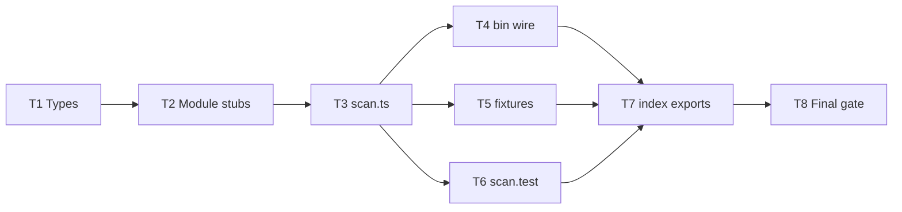

# Milestone 1 — Scaffold Tasks

**Design**: [`.specs/features/scaffold/design.md`](./design.md)  
**Spec**: [`.specs/features/scaffold/spec.md`](./spec.md)  
**Status**: Planned

---

## Execution Plan

### Phase 1: Foundation (Sequential)

```
T1 → T2 → T3
```

### Phase 2: Wiring (Parallel OK after T3)

```
T3 ──┬→ T4
     ├→ T5 [P]
     └→ T6
```

### Phase 3: Integration (Sequential)

```
T4, T5, T6 → T7 → T8
```



---

## Task Breakdown

### T1: Domain types (IMPL §5.1 + scan I/O)

**What**: Create all domain interfaces in `src/types/` per design.md — `FileChangeStats`, `ComplexityResult`, `HotspotScore`, `CoChangeEvent`, `CouplingPair`, `ScanOptions`, `ScanMeta`, `ScanResult`.

**Where**: `src/types/domain.ts`, `src/types/index.ts`

**Depends on**: None

**Reuses**: None

**Requirement**: HOTSPOT-02

**Tools**:

- MCP: NONE
- Skill: NONE

**Done when**:

- [ ] `src/types/domain.ts` defines all interfaces from design.md
- [ ] `src/types/index.ts` re-exports all public types
- [ ] No runtime logic in `src/types/` (types/interfaces only)
- [ ] Gate check passes: `pnpm build`

**Tests**: none (types excluded from coverage per TESTING.md)

**Gate**: build

---

### T2: Module stub exports [P]

**What**: Create barrel stubs for `git/`, `complexity/`, `scoring/`, `report/` with interfaces and factory functions that throw `Error` with milestone hint.

**Where**:

- `src/git/index.ts`
- `src/complexity/index.ts`
- `src/scoring/index.ts`
- `src/report/index.ts`

**Depends on**: T1

**Reuses**: Types from `src/types/index.js`

**Requirement**: HOTSPOT-01, HOTSPOT-03

**Tools**:

- MCP: NONE
- Skill: NONE

**Done when**:

- [ ] Each module exports interface(s) and `create*()` factory per design.md
- [ ] Calling any factory throws `Error` containing "not implemented" and milestone reference
- [ ] Co-located unit test per module asserts factory throws
- [ ] Gate check passes: `pnpm test -- src/git src/complexity src/scoring src/report`
- [ ] Test count: ≥4 new tests pass (one per module stub)

**Tests**: unit

**Gate**: quick (`pnpm test -- src/git src/complexity src/scoring src/report`)

---

### T3: Pipeline stub `runScan()`

**What**: Implement `src/scan.ts` with `runScan(options)` returning empty typed `ScanResult` and default meta (`since: "12 months ago"`, `scannedAt` ISO).

**Where**: `src/scan.ts`

**Depends on**: T1, T2

**Reuses**: `ScanOptions`, `ScanResult` from `src/types/`

**Requirement**: HOTSPOT-04

**Tools**:

- MCP: NONE
- Skill: NONE

**Done when**:

- [ ] `runScan` is async and returns `version: "1.0"`, empty `hotspots` and `coupling` arrays
- [ ] `meta.since` defaults to `"12 months ago"` when `options.since` omitted
- [ ] `meta.scannedAt` is valid ISO-8601 string
- [ ] `runScan` does not import git, ts-morph, or invoke module factories
- [ ] Gate check passes: `pnpm build`

**Tests**: none (covered in T6 integration test)

**Gate**: build

---

### T4: Bin delegates `scan <path>` → `runScan`

**What**: Replace `bin/hotspot-scanner.ts` stub with minimal argv parsing: `scan <path>` calls `runScan` and exits `0`; invalid usage prints to stderr and exits `2`.

**Where**: `bin/hotspot-scanner.ts`

**Depends on**: T3

**Reuses**: `runScan` from `../src/scan.js`

**Requirement**: HOTSPOT-05

**Tools**:

- MCP: NONE
- Skill: NONE

**Done when**:

- [ ] `hotspot-scanner scan <path>` exits `0` after awaiting `runScan({ repoPath })`
- [ ] Missing/invalid args print `Usage: hotspot-scanner scan <path>` to stderr and exit `2`
- [ ] No commander dependency added
- [ ] Gate check passes: `pnpm build`

**Tests**: none (CLI tests deferred to M5; manual smoke: `pnpm exec hotspot-scanner scan .`)

**Gate**: build

---

### T5: Fixture directory scaffold [P]

**What**: Create `tests/fixtures/git-log/`, `tests/fixtures/repos/`, `tests/fixtures/complexity/` each with `.gitkeep`.

**Where**: `tests/fixtures/**/.gitkeep`

**Depends on**: None (parallel with T2 after T1; independent of T3)

**Reuses**: Paths from STRUCTURE.md and TESTING.md

**Requirement**: HOTSPOT-06

**Tools**:

- MCP: NONE
- Skill: NONE

**Done when**:

- [ ] All three fixture subdirectories exist
- [ ] Each contains `.gitkeep`
- [ ] Vitest exclude unchanged (`tests/fixtures/**` not picked up as tests)

**Tests**: none

**Gate**: none

---

### T6: Integration placeholder test

**What**: Add `src/scan.test.ts` asserting `runScan` returns correct empty shape, default `since`, and valid `scannedAt`.

**Where**: `src/scan.test.ts`

**Depends on**: T3

**Reuses**: Vitest patterns from `src/index.test.ts`

**Requirement**: HOTSPOT-07

**Tools**:

- MCP: NONE
- Skill: NONE

**Done when**:

- [ ] Test calls `runScan({ repoPath: "." })` and asserts `version === "1.0"`
- [ ] Test asserts `hotspots` and `coupling` are empty arrays
- [ ] Test asserts `meta.since === "12 months ago"` when `since` omitted
- [ ] Test asserts `meta.scannedAt` parses as valid Date
- [ ] Gate check passes: `pnpm test -- src/scan.test.ts`
- [ ] Test count: ≥4 assertions in scan integration test

**Tests**: integration

**Gate**: quick (`pnpm test -- src/scan.test.ts`)

---

### T7: Public API re-exports

**What**: Update `src/index.ts` to export `runScan` and public types; extend `src/index.test.ts` to verify exports.

**Where**: `src/index.ts`, `src/index.test.ts`

**Depends on**: T3, T4, T5, T6

**Reuses**: Existing `PACKAGE_NAME` export

**Requirement**: HOTSPOT-02, HOTSPOT-04 (public API surface)

**Tools**:

- MCP: NONE
- Skill: NONE

**Done when**:

- [ ] `src/index.ts` exports `runScan` and re-exports types from `src/types/`
- [ ] `src/index.test.ts` verifies `runScan` and `PACKAGE_NAME` are importable
- [ ] Gate check passes: `pnpm test -- src/index.test.ts`
- [ ] Test count: existing + new export tests pass

**Tests**: unit

**Gate**: quick (`pnpm test -- src/index.test.ts`)

---

### T8: Final verification and ROADMAP sync

**What**: Run full project gate; update ROADMAP M1 with link to spec (if not done in planning); update STRUCTURE.md module statuses to `scaffold`/`stub`.

**Where**:

- `.specs/project/ROADMAP.md`
- `.specs/codebase/STRUCTURE.md`

**Depends on**: T1, T2, T3, T4, T5, T6, T7

**Reuses**: Quality gate from TESTING.md

**Requirement**: HOTSPOT-08

**Tools**:

- MCP: NONE
- Skill: NONE

**Done when**:

- [ ] Gate check passes: `pnpm build && pnpm test`
- [ ] ROADMAP M1 links to `.specs/features/scaffold/spec.md`
- [ ] STRUCTURE.md module map reflects new paths as `scaffold` or `stub`
- [ ] No regressions in existing `src/index.test.ts`

**Tests**: none (project gate)

**Gate**: full (`pnpm build && pnpm test`)

**Commit**: `feat(scaffold): add typed module skeleton and pipeline stub (M1)`

---

## Parallel Execution Map

```
Phase 1 (Sequential):
  T1 ──→ T2 ──→ T3

Phase 2 (Parallel after T3):
  T3 complete, then:
    ├── T4
    ├── T5 [P]
    └── T6

Phase 3 (Sequential):
  T4, T5, T6 complete, then:
    T7 ──→ T8
```

**Note:** T5 can start as soon as planning is approved — it has no code dependency on T1–T3. During Execute, orchestrator may run T5 in parallel with T2 or immediately after T1.

---

## Task Granularity Check

| Task | Scope | Status |
| ---- | ----- | ------ |
| T1: Domain types | 1 module (`src/types/`) | ✅ Granular |
| T2: Module stubs | 4 related stub files, same pattern | ✅ Granular |
| T3: runScan stub | 1 file | ✅ Granular |
| T4: Bin wire | 1 file | ✅ Granular |
| T5: Fixture dirs | 3 `.gitkeep` files | ✅ Granular |
| T6: scan.test.ts | 1 test file | ✅ Granular |
| T7: index exports | 2 files | ✅ Granular |
| T8: Gate + docs | verification + docs | ✅ Granular |

---

## Diagram-Definition Cross-Check

| Task | Depends On (task body) | Diagram Shows | Status |
| ---- | ---------------------- | ------------- | ------ |
| T1 | None | Entry node | ✅ Match |
| T2 | T1 | T1 → T2 | ✅ Match |
| T3 | T1, T2 | T2 → T3 | ✅ Match |
| T4 | T3 | T3 → T4 | ✅ Match |
| T5 | None | T3 → T5 (parallel) | ✅ Match |
| T6 | T3 | T3 → T6 | ✅ Match |
| T7 | T3, T4, T5, T6 | T4,T5,T6 → T7 | ✅ Match |
| T8 | T1–T7 | T7 → T8 | ✅ Match |

---

## Test Co-location Validation

| Task | Code Layer Created/Modified | Matrix Requires | Task Says | Status |
| ---- | --------------------------- | --------------- | --------- | ------ |
| T1: Domain types | `src/types/**` | none (excluded) | none | ✅ OK |
| T2: Module stubs | `src/{git,complexity,scoring,report}/` | unit (best effort) | unit | ✅ OK |
| T3: runScan | `src/scan.ts` | best effort | none (T6 covers) | ✅ OK |
| T4: Bin | `bin/hotspot-scanner.ts` | CLI tests in M5 | none | ✅ OK |
| T5: Fixtures | `tests/fixtures/` | none | none | ✅ OK |
| T6: scan.test | integration wiring | integration placeholder | integration | ✅ OK |
| T7: index exports | `src/index.ts` | best effort | unit | ✅ OK |
| T8: Final gate | docs only | project gate | full gate | ✅ OK |

---

## Requirement → Task Mapping

| Requirement | Task(s) |
| ----------- | ------- |
| HOTSPOT-01 | T2 |
| HOTSPOT-02 | T1, T7 |
| HOTSPOT-03 | T2 |
| HOTSPOT-04 | T3, T7 |
| HOTSPOT-05 | T4 |
| HOTSPOT-06 | T5 |
| HOTSPOT-07 | T6 |
| HOTSPOT-08 | T8 |

**Coverage:** 8 requirements, 8 mapped, 0 unmapped

---

## Module Owner Routing

| Task | Primary owner module |
| ---- | -------------------- |
| T1 | `src/types/` |
| T2 | `src/git/`, `src/complexity/`, `src/scoring/`, `src/report/` |
| T3 | `src/scan.ts` |
| T4 | `bin/hotspot-scanner.ts` |
| T5 | `tests/fixtures/` |
| T6 | `src/scan.test.ts` |
| T7 | `src/index.ts` |
| T8 | project docs |
