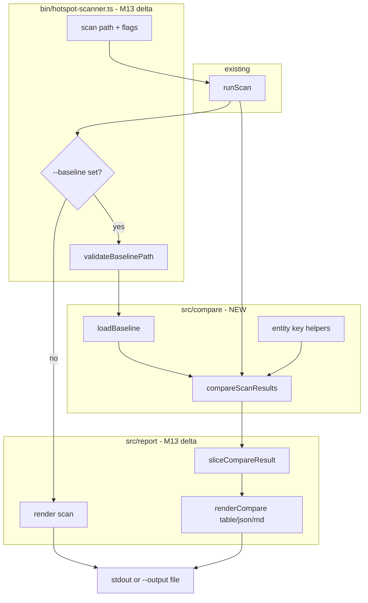

# Milestone 13 — Scan Compare Design

**Spec**: [`.specs/features/scan-compare/spec.md`](./spec.md)  
**Context**: [`.specs/features/scan-compare/context.md`](./context.md)  
**Status**: Done

---

## Architecture Overview

M13 adds a compare module (`src/compare/`) and extends the `scan` CLI with `--baseline <file>`. When the flag is set, the CLI runs a normal scan, loads the baseline JSON, computes a delta (`CompareResult`), and renders via new compare reporters. Without `--baseline`, behavior is unchanged from M11.



**Baseline:** [`.specs/features/export-formats/design.md`](../export-formats/design.md) — M10 reporter + CLI I/O; [`.specs/features/function-granularity/design.md`](../function-granularity/design.md) — M11 granularity branch.  
**ROADMAP:** M13 Scan Compare.

---

## Code Reuse Analysis

### Existing Components to Leverage

| Component                           | Location                             | How to Use                                              |
| ----------------------------------- | ------------------------------------ | ------------------------------------------------------- |
| `runScan()`                         | `src/scan.ts`                        | Current scan in compare branch — unchanged              |
| `createReporter`                    | `src/report/index.ts`                | Add `renderCompare()` dispatch                          |
| `sliceScanResult`                   | `src/report/slice.ts`                | Pattern for new `sliceCompareResult`                    |
| `renderTable` / `renderMarkdown`    | `src/report/table.ts`, `markdown.ts` | GFM escaping, numeric formatting conventions            |
| `parseFormat`, `parseGranularity`   | `bin/hotspot-scanner.ts`             | Unchanged parsers                                       |
| `validateOutputPath`, `writeReport` | `bin/hotspot-scanner.ts`             | Reuse for delta file output                             |
| `canonicalPair` logic               | `src/scoring/coupling-scorer.ts`     | Extract or duplicate `pairKey` for coupling entity keys |
| `sample-result.json`                | `tests/fixtures/report/`             | Base for compare fixture derivation                     |
| Integration fixture                 | `tests/fixtures/repos/small-ts/`     | E2E compare in T6                                       |

### Integration Points

| Consumer                 | Impact                                                            |
| ------------------------ | ----------------------------------------------------------------- |
| `src/types/domain.ts`    | Add `CompareResult`, `RankChange`, section types                  |
| `src/compare/`           | **New** — loader, keys, engine                                    |
| `src/report/`            | **New** compare renderers + `sliceCompareResult`                  |
| `bin/hotspot-scanner.ts` | `--baseline` option, action branch, `validateBaselinePath`        |
| `src/scan.ts`            | None — compare is post-scan                                       |
| `src/scoring/**`         | None — may export `canonicalPair` helper if refactored            |
| `src/index.ts`           | Export `compareScanResults`, `loadBaseline` (optional public API) |

---

## Type Changes

### Entity keys (`src/compare/keys.ts`)

```typescript
export function hotspotKey(filePath: string): string;
export function functionKey(
  filePath: string,
  functionName: string,
  line: number,
): string;
export function couplingKey(fileA: string, fileB: string): string;
```

`couplingKey` uses canonical ordering: `fileA < fileB ? [fileA, fileB] : [fileB, fileA]`, joined as `` `${fileA}\0${fileB}` `` (or `|` delimiter — implementation choice; must be stable and tested).

### Rank change wrapper (`src/types/domain.ts`)

```typescript
export interface RankChange<T> {
  entity: T;
  baselineRank: number;
  currentRank: number;
  rankDelta: number; // currentRank - baselineRank; positive = moved down
}
```

### Compare sections (`src/types/domain.ts`)

```typescript
export interface HotspotCompareSection {
  new: HotspotScore[];
  removed: HotspotScore[];
  rankChanged: RankChange<HotspotScore>[];
}

export interface FunctionCompareSection {
  new: FunctionHotspotScore[];
  removed: FunctionHotspotScore[];
  rankChanged: RankChange<FunctionHotspotScore>[];
}

export interface CouplingCompareSection {
  new: CouplingPair[];
  removed: CouplingPair[];
  rankChanged: RankChange<CouplingPair>[];
}

export interface CompareMeta {
  baseline: ScanMeta;
  current: ScanMeta;
  warnings: string[];
}

export interface CompareResult {
  version: "1.0";
  granularity: ScanGranularity;
  hotspots: HotspotCompareSection;
  functions: FunctionCompareSection;
  coupling: CouplingCompareSection;
  meta: CompareMeta;
}
```

**Mode population:**

| `granularity` | `hotspots`     | `functions`                                             | `coupling` |
| ------------- | -------------- | ------------------------------------------------------- | ---------- |
| `file`        | populated      | empty sections (`new`/`removed`/`rankChanged` all `[]`) | populated  |
| `function`    | empty sections | populated                                               | populated  |

---

## Compare Engine

### Module: `src/compare/compare.ts`

```typescript
export function compareScanResults(
  baseline: ScanResult,
  current: ScanResult,
): CompareResult;
```

### Algorithm (hotspots or functions — same structure)

For active array `items` (`hotspots` or `functions`):

1. **Guard:** if `baseline.meta.granularity !== current.meta.granularity`, throw `CompareError` (or typed error with message)
2. **Warnings:** if `baseline.meta.since !== current.meta.since`, push warning to `meta.warnings`
3. Build `baselineKey → { entity, rank }` map from baseline array (rank = index + 1)
4. Build `currentKey → { entity, rank }` map from current array (full ranking, pre-slice)
5. **Removed:** for each baseline key absent from current map → `removed` (use baseline entity)
6. **New:** for each current key absent from baseline map → `new` (use current entity)
7. **Rank changed:** for each key in both where `baselineRank !== currentRank` → `rankChanged` with `RankChange` wrapper
8. Unchanged keys (same rank) are omitted from all three arrays

### Coupling algorithm

Same as above using `couplingKey(fileA, fileB)` on `baseline.coupling` and `current.coupling`. Independent of `granularity`.

### Sort order within delta sections

Preserve baseline order for `removed`; current ranking order for `new`; baseline order for `rankChanged` (or current — pick baseline order for determinism in tests). **Recommendation:** sort `new` by current rank ascending; `removed` by baseline rank ascending; `rankChanged` by `Math.abs(rankDelta)` descending then key.

---

## Baseline Loader

### Module: `src/compare/load-baseline.ts`

```typescript
export async function loadBaseline(filePath: string): Promise<ScanResult>;
export function parseScanResult(json: unknown): ScanResult;
```

- `loadBaseline`: `readFile` UTF-8 → `JSON.parse` → `parseScanResult`
- `parseScanResult`: validate `version === "1.0"`, arrays exist, `meta.granularity` valid, numeric fields on first hotspot if present (lightweight shape check — no full schema validator YAGNI)
- Throw `BaselineError` (or reuse pattern from git errors) with actionable messages

**CLI validation:** `validateBaselinePath(path)` in `bin/hotspot-scanner.ts`:

- Reject empty path
- Reject directory (file must exist via `stat` — opposite of `validateOutputPath` which checks parent exists for write)
- Reject missing file

---

## Reporter Layer

### `sliceCompareResult` (`src/report/slice-compare.ts`)

```typescript
export function sliceCompareResult(
  result: CompareResult,
  top?: number,
): CompareResult;
```

When `top` is defined, slice `new`, `removed`, and `rankChanged` independently for each section (`hotspots`, `functions`, `coupling`). Does not recompute classification.

### Compare renderers

| Module                           | Export                                  |
| -------------------------------- | --------------------------------------- |
| `src/report/compare-json.ts`     | `renderCompareJson(result): string`     |
| `src/report/compare-table.ts`    | `renderCompareTable(result): string`    |
| `src/report/compare-markdown.ts` | `renderCompareMarkdown(result): string` |

### `createReporter` extension (`src/report/index.ts`)

```typescript
export interface Reporter {
  render(result: ScanResult, options: ReporterOptions): string;
  renderCompare(result: CompareResult, options: ReporterOptions): string;
}
```

```typescript
renderCompare(result, options) {
  const sliced = sliceCompareResult(result, options.top);
  switch (options.format) {
    case "json":
      return renderCompareJson(sliced);
    case "markdown":
      return renderCompareMarkdown(sliced);
    default:
      return renderCompareTable(sliced);
  }
}
```

---

## Table Layout

### File mode sections

```
Scan Compare Report
Baseline scanned: <baseline.scannedAt>  Since: <baseline.since>
Current scanned:  <current.scannedAt>   Since: <current.since>
[WARN lines if any]

=== New Hotspots ===
Rank | File | Score | ...

=== Removed Hotspots ===
...

=== Rank Changed Hotspots ===
Baseline Rank | Current Rank | Delta | File | Score | ...

=== New Coupling Pairs ===
...

=== Removed Coupling Pairs ===
...

=== Rank Changed Coupling Pairs ===
...
```

### Function mode

Replace **Hotspots** sections with **Functions** — add `Function` and `Line` columns per M11 table conventions.

### Formatting rules

- Scores and normalized values: 4 decimal places
- Integer fields: no decimal places
- Empty section: `(none)` in table; `_No results._` in markdown
- Pipe escape in markdown: same as M10/M11

---

## Markdown Layout

```markdown
# Hotspot Scanner — Compare Report

**Baseline:** scanned at …, window …  
**Current:** scanned at …, window …

> Warning: baseline and current use different --since windows.

## New Hotspots

| Rank | File | Score | … |
| ---: | --- | ---: | … |

## Removed Hotspots

…

## Rank Changed Hotspots

| Baseline Rank | Current Rank | Δ | File | Score | … |
| ---: | ---: | ---: | --- | ---: | … |

## Coupling Changes

…
```

Function mode: `## New Functions` etc. with `Function` and `Line` columns.

---

## CLI Wiring

### New option on `scan` command

```typescript
.option("--baseline <path>", "Compare scan against baseline JSON from a prior run")
```

### Action branch (pseudocode)

```typescript
const result = await runScan({ ... });

if (options.baseline) {
  await validateBaselinePath(options.baseline);
  const baseline = await loadBaseline(options.baseline);
  const compareResult = compareScanResults(baseline, result);
  for (const w of compareResult.meta.warnings) {
    logWarning(w);
  }
  output = createReporter().renderCompare(compareResult, { format, top });
} else {
  output = createReporter().render(result, { format, top });
}

await writeReport(output, outputPath);
```

**YAGNI:** No `CompareSink` abstraction — mirror M10 inline branch.

---

## Test Fixtures

| Fixture                                                | Purpose                                                           |
| ------------------------------------------------------ | ----------------------------------------------------------------- |
| `tests/fixtures/report/compare-baseline-file.json`     | Minimal baseline `ScanResult` (file mode, 3 hotspots, 2 coupling) |
| `tests/fixtures/report/compare-current-file.json`      | Current with 1 new, 1 removed, 1 rank-changed hotspot             |
| `tests/fixtures/report/compare-expected-file.json`     | Expected `CompareResult` for unit test golden assert              |
| `tests/fixtures/report/compare-baseline-function.json` | Function mode baseline                                            |
| `tests/fixtures/report/compare-expected-function.json` | Function mode expected delta                                      |

Derive from `sample-result.json` and `sample-result-functions.json` where possible.

---

## Documentation Sync Targets (T6)

| File                                            | Updates                                                                |
| ----------------------------------------------- | ---------------------------------------------------------------------- |
| `.specs/codebase/ARCHITECTURE.md`               | `--baseline` branch, `src/compare/` module, `CompareResult`            |
| `.specs/codebase/STRUCTURE.md`                  | `src/compare/`, `compare-*.ts` reporters                               |
| `README.md`                                     | `--baseline` flag, CI workflow example                                 |
| `.cursor/skills/vitals-cli-validation/SKILL.md` | Baseline export + compare validation commands                          |
| `.specs/project/ROADMAP.md`                     | M13 `**Specs:** Done` (planning); implementation `[x]` on Execute Done |

---

## Error Types

```typescript
export class CompareError extends Error {
  constructor(message: string) {
    super(message);
    this.name = "CompareError";
  }
}

export class BaselineError extends Error {
  constructor(message: string) {
    super(message);
    this.name = "BaselineError";
  }
}
```

CLI maps `BaselineError` / `CompareError` to exit `1`; `CliUsageError` remains exit `2`.

---

## Public API (`src/index.ts`)

Export for programmatic consumers:

```typescript
export { loadBaseline, parseScanResult, compareScanResults } from "./compare/index.js";
export type { CompareResult, RankChange, HotspotCompareSection, ... } from "./types/index.js";
```

Optional but recommended — aligns with existing `runScan` export pattern.
