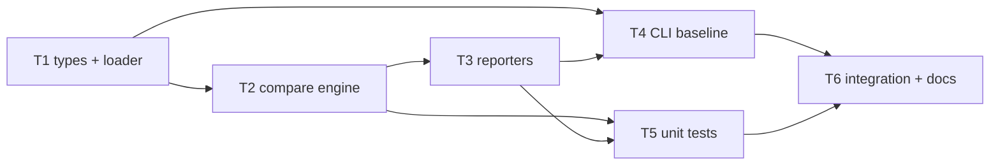

# Milestone 13 — Scan Compare Tasks

**Design**: [`.specs/features/scan-compare/design.md`](./design.md)  
**Spec**: [`.specs/features/scan-compare/spec.md`](./spec.md)  
**Context**: [`.specs/features/scan-compare/context.md`](./context.md)  
**Status**: Done

---

## Execution Plan

### Phase 1: Types + baseline loader (Sequential)

```
T1 CompareResult types + entity keys + loadBaseline + parseScanResult
```

### Phase 2: Compare engine (Sequential)

```
T1 → T2 compareScanResults — hotspots/functions + coupling
```

### Phase 3: Compare reporters (Sequential)

```
T2 → T3 compare table/json/markdown + sliceCompareResult + factory
```

### Phase 4: CLI wiring (Sequential)

```
T1 + T3 → T4 scan --baseline flag + action branch
```

### Phase 5: Unit tests (Sequential)

```
T2 + T3 → T5 compare engine + reporter tests + fixtures
```

### Phase 6: Integration + docs (Sequential)

```
T4 + T5 → T6 integration test on small-ts + docs sync + gate
```



### Diagram-Definition Cross-Check

| Task | Depends on (declared) | Appears in diagram after deps | Match |
| ---- | --------------------- | ----------------------------- | ----- |
| T1 | None | Root | ✅ |
| T2 | T1 | T1 → T2 | ✅ |
| T3 | T2 | T2 → T3 | ✅ |
| T4 | T1, T3 | T1/T3 → T4 | ✅ |
| T5 | T2, T3 | T2/T3 → T5 | ✅ |
| T6 | T4, T5 | T4/T5 → T6 | ✅ |

### Test Co-location Validation

| Task | Code layer | TESTING.md expectation | Tests in same task | Match |
| ---- | ---------- | ---------------------- | ------------------ | ----- |
| T1 | `src/compare/load-baseline.ts`, `keys.ts` | Unit required | `load-baseline.test.ts`, `keys.test.ts` | ✅ |
| T2 | `src/compare/compare.ts` | Unit required | `compare.test.ts` | ✅ |
| T3 | `src/report/compare-*.ts` | Unit required | `compare-*.test.ts`, `index.test.ts` | ✅ |
| T4 | `bin/hotspot-scanner.ts` | CLI unit | `bin/hotspot-scanner.test.ts` | ✅ |
| T5 | Fixtures + unit coverage | Unit required | Consolidate/compare gate in T5 | ✅ |
| T6 | `bin/` integration + docs | Integration + gate | `bin/hotspot-scanner.integration.test.ts` | ✅ |

---

## Task Breakdown

### T1: CompareResult types + baseline loader + entity keys

**What**: Add `CompareResult`, `RankChange`, section types, and `CompareMeta` to `src/types/domain.ts`. Implement `src/compare/keys.ts` with `hotspotKey`, `functionKey`, `couplingKey`. Implement `loadBaseline()`, `parseScanResult()`, and `BaselineError` in `src/compare/load-baseline.ts`. Export from `src/compare/index.ts`. Add unit tests for key stability, valid/invalid JSON parsing, and version guard.

**Where**: `src/types/domain.ts`, `src/types/index.ts`, `src/compare/keys.ts`, `src/compare/keys.test.ts`, `src/compare/load-baseline.ts`, `src/compare/load-baseline.test.ts`, `src/compare/index.ts`

**Depends on**: None

**Reuses**: [design.md](./design.md) § Type Changes, § Baseline Loader, § Entity keys; [context.md](./context.md) § Entity identity keys, § Granularity mismatch

**Requirement**: HOTSPOT-103, HOTSPOT-104, HOTSPOT-107

**Tools**:

- MCP: NONE
- Skill: NONE

**Done when**:

- [x] `CompareResult` and related types exported from `src/types/`
- [x] `parseScanResult()` accepts valid M11 `ScanResult` JSON and rejects wrong version / missing keys
- [x] `loadBaseline()` reads UTF-8 file and returns typed `ScanResult`
- [x] Entity key functions stable for coupling pair order swap
- [x] `src/compare/**` ≥80% line coverage on new files

**Tests**: `keys.test.ts` — hotspot, function, coupling keys; `load-baseline.test.ts` — valid fixture, malformed JSON, wrong version

**Gate**: `pnpm exec vitest run src/compare/keys.test.ts src/compare/load-baseline.test.ts`

---

### T2: Compare engine

**What**: Implement `compareScanResults(baseline, current)` in `src/compare/compare.ts` per design § Compare Engine. Handle file and function modes, coupling section, granularity guard (throw), `since` mismatch warning. Add `CompareError`. Create compare fixtures (`compare-baseline-file.json`, `compare-current-file.json`, `compare-expected-file.json`) and function-mode equivalents.

**Where**: `src/compare/compare.ts`, `src/compare/compare.test.ts`, `src/compare/index.ts`, `tests/fixtures/report/compare-*.json`

**Depends on**: T1

**Reuses**: [design.md](./design.md) § Compare Engine; [context.md](./context.md) § Compare scope, § Rank source

**Requirement**: HOTSPOT-105, HOTSPOT-106, HOTSPOT-107

**Tools**:

- MCP: NONE
- Skill: NONE

**Done when**:

- [x] File mode: `new`, `removed`, `rankChanged` correct for hotspots; empty function sections
- [x] Function mode: same for `functions`; empty hotspot sections
- [x] Coupling: `new`, `removed`, `rankChanged` with canonical pair keys
- [x] Granularity mismatch throws `CompareError`
- [x] `since` mismatch adds warning to `meta.warnings`, does not throw
- [x] `rankDelta = currentRank - baselineRank`
- [x] `src/compare/**` ≥80% line coverage maintained

**Tests**: `compare.test.ts` — file mode golden, function mode golden, coupling swap, granularity error, since warning

**Gate**: `pnpm exec vitest run src/compare/compare.test.ts`

---

### T3: Compare reporters + slice + factory

**What**: Implement `sliceCompareResult` in `src/report/slice-compare.ts`. Add `renderCompareTable`, `renderCompareJson`, `renderCompareMarkdown`. Extend `createReporter()` with `renderCompare()`. Add unit tests for all three formats in file and function modes, empty sections, pipe escaping in markdown.

**Where**: `src/report/slice-compare.ts`, `src/report/slice-compare.test.ts`, `src/report/compare-table.ts`, `src/report/compare-json.ts`, `src/report/compare-markdown.ts`, `src/report/compare-table.test.ts`, `src/report/compare-json.test.ts`, `src/report/compare-markdown.test.ts`, `src/report/index.ts`, `src/report/index.test.ts`

**Depends on**: T2

**Reuses**: [design.md](./design.md) § Reporter Layer, § Table Layout, § Markdown Layout; M10/M11 GFM patterns

**Requirement**: HOTSPOT-109, HOTSPOT-110

**Tools**:

- MCP: NONE
- Skill: NONE

**Done when**:

- [x] `renderCompare()` dispatches table, json, markdown
- [x] `sliceCompareResult` slices all delta arrays when `top` provided
- [x] File mode sections: New/Removed/Rank Changed Hotspots + Coupling
- [x] Function mode sections: New/Removed/Rank Changed Functions + Coupling
- [x] Empty sections render without throwing
- [x] Normal `render()` unchanged from M11
- [x] Compare reporter files ≥80% line coverage

**Tests**: `compare-*.test.ts`, `index.test.ts` — dispatch, slice, GFM escape

**Gate**: `pnpm exec vitest run src/report/slice-compare.test.ts src/report/compare-table.test.ts src/report/compare-json.test.ts src/report/compare-markdown.test.ts src/report/index.test.ts`

---

### T4: CLI `scan --baseline` flag

**What**: Add `--baseline <path>` option to `scan` command. Implement `validateBaselinePath()` (file must exist, not directory, not empty). Branch action: baseline path → load, compare, `renderCompare`; else normal `render`. Map `BaselineError`/`CompareError` to exit `1`. Add CLI unit tests.

**Where**: `bin/hotspot-scanner.ts`, `bin/hotspot-scanner.test.ts`

**Depends on**: T1, T3

**Reuses**: [design.md](./design.md) § CLI Wiring; [context.md](./context.md) § CLI shape, § Scan without baseline unchanged

**Requirement**: HOTSPOT-108

**Tools**:

- MCP: NONE
- Skill: NONE

**Done when**:

- [x] `--baseline` triggers compare flow with delta output
- [x] Omitting `--baseline` behavior unchanged (regression guard in tests)
- [x] `validateBaselinePath` rejects missing file, directory, empty path
- [x] `--format`, `--output`, `--top` work with compare output
- [x] Successful compare exits `0`
- [x] Warnings still on stderr

**Tests**: `bin/hotspot-scanner.test.ts` — `validateBaselinePath`, mocked compare branch

**Gate**: `pnpm exec vitest run bin/hotspot-scanner.test.ts`

---

### T5: Unit test consolidation + fixtures

**What**: Ensure all compare fixtures are complete and referenced. Add any missing edge-case tests (empty baseline arrays, entity removed from repo). Export compare API from `src/index.ts` if not done in T1/T2. Verify coverage thresholds for `src/compare/**` and compare reporter files.

**Where**: `tests/fixtures/report/compare-*.json`, `src/index.ts`, test files from T1–T3

**Depends on**: T2, T3

**Reuses**: [design.md](./design.md) § Test Fixtures; [spec.md](./spec.md) § Edge Cases

**Requirement**: HOTSPOT-111

**Tools**:

- MCP: NONE
- Skill: NONE

**Done when**:

- [x] Golden fixtures for file and function mode compare
- [x] Empty baseline edge case covered
- [x] `compareScanResults` and `loadBaseline` exported from `src/index.ts`
- [x] All compare-related unit tests pass
- [x] Coverage ≥80% on `src/compare/**` and new report modules

**Tests**: Full compare unit suite

**Gate**: `pnpm exec vitest run src/compare src/report/compare-table.test.ts src/report/compare-json.test.ts src/report/compare-markdown.test.ts src/report/slice-compare.test.ts`

---

### T6: Integration test + documentation sync + project gate

**What**: Integration test on `small-ts`: generate baseline JSON in test, run `scan --baseline`, assert exit `0` and parseable delta JSON with expected top-level keys. Regression: `scan` without `--baseline` unchanged. Update ARCHITECTURE.md, STRUCTURE.md, README.md, vitals-cli-validation skill. Mark ROADMAP M13 implementation checkboxes `[x]` on Execute Done only. Run full project gate.

**Where**: `bin/hotspot-scanner.integration.test.ts`, `.specs/codebase/ARCHITECTURE.md`, `.specs/codebase/STRUCTURE.md`, `README.md`, `.cursor/skills/vitals-cli-validation/SKILL.md`, `.specs/project/ROADMAP.md`

**Depends on**: T4, T5

**Reuses**: [design.md](./design.md) § Documentation Sync Targets; `tests/fixtures/repos/small-ts/`; skill `vitals-cli-validation`

**Requirement**: HOTSPOT-112

**Tools**:

- MCP: NONE
- Skill: `vitals-cli-validation`

**Done when**:

- [x] Integration: `--baseline` on `small-ts` exits `0`, delta JSON has `new`/`removed`/`rankChanged` sections
- [x] Integration: scan without `--baseline` regression pass
- [x] ARCHITECTURE.md documents `--baseline` and `src/compare/`
- [x] README.md flags table includes `--baseline`
- [x] vitals-cli-validation skill includes baseline workflow
- [x] ROADMAP M13 implementation checkboxes `[x]` on Execute Done
- [x] `pnpm build && pnpm test` passes

**Tests**: Full project gate + integration

**Gate**: `pnpm build && pnpm test`

---

## Requirement Traceability (Tasks)

| Requirement ID | Tasks |
| -------------- | ----- |
| HOTSPOT-103 | T1 |
| HOTSPOT-104 | T1 |
| HOTSPOT-105 | T2 |
| HOTSPOT-106 | T2 |
| HOTSPOT-107 | T1, T2 |
| HOTSPOT-108 | T4 |
| HOTSPOT-109 | T3 |
| HOTSPOT-110 | T3 |
| HOTSPOT-111 | T5 |
| HOTSPOT-112 | T6 |

**Coverage:** 10 total, 10 mapped to tasks, 0 unmapped
