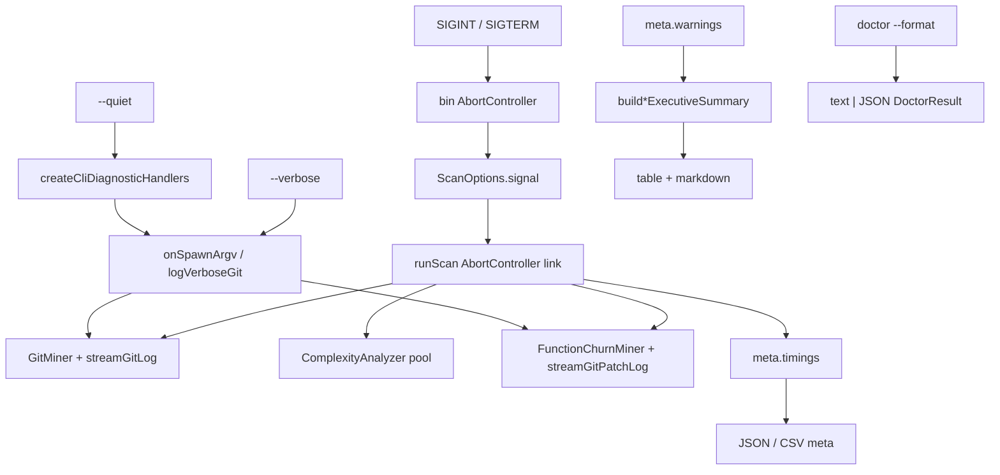

# Milestone 51 — Scan Observability Design

**Spec**: [spec.md](./spec.md)  
**Context**: [context.md](./context.md)  
**Status**: Planned

---

## Architecture Overview

M51 is an **observability and cancel** layer across bin, scan orchestration, git spawn, diagnostics, doctor CLI, report summary, and JSON schema. Rankings and scoring stay untouched.



**Baseline:** M28 diagnostics, M34 overlap abort, M38 quiet/no-progress, M39 doctor, M41 executive summary.

---

## Code Reuse Analysis

### Existing Components to Leverage

| Component | Location | How to Use |
| --------- | -------- | ---------- |
| Orchestrator `AbortController` | `src/scan.ts` | Link external `ScanOptions.signal`; keep sibling-failure abort |
| Numstat abort kill | `src/git/spawn.ts` | Already listens to `signal` — reuse |
| Complexity pool abort | `src/complexity/pool.ts` | Already accepts `signal` — reuse |
| Patch spawn | `src/git/function-churn/spawn.ts` | **Add** abort wiring (gap); type already extends `GitLogSpawnOptions` |
| CLI diagnostic handlers | `src/diagnostics/logger.ts` | Extend for verbose gate + quiet precedence |
| Executive summary | `src/report/summary.ts` | Add warning rollup helper |
| Doctor result | `src/doctor/index.ts` | Serialize existing `DoctorResult`; add thin JSON formatter |
| ScanMeta / schemas | `src/types/domain.ts`, `schemas/scan-result.json` | Additive `timings` |
| Warning format | `src/report/warning-format.ts` | Unchanged full lines; summary is separate |

### Integration Points

| System | Integration |
| ------ | ----------- |
| `bin/hotspot-scanner.ts` | Signal listeners around scan/compare actions; `--verbose`; doctor `--format` |
| `bin/scan-actions.ts` | Pass `signal` / verbose into `runScan` if shared helpers used |
| Contract tests | `tests/contract/json-schema.test.ts` for `timings` |
| `loadBaseline` | Accept metas with/without `timings` (additionalProperties / non-required) |

---

## Components

### 1. External abort link (`runScan`)

- **Purpose**: Honor operator cancel and sibling failure on one signal graph.
- **Location**: `src/scan.ts`
- **Interfaces**:
  - Extend `ScanOptions` with `signal?: AbortSignal` and optional `onSpawnArgv?: (argv: string[]) => void` (or pass verbose via deps — prefer options for testability)
  - On `options.signal` abort → `abortController.abort()`
  - Pass `signal` into function-churn `mine`
- **Reuses**: Existing overlap `Promise.all` / `allSettled` pattern

### 2. Function-churn AbortSignal

- **Purpose**: Close M34 follow-up so SIGINT mid-patch does not zombie git.
- **Location**: `src/git/function-churn/spawn.ts`, `index.ts`
- **Interfaces**: Forward `signal` into `streamGitPatchLog`; mirror numstat kill/close/readline pattern from `src/git/spawn.ts`
- **Dependencies**: `AbortSignal`, `child_process.spawn`

### 3. Stage timings

- **Purpose**: Record wall-clock ms per stage into `meta.timings`.
- **Location**: `src/scan.ts` (+ types)
- **Data model**: See context `ScanStageTimings`
- **Note**: File-mode overlap — measure each promise independently; `totalMs` = wall clock for `runScan` work

### 4. Verbose git argv

- **Purpose**: Narrow spawn trace.
- **Location**: `src/git/spawn.ts`, `src/git/function-churn/spawn.ts`, diagnostics or bin callback
- **Interfaces**: `onSpawnArgv?: (argv: string[]) => void` on spawn options; bin wires `verbose && !quiet` → `stderr.write(\`verbose: git ${argv.join(" ")}\n\`)`
- **CLI**: `--verbose` on `scan` and `compare` only

### 5. Warning summary

- **Purpose**: One-line rollup in executive summary.
- **Location**: `src/report/summary.ts` (helper `formatWarningSummaryLine(warnings: ScanWarning[]): string`)
- **Consumers**: `buildScanExecutiveSummary`, `buildCompareExecutiveSummary`

### 6. Doctor JSON

- **Purpose**: Machine-readable doctor output.
- **Location**: `src/doctor/` formatter or bin `formatDoctorFindingsJson`; prefer `src/doctor/format.ts` for purity
- **CLI**: `doctor -f/--format text|json`

### 7. Bin signal + exit mapping

- **Purpose**: Process lifecycle for cancel.
- **Location**: `bin/hotspot-scanner.ts` (and/or `bin/scan-actions.ts`)
- **Behavior**: Install listeners before `runScan`; on abort catch distinguish `AbortError` / cancelled flag → exit 130/143; remove listeners in `finally`

---

## Data Models

```ts
interface ScanStageTimings {
  gitMs: number;
  complexityMs: number;
  functionChurnMs?: number;
  totalMs: number;
}

interface ScanMeta {
  since: string;
  scannedAt: string;
  granularity: ScanGranularity;
  warnings: ScanWarning[];
  timings: ScanStageTimings; // always on successful scan
}

// Doctor JSON envelope
interface DoctorJsonReport {
  version: "1.0";
  findings: DoctorFinding[];
  exitCode: 0 | 1 | 2;
}
```

`ScanResult.version` / `CompareResult.version` remain `"1.0"`.

---

## Error Handling

| Scenario | Behavior | User sees |
| -------- | -------- | --------- |
| SIGINT | Abort stages; exit 130 | `warning: scan cancelled`; no report |
| SIGTERM | Abort stages; exit 143 | Same cancel line |
| Stage failure mid-overlap | Existing M34 sibling abort + rethrow | Existing error / non-zero |
| Invalid doctor format | `CliUsageError` | Exit 2 |
| Verbose + quiet | Quiet wins | No verbose lines |

---

## Design Decisions (summary)

| ID | Decision | Rationale |
| -- | -------- | --------- |
| D1 | Exit 130/143 | POSIX; distinct from usage errors |
| D2 | Additive timings under 1.0 | `additionalProperties`; baseline compat |
| D3 | No separate `scoringMs` | YAGNI; folded into `totalMs` |
| D4 | Warning rollup in exec summary only | Reuses M41 placement |
| D5 | Doctor JSON wraps `DoctorResult` | Exit policy unchanged |
| D6 | Verbose = argv hook only | STATE / M38 narrow reopen |

---

## Risks (CONCERNS)

| Risk | Mitigation |
| ---- | ---------- |
| Orphan git/workers on cancel | Function-churn abort gap closed; `allSettled` after abort |
| Partial rankings on interrupt | Never call reporter on cancel path |
| Baseline reject on new meta field | `timings` not required for load; additive schema |
| Verbose spam | Single line per spawn; quiet suppresses |
| Path conflict on `src/scan.ts` | Single task owns scan wiring (timings + signal + churn signal) |

---

## Testing Strategy

| Layer | Coverage |
| ----- | -------- |
| Unit | function-churn abort; timings shape; warning summary formatter; doctor JSON format; spawn `onSpawnArgv` |
| Scan unit | External signal abort; timings present; functionChurnMs omit in file mode |
| Contract | `meta.timings` in scan-result schema |
| CLI | doctor format json/text/invalid; `--verbose` / `--quiet`; cancel exit mapping where practical |
| Gate | `pnpm build && pnpm test` |

---

## Docs impact

- `ARCHITECTURE.md` — cancel signals, timings, verbose, doctor format
- `CONCERNS.md` — user-cancel path next to overlap abort
- `README.md` — flags and JSON field
- `STRUCTURE.md` — doctor format helper if new file
