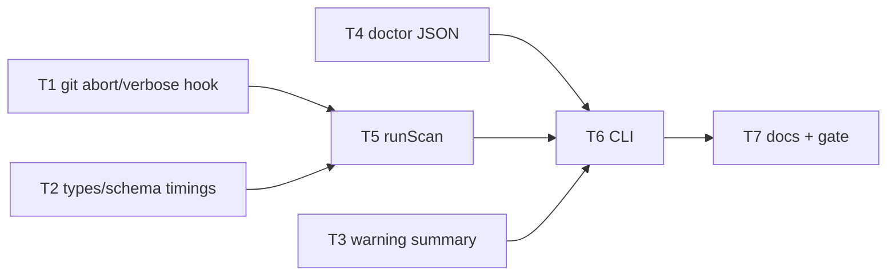

# Milestone 51 — Scan Observability Tasks

**Design**: [design.md](./design.md)  
**Spec**: [spec.md](./spec.md)  
**Context**: [context.md](./context.md)  
**Status**: Planned

---

## Execution Plan

```
T1 [P] git abort + spawn argv hook ──┐
T2 [P] types + schema timings ───────┼──→ T5 runScan wiring ──┐
T3 [P] warning summary (report) ─────┤                       ├──→ T6 CLI ──→ T7 docs + gate
T4 [P] doctor JSON format ───────────┴───────────────────────┘
```



### Diagram-Definition Cross-Check

| Task | Depends on (body) | Diagram shows | Status |
| ---- | ----------------- | ------------- | ------ |
| T1 | None | Root | ✅ Match |
| T2 | None | Root | ✅ Match |
| T3 | None | Root | ✅ Match |
| T4 | None | Root | ✅ Match |
| T5 | T1, T2 | T1/T2→T5 | ✅ Match |
| T6 | T3, T4, T5 | T3/T4/T5→T6 | ✅ Match |
| T7 | T6 | T6→T7 | ✅ Match |

### Path Conflict Check

| Task | Module owner | Paths | Conflict |
| ---- | ------------ | ----- | -------- |
| T1 | `src/git/` | `spawn.ts`, `function-churn/spawn.ts`, `function-churn/index.ts`, co-located tests | None vs T2–T4 — `[P]` OK |
| T2 | `src/types/` + `schemas/` | `domain.ts`, `scan-result.json`, `tests/contract/json-schema.test.ts`, baseline fixture note | None vs T1/T3/T4 — `[P]` OK |
| T3 | `src/report/` | `summary.ts`, `summary.test.ts` only | None — do not edit table/markdown files unless snapshot requires (prefer assert via summary) |
| T4 | `src/doctor/` | format helper + `index` export + tests | None — `[P]` OK |
| T5 | `src/scan.ts` | `scan.ts`, `scan.test.ts` (+ integration if needed) | Sole scan owner — after T1/T2 |
| T6 | `bin/` | `hotspot-scanner.ts`, `scan-actions.ts` if needed, CLI tests | Sole bin owner — after T3–T5 |
| T7 | docs | README, ARCHITECTURE, CONCERNS, STRUCTURE, ROADMAP/STATE notes | After T6 |

### Test Co-location Validation

| Task | Code layer | Matrix / TESTING.md | Task Tests | Status |
| ---- | ---------- | ------------------- | ---------- | ------ |
| T1 | `src/git/` | unit co-located | unit (abort + argv hook) | ✅ OK |
| T2 | types/schemas | contract + type compile | contract tests | ✅ OK |
| T3 | `src/report/` | unit co-located | unit summary | ✅ OK |
| T4 | `src/doctor/` | unit co-located | unit JSON format | ✅ OK |
| T5 | `src/scan.ts` | unit (+ integration as needed) | unit abort/timings | ✅ OK |
| T6 | `bin/` | CLI Vitest | CLI verbose/doctor/cancel mapping | ✅ OK |
| T7 | docs | none | full gate `pnpm build && pnpm test` | ✅ OK |

### Granularity Check

| Task | Scope | Status |
| ---- | ----- | ------ |
| T1 | Function-churn abort + shared spawn argv callback | ✅ Granular |
| T2 | Timings types + schema + contract | ✅ Granular |
| T3 | Warning summary line in executive summaries | ✅ Granular |
| T4 | Doctor JSON envelope formatter | ✅ Granular |
| T5 | runScan signal link + timings + FC signal + argv forward | ✅ Cohesive scan slice |
| T6 | CLI signals, `--verbose`, doctor `--format` | ✅ Cohesive CLI slice |
| T7 | Living docs + full gate | ✅ Granular |

---

## Task Breakdown

### T1: Git spawn AbortSignal (function-churn) + argv hook `[P]`

**What**: Wire `AbortSignal` into `streamGitPatchLog` (kill child / settle like numstat). Forward `signal` from `FunctionChurnMiner.mine`. Add optional `onSpawnArgv?: (argv: string[]) => void` to numstat and patch spawn (invoke once with argv before `spawn`).

**Where**: `src/git/spawn.ts`, `src/git/function-churn/spawn.ts`, `src/git/function-churn/index.ts`, co-located `*.test.ts`

**Depends on**: None

**Reuses**: Numstat abort pattern in `src/git/spawn.ts`

**Requirement**: HOTSPOT-772, HOTSPOT-774, HOTSPOT-794 (hook surface)

**Done when**:

- [ ] Patch stream aborts without hanging when signal aborted
- [ ] `mine({ signal })` forwards to spawn
- [ ] `onSpawnArgv` called with argv for numstat and patch when provided
- [ ] Gate: `pnpm exec vitest run src/git/spawn.test.ts src/git/function-churn/spawn.test.ts src/git/function-churn/index.test.ts`

**Tests**: Unit abort + argv callback

**Gate**: Narrow vitest above

**Commit**: `feat(git): abort function-churn spawn and support argv trace hook`

---

### T2: `ScanStageTimings` types + schema `[P]`

**What**: Add `ScanStageTimings` and `ScanMeta.timings` in domain types. Declare `timings` under `ScanMeta.properties` in `schemas/scan-result.json` (keep `version` const `"1.0"`; do not require `timings` for baseline-era documents if that would break load — prefer property declared, required only if contract tests for fresh scans assert presence separately). Update contract tests. Confirm `loadBaseline` still accepts fixtures without `timings`.

**Where**: `src/types/domain.ts`, `schemas/scan-result.json`, `tests/contract/json-schema.test.ts`, baseline fixtures / `load-baseline` tests as needed

**Depends on**: None

**Reuses**: M28 additive `warnings` under `1.0` pattern; context timings shape

**Requirement**: HOTSPOT-780, HOTSPOT-781, HOTSPOT-782, HOTSPOT-783

**Done when**:

- [ ] Types compile with `timings` on `ScanMeta`
- [ ] Schema documents `timings` object properties
- [ ] Contract tests green; baseline without timings still loads
- [ ] Gate: `pnpm exec vitest run tests/contract/json-schema.test.ts src/compare/load-baseline.test.ts`

**Tests**: Contract + load-baseline

**Gate**: Narrow vitest above

**Commit**: `feat(schemas): add additive ScanMeta.timings under 1.0`

---

### T3: Warning count/code summary `[P]`

**What**: Add `formatWarningSummaryLine(warnings: ScanWarning[]): string` per context (sorted codes, `(uncoded)`, `Warnings: 0`). Append to `buildScanExecutiveSummary` and `buildCompareExecutiveSummary` (compare uses `meta.warnings` only).

**Where**: `src/report/summary.ts`, `src/report/summary.test.ts`

**Depends on**: None

**Reuses**: M41 executive summary placement; `ScanWarning` shape

**Requirement**: HOTSPOT-786, HOTSPOT-787

**Done when**:

- [ ] Empty → `Warnings: 0`
- [ ] Mixed codes + uncoded match locked format
- [ ] Compare summary uses compare-level warnings only
- [ ] Gate: `pnpm exec vitest run src/report/summary.test.ts`

**Tests**: Unit summary

**Gate**: Narrow vitest above

**Commit**: `feat(report): add warning summary to executive summary`

---

### T4: Doctor JSON formatter `[P]`

**What**: Pure helper to format `DoctorJsonReport` (`version: "1.0"`, `findings`, `exitCode`) from `DoctorResult`. Keep text formatter behavior unchanged.

**Where**: `src/doctor/format.ts` (or extend `index.ts` if tiny), `src/doctor/index.ts` exports, `src/doctor/*.test.ts`

**Depends on**: None

**Reuses**: Existing `DoctorResult` / `DoctorFinding`

**Requirement**: HOTSPOT-790

**Done when**:

- [ ] JSON string parses to locked envelope
- [ ] Finding fields preserved
- [ ] Gate: `pnpm exec vitest run src/doctor/`

**Tests**: Unit

**Gate**: Narrow vitest above

**Commit**: `feat(doctor): add JSON report formatter`

---

### T5: `runScan` — signal link, timings, churn signal, argv forward

**What**: Accept `ScanOptions.signal` and `onSpawnArgv`; link external abort to orchestrator controller; record `meta.timings` (file vs function rules); pass `signal` + `onSpawnArgv` into miners; preserve sibling-failure abort. Cancel path: reject/abort so callers get no successful result.

**Where**: `src/scan.ts`, `src/scan.test.ts` (integration only if needed)

**Depends on**: T1, T2

**Reuses**: M34 overlap abort; T1 hooks; T2 types

**Requirement**: HOTSPOT-770, HOTSPOT-773, HOTSPOT-776, HOTSPOT-780, HOTSPOT-781

**Done when**:

- [ ] External abort cancels in-flight stages (unit with mocks)
- [ ] Successful scan always includes `timings`; file mode omits `functionChurnMs`
- [ ] Function-churn receives signal
- [ ] Sibling failure behavior unchanged
- [ ] Gate: `pnpm exec vitest run src/scan.test.ts`

**Tests**: Unit scan

**Gate**: Narrow vitest above

**Commit**: `feat(scan): wire cancel signal and stage timings`

---

### T6: CLI — SIGINT/SIGTERM, `--verbose`, doctor `--format`

**What**: Install signal listeners for scan/compare; map cancel → exit `130`/`143`; no report on cancel; stderr cancel line. Add `--verbose` (quiet wins) wiring `onSpawnArgv`. Add `doctor --format text|json` (default text); invalid → `CliUsageError` exit 2; JSON still printed when exit ≠ 0.

**Where**: `bin/hotspot-scanner.ts`, `bin/scan-actions.ts` if shared, `bin/hotspot-scanner.test.ts` (and doctor CLI coverage)

**Depends on**: T3, T4, T5

**Reuses**: `createCliDiagnosticHandlers`; T4 formatter; T5 options; M39 doctor exit policy

**Requirement**: HOTSPOT-770, HOTSPOT-771, HOTSPOT-775, HOTSPOT-790, HOTSPOT-791, HOTSPOT-794, HOTSPOT-795

**Done when**:

- [ ] `--verbose` stderr matches `verbose: git …`; `--quiet` suppresses
- [ ] `doctor --format json` / text / invalid covered
- [ ] Cancel exit mapping covered (unit/CLI with mocked abort as practical)
- [ ] Gate: `pnpm exec vitest run bin/hotspot-scanner.test.ts`

**Tests**: CLI Vitest (`vitals-cli-validation` patterns)

**Gate**: Narrow vitest above

**Commit**: `feat(cli): cancel signals, verbose git argv, doctor JSON`

---

### T7: Living docs + full quality gate

**What**: Document SIGINT/SIGTERM exits, `meta.timings` (overlap note), doctor `--format`, `--verbose` argv-only + quiet precedence. Update ARCHITECTURE diagnostics/pipeline cancel, CONCERNS overlap-abort + user cancel, README flags, STRUCTURE if new doctor file. Run full project gate.

**Where**: `README.md`, `.specs/codebase/ARCHITECTURE.md`, `CONCERNS.md`, `STRUCTURE.md` as needed

**Depends on**: T6

**Reuses**: M28/M34/M38/M39 doc sections

**Requirement**: HOTSPOT-798, HOTSPOT-799

**Done when**:

- [ ] Docs match locked context decisions
- [ ] Gate: `pnpm build && pnpm test` green
- [ ] No ranking/formula doc changes

**Tests**: None (docs) + full gate

**Gate**: `pnpm build && pnpm test`

**Commit**: `docs: scan observability cancel timings verbose doctor JSON`

---

## Parallelism notes

- **Do not** parallelize T5 with any other `src/scan.ts` editor.
- T3 is independent of T5 for code; T6 lists T3 so CLI/report smoke can assume summary lines exist when asserting table output (if asserted).
- Reserved IDs HOTSPOT-777–779, 784–785, 788–789, 792–793, 796–797 remain available for Execute splits if needed.

---

## Handoff

Planning complete. Promote **Status** to `Approved` / `Ready for Execute` in a **new** session, then invoke `orchestrator-implementer`.

**Final gate:** `pnpm build && pnpm test`
